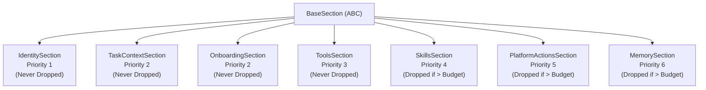
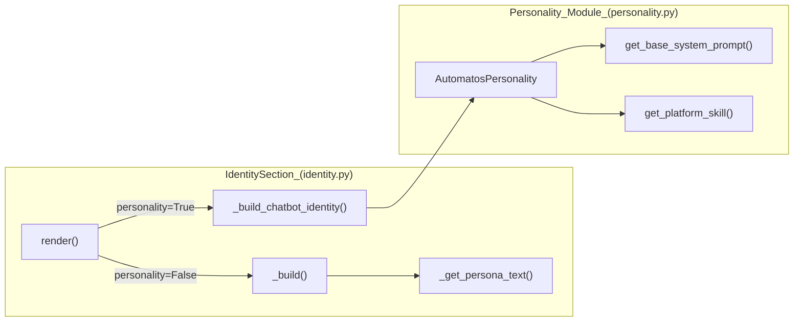
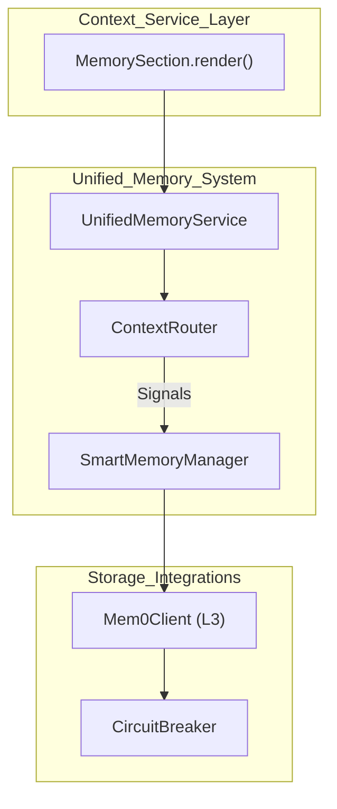

# Section Types

<details>
<summary>Relevant source files</summary>

The following files were used as context for generating this wiki page:

- [docs/PRDS/123-HARNESS-PATTERN-ADOPTION.md](docs/PRDS/123-HARNESS-PATTERN-ADOPTION.md)
- [docs/PRDS/137-AUTO-CHATBOT-RECOVERY.md](docs/PRDS/137-AUTO-CHATBOT-RECOVERY.md)
- [orchestrator/consumers/chatbot/integration.py](orchestrator/consumers/chatbot/integration.py)
- [orchestrator/consumers/chatbot/prompt_analyzer.py](orchestrator/consumers/chatbot/prompt_analyzer.py)
- [orchestrator/consumers/chatbot/smart_memory.py](orchestrator/consumers/chatbot/smart_memory.py)
- [orchestrator/consumers/chatbot/smart_orchestrator.py](orchestrator/consumers/chatbot/smart_orchestrator.py)
- [orchestrator/modules/agents/queries.py](orchestrator/modules/agents/queries.py)
- [orchestrator/modules/context/sections/composio.py](orchestrator/modules/context/sections/composio.py)
- [orchestrator/modules/context/sections/identity.py](orchestrator/modules/context/sections/identity.py)
- [orchestrator/modules/context/sections/memory.py](orchestrator/modules/context/sections/memory.py)
- [orchestrator/modules/context/sections/platform_actions.py](orchestrator/modules/context/sections/platform_actions.py)
- [orchestrator/modules/context/sections/playbook_context.py](orchestrator/modules/context/sections/playbook_context.py)
- [orchestrator/modules/context/sections/plugins.py](orchestrator/modules/context/sections/plugins.py)
- [orchestrator/modules/context/sections/skills.py](orchestrator/modules/context/sections/skills.py)
- [orchestrator/modules/context/sections/task_context.py](orchestrator/modules/context/sections/task_context.py)
- [orchestrator/modules/memory/integrations/mem0_client.py](orchestrator/modules/memory/integrations/mem0_client.py)
- [orchestrator/scripts/eval/tool_routing/seed_telemetry.py](orchestrator/scripts/eval/tool_routing/seed_telemetry.py)
- [orchestrator/tests/test_platform_actions_section.py](orchestrator/tests/test_platform_actions_section.py)
- [orchestrator/tests/test_platform_actions_section_graph.py](orchestrator/tests/test_platform_actions_section_graph.py)

</details>


This page documents the **16 section types** that make up the unified prompt-building system in `ContextService`. Each section is responsible for rendering a specific part of the system prompt (identity, skills, tools, memory, etc.) and has a priority that determines whether it can be dropped when token budgets are exceeded.

For information about how sections are prioritized and trimmed, see [Section Priority System](orchestrator/modules/context/budget.py:1-203)(). For token budget allocation rules, see [Token Budget Management](orchestrator/modules/context/budget.py:53-146)(). For the mode configurations that determine which sections are included, see [Context Modes](orchestrator/modules/context/modes.py:1-134)().

**Sources:** [orchestrator/modules/context/sections/__init__.py:1-64](), [orchestrator/modules/context/modes.py:1-134]()

---

## BaseSection Interface

All section types inherit from `BaseSection`, an abstract base class that defines the contract for prompt assembly. Sections implement key methods for rendering and truncation.

| Method | Purpose | Returns |
|--------|---------|---------|
| `render(ctx: SectionContext)` | Async method that builds the section's text content | `str` (markdown-formatted) |
| `truncate(text: str, max_tokens: int)` | Static method to truncate text to fit budget | `str` |

**Section metadata (class attributes):**

```python
name: str                      # Section identifier (e.g., "identity", "memory")
priority: int                  # 1-10 (1 is highest, never dropped)
max_tokens: Optional[int]      # Hard limit for this section
```

**SectionContext** is passed to every `render()` call and contains the `agent`, `workspace_id`, `messages`, `task_description`, and `db_session`.

**Sources:** [orchestrator/modules/context/sections/base.py:1-50](), [orchestrator/modules/context/sections/__init__.py:10-10]()

---

## Section Registry

The system uses a centralized registry to map string identifiers in `ModeConfig` to concrete class implementations.

**Diagram: Section Hierarchy and Priority**



**Sources:** [orchestrator/modules/context/sections/__init__.py:27-43](), [orchestrator/modules/context/budget.py:110-133]()

---

**Table: Core Section Types**

| Priority | Section Name | Purpose | Max Tokens | Never Drop? |
|----------|-------------|---------|------------|-----------|
| 1 | `identity` | Agent name, role, persona, personality | 600 | Yes |
| 2 | `task_context` | Task description, status, board info | 1500 | Yes |
| 2 | `onboarding` | Mission Zero onboarding flow | 800 | Yes |
| 2 | `playbook_context` | Recipe step info and previous outputs | 1500 | Yes |
| 3 | `tools` | Tool loading (FULL/FILTERED/NONE) | N/A | No (P>2) |
| 4 | `skills` | SKILL.md content from database | 3000 | No |
| 5 | `platform_actions`| Summary of platform_* management tools | 2000 | No |
| 6 | `memory` | User memories, logs, session context | 1500 | No |

**Sources:** [orchestrator/modules/context/sections/identity.py:68-70](), [orchestrator/modules/context/sections/task_context.py:26-28](), [orchestrator/modules/context/sections/skills.py:25-27](), [orchestrator/modules/context/sections/platform_actions.py:32-34](), [orchestrator/modules/context/budget.py:121-123]()

---

## IdentitySection (Priority 1)

**Purpose:** Establishes who the agent is—name, role, workspace, and persona. Always included so the agent has a consistent identity.

### Rendering Modes

1.  **Basic Identity** (Default): Used for `TASK_EXECUTION`, `HEARTBEAT`, etc. Renders name, role, workspace, and `_get_persona_text`. [orchestrator/modules/context/sections/identity.py:87-120]()
2.  **Chatbot Personality**: Triggered when `personality=True` in `ModeConfig`. Invokes `AutomatosPersonality` for greetings, tool guidance, and self-learning instructions. [orchestrator/modules/context/sections/identity.py:122-165]()

**Diagram: Identity Construction in Code Space**



**Sources:** [orchestrator/modules/context/sections/identity.py:55-165](), [orchestrator/modules/context/sections/identity.py:72-82]()

---

## TaskContextSection (Priority 2)

**Purpose:** Provides the agent with its current task assignment. Essential for `TASK_EXECUTION` and `HEARTBEAT_AGENT` modes.

### Context Included
- **Current Task**: The raw description from `ctx.task_description`. [orchestrator/modules/context/sections/task_context.py:43-51]()
- **Metadata**: Status, Priority, and Board name passed via `kwargs`. [orchestrator/modules/context/sections/task_context.py:54-68]()
- **Dependency Instructions**: Guidance on how to handle `## DEPENDENCY CONTEXT` from previous tasks. [orchestrator/modules/context/sections/task_context.py:71-84]()

**Sources:** [orchestrator/modules/context/sections/task_context.py:18-89]()

---

## PlatformActionsSection (Priority 5)

**Purpose:** Injects a Markdown catalog of available `platform_execute` actions.

### Catalog Generation & Semantic Routing
- **Semantic Filtering**: When `SEMANTIC_TOOL_ROUTING` is enabled, the section uses `ActionSemanticIndex` to rank actions by similarity to the user query. [orchestrator/modules/context/sections/platform_actions.py:7-12]()
- **Graph Routing**: If `TOOL_ROUTING_GRAPH` is active, it attempts to rank multi-action chains via `GraphRouter.rank_chains`. [orchestrator/modules/context/sections/platform_actions.py:68-77]()
- **Registry Delegation**: Wraps `ActionRegistry.build_prompt_summary()` or `build_filtered_prompt_summary()` to ensure a consistent catalog. [orchestrator/modules/context/sections/platform_actions.py:154-157]()
- **Chain Hints**: Provides "Likely Platform Action Chains" (e.g., `call platform_list_agents then platform_get_agent`) to guide the LLM through multi-step operations. [orchestrator/modules/context/sections/platform_actions.py:172-192]()

**Sources:** [orchestrator/modules/context/sections/platform_actions.py:1-192](), [orchestrator/tests/test_platform_actions_section.py:1-13]()

---

## SkillsSection (Priority 4)

**Purpose:** Injects the content of `SKILL.md` for the agent's active skills.

### Loading Logic
1.  Retrieves active skills via the `agent.skills` relationship, sorted by priority. [orchestrator/modules/context/sections/skills.py:54-68]()
2.  **Primary vs Auxiliary**: The highest-priority skill is rendered uncapped. Auxiliary skills share a 5000-token budget to prevent truncation of the primary platform skill. [orchestrator/modules/context/sections/skills.py:24-32]()
3.  **Content Extraction**: Loads from `skill.prompt_template` with a fallback to `SkillLoader.load_skill_core`. [orchestrator/modules/context/sections/skills.py:117-146]()
4.  **Skill Tools**: Automatically appends a "Using Your Skill Tools" section listing function names found in the skill's `tools_schema`. [orchestrator/modules/context/sections/skills.py:88-98]()

**Sources:** [orchestrator/modules/context/sections/skills.py:18-147]()

---

## ToolsSection (Priority 3)

**Purpose:** Loads tool schemas and determines `tool_choice`. This section returns an empty string for the prompt text and instead populates `ContextResult.tools`.

### Loading Strategies
- **FULL**: All assigned core, platform, and Composio tools.
- **FILTERED**: Intent-based filtering via `SmartToolRouter`. Used in `CHATBOT` mode.
- **DISPATCHER_ONLY**: Only the `platform_execute` schema for orchestrator heartbeat ticks.

**Sources:** [orchestrator/modules/context/modes.py:1-134](), [orchestrator/consumers/chatbot/smart_orchestrator.py:186-190]()

---

## MemorySection (Priority 6)

**Purpose:** Injects user memories and daily logs. It serves as the bridge between the 5-layer memory architecture and the LLM prompt.

### Retrieval Strategy
1. **Context Router (L0-L4)**: For `CHATBOT` mode, it attempts to use `UnifiedMemoryService.retrieve_context()` to get a `context_bundle` containing long-term memories, session summaries, and temporal results. [orchestrator/modules/context/sections/memory.py:110-132]()
2. **Fallback**: If the router fails, it falls back to `SmartMemoryManager.retrieve_memories()` for global and agent-specific memory retrieval. [orchestrator/modules/context/sections/memory.py:83-84]()
3. **Mem0 Integration**: Utilizes the `Mem0Client` which includes a circuit breaker and exponential backoff to ensure memory retrieval does not block the critical path. [orchestrator/modules/memory/integrations/mem0_client.py:25-60]()
4. **Recipe Learnings**: Injects `recipe_memories` (learnings from previous workflow runs) during the first step of a recipe. [orchestrator/modules/context/sections/memory.py:86-92]()

**Diagram: Memory Data Flow to Prompt**



**Sources:** [orchestrator/modules/context/sections/memory.py:32-194](), [orchestrator/modules/memory/integrations/mem0_client.py:77-174](), [orchestrator/consumers/chatbot/smart_memory.py:50-181]()

---

## Budget Management & Trimming

When the total tokens across all sections exceed the `available_for_sections` budget, the `TokenBudgetManager` applies a priority-based trimming algorithm.

1.  **Capping**: Sections are first truncated to their individual `max_tokens`. [orchestrator/modules/context/budget.py:79-103]()
2.  **Dropping**: If still over budget, sections are dropped starting from the **highest priority number** (lowest importance). [orchestrator/modules/context/budget.py:110-118]()
3.  **Protection**: Sections with `priority <= 2` (`identity`, `task_context`, `onboarding`, `playbook_context`) are **never dropped**. [orchestrator/modules/context/budget.py:121-123]()

**Sources:** [orchestrator/modules/context/budget.py:53-146](), [orchestrator/modules/context/modes.py:125-133]()

---