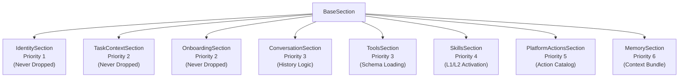
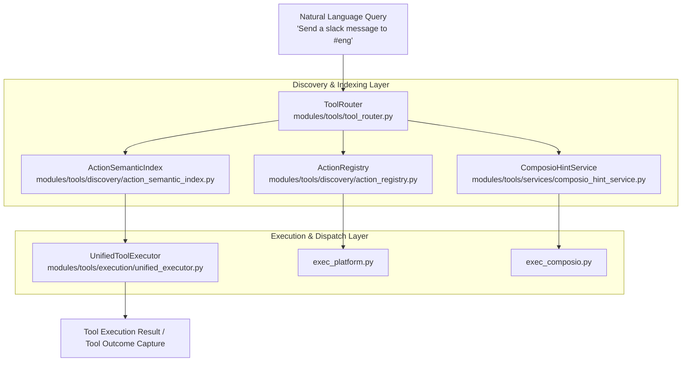
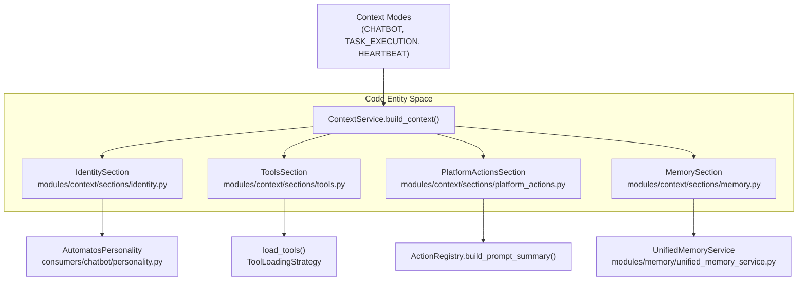

# Section Types

Relevant source files

The following files were used as context for generating this wiki page:

- [orchestrator/consumers/chatbot/tool_router.py](orchestrator/consumers/chatbot/tool_router.py)
- [orchestrator/core/services/skill_l3_execution.py](orchestrator/core/services/skill_l3_execution.py)
- [orchestrator/modules/agents/services/skill_portability.py](orchestrator/modules/agents/services/skill_portability.py)
- [orchestrator/modules/context/sections/identity.py](orchestrator/modules/context/sections/identity.py)
- [orchestrator/modules/context/sections/platform_actions.py](orchestrator/modules/context/sections/platform_actions.py)
- [orchestrator/modules/context/sections/skills.py](orchestrator/modules/context/sections/skills.py)
- [orchestrator/modules/context/sections/task_context.py](orchestrator/modules/context/sections/task_context.py)
- [orchestrator/modules/context/sections/tools.py](orchestrator/modules/context/sections/tools.py)
- [orchestrator/modules/tools/discovery/action_registry.py](orchestrator/modules/tools/discovery/action_registry.py)
- [orchestrator/modules/tools/discovery/action_semantic_index.py](orchestrator/modules/tools/discovery/action_semantic_index.py)
- [orchestrator/modules/tools/discovery/actions_skills.py](orchestrator/modules/tools/discovery/actions_skills.py)
- [orchestrator/modules/tools/discovery/handlers_skill_runtime.py](orchestrator/modules/tools/discovery/handlers_skill_runtime.py)
- [orchestrator/modules/tools/execution/unified_executor.py](orchestrator/modules/tools/execution/unified_executor.py)
- [orchestrator/modules/tools/registry/tool_registry.py](orchestrator/modules/tools/registry/tool_registry.py)
- [orchestrator/modules/tools/services/composio_hint_service.py](orchestrator/modules/tools/services/composio_hint_service.py)
- [orchestrator/modules/tools/services/composio_tool_service.py](orchestrator/modules/tools/services/composio_tool_service.py)
- [orchestrator/modules/tools/tool_router.py](orchestrator/modules/tools/tool_router.py)
- [orchestrator/tests/test_action_registry_filtered.py](orchestrator/tests/test_action_registry_filtered.py)
- [orchestrator/tests/test_action_semantic_index.py](orchestrator/tests/test_action_semantic_index.py)
- [orchestrator/tests/test_identity_section.py](orchestrator/tests/test_identity_section.py)
- [orchestrator/tests/test_p2w1_agent_skills_repair.py](orchestrator/tests/test_p2w1_agent_skills_repair.py)
- [orchestrator/tests/test_platform_actions_section.py](orchestrator/tests/test_platform_actions_section.py)
- [orchestrator/tests/test_prd202_s2_trigger_activation.py](orchestrator/tests/test_prd202_s2_trigger_activation.py)
- [orchestrator/tests/test_skills_section.py](orchestrator/tests/test_skills_section.py)
- [orchestrator/tests/test_tool_router_semantic.py](orchestrator/tests/test_tool_router_semantic.py)

This page documents the detailed technical implementation of the section types that make up the unified prompt-building system in `ContextService`. Each section implements the `BaseSection` contract, rendering specific contextual components into the system prompt while adhering to priority-based token budgeting and fallback behaviors.

**Sources:** [orchestrator/modules/context/sections/__init__.py:1-64](), [orchestrator/modules/context/modes.py:1-134]()

---

## BaseSection Contract & Registry

All sections inherit from `BaseSection`, an abstract base class defining the standard lifecycle methods for rendering markdown content and managing token constraints.

| Method / Attribute | Purpose | Type / Return |
|-------------------|---------|---------------|
| `render(ctx: SectionContext)` | Async method building the section's text content | `str` (Markdown) |
| `truncate(text: str, max_tokens: int)` | Static method ensuring compliance with token limits | `str` |
| `name` | Unique string identifier for registry mapping | `str` |
| `priority` | Integer precedence (1 is highest; protected from trimming) | `int` (1–10) |
| `max_tokens` | Optional hard ceiling for section length | `Optional[int]` |

**Diagram: Section Hierarchy and Priority Flow**

**Sources:** [orchestrator/modules/context/sections/base.py:1-50](), [orchestrator/modules/context/sections/__init__.py:27-43]()

---

## Natural Language Space to Code Entity Space: Tool & Action Routing

The following diagram maps high-level user natural language inputs and tool intentions to the underlying code entities and routing modules responsible for execution.

**Diagram: Natural Language Tool Resolution to Code Entities**

**Sources:** [orchestrator/modules/tools/tool_router.py:1-174](), [orchestrator/modules/tools/discovery/action_semantic_index.py:1-55](), [orchestrator/modules/tools/execution/unified_executor.py:58-146]()

---

## Natural Language Space to Code Entity Space: Prompt Mode Assembly

This diagram illustrates how high-level operating contexts map to specific section assemblers and runtime components inside `ContextService`.

**Diagram: Context Modes to Code Entity Mapping**

**Sources:** [orchestrator/modules/context/sections/identity.py:122-165](), [orchestrator/modules/context/sections/tools.py:61-124](), [orchestrator/modules/context/sections/platform_actions.py:48-108]()

---

## IdentitySection (Priority 1)

**Purpose:** Establishes core agent parameters including name, role, workspace assignment, and behavioral persona. It is protected from trimming and guarantees baseline identity awareness across all execution contexts. [orchestrator/modules/context/sections/identity.py:55-70]()

### Rendering Implementation
- **Basic Mode (`_build`)**: Formats standard metadata for non-chatbot modes (`TASK_EXECUTION`, `HEARTBEAT`), incorporating workspace identity, agent description, and response formatting rules. [orchestrator/modules/context/sections/identity.py:87-121]()
- **Chatbot Personality (`_build_chatbot_identity`)**: Engaged when `personality=True` in session configuration. Combines outputs from `AutomatosPersonality` (base prompt, platform skills, action response styles) with agent-specific traits [orchestrator/modules/context/sections/identity.py:122-165]().

**Sources:** [orchestrator/modules/context/sections/identity.py:55-165]()

---

## TaskContextSection (Priority 2)

**Purpose:** Injects active task payloads, operational states, board assignments, and inter-task dependencies into execution turns [orchestrator/modules/context/sections/task_context.py:18-88]().

### Context Elements
- **Task Payload**: Direct text from `ctx.task_description`. [orchestrator/modules/context/sections/task_context.py:43-51]()
- **Execution Metadata**: Status indicators, priority tiers, and board context dictionaries passed through `kwargs`. [orchestrator/modules/context/sections/task_context.py:54-68]()
- **Dependency Directives**: Guidelines for processing preceding task outputs (`## DEPENDENCY CONTEXT`). [orchestrator/modules/context/sections/task_context.py:71-84]()

**Sources:** [orchestrator/modules/context/sections/task_context.py:18-88]()

---

## OnboardingSection (Priority 2)

**Purpose:** Manages guided onboarding workflows (Mission Zero) during initial workspace provisioning, injecting step-by-step instructions and goal tracking states into the prompt.

**Sources:** [orchestrator/modules/context/sections/__init__.py:27-43]()

---

## ConversationSection (Priority 3)

**Purpose:** Formats message history, filters system logs, and applies sliding-window token budgets. The `render()` method returns an empty string; historical messages are injected via structured API formatting (`format_messages()`). [orchestrator/modules/context/sections/conversation.py:29-35]()

### Attachment Integration
Prevents reference anomalies via `render_unresolved_file_part`. If an attachment identifier exists in `resolved_attachment_ids`, the section yields execution to `AttachmentResolver` for direct multimodal or textual injection. [orchestrator/modules/context/sections/conversation.py:63-66]()

**Sources:** [orchestrator/modules/context/sections/conversation.py:1-182](), [orchestrator/core/attachment_refs.py:1-30]()

---

## ToolsSection (Priority 3)

**Purpose:** Manages tool schema discovery and determines execution strategies (`tool_choice`). It does not emit text into the system prompt; instead, it populates `ContextResult.tools` [orchestrator/modules/context/sections/tools.py:41-56]().

### Tool Loading Strategies
- **`FULL`**: Resolves all assigned core, platform, and Composio tools. [orchestrator/modules/context/sections/tools.py:94-101]()
- **`FILTERED`**: Executes intent-based dynamic filtering via `SmartToolRouter` and `ComposioHintService`. [orchestrator/modules/context/sections/tools.py:103-113]()
- **`DISPATCHER_ONLY`**: Restricts tool payloads to the `platform_execute` dispatcher schema (optimized for orchestrator ticks). [orchestrator/modules/context/sections/tools.py:91-92]()
- **`NONE`**: Suppresses tool delivery entirely (`tool_choice="none"`). [orchestrator/modules/context/sections/tools.py:88-89]()

**Sources:** [orchestrator/modules/context/sections/tools.py:32-124]()

---

## SkillsSection (Priority 4)

**Purpose:** Implements trigger-based skill loading to minimize context consumption [orchestrator/modules/context/sections/skills.py:1-185]().

### L1 vs L2 Activation Tiers
- **L1 Catalog (Default)**: Injects lightweight titles and descriptions for all assigned skills (~50–100 tokens per skill) [orchestrator/modules/context/sections/skills.py:168-173]().
- **L2 Full Body (On-Demand)**: Pulls complete markdown skill files (`SKILL.md`) when explicitly required by system pins (`SKILL_CORE_ALWAYS_ON`) or when the model calls `platform_load_skill` [orchestrator/modules/context/sections/skills.py:87-91](), [orchestrator/modules/tools/discovery/actions_skills.py:29-56]().

**Sources:** [orchestrator/modules/context/sections/skills.py:1-185]()

---

## PlatformActionsSection (Priority 5)

**Purpose:** Renders a categorized markdown inventory of available `platform_execute` actions [orchestrator/modules/context/sections/platform_actions.py:30-37]().

### Semantic Filtering Pipeline
When `SEMANTIC_TOOL_ROUTING` is enabled and a query string is present in `ctx.kwargs`, `PlatformActionsSection` queries `ActionSemanticIndex` to rank actions by cosine similarity. It renders only the top-K matches via `ActionRegistry.build_filtered_prompt_summary()`, falling back safely to the full catalog on error [orchestrator/modules/context/sections/platform_actions.py:48-108]().

**Sources:** [orchestrator/modules/context/sections/platform_actions.py:1-365](), [orchestrator/modules/tools/discovery/action_semantic_index.py:1-114]()

---

## MemorySection (Priority 6)

**Purpose:** Bridges the layered persistence architecture to the prompt space by injecting user preferences, historical logs, and semantic context bundles [orchestrator/modules/context/sections/memory.py:32-194]().

### Retrieval Architecture
- **Context Router Path**: Queries `UnifiedMemoryService.retrieve_context()` in `CHATBOT` mode to construct a multi-tiered context bundle (L0–L4) [orchestrator/modules/context/sections/memory.py:90-126]().
- **Smart Memory Fallback**: Utilizes `SmartMemoryManager.retrieve_memories()` to pull global and agent-scoped memory tiers if primary context resolution encounters faults [orchestrator/modules/context/sections/memory.py:78-79]().

**Sources:** [orchestrator/modules/context/sections/memory.py:32-194](), [orchestrator/modules/memory/unified_memory_service.py:1-200]()

---