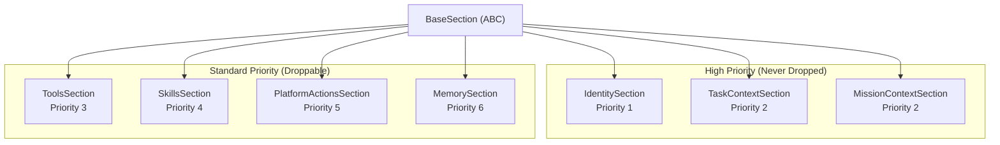
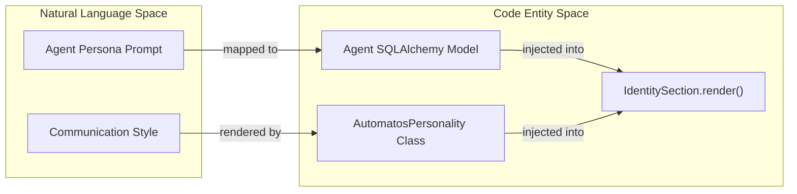
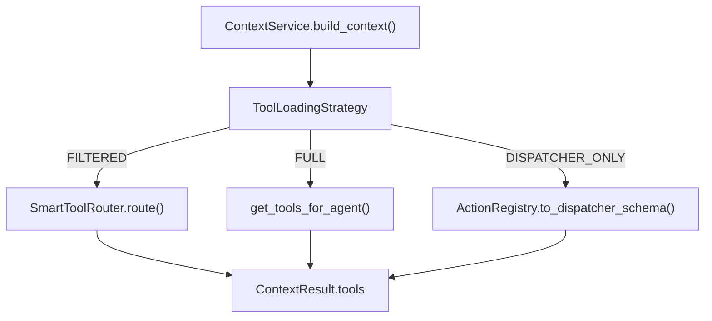

# Section Types

<details>
<summary>Relevant source files</summary>

The following files were used as context for generating this wiki page:

- [docs/PRDS/123-HARNESS-PATTERN-ADOPTION.md](docs/PRDS/123-HARNESS-PATTERN-ADOPTION.md)
- [orchestrator/consumers/chatbot/integration.py](orchestrator/consumers/chatbot/integration.py)
- [orchestrator/consumers/chatbot/prompt_analyzer.py](orchestrator/consumers/chatbot/prompt_analyzer.py)
- [orchestrator/consumers/chatbot/smart_orchestrator.py](orchestrator/consumers/chatbot/smart_orchestrator.py)
- [orchestrator/modules/agents/queries.py](orchestrator/modules/agents/queries.py)
- [orchestrator/modules/context/budget.py](orchestrator/modules/context/budget.py)
- [orchestrator/modules/context/modes.py](orchestrator/modules/context/modes.py)
- [orchestrator/modules/context/sections/__init__.py](orchestrator/modules/context/sections/__init__.py)
- [orchestrator/modules/context/sections/agent_roster.py](orchestrator/modules/context/sections/agent_roster.py)
- [orchestrator/modules/context/sections/composio.py](orchestrator/modules/context/sections/composio.py)
- [orchestrator/modules/context/sections/identity.py](orchestrator/modules/context/sections/identity.py)
- [orchestrator/modules/context/sections/memory.py](orchestrator/modules/context/sections/memory.py)
- [orchestrator/modules/context/sections/mission_context.py](orchestrator/modules/context/sections/mission_context.py)
- [orchestrator/modules/context/sections/onboarding.py](orchestrator/modules/context/sections/onboarding.py)
- [orchestrator/modules/context/sections/platform_actions.py](orchestrator/modules/context/sections/platform_actions.py)
- [orchestrator/modules/context/sections/plugins.py](orchestrator/modules/context/sections/plugins.py)
- [orchestrator/modules/context/sections/skills.py](orchestrator/modules/context/sections/skills.py)
- [orchestrator/modules/context/sections/task_context.py](orchestrator/modules/context/sections/task_context.py)
- [orchestrator/modules/context/sections/tools.py](orchestrator/modules/context/sections/tools.py)
- [orchestrator/tests/test_context/__init__.py](orchestrator/tests/test_context/__init__.py)
- [orchestrator/tests/test_context/conftest.py](orchestrator/tests/test_context/conftest.py)
- [orchestrator/tests/test_context/test_budget_manager.py](orchestrator/tests/test_context/test_budget_manager.py)
- [orchestrator/tests/test_context/test_estimator.py](orchestrator/tests/test_context/test_estimator.py)
- [orchestrator/tests/test_context/test_identity_section.py](orchestrator/tests/test_context/test_identity_section.py)
- [orchestrator/tests/test_context/test_memory_section.py](orchestrator/tests/test_context/test_memory_section.py)
- [orchestrator/tests/test_context/test_modes.py](orchestrator/tests/test_context/test_modes.py)
- [orchestrator/tests/test_context/test_service.py](orchestrator/tests/test_context/test_service.py)

</details>


This page documents the **15+ section types** that make up the unified prompt-building system in `ContextService`. Each section is responsible for rendering a specific part of the system prompt (identity, skills, tools, memory, etc.) and has a priority that determines whether it can be dropped when token budgets are exceeded.

For information about how sections are prioritized and trimmed, see [Section Priority System](orchestrator/modules/context/budget.py:1-203)(). For token budget allocation rules, see [Token Budget Management](orchestrator/modules/context/budget.py:53-146)(). For the mode configurations that determine which sections are included, see [Context Modes](orchestrator/modules/context/modes.py:1-134)().

**Sources:** [orchestrator/modules/context/sections/__init__.py:1-68](), [orchestrator/modules/context/modes.py:1-134]()

---

## BaseSection Interface

All section types inherit from `BaseSection`, an abstract base class that defines the contract for prompt assembly. Sections implement key methods for rendering and truncation.

| Method | Purpose | Returns |
|--------|---------|---------|
| `render(ctx: SectionContext)` | Async method that builds the section's text content | `str` (markdown-formatted) |
| `truncate(text: str, max_tokens: int)` | Static method to truncate text to fit budget | `str` |

**Section metadata (class attributes):**

```python
name: str                      # Section identifier (e.g., "identity", "memory")
priority: int                  # 1-10 (1 is highest, never dropped)
max_tokens: Optional[int]      # Hard limit for this section
```

**SectionContext** is passed to every `render()` call and contains the `agent`, `workspace_id`, `messages`, `task_description`, and `db_session`.

**Sources:** [orchestrator/modules/context/sections/base.py:1-50](), [orchestrator/modules/context/sections/__init__.py:10-10]()

---

## Section Registry

The system uses a centralized `SECTION_REGISTRY` to map string identifiers in `ModeConfig` to concrete class implementations.

**Diagram: Section Hierarchy and Priority**



**Sources:** [orchestrator/modules/context/sections/__init__.py:27-45](), [orchestrator/modules/context/budget.py:110-133]()

---

**Table: Core Section Types**

| Priority | Section Name | Purpose | Max Tokens | Never Drop? |
|----------|-------------|---------|------------|-----------|
| 1 | `identity` | Agent name, role, persona, personality | 600 | Yes |
| 2 | `task_context` | Task description, status, board info | 1500 | Yes |
| 2 | `mission_context`| Multi-agent mission goals and DAG state | 4000 | Yes |
| 3 | `tools` | Tool loading (FULL/FILTERED/NONE) | N/A | No (P>2) |
| 4 | `skills` | SKILL.md content from database | 3000 | No |
| 5 | `platform_actions`| Summary of platform_* management tools | 2000 | No |
| 6 | `memory` | User memories, logs, session context | 1500 | No |

**Sources:** [orchestrator/modules/context/sections/identity.py:68-70](), [orchestrator/modules/context/sections/task_context.py:26-28](), [orchestrator/modules/context/sections/skills.py:25-27](), [orchestrator/modules/context/sections/platform_actions.py:32-34](), [orchestrator/modules/context/budget.py:121-123]()

---

## IdentitySection (Priority 1)

**Purpose:** Establishes who the agent is—name, role, workspace, and persona. Always included so the agent has a consistent identity.

### Rendering Modes

1.  **Basic Identity** (Default): Used for `TASK_EXECUTION`, `HEARTBEAT`, etc. Renders name, role, workspace, and `_get_persona_text`. [orchestrator/modules/context/sections/identity.py:87-120]()
2.  **Chatbot Personality**: Triggered when `personality=True` in `ModeConfig`. Invokes `AutomatosPersonality` for greetings, tool guidance, and self-learning instructions. [orchestrator/modules/context/sections/identity.py:122-165]()

**Diagram: Natural Language Persona to Code Entity**



**Sources:** [orchestrator/modules/context/sections/identity.py:55-165](), [orchestrator/consumers/chatbot/smart_orchestrator.py:192-205]()

---

## TaskContextSection (Priority 2)

**Purpose:** Provides the agent with its current task assignment. Essential for `TASK_EXECUTION` and `HEARTBEAT_AGENT` modes.

### Context Included
- **Current Task**: The raw description from `ctx.task_description`. [orchestrator/modules/context/sections/task_context.py:43-51]()
- **Metadata**: Status, Priority, and Board name passed via `kwargs`. [orchestrator/modules/context/sections/task_context.py:54-68]()
- **Dependency Instructions**: Guidance on how to handle `## DEPENDENCY CONTEXT` from previous tasks. [orchestrator/modules/context/sections/task_context.py:71-84]()

**Sources:** [orchestrator/modules/context/sections/task_context.py:18-89]()

---

## ToolsSection (Priority 3)

**Purpose:** Loads tool schemas and determines `tool_choice`. This section is unique: it **returns an empty string** for the prompt text and instead populates `ContextResult.tools`.

### Loading Strategies
- **FULL**: All assigned core, platform, and Composio tools. Used in `TASK_EXECUTION` and `HEARTBEAT_AGENT`. [orchestrator/modules/context/sections/tools.py:84-85]()
- **FILTERED**: Intent-based filtering via `SmartToolRouter`. Used in `CHATBOT` mode. [orchestrator/modules/context/sections/tools.py:87-96]()
- **DISPATCHER_ONLY**: Only the `platform_execute` schema for orchestrator heartbeat ticks. [orchestrator/modules/context/sections/tools.py:81-82]()

**Diagram: Tool Routing Logic**



**Sources:** [orchestrator/modules/context/sections/tools.py:41-193](), [orchestrator/modules/context/modes.py:35-134]()

---

## PlatformActionsSection (Priority 5)

**Purpose:** Injects a Markdown catalog of available `platform_execute` actions. This allows agents to introspect and manage the platform (e.g., listing agents, searching knowledge).

### Catalog Generation
- **Registry Delegation**: Wraps `ActionRegistry.build_prompt_summary()` to ensure a consistent catalog across all consumers. [orchestrator/modules/context/sections/platform_actions.py:58-62]()
- **Filtering**: Excludes admin-only and promoted actions by default to keep the prompt focused. [orchestrator/modules/context/sections/platform_actions.py:62-62]()
- **Preamble**: Includes instructions on how to use the `platform_execute` tool correctly. [orchestrator/modules/context/sections/platform_actions.py:50-56]()

**Sources:** [orchestrator/modules/context/sections/platform_actions.py:23-75]()

---

## SkillsSection (Priority 4)

**Purpose:** Injects the content of `SKILL.md` for the agent's active skills.

### Loading Logic
1.  Retrieves skills via the `agent.skills` relationship. [orchestrator/modules/context/sections/skills.py:47-52]()
2.  Loads content from `skill.prompt_template`. [orchestrator/modules/context/sections/skills.py:106-109]()
3.  Fallback to `SkillLoader.load_skill_core` if the database field is empty. [orchestrator/modules/context/sections/skills.py:111-126]()
4.  Appends "Using Your Skill Tools" instructions if the skill defines specific functions in its `tools_schema`. [orchestrator/modules/context/sections/skills.py:68-78]()

**Sources:** [orchestrator/modules/context/sections/skills.py:18-129]()

---

## Budget Management & Trimming

When the total tokens across all sections exceed the `available_for_sections` budget, the `TokenBudgetManager` applies a priority-based trimming algorithm.

1.  **Capping**: Sections are first truncated to their individual `max_tokens`. [orchestrator/modules/context/budget.py:79-103]()
2.  **Dropping**: If still over budget, sections are dropped starting from the **highest priority number** (lowest importance). [orchestrator/modules/context/budget.py:110-118]()
3.  **Protection**: Sections with `priority <= 2` (`identity`, `task_context`, `mission_context`) are **never dropped**. [orchestrator/modules/context/budget.py:121-123]()

**Sources:** [orchestrator/modules/context/budget.py:53-146](), [orchestrator/modules/context/modes.py:125-133]()

---