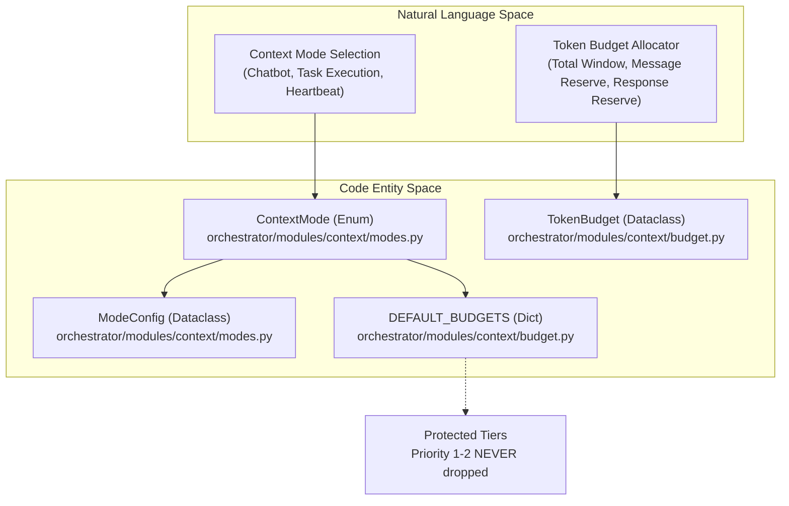
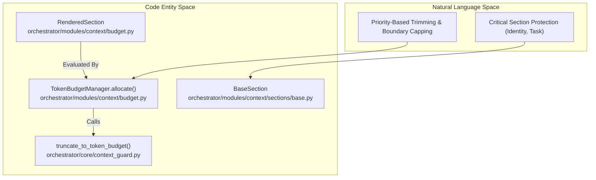

# Token Budget Management

Relevant source files

The following files were used as context for generating this wiki page:

- [orchestrator/alembic/versions/prd201_s1_message_context_trace.py](orchestrator/alembic/versions/prd201_s1_message_context_trace.py)
- [orchestrator/core/context_guard.py](orchestrator/core/context_guard.py)
- [orchestrator/core/llm/prompt_cache.py](orchestrator/core/llm/prompt_cache.py)
- [orchestrator/core/llm/request_scope.py](orchestrator/core/llm/request_scope.py)
- [orchestrator/core/observability/tracer.py](orchestrator/core/observability/tracer.py)
- [orchestrator/modules/context/__init__.py](orchestrator/modules/context/__init__.py)
- [orchestrator/modules/context/budget.py](orchestrator/modules/context/budget.py)
- [orchestrator/modules/context/modes.py](orchestrator/modules/context/modes.py)
- [orchestrator/modules/context/planning.py](orchestrator/modules/context/planning.py)
- [orchestrator/modules/context/result.py](orchestrator/modules/context/result.py)
- [orchestrator/modules/context/sections/__init__.py](orchestrator/modules/context/sections/__init__.py)
- [orchestrator/modules/context/sections/agent_roster.py](orchestrator/modules/context/sections/agent_roster.py)
- [orchestrator/modules/context/sections/base.py](orchestrator/modules/context/sections/base.py)
- [orchestrator/modules/context/sections/composio.py](orchestrator/modules/context/sections/composio.py)
- [orchestrator/modules/context/sections/field_memory.py](orchestrator/modules/context/sections/field_memory.py)
- [orchestrator/modules/context/sections/planning_history.py](orchestrator/modules/context/sections/planning_history.py)
- [orchestrator/modules/context/sections/planning_knowledge.py](orchestrator/modules/context/sections/planning_knowledge.py)
- [orchestrator/modules/context/sections/playbook_context.py](orchestrator/modules/context/sections/playbook_context.py)
- [orchestrator/modules/context/sections/plugins.py](orchestrator/modules/context/sections/plugins.py)
- [orchestrator/services/orchestration_state.py](orchestrator/services/orchestration_state.py)
- [orchestrator/tests/test_context/test_modes.py](orchestrator/tests/test_context/test_modes.py)
- [orchestrator/tests/test_context/test_service.py](orchestrator/tests/test_context/test_service.py)
- [orchestrator/tests/test_context_guard.py](orchestrator/tests/test_context_guard.py)
- [orchestrator/tests/test_prd164_planning_pack.py](orchestrator/tests/test_prd164_planning_pack.py)
- [orchestrator/tests/test_prd179_field_read.py](orchestrator/tests/test_prd179_field_read.py)

**Purpose**: This page documents the token budget management system in `ContextService`, which controls how much context can be included in LLM prompts across different execution modes. Token budgets prevent prompt assembly from exceeding model context windows while ensuring critical sections (identity, task context, skills) are never dropped.

---

## Overview

The token budget manager allocates a fixed token budget across rendered sections during prompt assembly. Each context mode (e.g., `CHATBOT`, `TASK_EXECUTION`, `HEARTBEAT_ORCHESTRATOR`) defined in `ContextMode` [orchestrator/modules/context/modes.py:13-22]() has a specific `ModeConfig` which dictates the sections included and optional `max_tokens` constraints [orchestrator/modules/context/modes.py:113-120](). 

During the assembly phase, the `TokenBudgetManager` ensures that the final prompt fits within the model's window. Sections with priority 1-2 are **never dropped**, while sections with higher priority numbers (lower importance) may be trimmed or excluded if the budget is exhausted [orchestrator/modules/context/budget.py:51-62]().

### Context to Code Mapping: Modes & Budgets

**Sources**:
- [orchestrator/modules/context/modes.py:13-22]()
- [orchestrator/modules/context/modes.py:113-120]()
- [orchestrator/modules/context/budget.py:24-39]()
- [orchestrator/modules/context/budget.py:51-62]()

---

## Budget Configuration per Mode

Token budgets are configured per context mode in `DEFAULT_BUDGETS` [orchestrator/modules/context/budget.py:154-195](). A `TokenBudget` defines the total window, tokens reserved for the model's response, and tokens reserved for the conversation message history [orchestrator/modules/context/budget.py:31-33](). The property `available_for_sections` is dynamically computed to determine the remaining space for system prompt sections [orchestrator/modules/context/budget.py:36-37]().

### Default Budgets by Mode

| ContextMode | Total Budget | Reserved (Response) | Reserved (Messages) | Available for Sections |
| :--- | :--- | :--- | :--- | :--- |
| `CHATBOT` | 128,000 | 4,096 | 60,000 | 63,904 |
| `TASK_EXECUTION` | 128,000 | 4,096 | 20,000 | 103,904 |
| `HEARTBEAT_ORCHESTRATOR`| 128,000 | 2,048 | 0 | 125,952 |
| `HEARTBEAT_AGENT` | 128,000 | 4,096 | 0 | 123,904 |
| `RECIPE` | 128,000 | 4,096 | 10,000 | 113,904 |
| `NL2SQL` | 128,000 | 2,048 | 2,000 | 123,952 |

**Sources**:
- [orchestrator/modules/context/budget.py:154-195]()
- [orchestrator/modules/context/budget.py:24-40]()

---

## TokenBudgetManager and Trimming Logic

The `TokenBudgetManager` [orchestrator/modules/context/budget.py:51-62]() manages token allocation across `RenderedSection` objects. It follows a multi-step trimming algorithm to protect critical information.

### Natural Language Space to Code Entity Space: Trimming Execution

**Key Implementation Details**:
1. **Per-Section Caps**: Before dropping entire sections, the manager applies individual `max_tokens` constraints defined on the section classes. If a section exceeds its limit, it is truncated on a token boundary using `truncate_to_token_budget` [orchestrator/modules/context/budget.py:80-103]().
2. **Priority-Based Dropping**: If the total still exceeds the budget, it drops sections starting from the highest priority number (least important) [orchestrator/modules/context/budget.py:115-117]().
3. **Protected Tiers**: Sections with `priority <= 2` are **never dropped** [orchestrator/modules/context/budget.py:124-125](). This ensures the agent always knows its identity and immediate goal.
    - `IdentitySection` (Priority 1) [orchestrator/modules/context/sections/identity.py]()
    - `TaskContextSection` (Priority 2) [orchestrator/modules/context/sections/task_context.py]()
    - `OnboardingSection` (Priority 2) [orchestrator/modules/context/sections/onboarding.py]()
    - `MissionContextSection` (Priority 2) [orchestrator/modules/context/sections/mission_context.py]()

**Sources**:
- [orchestrator/modules/context/budget.py:64-147]()
- [orchestrator/modules/context/sections/base.py:42-50]()
- [orchestrator/core/context_guard.py:59-85]()

---

## Context Guard and Token Counting

The platform relies on `tiktoken` for accurate token counting and context window management across execution paths [orchestrator/core/context_guard.py:41-56]().

- **`count_tokens`**: Measures exact token lengths using `cl100k_base` encoding or falls back to a ~4-chars/token heuristic when `tiktoken` is absent [orchestrator/core/context_guard.py:49-56]().
- **`truncate_to_token_budget`**: Truncates text to a specified token limit on a token boundary rather than mid-word or mid-JSON [orchestrator/core/context_guard.py:59-85]().
- **`count_message_tokens`**: Computes token usage across message payloads including role overhead and tool calls [orchestrator/core/context_guard.py:87-110]().
- **`estimate_turn_budget`**: Provides budget admission estimates at tool-loop boundaries for pricing and policy gates [orchestrator/core/context_guard.py:119-145]().

**Sources**:
- [orchestrator/core/context_guard.py:41-145]()

---

## Prompt Cache and Integration

Prompt caching mechanisms interact with the token management layer to avoid redundant encoding overhead on static system sections. 

1. `ContextService` builds and caches static prefixes (such as `IdentitySection` and workspace configuration) while appending dynamic context (such as memory and recent conversation history).
2. The `ContextGuard` monitors total token counts prior to LLM invocation, triggering conversation compaction or section trimming when thresholds approach model limits [orchestrator/core/context_guard.py:5-18]().
3. Observability tracing records assembled section sizes and trim operations to provide complete execution auditability.

**Sources**:
- [orchestrator/core/context_guard.py:5-18]()
- [orchestrator/modules/context/service.py]()

---