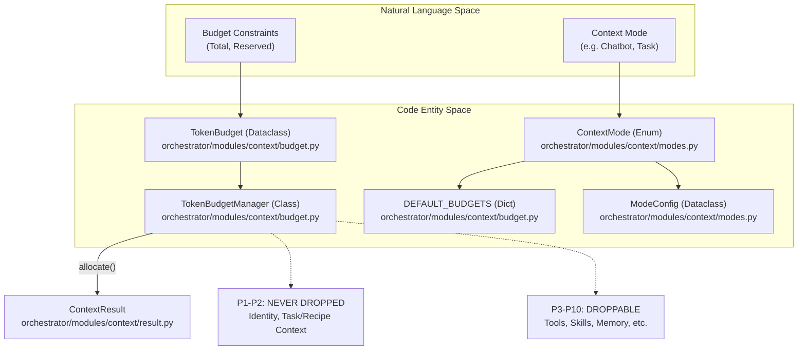
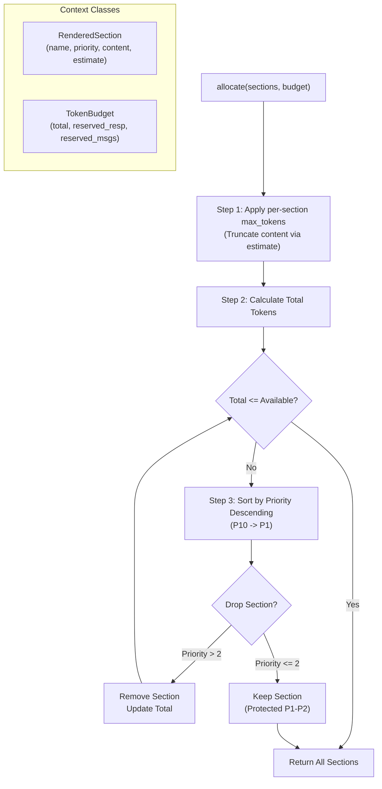

# Token Budget Management

Relevant source files

The following files were used as context for generating this wiki page:

- [orchestrator/modules/context/budget.py](orchestrator/modules/context/budget.py)
- [orchestrator/modules/context/modes.py](orchestrator/modules/context/modes.py)
- [orchestrator/modules/context/sections/__init__.py](orchestrator/modules/context/sections/__init__.py)
- [orchestrator/modules/context/sections/agent_roster.py](orchestrator/modules/context/sections/agent_roster.py)
- [orchestrator/modules/context/sections/mission_context.py](orchestrator/modules/context/sections/mission_context.py)
- [orchestrator/modules/context/sections/onboarding.py](orchestrator/modules/context/sections/onboarding.py)
- [orchestrator/tests/test_context/__init__.py](orchestrator/tests/test_context/__init__.py)
- [orchestrator/tests/test_context/conftest.py](orchestrator/tests/test_context/conftest.py)
- [orchestrator/tests/test_context/test_budget_manager.py](orchestrator/tests/test_context/test_budget_manager.py)
- [orchestrator/tests/test_context/test_estimator.py](orchestrator/tests/test_context/test_estimator.py)
- [orchestrator/tests/test_context/test_identity_section.py](orchestrator/tests/test_context/test_identity_section.py)
- [orchestrator/tests/test_context/test_memory_section.py](orchestrator/tests/test_context/test_memory_section.py)
- [orchestrator/tests/test_context/test_modes.py](orchestrator/tests/test_context/test_modes.py)
- [orchestrator/tests/test_context/test_service.py](orchestrator/tests/test_context/test_service.py)

**Purpose**: This page documents the token budget management system in `ContextService`, which controls how much context can be included in LLM prompts across different execution modes. Token budgets prevent prompt assembly from exceeding model context windows while ensuring critical sections (identity, task context, skills) are never dropped.

---

## Overview

The token budget manager allocates a fixed token budget across rendered sections during prompt assembly. Each context mode (e.g., `CHATBOT`, `TASK_EXECUTION`, `HEARTBEAT_ORCHESTRATOR`) defined in `ContextMode` [orchestrator/modules/context/modes.py:13-22]() has a specific `ModeConfig` which dictates the sections included and optional `max_tokens` constraints [orchestrator/modules/context/modes.py:25-33](). During the assembly phase, the `TokenBudgetManager` ensures that the final prompt fits within the model's window. Sections with priority 1-2 are **never dropped**, while sections with higher priority numbers (lower importance) may be trimmed or excluded if the budget is exhausted [orchestrator/modules/context/budget.py:8-9]().

### Context to Code Mapping

**Sources**:
- [orchestrator/modules/context/modes.py:13-22]()
- [orchestrator/modules/context/modes.py:25-33]()
- [orchestrator/modules/context/budget.py:26-40]()
- [orchestrator/modules/context/budget.py:53-64]()

---

## Budget Configuration

Token budgets are configured per context mode in `DEFAULT_BUDGETS` [orchestrator/modules/context/budget.py:152-202](). A `TokenBudget` defines the total window, tokens reserved for the model's response, and tokens reserved for the conversation message history [orchestrator/modules/context/budget.py:26-35](). The property `available_for_sections` is dynamically computed to determine the remaining space for system prompt sections [orchestrator/modules/context/budget.py:37-40]().

### Default Budgets by Mode

| ContextMode | Total Budget | Reserved (Response) | Reserved (Messages) | Available for Sections |
| :--- | :--- | :--- | :--- | :--- |
| `CHATBOT` | 128,000 | 4,096 | 60,000 | 63,904 |
| `TASK_EXECUTION` | 128,000 | 4,096 | 20,000 | 103,904 |
| `HEARTBEAT_ORCHESTRATOR`| 128,000 | 2,048 | 0 | 125,952 |
| `COORDINATOR` | 131,072 | 4,096 | 0 | 126,976 |
| `NL2SQL` | 128,000 | 2,048 | 2,000 | 123,952 |

**Sources**:
- [orchestrator/modules/context/budget.py:152-202]()
- [orchestrator/modules/context/budget.py:26-40]()

---

## TokenBudgetManager Implementation

The `TokenBudgetManager` [orchestrator/modules/context/budget.py:53-64]() manages token allocation across `RenderedSection` objects. It follows a multi-step trimming algorithm to protect critical information.

### Data Flow and Trimming Logic

**Key Implementation Details**:
1. **Per-Section Caps**: Before dropping entire sections, the manager applies individual `max_tokens` constraints. If a section exceeds its limit, it is truncated (roughly 4 chars per token) and re-estimated [orchestrator/modules/context/budget.py:81-93]().
2. **Priority-Based Dropping**: If the total still exceeds the budget, it drops sections starting from the highest priority number (least important) [orchestrator/modules/context/budget.py:113-115]().
3. **Protected Tiers**: Sections with `priority <= 2` are **never dropped** [orchestrator/modules/context/budget.py:122-123](). This ensures the agent always knows who it is and what its immediate goal is.
    - `IdentitySection` (Priority 1) [orchestrator/modules/context/sections/identity.py:158-161]()
    - `TaskContextSection` (Priority 2) [orchestrator/modules/context/sections/__init__.py:39]()
    - `OnboardingSection` (Priority 2) [orchestrator/modules/context/sections/onboarding.py:43]()
    - `MissionContextSection` (Priority 2) [orchestrator/modules/context/sections/mission_context.py:31]()

**Sources**:
- [orchestrator/modules/context/budget.py:66-145]()
- [orchestrator/modules/context/sections/identity.py:158-161]()
- [orchestrator/modules/context/sections/onboarding.py:43]()
- [orchestrator/modules/context/sections/mission_context.py:31]()

---

## Section Priority System

The system uses a 1-10 priority scale (defined in `SECTION_REGISTRY` mapping) where lower numbers indicate higher importance [orchestrator/modules/context/sections/__init__.py:28-45]().

| Priority | Section Name | Role | Class |
| :--- | :--- | :--- | :--- |
| **1** | `identity` | Agent name, role, persona, response style | `IdentitySection` |
| **2** | `task_context` | Current task description and metadata | `TaskContextSection` |
| **2** | `onboarding` | Mission Zero workspace setup prompts | `OnboardingSection` |
| **2** | `mission_context` | Mission goal, plan, and task statuses | `MissionContextSection` |
| **3** | `agent_roster` | Available agents for the coordinator | `AgentRosterSection` |
| **3** | `tools` | Tool choice and loading (Internal rendering) | `ToolsSection` |
| **4** | `skills` | Skill instructions and tool usage guides | `SkillsSection` |
| **5** | `platform_actions`| Summaries of available system tools | `PlatformActionsSection` |
| **5** | `plugins` | Non-materialized plugin capabilities | `PluginsSection` |
| **5** | `composio` | External app descriptions | `ComposioSection` |
| **6** | `memory` | User facts, session context, and logs | `MemorySection` |
| **8** | `datetime_context`| Current timestamp for temporal grounding | `DatetimeContextSection` |
| **9** | `conversation` | Formatted chat history | `ConversationSection` |
| **10** | `custom` | Dynamic overrides or one-off prompts | `CustomSection` |

**Sources**:
- [orchestrator/modules/context/sections/__init__.py:28-45]()
- [orchestrator/modules/context/budget.py:121-123]()
- [orchestrator/modules/context/sections/agent_roster.py:28]()
- [orchestrator/modules/context/sections/onboarding.py:43]()
- [orchestrator/modules/context/sections/mission_context.py:31]()

---

## Token Estimation

The system uses a `TokenEstimator` utility [orchestrator/modules/context/budget.py:22]() for rapid calculations without requiring a full tokenizer in the critical path.

- **Heuristic**: Roughly 4 characters per token [orchestrator/modules/context/budget.py:83]().
- **Usage**: `TokenBudgetManager` uses it to re-calculate estimates after truncating section content to fit `max_tokens` [orchestrator/modules/context/budget.py:84-85]().
- **Safety**: If the total tokens remain over budget after all droppable sections are removed, a warning is logged, but priority 1-2 sections are preserved to maintain agent coherence [orchestrator/modules/context/budget.py:137-143]().

**Sources**:
- [orchestrator/modules/context/budget.py:22]()
- [orchestrator/modules/context/budget.py:82-92]()
- [orchestrator/modules/context/budget.py:137-143]()

---

## Integration in Prompt Building

In the `ContextService`, budget management is applied after all sections have been rendered in parallel.

1. `ContextService.build_context()` determines the `ContextMode` and retrieves the corresponding `TokenBudget` from `DEFAULT_BUDGETS` [orchestrator/modules/context/budget.py:152-202]().
2. All sections required by the mode are rendered into `RenderedSection` objects [orchestrator/modules/context/budget.py:43-50]().
3. `TokenBudgetManager.allocate()` is called to trim or drop sections based on priority [orchestrator/modules/context/budget.py:66-70]().
4. The final `ContextResult` includes the list of `sections_included` and `sections_trimmed` for observability [orchestrator/tests/test_context/test_service.py:202-204]().

**Sources**:
- [orchestrator/modules/context/budget.py:152-202]()
- [orchestrator/modules/context/budget.py:66-75]()
- [orchestrator/tests/test_context/test_service.py:192-204]()

---