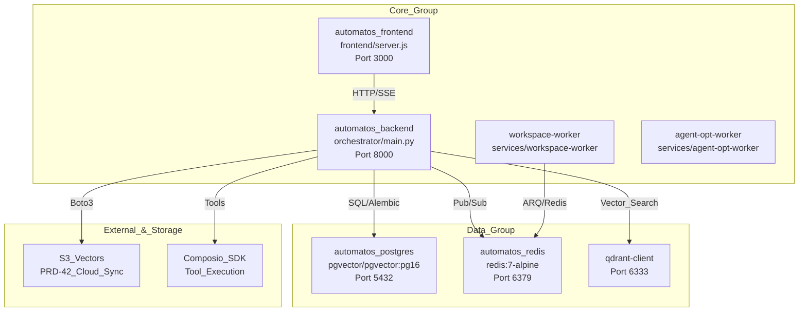

# Deployment & Infrastructure

Relevant source files

The following files were used as context for generating this wiki page:

- [docker-compose.yml](docker-compose.yml)
- [frontend/.dockerignore](frontend/.dockerignore)
- [frontend/Dockerfile](frontend/Dockerfile)
- [orchestrator/Dockerfile](orchestrator/Dockerfile)
- [orchestrator/api/cloud_documents.py](orchestrator/api/cloud_documents.py)
- [orchestrator/core/database/boot_lock.py](orchestrator/core/database/boot_lock.py)
- [orchestrator/core/redis/client.py](orchestrator/core/redis/client.py)
- [orchestrator/requirements.txt](orchestrator/requirements.txt)
- [railway.json](railway.json)

## Purpose and Scope

This document covers the containerization, orchestration, and deployment infrastructure for Automatos AI. It explains the Docker multi-stage build process, the modular Docker Compose architecture mirroring a 19-service production topology, environment variable configuration, and production deployment strategies on platforms like Railway.

**Related Pages:**
- For Dockerfiles of specific components, see [Docker Containerization](#20.1)
- For modular service definitions and health checks, see [Docker Compose Setup](#20.2)
- For required secrets and API keys, see [Environment Variables](#20.3)
- For pgvector and migrations, see [Database Setup](#20.4)
- For pub/sub and session storage, see [Redis Configuration](#20.5)
- For scaling and monitoring, see [Production Deployment](#20.6)

---

## System Overview

Automatos AI uses a highly modular, containerized architecture. While a single `docker-compose.yml` exists for quick starts, the production infrastructure is divided into functional groups to allow independent scaling. The backend services utilize a `boot_leader_lock` via PostgreSQL advisory locks to coordinate database migrations across multiple worker replicas [orchestrator/core/database/boot_lock.py:25-34]().

### Infrastructure Topology
The following diagram maps the production service groups to their respective code entities and data stores.

**Sources:** [docker-compose.yml:22-184](), [orchestrator/requirements.txt:61-105](), [orchestrator/core/redis/client.py:110-120]()

---

## Backend Containerization

The backend uses a multi-stage Dockerfile to optimize image size and security [orchestrator/Dockerfile:4-8]().

- **Base Stage**: Installs system dependencies including `tesseract-ocr` for OCR and `libpango`/`libcairo` for `WeasyPrint` document generation [orchestrator/Dockerfile:18-32](). It pre-downloads NLTK data to `/usr/local/nltk_data` [orchestrator/Dockerfile:49-52]().
- **Development Stage**: Enables hot-reload by mounting the `orchestrator/` directory and running `uvicorn` with `--reload` [orchestrator/Dockerfile:90]().
- **Production Stage**: Strips development dependencies, creates a non-root `automatos` user (UID 1000) [orchestrator/Dockerfile:117](), and runs `uvicorn main:app` with 4 workers after applying `alembic upgrade heads` [orchestrator/Dockerfile:140]().

For details, see [Docker Containerization](#20.1).

**Sources:** [orchestrator/Dockerfile:1-141](), [orchestrator/requirements.txt:1-119]()

---

## Frontend Containerization

The frontend is a Next.js application containerized using a four-stage process [frontend/Dockerfile:4-9]().

- **Base**: Installs build tools like `python3` and `make` for native module compilation [frontend/Dockerfile:19-23]().
- **Builder**: Bakes `NEXT_PUBLIC_*` environment variables (e.g., `NEXT_PUBLIC_API_URL`, `NEXT_PUBLIC_CLERK_PUBLISHABLE_KEY`) into the client bundle [frontend/Dockerfile:58-80]().
- **Production**: Uses the Next.js `standalone` output mode [frontend/Dockerfile:97]() to minimize the runtime image size, running as a non-root `nextjs` user [frontend/Dockerfile:101]().

For details, see [Docker Containerization](#20.1).

**Sources:** [frontend/Dockerfile:1-114]()

---

## Docker Compose Setup

The system provides a unified `docker-compose.yml` for local development.

- **Service Orchestration**: It defines `postgres`, `redis`, `backend`, and `frontend` as core services [docker-compose.yml:18-170]().
- **Profiles**: Services like `workspace-worker` are gated behind the `workers` profile to save resources during standard development [docker-compose.yml:184]().
- **Health Checks**: All services include robust health checks (e.g., `pg_isready` for Postgres [docker-compose.yml:36-41](), `redis-cli ping` for Redis [docker-compose.yml:66-71]()).
- **Volume Mounting**: The backend mounts the `orchestrator/` directory for hot-reloading and has read-only access to `workspace_data` for the code viewer widget [docker-compose.yml:126-130]().

For details, see [Docker Compose Setup](#20.2).

**Sources:** [docker-compose.yml:1-190]()

---

## Environment Variables

Configuration is driven by environment variables. A template is provided in `.env.example`.

### Variable Categories
| Category | Key Variables |
| :--- | :--- |
| **Databases** | `DATABASE_URL`, `POSTGRES_PASSWORD`, `REDIS_PASSWORD` [docker-compose.yml:94-102]() |
| **Auth** | `CLERK_SECRET_KEY`, `NEXT_PUBLIC_CLERK_PUBLISHABLE_KEY` [docker-compose.yml:118-121]() |
| **Security** | `API_KEY` (Required for backend/worker communication) [docker-compose.yml:116]() |
| **LLM Providers** | `OPENAI_API_KEY`, `ANTHROPIC_API_KEY` [docker-compose.yml:105-106]() |
| **Integrations** | `GOTENBERG_URL` (PDF Generation) [docker-compose.yml:109]() |

For details, see [Environment Variables](#20.3).

**Sources:** [docker-compose.yml:26-121]()

---

## Production Deployment & Monitoring

The platform is optimized for cloud deployment with a focus on reliability and security.

- **Railway Deployment**: The `railway.json` file configures the production build target and restart policies [railway.json:1-13]().
- **Database Migrations**: The production command `alembic upgrade heads && uvicorn ...` ensures that the schema is always synchronized with the code before the server starts [orchestrator/Dockerfile:140]().
- **Redis Hardening**: Production Redis is configured to rename/disable dangerous commands like `FLUSHDB` and `FLUSHALL` [docker-compose.yml:59-60]().
- **Real-time Events**: The `RedisClient` manages workflow event publishing to channels like `workflow:{id}:execution:{id}` for frontend streaming [orchestrator/core/redis/client.py:110-119]().

For details, see [Production Deployment](#20.6).

**Sources:** [railway.json:1-13](), [orchestrator/Dockerfile:132-140](), [docker-compose.yml:54-61](), [orchestrator/core/redis/client.py:91-120]()

---