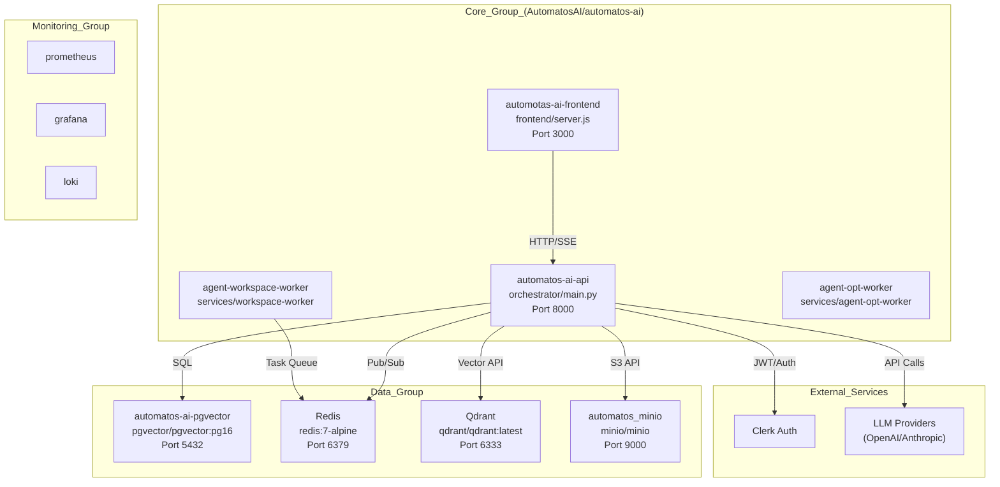

# Deployment & Infrastructure

Relevant source files

The following files were used as context for generating this wiki page:

- [.github/workflows/test.yml](.github/workflows/test.yml)
- [docker-compose.yml](docker-compose.yml)
- [frontend/.dockerignore](frontend/.dockerignore)
- [frontend/Dockerfile](frontend/Dockerfile)
- [infrastructure/.env.example](infrastructure/.env.example)
- [infrastructure/railway-manifest.json](infrastructure/railway-manifest.json)
- [orchestrator/Dockerfile](orchestrator/Dockerfile)
- [orchestrator/core/redis/client.py](orchestrator/core/redis/client.py)
- [orchestrator/requirements.txt](orchestrator/requirements.txt)
- [orchestrator/tests/test_dockerfile_prod_parity.py](orchestrator/tests/test_dockerfile_prod_parity.py)

## Purpose and Scope

This document covers the containerization, orchestration, and deployment infrastructure for Automatos AI. It explains the Docker multi-stage build process, the modular Docker Compose architecture mirroring a 19-service production topology, environment variable configuration, and production deployment strategies on platforms like Railway.

**Related Pages:**
- For Dockerfiles of specific components, see [Docker Containerization](#20.1)
- For modular service definitions and health checks, see [Docker Compose Setup](#20.2)
- For required secrets and API keys, see [Environment Variables](#20.3)
- For pgvector and migrations, see [Database Setup](#20.4)
- For pub/sub and session storage, see [Redis & Vector Store Configuration](#20.5)
- For scaling and monitoring, see [Production Deployment & CI/CD](#20.6)

---

## System Overview

Automatos AI uses a highly modular, containerized architecture. While a single `docker-compose.yml` exists for quick starts, the production infrastructure is divided into functional groups (Core, Data, Monitoring, Voice, Memory, Landing) to allow independent scaling and management.

### Infrastructure Topology
The following diagram maps the production service groups to their respective code entities and data stores, including the local S3-compatible storage layer.

**Sources:** [docker-compose.yml:26-133](), [infrastructure/railway-manifest.json:68-235]()

---

## Docker Containerization

The Automatos AI platform leverages multi-stage Dockerfiles for its core components: `orchestrator` (backend), `frontend`, `workspace-worker`, and `agent-opt-worker`. This approach optimizes image size, build times, and security by separating build-time dependencies from runtime environments. Production parity tests, such as `test_dockerfile_prod_parity.py`, ensure that local development configurations do not inadvertently ship to production, especially concerning build arguments and default values [orchestrator/tests/test_dockerfile_prod_parity.py:1-102](). Each Dockerfile also includes a `.dockerignore` file to exclude unnecessary files from the build context, further reducing image size and build times [frontend/.dockerignore:1-15]().

For details, see [Docker Containerization](#20.1).

**Sources:** [orchestrator/Dockerfile:1-184](), [frontend/Dockerfile:1-133](), [orchestrator/tests/test_dockerfile_prod_parity.py:1-102](), [frontend/.dockerignore:1-15]()

---

## Docker Compose Setup

The `docker-compose.yml` file provides a comprehensive local development environment, defining various services essential for the Automatos AI platform. This includes core data stores like `postgres` (with `pgvector` support), `redis` for caching and pub/sub, and `minio` as a local S3-compatible object store [docker-compose.yml:26-111](). An optional `qdrant` service is available via the `memory` profile for durable and field memory [docker-compose.yml:123-133](). Each service is configured with health checks to ensure proper startup and operation, and volumes are used for data persistence. The `docker-entrypoint.sh` script for the backend handles database migrations before application startup, ensuring schema alignment [orchestrator/Dockerfile:119-131]().

For details, see [Docker Compose Setup](#20.2).

**Sources:** [docker-compose.yml:1-442](), [orchestrator/Dockerfile:119-131]()

---

## Environment Variables

Configuration across the Automatos AI platform is managed through environment variables. The `infrastructure/.env.example` file serves as a template, outlining all configurable variables, including required secrets like `POSTGRES_PASSWORD`, `REDIS_PASSWORD`, and various API keys [infrastructure/.env.example:1-231](). These variables are categorized for clarity, covering global settings, database connections, LLM providers, security, and integration-specific keys. The system also uses `envs/*.defaults` files to set default values for local development, which can be overridden by the `.env` file or explicit `environment` settings in `docker-compose.yml` [docker-compose.yml:158-159](). Sensitive information is explicitly marked as `[REQUIRED]` and should not be committed to version control.

For details, see [Environment Variables](#20.3).

**Sources:** [infrastructure/.env.example:1-231](), [docker-compose.yml:158-159]()

---

## Database Setup

Automatos AI utilizes PostgreSQL with the `pgvector` extension for its primary data storage and vector embeddings. The `postgres` service in `docker-compose.yml` uses the `pgvector/pgvector:pg16` image, ensuring vector capabilities are available out-of-the-box [docker-compose.yml:31](). Database schema management is handled by Alembic, with migrations applied automatically at backend startup via `alembic upgrade heads` [orchestrator/Dockerfile:131](). The `scripts/init_test_db.py` script is used in CI environments to initialize a fresh database schema for testing [orchestrator/tests/test.yml:109-110](). Seed data and schema initialization are part of the application's boot process, ensuring a consistent starting state.

For details, see [Database Setup](#20.4).

**Sources:** [docker-compose.yml:31](), [orchestrator/Dockerfile:131](), [orchestrator/tests/test.yml:109-110]()

---

## Redis & Vector Store Configuration

Redis is a critical component for caching, session management, and real-time communication via Pub/Sub channels. The `RedisClient` in `orchestrator/core/redis/client.py` manages connection pooling and provides methods for publishing and subscribing to messages, crucial for real-time workflow updates [orchestrator/core/redis/client.py:13-120](). The `docker-compose.yml` configures Redis with a password and disables dangerous commands like `FLUSHDB` and `FLUSHALL` for security [docker-compose.yml:61-62](). For vector storage, the platform supports `pgvector` (default) and an optional `Qdrant` service, which can be enabled via a Docker Compose profile for durable and field memory [docker-compose.yml:123-133](). S3 Vectors backend is also supported for cloud-based vector storage.

For details, see [Redis & Vector Store Configuration](#20.5).

**Sources:** [orchestrator/core/redis/client.py:13-120](), [docker-compose.yml:61-62](), [docker-compose.yml:123-133]()

---

## Production Deployment & CI/CD

The Automatos AI platform is deployed to production using Railway, with its topology defined in `infrastructure/railway-manifest.json`. This manifest organizes services into logical groups like `core`, `data`, `voice`, and `monitoring`, specifying their repositories, build configurations (e.g., `builder: DOCKERFILE`), and environment variables [infrastructure/railway-manifest.json:12-228](). GitHub Actions workflows, such as `test.yml`, enforce code quality and reliability by running comprehensive test suites, including a coverage ratchet to maintain code coverage standards [orchestrator/tests/test.yml:1-144](). The `import-linter` tool is used to enforce architectural boundaries and prevent unwanted dependencies between modules [orchestrator/requirements.txt:66-70](). Scaling and disaster recovery scripts are part of the operational toolkit, ensuring high availability and performance.

For details, see [Production Deployment & CI/CD](#20.6).

**Sources:** [infrastructure/railway-manifest.json:12-228](), [orchestrator/tests/test.yml:1-144](), [orchestrator/requirements.txt:66-70]()

---