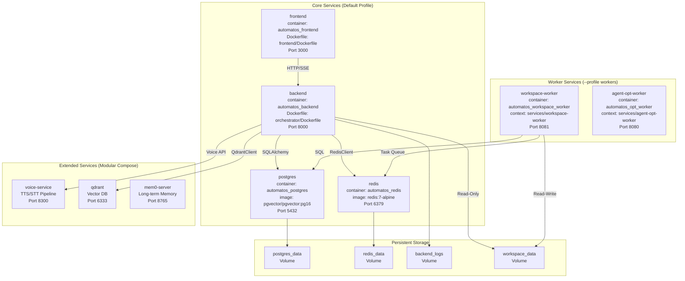
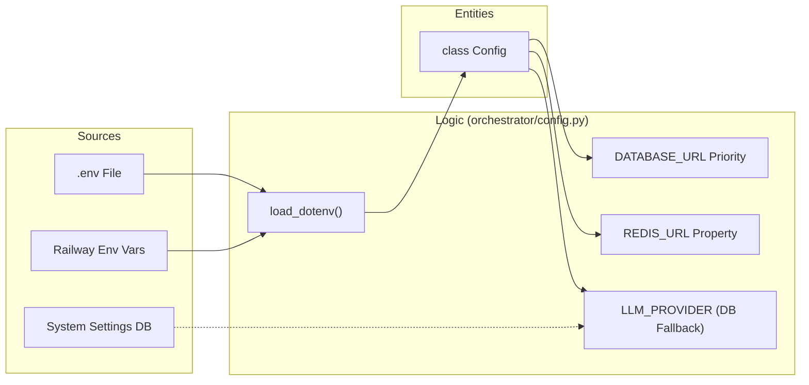

# Deployment & Infrastructure

Relevant source files

The following files were used as context for generating this wiki page:

- [README.md](README.md)
- [docker-compose.yml](docker-compose.yml)
- [docs/README.md](docs/README.md)
- [frontend/.dockerignore](frontend/.dockerignore)
- [frontend/Dockerfile](frontend/Dockerfile)
- [frontend/pages/_document.tsx](frontend/pages/_document.tsx)
- [infrastructure/.env.example](infrastructure/.env.example)
- [infrastructure/docker-compose.core.yml](infrastructure/docker-compose.core.yml)
- [infrastructure/docker-compose.data.yml](infrastructure/docker-compose.data.yml)
- [infrastructure/docker-compose.landing.yml](infrastructure/docker-compose.landing.yml)
- [infrastructure/docker-compose.memory.yml](infrastructure/docker-compose.memory.yml)
- [infrastructure/docker-compose.monitoring.yml](infrastructure/docker-compose.monitoring.yml)
- [infrastructure/docker-compose.voice.yml](infrastructure/docker-compose.voice.yml)
- [infrastructure/docker-compose.yml](infrastructure/docker-compose.yml)
- [infrastructure/railway-manifest.json](infrastructure/railway-manifest.json)
- [orchestrator/.dockerignore](orchestrator/.dockerignore)
- [orchestrator/.python-version](orchestrator/.python-version)
- [orchestrator/.railway-watch.json](orchestrator/.railway-watch.json)
- [orchestrator/Dockerfile](orchestrator/Dockerfile)
- [orchestrator/api/cloud_documents.py](orchestrator/api/cloud_documents.py)
- [orchestrator/core/credentials/encryption.py](orchestrator/core/credentials/encryption.py)
- [orchestrator/core/redis/client.py](orchestrator/core/redis/client.py)
- [orchestrator/modules/tools/services/__init__.py](orchestrator/modules/tools/services/__init__.py)
- [orchestrator/requirements.txt](orchestrator/requirements.txt)
- [orchestrator/start.sh](orchestrator/start.sh)
- [railway.json](railway.json)

## Purpose and Scope

This document covers the containerization, orchestration, and deployment infrastructure for Automatos AI. It explains the Docker multi-stage build process, modular Docker Compose service orchestration (Core, Data, Monitoring, Voice, Memory, Landing), environment variable configuration, and production deployment strategies on Railway.

**Related Pages:**
- For Dockerfiles of specific components, see [Docker Containerization](#20.1)
- For service definitions and health checks, see [Docker Compose Setup](#20.2)
- For required secrets and API keys, see [Environment Variables](#20.3)
- For pgvector and migrations, see [Database Setup](#20.4)
- For pub/sub and session storage, see [Redis Configuration](#20.5)
- For scaling and monitoring, see [Production Deployment](#20.6)

---

## System Overview

Automatos AI uses a containerized architecture with services orchestrated by Docker Compose. The system supports both development (hot-reload) and production (optimized) targets through multi-stage Dockerfiles and profile-based service activation. In production, the topology expands to 19 services across 6 functional groups.

### Infrastructure Topology
The following diagram maps high-level infrastructure components to their respective code entities and service definitions.

**Sources:** [docker-compose.yml:18-251](), [infrastructure/docker-compose.core.yml:14-167](), [infrastructure/docker-compose.data.yml:13-107](), [infrastructure/docker-compose.voice.yml:12-86]()

---

## Backend Containerization

The backend uses a multi-stage Dockerfile [orchestrator/Dockerfile:1-130]() to optimize image size and security.

- **Base Stage**: Installs system dependencies like `gcc`, `tesseract-ocr`, `ghostscript`, and `libpango` for document generation [orchestrator/Dockerfile:18-32](). It also pre-downloads NLTK data to `/usr/local/nltk_data` [orchestrator/Dockerfile:49-52]().
- **Development Stage**: Configured for hot-reload by mounting the `orchestrator/` directory and running `uvicorn` with `--reload` [orchestrator/Dockerfile:85]().
- **Production Stage**: Removes development tools (pytest, black), creates a non-root `automatos` user [orchestrator/Dockerfile:112](), and uses the `PORT` environment variable provided by Railway [orchestrator/Dockerfile:129]().

For details, see [Docker Containerization](#20.1).

**Sources:** [orchestrator/Dockerfile:1-130](), [orchestrator/requirements.txt:1-113]()

---

## Frontend Containerization

The frontend is a Next.js application containerized using a four-stage process [frontend/Dockerfile:1-115]().

- **Base**: Installs build tools like `python3` and `make` for native module compilation [frontend/Dockerfile:19-23]().
- **Builder**: Injects `NEXT_PUBLIC_*` environment variables during the build process, including `NEXT_PUBLIC_API_URL` and `NEXT_PUBLIC_CLERK_PUBLISHABLE_KEY` [frontend/Dockerfile:58-71]().
- **Production**: Uses the Next.js "standalone" output mode [frontend/Dockerfile:97]() to minimize the runtime image size, running as a non-root `nextjs` user [frontend/Dockerfile:101]().

For details, see [Docker Containerization](#20.1).

**Sources:** [frontend/Dockerfile:1-115]()

---

## Docker Compose Setup

The orchestration is split into modular files for different environments and functional groups.

- **Unified Compose**: The root `docker-compose.yml` provides a quick-start for core services [docker-compose.yml:1-16]().
- **Modular Infrastructure**: In production, services are split into:
    - `docker-compose.core.yml`: API, Frontend, and Workers [infrastructure/docker-compose.core.yml:1-12]().
    - `docker-compose.data.yml`: PostgreSQL (pgvector), Redis, and Qdrant [infrastructure/docker-compose.data.yml:1-11]().
    - `docker-compose.monitoring.yml`: Prometheus, Grafana, Loki, and Exporters [infrastructure/docker-compose.monitoring.yml:1-14]().
    - `docker-compose.voice.yml`: TTS and STT services [infrastructure/docker-compose.voice.yml:1-10]().

For details, see [Docker Compose Setup](#20.2).

**Sources:** [docker-compose.yml:1-253](), [infrastructure/docker-compose.core.yml:1-167](), [infrastructure/docker-compose.monitoring.yml:1-183]()

---

## Environment Variables

Configuration is centralized in the backend `Config` class, which prioritizes environment variables over hardcoded defaults.

### Configuration Resolution Logic

Required variables include `POSTGRES_PASSWORD`, `REDIS_PASSWORD`, and `API_KEY` [docker-compose.yml:29-116](). Security-critical keys like `CREDENTIAL_ENCRYPTION_KEY` and `WIDGET_TOKEN_SECRET` must be set for production [infrastructure/docker-compose.core.yml:61-62]().

For details, see [Environment Variables](#20.3).

**Sources:** [docker-compose.yml:8-12](), [infrastructure/docker-compose.core.yml:28-112](), [orchestrator/core/credentials/encryption.py:62-72]()

---

## Database & Redis Setup

### Database (PostgreSQL)
The system uses `pgvector` for semantic search [orchestrator/requirements.txt:11](). Production uses `pgvector:pg18` with optimized memory settings (`shared_buffers=256MB`, `work_mem=4MB`) [infrastructure/docker-compose.data.yml:20-28]().

### Redis
Redis handles caching, Pub/Sub, and task queues. Security is hardened by renaming dangerous commands like `FLUSHALL` and `FLUSHDB` to empty strings [docker-compose.yml:59-61](). Production uses `redis:8.2.1` with a 256MB LRU eviction policy [infrastructure/docker-compose.data.yml:53-62]().

For details, see [Database Setup](#20.4) and [Redis Configuration](#20.5).

**Sources:** [docker-compose.yml:22-73](), [infrastructure/docker-compose.data.yml:19-76](), [orchestrator/requirements.txt:11]()

---

## Production Deployment

Automatos AI is deployed on Railway using a multi-repo, multi-service topology [infrastructure/railway-manifest.json:1-12]().

- **Service Groups**: 19 services are organized into groups: `core`, `voice`, `memory`, `monitoring`, `data`, and `landing` [infrastructure/railway-manifest.json:14-44]().
- **Railway Configuration**: The `railway.json` file specifies the `production` Docker target and an `ON_FAILURE` restart policy [railway.json:1-13]().
- **Monitoring Stack**: A full observability suite is deployed, including `prometheus` for metrics, `loki` for log aggregation, and `grafana` for visualization [infrastructure/docker-compose.monitoring.yml:16-75]().
- **Persistence**: Production volumes include `agent-workspace-data` (50GB) and `prometheus_data` (50GB) [infrastructure/railway-manifest.json:135-137]().

For details, see [Production Deployment](#20.6).

**Sources:** [railway.json:1-13](), [infrastructure/railway-manifest.json:1-121](), [infrastructure/docker-compose.monitoring.yml:1-193]()

---