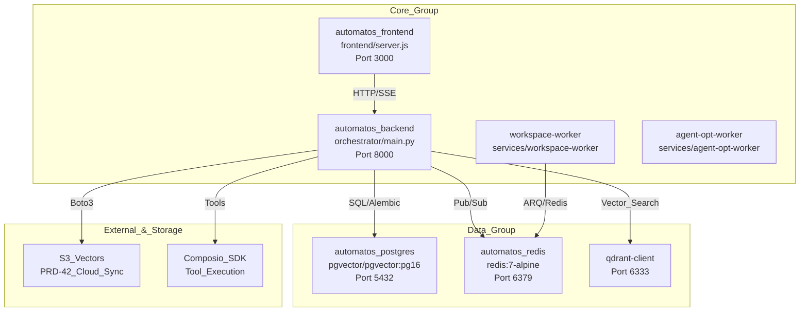

# Deployment & Infrastructure

Relevant source files

The following files were used as context for generating this wiki page:

- [docker-compose.yml](docker-compose.yml)
- [frontend/.dockerignore](frontend/.dockerignore)
- [frontend/Dockerfile](frontend/Dockerfile)
- [orchestrator/Dockerfile](orchestrator/Dockerfile)
- [orchestrator/api/cloud_documents.py](orchestrator/api/cloud_documents.py)
- [orchestrator/core/database/boot_lock.py](orchestrator/core/database/boot_lock.py)
- [orchestrator/core/redis/client.py](orchestrator/core/redis/client.py)
- [orchestrator/requirements.txt](orchestrator/requirements.txt)
- [railway.json](railway.json)

## Purpose and Scope

This document covers the containerization, orchestration, and deployment infrastructure for Automatos AI. It explains the Docker multi-stage build process, the Docker Compose stack that is the local edition, environment variable configuration, and the hosted deployment on Railway.

> **Running it yourself?** [Self-hosting — the local edition](../getting-started/self-hosting.md) is the reference for the compose stack: services and ports, the three required secrets, the worker's host directory, object storage, the optional Composio key, updating, resetting and troubleshooting. The pages under this section describe the containers and the hosted topology; they point at the guide rather than repeating it.

**Related Pages:**
- For Dockerfiles of specific components, see [Docker Containerization](docker-containerization.md)
- For the compose services, volumes and profiles, see [Docker Compose Setup](docker-compose-setup.md)
- For where configuration lives and what each variable does, see [Environment Variables](environment-variables.md)
- For pgvector and migrations, see [Database Setup](database-setup.md)
- For pub/sub and session storage, see [Redis Configuration](redis-configuration.md)
- For the hosted (Railway) deployment, see [Production Deployment](production-deployment.md)

---

## System Overview

One codebase ships as two editions behind a runtime flag: the **local edition** (`AUTH_EDITION=local` — the `docker-compose.yml` stack: no login, one workspace, MinIO + pgvector) and the **hosted edition** (`AUTH_EDITION=saas` on Railway — Clerk accounts, AWS S3 + S3 Vectors, mem0/Qdrant memory, telemetry). The hosted deployment sets each service's environment itself and never reads the compose file or `envs/*.defaults`; the compose defaults therefore cost it nothing. The backend services utilize a `boot_leader_lock` via PostgreSQL advisory locks to coordinate database migrations across multiple worker replicas [orchestrator/core/database/boot_lock.py:25-34]().

### Infrastructure Topology
The following diagram maps the **hosted** service groups to their respective code entities and data stores. Locally, `agent-opt-worker`, Qdrant and S3 Vectors are absent (MinIO stands in for S3; RAG runs on pgvector) and Composio is only reachable with your own key.

**Sources:** [docker-compose.yml:22-184](), [orchestrator/requirements.txt:61-105](), [orchestrator/core/redis/client.py:110-120]()

---

## Backend Containerization

The backend uses a multi-stage Dockerfile to optimize image size and security [orchestrator/Dockerfile:4-8]().

- **Base Stage**: Installs system dependencies including `tesseract-ocr` for OCR and `libpango`/`libcairo` for `WeasyPrint` document generation [orchestrator/Dockerfile:18-32](). It pre-downloads NLTK data to `/usr/local/nltk_data` [orchestrator/Dockerfile:49-52]().
- **Development Stage**: Enables hot-reload by mounting the `orchestrator/` directory and running `uvicorn` with `--reload` [orchestrator/Dockerfile:90]().
- **Production Stage**: Strips development dependencies, creates a non-root `automatos` user (UID 1000) [orchestrator/Dockerfile:117](), and runs `uvicorn main:app` with 4 workers after applying `alembic upgrade heads` [orchestrator/Dockerfile:140]().

For details, see [Docker Containerization](#20.1).

**Sources:** [orchestrator/Dockerfile:1-141](), [orchestrator/requirements.txt:1-119]()

---

## Frontend Containerization

The frontend is a Next.js application containerized using a four-stage process [frontend/Dockerfile:4-9]().

- **Base**: Installs build tools like `python3` and `make` for native module compilation [frontend/Dockerfile:19-23]().
- **Builder**: Bakes `NEXT_PUBLIC_*` environment variables (e.g., `NEXT_PUBLIC_API_URL`, `NEXT_PUBLIC_CLERK_PUBLISHABLE_KEY`) into the client bundle [frontend/Dockerfile:58-80]().
- **Production**: Uses the Next.js `standalone` output mode [frontend/Dockerfile:97]() to minimize the runtime image size, running as a non-root `nextjs` user [frontend/Dockerfile:101]().

For details, see [Docker Containerization](#20.1).

**Sources:** [frontend/Dockerfile:1-114]()

---

## Docker Compose Setup

The unified `docker-compose.yml` is the local edition and the development environment.

- **Default profile**: `postgres` (pgvector), `redis`, `minio` (+ the one-shot `minio-init`), `backend`, `frontend` and `workspace-worker` [docker-compose.yml]().
- **`--profile all`**: adds `adminer` (database GUI, :8080) and `gotenberg` (document conversion, :3001). There is no `workers` profile any more — the workspace-worker runs by default.
- **Health Checks**: every long-running service has one (`pg_isready`, `redis-cli ping`, `mc ready`, `curl /health`); the frontend starts only after the backend is healthy.
- **Mounts**: the backend and frontend bind-mount their source directories for hot reload. The worker's files live in the host directory `AUTOMATOS_WORKSPACE_DIR` (default `./workspaces`), bind-mounted at `/workspaces` — read-write for the worker, read-only for the backend. This is a bind mount, not a named volume.

For details, see [Docker Compose Setup](docker-compose-setup.md).

**Sources:** [docker-compose.yml]()

---

## Environment Variables

Configuration is layered: `.env` (from `.env.example`) holds the secrets and is read by compose for substitution only; `envs/api.defaults` and `envs/frontend.defaults` carry the committed local topology; `envs/*.local` are gitignored overrides; `orchestrator/config.py` holds every code default and is the only module that reads the environment.

### Variable Categories
| Category | Key Variables |
| :--- | :--- |
| **Required (compose refuses to start without them)** | `POSTGRES_PASSWORD`, `REDIS_PASSWORD`, `API_KEY` [docker-compose.yml]() |
| **Edition** | `AUTH_EDITION` (`local` / `saas`) and its frontend mirror `NEXT_PUBLIC_AUTH_EDITION` [envs/api.defaults](), [envs/frontend.defaults]() |
| **LLM Providers** | `OPENAI_API_KEY`, `ANTHROPIC_API_KEY`, `OPENROUTER_API_KEY` — or keys stored under Settings → API Keys [docker-compose.yml]() |
| **Object storage** | `S3_ENDPOINT_URL` (MinIO locally), `S3_ACCESS_KEY_ID` / `S3_SECRET_ACCESS_KEY` / `S3_REGION` (mapped to the backend's `AWS_*`), `S3_PUBLIC_ENDPOINT_URL` [docker-compose.yml](), [envs/api.defaults]() |
| **Workspace worker** | `AUTOMATOS_WORKSPACE_DIR`, `ANTHROPIC_API_KEY` / `CLAUDE_CODE_OAUTH_TOKEN` (Canvas sessions), `WORKER_CONCURRENCY`, `WORKER_INTERNAL_TOKEN` [docker-compose.yml]() |
| **Integrations** | `COMPOSIO_API_KEY` (bring your own; optional), `GOTENBERG_URL` [docker-compose.yml]() |
| **Auth (hosted edition only)** | `CLERK_SECRET_KEY`, `CLERK_JWKS_URL`, `NEXT_PUBLIC_CLERK_PUBLISHABLE_KEY` — `:-` defaults in compose, so their absence never blocks a local boot [docker-compose.yml]() |

For details, see [Environment Variables](environment-variables.md).

**Sources:** [docker-compose.yml](), [envs/api.defaults](), [envs/frontend.defaults]()

---

## Production Deployment & Monitoring

The platform is optimized for cloud deployment with a focus on reliability and security.

- **Railway Deployment**: The `railway.json` file configures the production build target and restart policies [railway.json:1-13]().
- **Database Migrations**: The entrypoint runs `alembic upgrade heads` before `uvicorn` on every boot, in both editions; a failing migration stops the boot [docker-entrypoint.sh](), [orchestrator/Dockerfile:140]().
- **Redis Hardening**: The compose Redis is configured to rename/disable dangerous commands like `FLUSHDB` and `FLUSHALL` [docker-compose.yml]().
- **Real-time Events**: The `RedisClient` manages workflow event publishing to channels like `workflow:{id}:execution:{id}` for frontend streaming [orchestrator/core/redis/client.py:110-119]().

For details, see [Production Deployment](#20.6).

**Sources:** [railway.json:1-13](), [orchestrator/Dockerfile:132-140](), [docker-compose.yml:54-61](), [orchestrator/core/redis/client.py:91-120]()

---