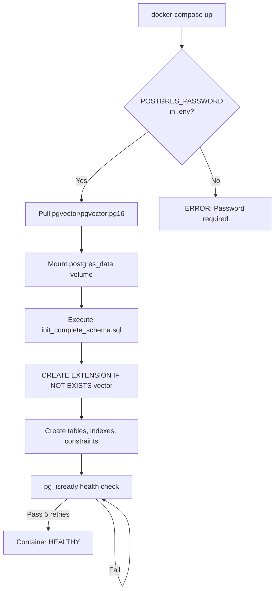
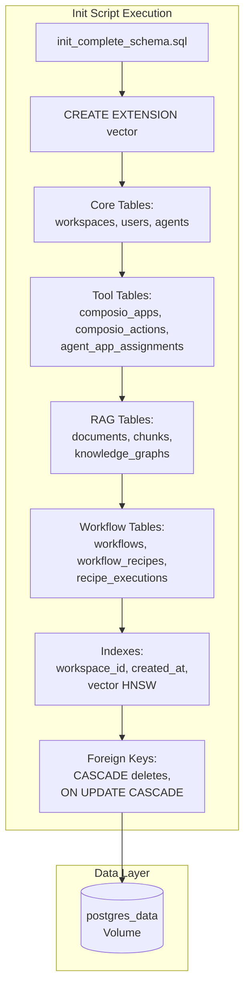
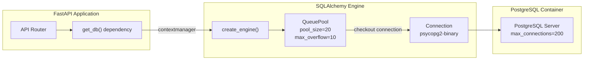
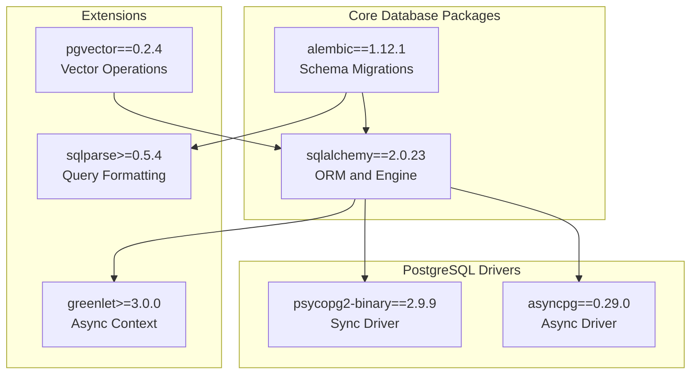
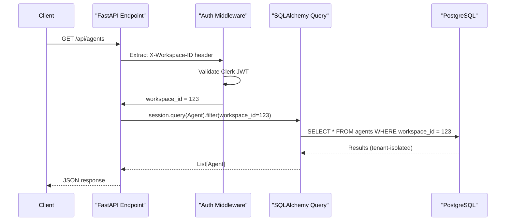

# Database Setup

<details>
<summary>Relevant source files</summary>

The following files were used as context for generating this wiki page:

- [docker-compose.yml](docker-compose.yml)
- [frontend/.dockerignore](frontend/.dockerignore)
- [frontend/Dockerfile](frontend/Dockerfile)
- [orchestrator/Dockerfile](orchestrator/Dockerfile)
- [orchestrator/core/redis/client.py](orchestrator/core/redis/client.py)
- [orchestrator/requirements.txt](orchestrator/requirements.txt)

</details>


## Purpose and Scope

This document covers the PostgreSQL database configuration, initialization, and management for Automatos AI. It details the Docker-based deployment, pgvector extension setup, schema initialization, connection pooling, and multi-tenancy architecture.

For application-level data models and ORM patterns, see [Database Models](#13.3). For Redis configuration, see [Redis Configuration](#15.5). For complete environment variable reference, see [Environment Variables](#15.3).

---

## PostgreSQL with pgvector

Automatos AI uses **PostgreSQL 16** with the **pgvector extension** for vector similarity search in the RAG system. The `pgvector/pgvector:pg16` Docker image provides both the database engine and native vector operations without requiring separate installation steps.

### Key Features

| Feature | Purpose | Implementation |
|---------|---------|----------------|
| **pgvector Extension** | Vector embeddings for RAG | Automatic initialization via init script |
| **Connection Pooling** | Max 200 concurrent connections | `max_connections=200` in POSTGRES_INITDB_ARGS |
| **Shared Buffers** | Memory optimization | `shared_buffers=256MB` for query performance |
| **SQLAlchemy ORM** | Python database abstraction | `sqlalchemy==2.0.23` with async support |
| **Alembic Migrations** | Schema versioning | `alembic==1.12.1` for incremental updates |

**Sources:** [docker-compose.yml:22-43](), [orchestrator/requirements.txt:6-13]()

---

## Docker Container Configuration

### Container Initialization Flow



**Sources:** [docker-compose.yml:22-43]()

### Docker Compose Service Definition

The PostgreSQL service is defined with strict health checks to ensure dependent services (backend, workspace-worker) only start when the database is fully ready:

```yaml
postgres:
  image: pgvector/pgvector:pg16
  environment:
    POSTGRES_DB: ${POSTGRES_DB:-orchestrator_db}
    POSTGRES_USER: ${POSTGRES_USER:-postgres}
    POSTGRES_PASSWORD: ${POSTGRES_PASSWORD:?POSTGRES_PASSWORD is required}
    POSTGRES_INITDB_ARGS: "-c max_connections=200 -c shared_buffers=256MB"
  volumes:
    - postgres_data:/var/lib/postgresql/data
    - ./orchestrator/database/init_complete_schema.sql:/docker-entrypoint-initdb.d/01-schema.sql:ro
  healthcheck:
    test: ["CMD-SHELL", "pg_isready -U ${POSTGRES_USER:-postgres}"]
    interval: 10s
    timeout: 5s
    retries: 5
    start_period: 10s
```

The `POSTGRES_PASSWORD:?` syntax enforces that the variable **must be set** in the `.env` file, preventing accidental deployment with default credentials.

**Sources:** [docker-compose.yml:22-43]()

---

## Environment Variables

### Required Configuration

| Variable | Default | Description |
|----------|---------|-------------|
| `POSTGRES_DB` | `orchestrator_db` | Database name |
| `POSTGRES_USER` | `postgres` | Superuser account |
| `POSTGRES_PASSWORD` | **(required)** | Master password - no default |
| `POSTGRES_HOST` | `postgres` | Hostname (container name in Docker network) |
| `POSTGRES_PORT` | `5432` | Standard PostgreSQL port |
| `DATABASE_URL` | *(computed)* | Full connection string for SQLAlchemy |

### Connection String Construction

The backend service constructs the `DATABASE_URL` from individual components:

```bash
DATABASE_URL=postgresql://${POSTGRES_USER}:${POSTGRES_PASSWORD}@${POSTGRES_HOST}:${POSTGRES_PORT}/${POSTGRES_DB}
```

This format is compatible with SQLAlchemy's `create_engine()` and Alembic's configuration.

**Sources:** [docker-compose.yml:91-97]()

---

## Schema Initialization

### Automatic Schema Creation

The database schema is initialized **once** during container first-start via the Docker `docker-entrypoint-initdb.d` mechanism. The `init_complete_schema.sql` script is mounted as a read-only volume and executed before PostgreSQL accepts connections.



**Sources:** [docker-compose.yml:35]()

### Key Schema Components

The complete schema includes **40+ tables** organized by functional domain:

| Domain | Tables | Purpose |
|--------|--------|---------|
| **Identity** | `workspaces`, `users`, `team_members` | Multi-tenancy and authentication |
| **Agents** | `agents`, `agent_categories`, `personas` | Agent definitions and configuration |
| **Tools** | `composio_apps`, `composio_actions`, `agent_app_assignments` | Tool metadata and permissions |
| **RAG** | `documents`, `chunks`, `knowledge_graphs`, `entities` | Document storage and retrieval |
| **Workflows** | `workflows`, `workflow_recipes`, `recipe_executions` | Multi-step automation |
| **Memory** | `conversation_contexts`, `memory_entries` | Chat history and agent memory |
| **System** | `credentials`, `settings`, `audit_logs` | Configuration and compliance |

Every major table includes:
- `workspace_id`: Foreign key for tenant isolation (indexed)
- `created_at` / `updated_at`: Timestamp tracking with auto-update triggers
- Soft delete support: `is_deleted` + `deleted_at` columns where appropriate

**Sources:** [docker-compose.yml:35]()

---

## Connection Pooling and Session Management

### SQLAlchemy Engine Configuration

The backend uses SQLAlchemy 2.0 with a connection pool configured for high concurrency:



### Session Lifecycle

Each API request follows this pattern:

1. **Request arrives** → Router invokes endpoint
2. **Dependency injection** → FastAPI calls `get_db()` 
3. **Session creation** → New SQLAlchemy `Session` from engine
4. **Query execution** → ORM operations within transaction
5. **Auto-commit/rollback** → `yield` returns control, exception handling commits or rolls back
6. **Session close** → Connection returned to pool

This ensures:
- **Automatic transaction management** (commit on success, rollback on exception)
- **Connection reuse** (pooling prevents connection exhaustion)
- **Thread safety** (each request gets isolated session)

**Sources:** [orchestrator/requirements.txt:6-13]()

---

## Database Dependencies

### Python Package Stack



**Sources:** [orchestrator/requirements.txt:6-13]()

### System-Level Dependencies

The Docker image includes PostgreSQL client tools for debugging and migrations:

| Package | Purpose | Installation Layer |
|---------|---------|-------------------|
| `postgresql-client` | `psql`, `pg_dump`, `pg_restore` | [orchestrator/Dockerfile:23]() |
| `gcc`, `g++` | Compile psycopg2 from source if needed | [orchestrator/Dockerfile:19-20]() |
| `libmagic1` | File type detection for document uploads | [orchestrator/Dockerfile:24]() |

**Sources:** [orchestrator/Dockerfile:18-33]()

---

## Migrations with Alembic

### Migration Directory Structure

```
orchestrator/
├── alembic/
│   ├── versions/
│   │   ├── 001_initial_schema.py
│   │   ├── 002_add_pgvector.py
│   │   └── ...
│   ├── env.py              # Migration runtime config
│   └── script.py.mako      # Migration template
├── alembic.ini             # Alembic configuration
└── database/
    └── init_complete_schema.sql  # Docker initialization
```

### Migration Commands

For development environments, use Alembic to evolve the schema:

```bash
# Generate migration from model changes
docker-compose exec backend alembic revision --autogenerate -m "add new table"

# Apply pending migrations
docker-compose exec backend alembic upgrade head

# Rollback one migration
docker-compose exec backend alembic downgrade -1

# View migration history
docker-compose exec backend alembic history
```

### Production Deployment Strategy

In production (Railway, AWS), the database is **pre-initialized** with the complete schema via the init script. Alembic is used **only for incremental updates** after initial deployment:

1. **First deploy**: Docker runs `init_complete_schema.sql` → Full schema created
2. **Schema changes**: Developer creates Alembic migration
3. **Deploy update**: CI/CD runs `alembic upgrade head` before starting backend
4. **Rollback**: Use `alembic downgrade` if issues detected

**Sources:** [orchestrator/requirements.txt:8](), [docker-compose.yml:35]()

---

## Multi-Tenancy Data Isolation

### Database-Level Isolation

Every workspace-scoped table includes a `workspace_id` column with an index and foreign key constraint:

```sql
CREATE TABLE agents (
    id SERIAL PRIMARY KEY,
    workspace_id INTEGER NOT NULL REFERENCES workspaces(id) ON DELETE CASCADE,
    name VARCHAR(255) NOT NULL,
    -- ... other columns ...
    created_at TIMESTAMP NOT NULL DEFAULT CURRENT_TIMESTAMP,
    updated_at TIMESTAMP NOT NULL DEFAULT CURRENT_TIMESTAMP,
    INDEX idx_agents_workspace (workspace_id)
);
```

### Query Filtering Pattern

All ORM queries **automatically filter** by workspace context:



**Sources:** [docker-compose.yml:22-43]()

### Marketplace vs Workspace Items

The `owner_type` field distinguishes shared marketplace items from private workspace items:

| `owner_type` | Visibility | Query Filter |
|--------------|-----------|--------------|
| `marketplace` | Global (all workspaces) | No `workspace_id` filter |
| `workspace` | Private (single workspace) | Filter by `workspace_id` |

When a user installs a marketplace item, a copy is created with:
- `owner_type = 'workspace'`
- `workspace_id = <user's workspace>`
- `cloned_from_id = <marketplace item ID>`

This enables centralized updates while maintaining tenant isolation.

**Sources:** [docker-compose.yml:22-43]()

---

## Performance Optimization

### Indexing Strategy

Critical indexes for query performance:

| Table | Index | Justification |
|-------|-------|---------------|
| `agents` | `(workspace_id, created_at DESC)` | List agents by workspace (common query) |
| `documents` | `(workspace_id, created_at DESC)` | Document timeline view |
| `chunks` | `(document_id, chunk_index)` | Ordered chunk retrieval for RAG |
| `composio_actions` | `(app_name, name)` | Tool resolution in ToolRouter |
| `workflow_recipes` | `(workspace_id, is_active)` | Active recipe lookup |
| `conversation_contexts` | `(workspace_id, agent_id, created_at DESC)` | Chat history pagination |

### Vector Search Indexes

For pgvector columns, HNSW indexes provide approximate nearest neighbor search:

```sql
CREATE INDEX idx_chunks_embedding ON chunks 
USING hnsw (embedding vector_cosine_ops)
WITH (m = 16, ef_construction = 64);
```

- **m=16**: Number of bidirectional links per layer (higher = better recall, more memory)
- **ef_construction=64**: Candidate pool size during index build (higher = better quality, slower build)

At query time, `ef_search` controls the tradeoff between speed and recall (set dynamically per query).

**Sources:** [orchestrator/requirements.txt:11]()

### Connection Pool Tuning

Default pool configuration:

```python
engine = create_engine(
    DATABASE_URL,
    pool_size=20,          # Base connection count
    max_overflow=10,       # Additional connections under load
    pool_pre_ping=True,    # Test connections before checkout
    pool_recycle=3600      # Recycle connections every hour
)
```

This supports **30 concurrent requests** under normal load, with graceful degradation (connection queueing) beyond that.

**Sources:** [docker-compose.yml:30]()

---

## Health Checks and Monitoring

### Container Health Check

The PostgreSQL container exports a health check endpoint:

```bash
pg_isready -U postgres
```

This command:
- **Succeeds (exit 0)** if PostgreSQL is accepting connections
- **Fails (exit 1)** if the server is unreachable or initializing
- **Retries 5 times** with 10-second intervals before marking unhealthy

### Backend Database Connection Test

The FastAPI backend includes a `/health` endpoint that verifies database connectivity:

```python
@app.get("/health")
async def health_check(db: Session = Depends(get_db)):
    try:
        # Execute simple query to verify connection
        db.execute("SELECT 1")
        return {"status": "healthy", "database": "connected"}
    except Exception as e:
        raise HTTPException(status_code=503, detail="Database unavailable")
```

This is called by Docker health checks and load balancers to determine service readiness.

**Sources:** [docker-compose.yml:36-41]()

### Volume Persistence

The `postgres_data` named volume ensures data survives container restarts:

```yaml
volumes:
  postgres_data:
    driver: local
    name: automatos_postgres_data
```

- **Location**: `/var/lib/docker/volumes/automatos_postgres_data/_data`
- **Lifecycle**: Persists across `docker-compose down` (destroyed only with `docker-compose down -v`)
- **Backup**: Use `docker run --rm -v automatos_postgres_data:/data -v $(pwd):/backup ubuntu tar czf /backup/postgres.tar.gz -C /data .`

**Sources:** [docker-compose.yml:259-261]()

---

## Database Access Patterns

### Direct SQL Execution

For debugging or manual operations, connect to PostgreSQL directly:

```bash
# Via docker-compose
docker-compose exec postgres psql -U postgres -d orchestrator_db

# Via Adminer UI (with --profile all)
docker-compose --profile all up
# Access http://localhost:8080
```

### Adminer Database UI

The `adminer` service (profile: `all`) provides a web-based database administration interface:

| Feature | Description |
|---------|-------------|
| **URL** | `http://localhost:8080` |
| **Server** | `postgres` (Docker network hostname) |
| **Login** | Uses `POSTGRES_USER` and `POSTGRES_PASSWORD` from `.env` |
| **Capabilities** | Query editor, schema browser, table editor, import/export |

**Sources:** [docker-compose.yml:223-236]()

---

## Production Deployment Considerations

### Railway Managed PostgreSQL

On Railway, use the managed PostgreSQL addon instead of self-hosted container:

1. **Add PostgreSQL Addon** → Railway automatically injects `DATABASE_URL`
2. **Remove postgres service** from `docker-compose.yml` (not needed)
3. **Run migrations** via Railway build command: `alembic upgrade head`
4. **pgvector extension** must be manually enabled:
   ```sql
   CREATE EXTENSION IF NOT EXISTS vector;
   ```

### Connection Limit Scaling

For high-traffic production:

- **Managed PostgreSQL**: Increase connection limit to 500+ via provider dashboard
- **Self-hosted**: Tune `max_connections` and `shared_buffers` in postgresql.conf
- **Connection pooling**: Use PgBouncer for connection multiplexing (100+ backend connections → 1000+ client connections)

### Backup Strategy

| Frequency | Method | Retention |
|-----------|--------|-----------|
| **Hourly** | WAL archiving to S3 | 7 days |
| **Daily** | Full dump via `pg_dump` | 30 days |
| **Weekly** | Snapshot of volume/RDS instance | 90 days |

Restore procedure:
```bash
# Restore from pg_dump
cat backup.sql | docker-compose exec -T postgres psql -U postgres -d orchestrator_db

# Point-in-time recovery (WAL replay)
# Requires continuous archiving setup
```

**Sources:** [docker-compose.yml:22-43](), [orchestrator/Dockerfile:23]()

---

## Troubleshooting

### Common Issues

| Symptom | Cause | Solution |
|---------|-------|----------|
| `FATAL: password authentication failed` | Wrong `POSTGRES_PASSWORD` in `.env` | Update `.env` and restart: `docker-compose restart postgres` |
| `FATAL: database does not exist` | `POSTGRES_DB` mismatch | Check `DATABASE_URL` matches `POSTGRES_DB` |
| `connection refused` | Container not healthy | Check logs: `docker-compose logs postgres` |
| `too many connections` | Exceeds `max_connections=200` | Increase pool limit or reduce concurrent requests |
| `extension "vector" does not exist` | pgvector not installed | Verify using correct image: `pgvector/pgvector:pg16` |

### Diagnostic Commands

```bash
# View container status
docker-compose ps postgres

# View PostgreSQL logs
docker-compose logs -f postgres

# Test connection from host
docker-compose exec postgres pg_isready -U postgres

# Inspect active connections
docker-compose exec postgres psql -U postgres -c "SELECT count(*) FROM pg_stat_activity;"

# View slow queries (> 100ms)
docker-compose exec postgres psql -U postgres -c "SELECT query, total_time FROM pg_stat_statements ORDER BY total_time DESC LIMIT 10;"
```

### Reset Database

To completely reset the database (⚠️ destroys all data):

```bash
# Stop services
docker-compose down

# Remove volume
docker volume rm automatos_postgres_data

# Restart (will re-initialize)
docker-compose up -d postgres
```

**Sources:** [docker-compose.yml:22-43](), [orchestrator/Dockerfile:18-33]()

---