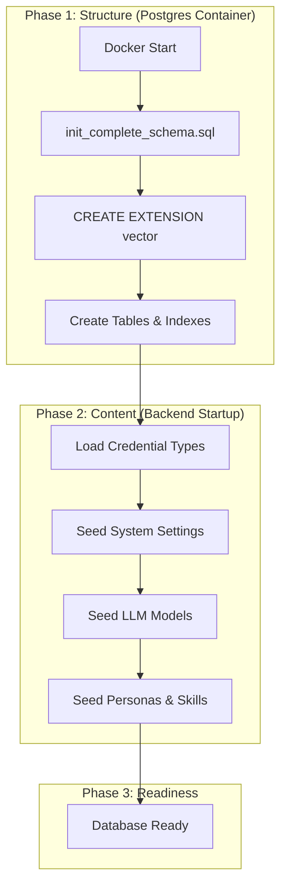
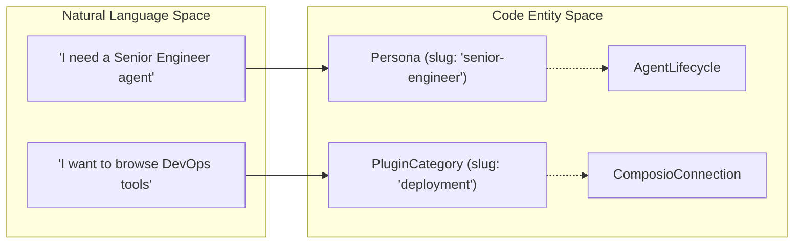
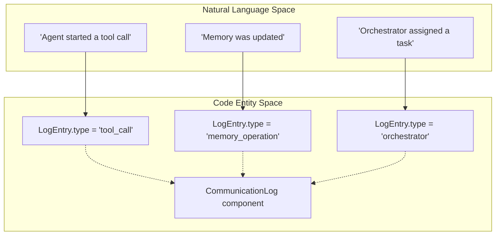

# Database Setup

<details>
<summary>Relevant source files</summary>

The following files were used as context for generating this wiki page:

- [README.md](README.md)
- [docker-compose.yml](docker-compose.yml)
- [docs/README.md](docs/README.md)
- [frontend/.dockerignore](frontend/.dockerignore)
- [frontend/Dockerfile](frontend/Dockerfile)
- [frontend/components/workflows/execution-theater/communication-log.tsx](frontend/components/workflows/execution-theater/communication-log.tsx)
- [orchestrator/Dockerfile](orchestrator/Dockerfile)
- [orchestrator/api/cloud_documents.py](orchestrator/api/cloud_documents.py)
- [orchestrator/core/redis/client.py](orchestrator/core/redis/client.py)
- [orchestrator/modules/tools/services/__init__.py](orchestrator/modules/tools/services/__init__.py)
- [orchestrator/requirements.txt](orchestrator/requirements.txt)

</details>


## Purpose and Scope

This document covers the PostgreSQL database configuration, initialization, and management for Automatos AI. It details the Docker-based deployment, pgvector extension setup, schema initialization, and the seeding process for system defaults.

For application-level data models and ORM patterns, see [Backend Architecture](18.3). For complete environment variable reference, see [Environment Variables](20.3).

---

## PostgreSQL with pgvector

Automatos AI uses **PostgreSQL 16** with the **pgvector extension** for vector similarity search in the RAG system. The `pgvector/pgvector:pg16` Docker image provides both the database engine and native vector operations [docker-compose.yml:23-23]().

### Key Features

| Feature | Purpose | Implementation |
|---------|---------|----------------|
| **pgvector Extension** | Vector embeddings for RAG | `pgvector==0.2.4` in requirements [orchestrator/requirements.txt:11-11]() |
| **Connection Pooling** | Max 200 concurrent connections | `max_connections=200` in `POSTGRES_INITDB_ARGS` [docker-compose.yml:30-30]() |
| **Shared Buffers** | Memory optimization | `shared_buffers=256MB` for query performance [docker-compose.yml:30-30]() |
| **SQLAlchemy ORM** | Python database abstraction | `sqlalchemy==2.0.23` [orchestrator/requirements.txt:7-7]() |
| **Alembic Migrations** | Schema versioning | `alembic==1.12.1` [orchestrator/requirements.txt:8-8]() |

**Sources:** [docker-compose.yml:22-43](), [orchestrator/requirements.txt:7-11]()

---

## Schema Initialization and Seed Data

### Database Bootstrapping Flow

The system initializes in two phases: structural creation via SQL scripts and content population via Python seeders. The `backend` service depends on a healthy `postgres` container before starting [docker-compose.yml:85-87]().


**Sources:** [docker-compose.yml:35-35](), [docker-compose.yml:85-87]()

### Seed Data Loader

The system populates essential platform data during the initialization phase.

1.  **Credential Types**: Loads definitions into the `credential_types` table to support multi-provider auth.
2.  **System Settings**: Establishes core platform defaults for the workspace.
3.  **LLM Models**: Populates supported models (OpenAI, Anthropic, Gemini) into the database [orchestrator/requirements.txt:71-75]().
4.  **Personas**: Seeds global agent personas (e.g., Senior Engineer, QA Engineer) [README.md:33-35]().
5.  **Plugin Categories**: Sets up marketplace categories like "Code Review" and "DevOps" [README.md:43-45]().

**Sources:** [orchestrator/requirements.txt:71-75](), [README.md:33-45]()

---

## Natural Language to Code Entity Mapping

This section bridges conceptual data requirements with specific code implementations.

### Persona and Category Mapping

The system uses specific identifiers in the database to represent agent roles and marketplace categories.


**Sources:** [README.md:33-35](), [orchestrator/api/cloud_documents.py:20-21]()

### Execution Logging Mapping

The frontend `CommunicationLog` component maps execution events from the database and real-time streams to visual log entries [frontend/components/workflows/execution-theater/communication-log.tsx:37-47]().


**Sources:** [frontend/components/workflows/execution-theater/communication-log.tsx:37-47](), [frontend/components/workflows/execution-theater/communication-log.tsx:205-216]()

---

## Connection Configuration

### Environment Variables

The database connection is configured via environment variables. The `DATABASE_URL` is the primary string used by SQLAlchemy [docker-compose.yml:97-97]().

| Variable | Default | Description |
|----------|---------|-------------|
| `POSTGRES_DB` | `orchestrator_db` | Database name [docker-compose.yml:27-27]() |
| `POSTGRES_USER` | `postgres` | Superuser account [docker-compose.yml:28-28]() |
| `POSTGRES_PASSWORD` | **(required)** | Master password [docker-compose.yml:29-29]() |
| `POSTGRES_HOST` | `postgres` | Hostname in Docker network [docker-compose.yml:95-95]() |
| `POSTGRES_PORT` | `5432` | Standard PostgreSQL port [docker-compose.yml:96-96]() |

**Sources:** [docker-compose.yml:26-32](), [docker-compose.yml:91-97]()

### Docker Compose Service

The PostgreSQL service is defined with health checks to ensure availability before dependent services (like the FastAPI `backend`) start:

```yaml
postgres:
  image: pgvector/pgvector:pg16
  container_name: automatos_postgres
  environment:
    POSTGRES_DB: ${POSTGRES_DB:-orchestrator_db}
    POSTGRES_USER: ${POSTGRES_USER:-postgres}
    POSTGRES_PASSWORD: ${POSTGRES_PASSWORD:?POSTGRES_PASSWORD is required}
  volumes:
    - postgres_data:/var/lib/postgresql/data
    - ./orchestrator/database/init_complete_schema.sql:/docker-entrypoint-initdb.d/01-schema.sql:ro
  healthcheck:
    test: ["CMD-SHELL", "pg_isready -U ${POSTGRES_USER:-postgres}"]
    interval: 10s
    timeout: 5s
    retries: 5
```
**Sources:** [docker-compose.yml:22-43]()

---

## Real-Time Update Integration

While PostgreSQL stores the source of truth, real-time execution events are broadcast via Redis Pub/Sub to the frontend [orchestrator/core/redis/client.py:2-6]().

*   **Workflow Events**: `publish_workflow_event` sends subtask updates to specific channels [orchestrator/core/redis/client.py:91-119]().
*   **Async Delivery**: WebSocket endpoints use `get_async_pubsub` for non-blocking message delivery to the UI [orchestrator/core/redis/client.py:48-64]().

**Sources:** [orchestrator/core/redis/client.py:48-64](), [orchestrator/core/redis/client.py:91-119]()

---