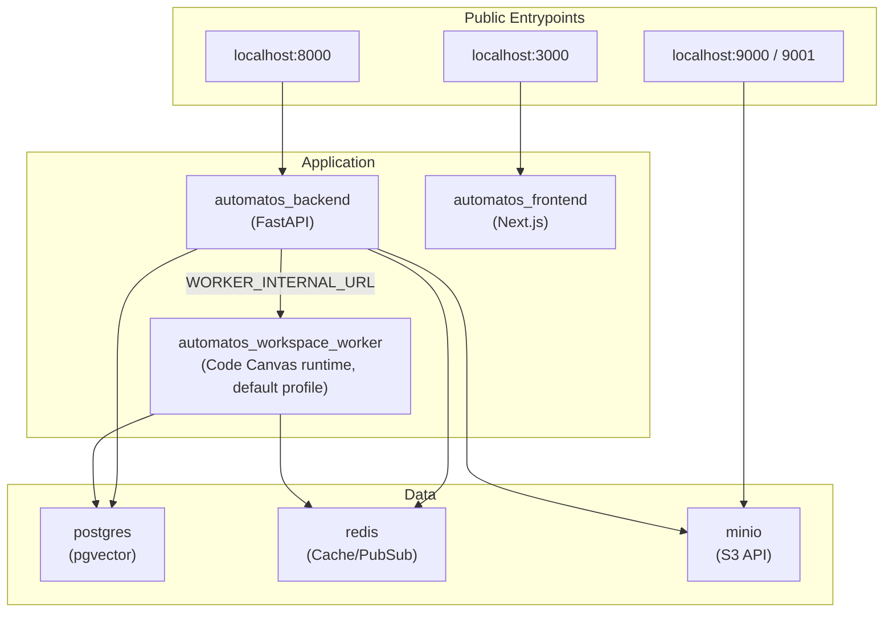
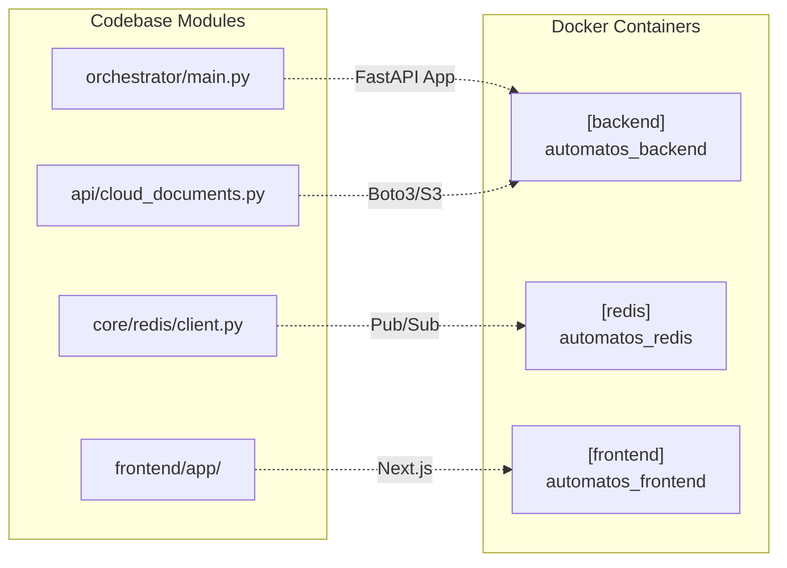

# Docker Compose Setup

Relevant source files

The following files were used as context for generating this wiki page:

- [docker-compose.yml](docker-compose.yml)
- [frontend/.dockerignore](frontend/.dockerignore)
- [frontend/Dockerfile](frontend/Dockerfile)
- [orchestrator/Dockerfile](orchestrator/Dockerfile)
- [orchestrator/api/cloud_documents.py](orchestrator/api/cloud_documents.py)
- [orchestrator/core/redis/client.py](orchestrator/core/redis/client.py)
- [orchestrator/requirements.txt](orchestrator/requirements.txt)

This page documents the Docker Compose orchestration for Automatos AI — the stack that **is** the local edition and the development environment: service definitions, dependencies, health checks, volumes, networks and the one optional profile. The hosted (Railway) topology is separate and described in [Production Deployment](production-deployment.md); Railway never reads this file.

> The operator-facing walkthrough — secrets, first boot, the worker's host directory, object storage, Composio, updating, resetting, troubleshooting — is [Self-hosting — the local edition](../getting-started/self-hosting.md). This page describes the compose file itself.

## Purpose and Scope

The Docker Compose configuration orchestrates all services required to run Automatos AI in a containerized environment. It defines:

- **Data services**: PostgreSQL with `pgvector`, Redis, MinIO (S3-compatible object storage) with a one-shot bucket initialiser [docker-compose.yml]().
- **Application services**: the FastAPI backend and the Next.js frontend, built from source with their `development` targets [docker-compose.yml]().
- **The workspace-worker**: the Code Canvas runtime, in the default profile, acting on a host directory [docker-compose.yml]().
- **`--profile all`**: Adminer (database GUI) and Gotenberg (DOCX/XLSX → PDF, PRD-63) [docker-compose.yml]().

The `agent-opt-worker` (prompt optimisation), mem0, Qdrant and the observability stack are not part of the compose file; they belong to the hosted deployment.

Sources: [docker-compose.yml](), [orchestrator/Dockerfile:1-141](), [frontend/Dockerfile:1-115]()

---

## Services

| Service | Container | Image / build | Host port (variable) | Role |
|---|---|---|---|---|
| `postgres` | `automatos_postgres` | `pgvector/pgvector:pg16` | 5432 (`POSTGRES_PORT`) | Relational data and the pgvector chunk store (local RAG) [docker-compose.yml]() |
| `redis` | `automatos_redis` | `redis:7-alpine` | 6379 (`REDIS_PORT`) | Cache, pub/sub, queues; `FLUSHDB`/`FLUSHALL`/`DEBUG` disabled, 256 MB `allkeys-lru` [docker-compose.yml]() |
| `minio` | `automatos_minio` | `minio/minio` | 9000 API (`MINIO_PORT`), 9001 console (`MINIO_CONSOLE_PORT`) | S3-compatible object store; the backend reaches it via `S3_ENDPOINT_URL=http://minio:9000` [docker-compose.yml]() |
| `minio-init` | `automatos_minio_init` | `minio/mc` | — | One-shot: creates `S3_DOCUMENTS_BUCKET` (default `automatos-ai`), then exits [docker-compose.yml]() |
| `backend` | `automatos_backend` | `./orchestrator`, target `development` | 8000 (`API_PORT`) | FastAPI API; `uvicorn --reload` over the bind-mounted source; entrypoint `docker-entrypoint.sh` [docker-compose.yml]() |
| `frontend` | `automatos_frontend` | `./frontend`, target `development` | 3000 (`FRONTEND_PORT`) | Next.js UI (`npm run dev`); starts after the backend is healthy [docker-compose.yml]() |
| `workspace-worker` | `automatos_workspace_worker` | `./services/workspace-worker` | none (8081 internal only) | Code Canvas runtime; 2 CPU / 2 GB limits; `WORKER_CONCURRENCY` default 3 [docker-compose.yml]() |
| `adminer` (`--profile all`) | `automatos_adminer` | `adminer` | 8080 (`ADMINER_PORT`) | Database GUI pre-pointed at `postgres` [docker-compose.yml]() |
| `gotenberg` (`--profile all`) | `automatos_gotenberg` | `gotenberg/gotenberg:8` | 3001 (`GOTENBERG_PORT`) | Document conversion at `http://gotenberg:3000` for the backend [docker-compose.yml]() |

**System Data Flow & Networking**

All services share the `automatos` bridge network (`automatos_network`) [docker-compose.yml]().

Sources: [docker-compose.yml](), [envs/api.defaults](), [orchestrator/core/redis/client.py:141-197]()

---

## Core Infrastructure Implementation

### Backend (FastAPI)
The backend service is built using a multi-stage `Dockerfile` targeting `python:3.11-slim` [orchestrator/Dockerfile:13](). It includes system dependencies for OCR (`tesseract-ocr`), document processing (`ghostscript`), and PDF generation (`libpango`) [orchestrator/Dockerfile:18-32]().

- **Entrypoint**: `docker-entrypoint.sh` (bind-mounted from the repo root) waits for Postgres, builds the schema on an empty database (`python -m scripts.init_fresh_db`), runs `alembic upgrade heads` (fail-closed), loads the idempotent seeds, ensures the local workspace and operator exist, then starts `uvicorn` [docker-entrypoint.sh]().
- **Configuration**: `env_file: envs/api.defaults` (committed local topology, `AUTH_EDITION=local`) then the optional gitignored `envs/api.local`; the `environment:` block carries the secrets substituted from `.env` and wins over both [docker-compose.yml]().
- **Hot Reload**: In development mode, the `./orchestrator` directory is mounted to `/app` and `uvicorn` runs with `--reload` [docker-compose.yml](), [orchestrator/Dockerfile:93]().
- **Object storage**: `S3_ENDPOINT_URL=http://minio:9000`; the backend's `AWS_ACCESS_KEY_ID` / `AWS_SECRET_ACCESS_KEY` / `AWS_REGION` are set from `S3_ACCESS_KEY_ID` / `S3_SECRET_ACCESS_KEY` / `S3_REGION` (defaulting to the MinIO root credentials), so a developer's `AWS_*` variables never reach the local store [docker-compose.yml]().

### Workspace worker
Built from `services/workspace-worker`. The host directory `${AUTOMATOS_WORKSPACE_DIR:-./workspaces}` is bind-mounted at `/workspaces` (read-write here, read-only in the backend); each workspace gets `/workspaces/<workspace_id>/`, every Code Canvas tool call is confined to it and mutations need approval. The process runs as uid 1000 (`worker`) and its entrypoint takes ownership of the mounted directory. Canvas sessions need `ANTHROPIC_API_KEY` or `CLAUDE_CODE_OAUTH_TOKEN` in `.env`. The backend reaches the worker at `WORKER_INTERNAL_URL=http://workspace-worker:8081` (`envs/api.defaults`); the port is not published on the host [docker-compose.yml](), [services/workspace-worker/entrypoint.sh](), [services/workspace-worker/worker_config.py]().

### Frontend (Next.js)
The frontend uses a multi-stage build that outputs a standalone Node.js server for production efficiency [frontend/Dockerfile:83-114]().

- **Environment Injection**: `NEXT_PUBLIC_API_URL` and Clerk keys are baked into the client bundle during the build stage [frontend/Dockerfile:58-71]().
- **Security**: Runs as a non-root `nextjs` user [frontend/Dockerfile:93-101]().

### Redis Pub/Sub & Task Queue
Redis is the central nervous system for real-time updates. The `RedisClient` class manages connection pools and async pub/sub for WebSocket streaming [orchestrator/core/redis/client.py:14-64]().

- **Workflow Events**: The `publish_workflow_event` method routes execution updates to channels like `workflow:{id}:execution:{id}` [orchestrator/core/redis/client.py:110-119]().
- **Security**: The `redis` service renames dangerous commands like `FLUSHALL` and `FLUSHDB` to prevent accidental data loss [docker-compose.yml:59-61]().

Sources: [orchestrator/Dockerfile:1-141](), [frontend/Dockerfile:1-115](), [orchestrator/core/redis/client.py:1-197](), [docker-compose.yml:48-73]()

---

## Code Entity to Service Mapping

This diagram maps specific Python modules and frontend components to their containerized environments.

Sources: [orchestrator/main.py:1-50](), [orchestrator/core/redis/client.py:14-31](), [orchestrator/api/cloud_documents.py:25](), [frontend/Dockerfile:114]()

---

## Data Persistence & Volumes

The setup uses named volumes to ensure state is preserved across container lifecycles, plus one host bind mount.

| Volume / mount | Service | Mount Path | Purpose |
|-------------|---------|------------|---------|
| `postgres_data` (`automatos_postgres_data`) | `postgres` | `/var/lib/postgresql/data` | Persistent SQL & vector data. Keeps the password it was initialised with — changing `POSTGRES_PASSWORD` later needs a reset or `ALTER USER` [docker-compose.yml]() |
| `redis_data` (`automatos_redis_data`) | `redis` | `/data` | Cache and session persistence [docker-compose.yml]() |
| `minio_data` (`automatos_minio_data`) | `minio` | `/data` | Object storage (documents, generated outputs, plugin packages, images) [docker-compose.yml]() |
| `backend_data` | `backend` | `/app/data` | The auto-generated credential-encryption key (`CREDENTIAL_KEY_FILE`); losing it makes stored API keys undecryptable [docker-compose.yml](), [envs/api.defaults]() |
| `backend_logs` (`automatos_backend_logs`) | `backend` | `/app/logs` | Application logs [docker-compose.yml]() |
| **bind mount** `${AUTOMATOS_WORKSPACE_DIR:-./workspaces}` | `workspace-worker` (rw), `backend` (ro) | `/workspaces` | The agents' files, on the host. Not a named volume: `docker compose down -v` leaves it in place [docker-compose.yml]() |

Sources: [docker-compose.yml](), [envs/api.defaults]()

---

## Environment Configuration

A `.env` file is mandatory for initialization. Compose reads it for variable substitution only; the committed topology lives in `envs/api.defaults` and `envs/frontend.defaults`, with `envs/api.local` / `envs/frontend.local` as gitignored overrides.

- **Required** (`${VAR:?…}` — compose refuses to start without them): `POSTGRES_PASSWORD`, `REDIS_PASSWORD`, `API_KEY` [docker-compose.yml]().
- **LLM keys**: optional at startup (`OPENAI_API_KEY`, `ANTHROPIC_API_KEY`, `OPENROUTER_API_KEY`); can also be stored under Settings → API Keys [docker-compose.yml]().
- **Integrations**: `COMPOSIO_API_KEY` — bring your own; without it integrations are disabled and native tools keep working [docker-compose.yml]().
- **Worker**: `AUTOMATOS_WORKSPACE_DIR`, `ANTHROPIC_API_KEY` / `CLAUDE_CODE_OAUTH_TOKEN`, `WORKER_CONCURRENCY`, `WORKSPACE_DEFAULT_QUOTA_GB`, `WORKER_INTERNAL_TOKEN` [docker-compose.yml]().
- **Auth**: Clerk variables are hosted-edition only and use `:-` defaults, so their absence never blocks a local boot; `AUTH_EDITION=local` comes from `envs/api.defaults` [docker-compose.yml](), [envs/api.defaults]().

### Launching the Stack

- **Default**: `docker compose up` (add `--build` after dependency or Dockerfile changes) [docker-compose.yml]().
- **With admin tools**: `docker compose --profile all up` — Adminer and Gotenberg [docker-compose.yml]().
- **Updating**: `git pull && docker compose up -d --build`; migrations run on every backend boot.
- **Reset**: `docker compose down -v` removes the named volumes; delete `AUTOMATOS_WORKSPACE_DIR` by hand.
- **Production Mode**: the `production` targets in the Dockerfiles exclude dev dependencies like `pytest`, `black`, and `isort` and are what the hosted deployment builds; the compose file uses the `development` targets [orchestrator/Dockerfile:98-146](), [frontend/Dockerfile:92-121]().

Sources: [docker-compose.yml](), [orchestrator/Dockerfile](), [frontend/Dockerfile]()

---