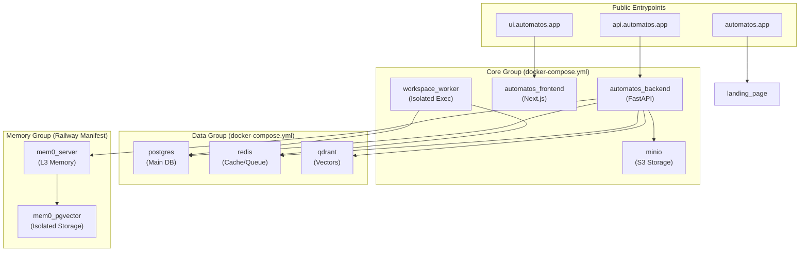
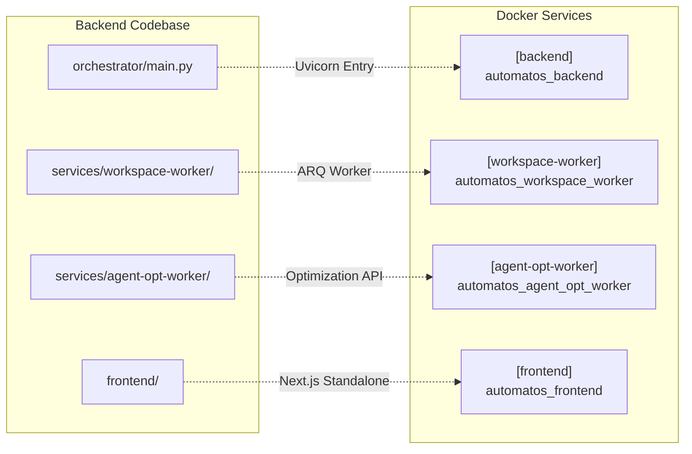

# Docker Compose Setup

<details>
<summary>Relevant source files</summary>

The following files were used as context for generating this wiki page:

- [.env.example](.env.example)
- [.github/workflows/test.yml](.github/workflows/test.yml)
- [docker-compose.yml](docker-compose.yml)
- [docker-entrypoint.sh](docker-entrypoint.sh)
- [frontend/.dockerignore](frontend/.dockerignore)
- [frontend/Dockerfile](frontend/Dockerfile)
- [frontend/components/activity/board/__tests__/blocked-reason.test.ts](frontend/components/activity/board/__tests__/blocked-reason.test.ts)
- [frontend/components/activity/board/__tests__/task-deliverables-panel.test.tsx](frontend/components/activity/board/__tests__/task-deliverables-panel.test.tsx)
- [frontend/components/activity/board/blocked-reason.ts](frontend/components/activity/board/blocked-reason.ts)
- [frontend/components/activity/board/task-deliverables-panel.tsx](frontend/components/activity/board/task-deliverables-panel.tsx)
- [infrastructure/.env.example](infrastructure/.env.example)
- [infrastructure/railway-manifest.json](infrastructure/railway-manifest.json)
- [orchestrator/Dockerfile](orchestrator/Dockerfile)
- [orchestrator/alembic/versions/prd222_veteran_skip_backfill.py](orchestrator/alembic/versions/prd222_veteran_skip_backfill.py)
- [orchestrator/core/redis/client.py](orchestrator/core/redis/client.py)
- [orchestrator/core/seeds/seed_local_first_run.py](orchestrator/core/seeds/seed_local_first_run.py)
- [orchestrator/requirements.txt](orchestrator/requirements.txt)
- [orchestrator/tests/test_dockerfile_prod_parity.py](orchestrator/tests/test_dockerfile_prod_parity.py)
- [orchestrator/tests/test_prd222_onboarding_reset.py](orchestrator/tests/test_prd222_onboarding_reset.py)
- [orchestrator/tests/test_prd233_fresh_install_starts_onboarding.py](orchestrator/tests/test_prd233_fresh_install_starts_onboarding.py)

</details>


This page documents the Docker Compose orchestration for Automatos AI, covering service definitions, dependencies, health checks, volumes, networks, and deployment profiles. The setup mirrors a 19-service production topology used in Railway deployments, organized into modular functional groups.

## Purpose and Scope

The Docker Compose configuration orchestrates all services required to run Automatos AI in a containerized environment. It defines:

- **Core Services**: PostgreSQL, Redis, MinIO (S3), FastAPI backend, Next.js frontend [docker-compose.yml:135-217]().
- **Data Infrastructure**: Dedicated pgvector, Redis, and Qdrant vector database [docker-compose.yml:30-133]().
- **Memory Subsystem**: Mem0 OpenMemory server with isolated storage (not directly in `docker-compose.yml`, but part of the broader infrastructure as seen in `infrastructure/railway-manifest.json`) [infrastructure/railway-manifest.json:31-38]().
- **Voice Services**: TTS (Chatterbox), STT (Whisper), and WebSocket orchestration (not directly in `docker-compose.yml`, but part of the broader infrastructure as seen in `infrastructure/railway-manifest.json`) [infrastructure/railway-manifest.json:24-30]().
- **Monitoring Stack**: Prometheus, Grafana, Loki, and exporters (not directly in `docker-compose.yml`, but part of the broader infrastructure as seen in `infrastructure/railway-manifest.json`) [infrastructure/railway-manifest.json:39-50]().
- **Worker Services**: Workspace worker for isolated task execution and agent-opt-worker for prompt optimization [docker-compose.yml:218-270]().

Sources: [docker-compose.yml:1-270](), [infrastructure/railway-manifest.json:1-66]()

## Modular Architecture (Production Mirror)

The system is split into specialized compose files to allow granular scaling and deployment of specific subsystems. This mirrors the Railway production topology.

### Service Grouping

| Group | Compose File | Primary Services |
|-------|--------------|------------------|
| **Core** | `docker-compose.yml` | `backend`, `frontend`, `workspace-worker`, `minio` |
| **Data** | `docker-compose.yml` | `postgres`, `redis`, `qdrant` |
| **Memory** | `infrastructure/railway-manifest.json` | `mem0-server`, `mem0-pgvector` |
| **Voice** | `infrastructure/railway-manifest.json` | `voice-service`, `voice-pipeline` |
| **Monitoring** | `infrastructure/railway-manifest.json` | `prometheus`, `grafana`, `loki`, `log-relay` |
| **Landing** | `infrastructure/railway-manifest.json` | `automatos-ai-landing` |

**Cross-Service Communication Map**



Sources: [docker-compose.yml:26-270](), [infrastructure/railway-manifest.json:1-66]()

---

## Core Infrastructure

### PostgreSQL (pgvector)

The database uses `pgvector/pgvector:pg16` for production-grade vector storage, supporting the `pgvector` extension required for L2 memory and RAG operations [docker-compose.yml:31]().

**Health Check & Initialization**
```yaml
healthcheck:
  test: ["CMD-SHELL", "pg_isready -U ${POSTGRES_USER:-postgres}"]
  interval: 10s
  timeout: 5s
  retries: 5
  start_period: 10s
```
The `docker-entrypoint.sh` script ensures PostgreSQL is ready and runs Alembic migrations before the backend starts [docker-entrypoint.sh:22-60]().

Sources: [docker-compose.yml:30-51](), [docker-entrypoint.sh:22-60]()

### Redis Security Hardening

Redis serves as the session store, pub/sub hub for real-time updates via `RedisClient` [orchestrator/core/redis/client.py:14-31](), and task queue for `WorkspaceWorker`. It is hardened by renaming dangerous commands [docker-compose.yml:59-68]().

| Command | Action | Reason |
|---------|--------|--------|
| `FLUSHDB` | Disabled | Prevent accidental data wipe [docker-compose.yml:66]() |
| `FLUSHALL` | Disabled | Prevent global data wipe [docker-compose.yml:67]() |
| `DEBUG` | Disabled | Prevent info disclosure [docker-compose.yml:68]() |

Sources: [docker-compose.yml:55-80](), [orchestrator/core/redis/client.py:1-31]()

### MinIO (Local S3)

MinIO provides a durable local object store for the "knowledge flywheel," ensuring generated outputs persist instead of using ephemeral container disk [docker-compose.yml:83-88](). The backend talks to it through the existing S3 seam via `S3_ENDPOINT_URL` [docker-compose.yml:87](). The `minio-init` service is no longer used as the storage factory calls `ensure_bucket()` on first use [docker-compose.yml:112-114]().

Sources: [docker-compose.yml:83-114]()

### Qdrant (Vector Store)

Qdrant is an optional, opt-in service for durable (L3) and field memory [docker-compose.yml:116-117](). It is enabled via the `memory` profile: `docker compose --profile memory up -d` [docker-compose.yml:118]().

Sources: [docker-compose.yml:116-133]()

---

## Specialized Subsystems (Railway Manifest)

The following subsystems are defined in the `infrastructure/railway-manifest.json` for production deployments and are not directly part of the default `docker-compose.yml`.

### Memory Services (L3 Storage)

The memory subsystem isolates Mem0 workloads into a dedicated container and database instance to prevent RAG/embedding tasks from impacting main API performance [infrastructure/railway-manifest.json:31-38]().

- **mem0-server**: Provides the OpenMemory API for long-term fact storage [infrastructure/railway-manifest.json:35]().
- **mem0-pgvector**: Dedicated PostgreSQL instance to isolate memory vector workloads [infrastructure/railway-manifest.json:36]().

### Voice Pipeline

Enables real-time TTS and STT capabilities for agents.
- **voice-service**: Runs Chatterbox (TTS) and Whisper (STT) engines [infrastructure/railway-manifest.json:28]().
- **voice-pipeline**: WebSocket orchestration layer connecting the `backend` to `voice-service` [infrastructure/railway-manifest.json:29]().

### Monitoring & Observability

A complete Prometheus/Grafana stack is included for system health tracking.
- **log-relay**: Receives Railway log drains and pushes to **Loki** [infrastructure/railway-manifest.json:46]().
- **exporters**: `postgres-exporter` and `redis-exporter` provide service-specific metrics to Prometheus [infrastructure/railway-manifest.json:49-50]().

Sources: [infrastructure/railway-manifest.json:1-66]()

---

## Code to Container Mapping

This diagram maps specific backend modules and service directories to their containerized service counterparts.



Sources: [orchestrator/Dockerfile:131](), [frontend/Dockerfile:129](), [docker-compose.yml:135-270]()

---

## Dockerfile Specifications

### Backend (Orchestrator)
The backend uses a multi-stage Dockerfile [orchestrator/Dockerfile:1-8]().
- **`pybuild` stage**: Installs build-time dependencies like `gcc`, `g++`, `libffi-dev` and Python packages from `requirements.txt` [orchestrator/Dockerfile:19-59](). It conditionally installs `graphifyy[leiden]` based on `INSTALL_GRAPH_EXTRAS` build argument [orchestrator/Dockerfile:38-58]().
- **`base` stage**: Installs runtime-only system dependencies such as `git`, `postgresql-client`, `libmagic1`, `tesseract-ocr`, `ghostscript`, `libpango-1.0-0`, `libcairo2`, `libgdk-pixbuf-2.0-0` [orchestrator/Dockerfile:70-81]().
- **`development` stage**: Includes hot-reload capabilities and debugging tools. The entrypoint `docker-entrypoint.sh` is mounted from the host, and the default command runs `alembic upgrade heads` before starting `uvicorn` with `--reload` [orchestrator/Dockerfile:91-131]().
- **`production` stage**: Optimized and minimal, copying only necessary application code and running `uvicorn` with multiple workers [orchestrator/Dockerfile:136-184]().

Sources: [orchestrator/Dockerfile:1-184](), [orchestrator/requirements.txt:1-142]()

### Frontend
The frontend uses a multi-stage Dockerfile for a Next.js standalone build [frontend/Dockerfile:1-9]().
- **`base` stage**: Installs Node.js and common build tools [frontend/Dockerfile:14-26]().
- **`development` stage**: Installs all dependencies and runs the Next.js development server with hot-reload [frontend/Dockerfile:30-48]().
- **`builder` stage**: Accepts `NEXT_PUBLIC_*` build arguments which are embedded into the client bundle. It performs the `npm run build` step [frontend/Dockerfile:53-98]().
- **`production` stage**: Copies only the `.next/standalone`, `.next/static`, and `public` folders for a minimal image. It runs the `node server.js` command [frontend/Dockerfile:103-132]().

Sources: [frontend/Dockerfile:1-132]()

---

## Volumes and Data Persistence

The setup uses named volumes to ensure data persistence across container restarts.

| Volume Name | Usage | Target Path |
|-------------|-------|-------------|
| `postgres_data` | Main DB storage | `/var/lib/postgresql/data` [docker-compose.yml:42]() |
| `redis_data` | Cache/Queue state | `/data` [docker-compose.yml:72]() |
| `minio_data` | S3 Object storage | `/data` [docker-compose.yml:102]() |
| `qdrant_data` | Qdrant vector storage | `/qdrant/storage` [docker-compose.yml:131]() |
| `automatos_backend_data` | Backend persistent data (e.g., credential encryption keys) | `/app/data` [orchestrator/Dockerfile:108]() |
| `automatos_workspace_dir` | Workspace worker filesystems | `/workspaces` [docker-compose.yml:249]() |

Sources: [docker-compose.yml:42,72,102,131,249](), [orchestrator/Dockerfile:108]()

---

## Deployment and Setup

### Prerequisites
1. Copy `.env.example` to `.env` and set required values (`POSTGRES_PASSWORD`, `REDIS_PASSWORD`, `API_KEY`) [docker-compose.yml:14-15]().
2. Ensure Docker and Docker Compose are installed.

### Launch Commands

- **Standard (Core Only)**: `docker compose up --build` [docker-compose.yml:9]().
- **With Qdrant (Memory Profile)**: `docker compose --profile memory up -d` [docker-compose.yml:118]().
- **Development Mode**: Uses the `development` target in the Dockerfile for hot-reloading [orchestrator/Dockerfile:91-131]().

### `docker-entrypoint.sh`

The `docker-entrypoint.sh` script orchestrates the backend startup sequence [docker-entrypoint.sh:1-11]():
1. **Wait for PostgreSQL**: Ensures the database is ready before proceeding [docker-entrypoint.sh:22-39]().
2. **Run Database Migrations**: Executes `alembic upgrade heads` to apply all pending migrations. This is a fail-closed step; if migrations fail, the container exits [docker-entrypoint.sh:41-61]().
3. **Load Seed Data**: Runs `python -m core.database.load_seed_data` to populate initial data. This process is idempotent [docker-entrypoint.sh:63-93]().
4. **Ensure Local Workspace**: For the `local` authentication edition, it ensures the `DEFAULT_WORKSPACE_ID` exists and seeds a `Local Operator` user. This is crucial for fresh installs to start onboarding correctly [docker-entrypoint.sh:96-127](). The workspace is inserted with an explicit `not_started` onboarding stage to prevent it from being marked `skipped` by the `prd222_veteran_skip_backfill` migration [docker-entrypoint.sh:110-113](), [orchestrator/alembic/versions/prd222_veteran_skip_backfill.py:44](), [orchestrator/tests/test_prd233_fresh_install_starts_onboarding.py:44-48]().
5. **Check Database Connection**: Verifies the database connection after migrations and seeding [docker-entrypoint.sh:130-143]().
6. **Start Backend Application**: Finally, it executes the `uvicorn` command to start the FastAPI application [docker-entrypoint.sh:199]().

Sources: [docker-compose.yml:1-16](), [docker-entrypoint.sh:1-204](), [orchestrator/alembic/versions/prd222_veteran_skip_backfill.py:1-65](), [orchestrator/tests/test_prd233_fresh_install_starts_onboarding.py:1-57]()

---