# Docker Compose Setup

<details>
<summary>Relevant source files</summary>

The following files were used as context for generating this wiki page:

- [docker-compose.yml](docker-compose.yml)
- [frontend/.dockerignore](frontend/.dockerignore)
- [frontend/Dockerfile](frontend/Dockerfile)
- [orchestrator/Dockerfile](orchestrator/Dockerfile)
- [orchestrator/core/redis/client.py](orchestrator/core/redis/client.py)
- [orchestrator/requirements.txt](orchestrator/requirements.txt)

</details>


## Purpose and Scope

This document describes the Docker Compose orchestration configuration that manages all Automatos AI services in a unified environment. It covers service definitions, networking, volume management, health checks, and development workflows.

For individual Dockerfile details and multi-stage build strategies, see [Docker Containerization](#12.1). For environment variable configuration, see [Environment Variables](#12.3). For database initialization and migrations, see [Database Setup](#12.4). For Redis configuration and caching policies, see [Redis Configuration](#12.5).

**Sources:** [docker-compose.yml:1-198](), [README.md:52-78]()

---

## Service Architecture

The Docker Compose configuration orchestrates four core services and optional admin tools using a single network and persistent volumes.

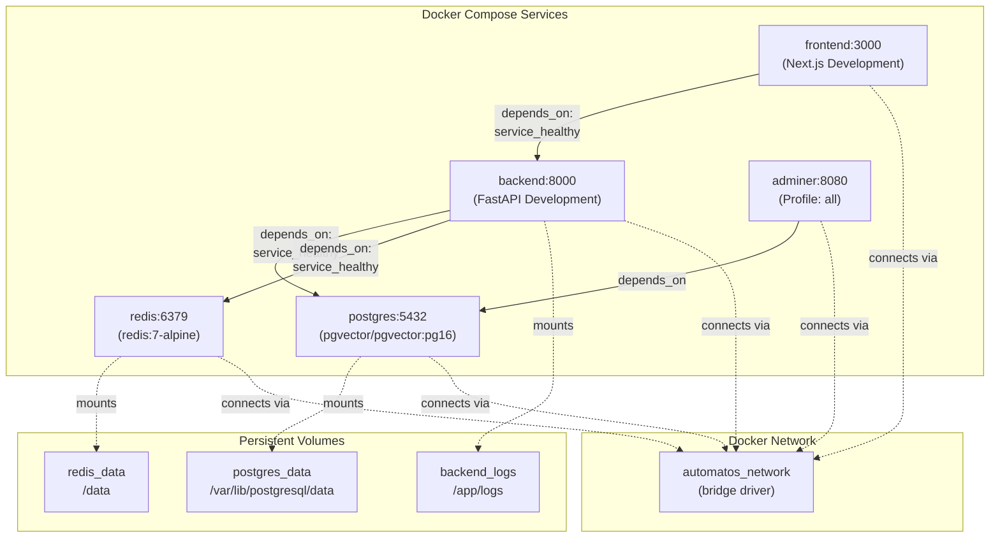

### Service Summary

| Service | Image/Build | Port | Profile | Purpose |
|---------|-------------|------|---------|---------|
| `postgres` | `pgvector/pgvector:pg16` | 5432 | default | PostgreSQL database with vector extension |
| `redis` | `redis:7-alpine` | 6379 | default | Cache, session store, and Pub/Sub |
| `backend` | Built from `./orchestrator` | 8000 | default | FastAPI application server |
| `frontend` | Built from `./frontend` | 3000 | default | Next.js web application |
| `adminer` | `adminer:latest` | 8080 | `all` | Database management UI |

**Sources:** [docker-compose.yml:17-174]()

---

## Core Services Configuration

### PostgreSQL Database

The `postgres` service runs PostgreSQL 16 with the `pgvector` extension for vector similarity search.

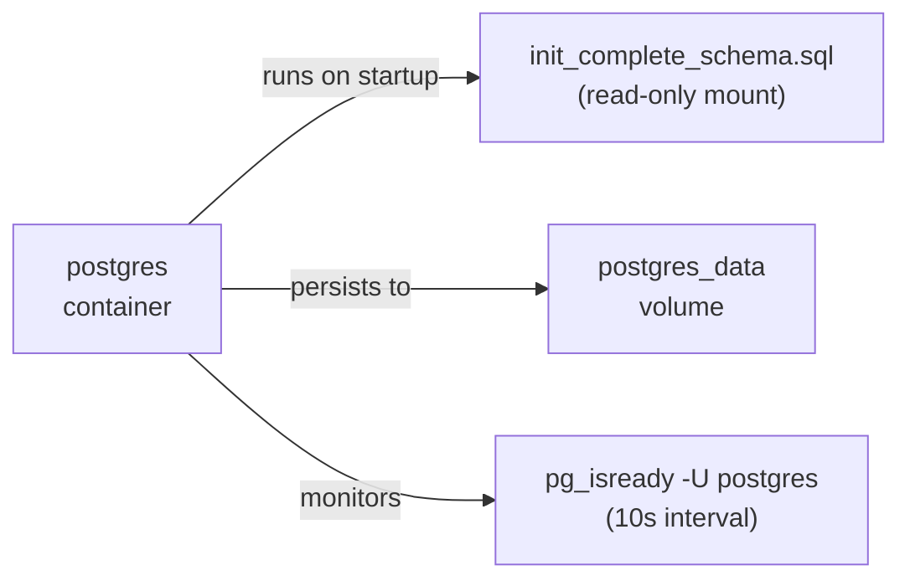

**Configuration Details:**

- **Container Name:** `automatos_postgres`
- **Restart Policy:** `unless-stopped`
- **Port Mapping:** `${POSTGRES_PORT:-5432}:5432`
- **Initialization:** Mounts [orchestrator/database/init_complete_schema.sql:1-*]() as `/docker-entrypoint-initdb.d/01-schema.sql`
- **Connection Limits:** `max_connections=200`, `shared_buffers=256MB`
- **Health Check:** `pg_isready` every 10 seconds, 5 retries, 10s start period

**Environment Variables:**

| Variable | Default | Purpose |
|----------|---------|---------|
| `POSTGRES_DB` | `orchestrator_db` | Database name |
| `POSTGRES_USER` | `postgres` | Database user |
| `POSTGRES_PASSWORD` | `automatos_dev_pass` | Database password |

**Sources:** [docker-compose.yml:21-42]()

### Redis Cache

The `redis` service provides caching, session storage, and real-time Pub/Sub messaging.

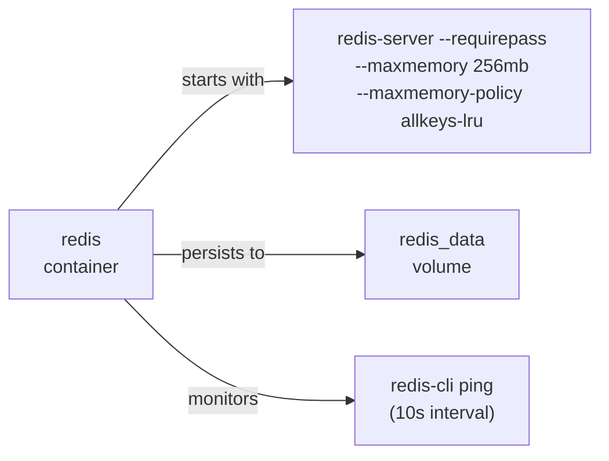

**Configuration Details:**

- **Container Name:** `automatos_redis`
- **Restart Policy:** `unless-stopped`
- **Port Mapping:** `${REDIS_PORT:-6379}:6379`
- **Memory Limit:** `256mb` with `allkeys-lru` eviction
- **Authentication:** Password-protected via `REDIS_PASSWORD`
- **Health Check:** `redis-cli ping` with password authentication every 10 seconds

**Memory Policy:** The `allkeys-lru` policy evicts least recently used keys when the 256MB limit is reached, ensuring cache performance. The `RedisClient` class in [orchestrator/core/redis/client.py:14-198]() manages connections with a pool of up to 50 connections.

**Sources:** [docker-compose.yml:47-63](), [orchestrator/core/redis/client.py:14-31]()

### Backend Service

The `backend` service builds the FastAPI application from the orchestrator directory using the development target.

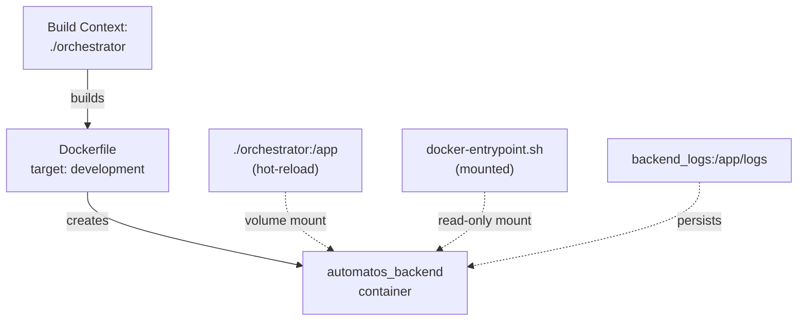

**Build Configuration:**

- **Context:** `./orchestrator`
- **Dockerfile:** [orchestrator/Dockerfile:1-116]()
- **Target Stage:** `development` (enables hot-reload)
- **Base Image:** `python:3.11-slim`

**Runtime Configuration:**

- **Container Name:** `automatos_backend`
- **Port Mapping:** `${API_PORT:-8000}:8000`
- **Command:** `uvicorn main:app --host 0.0.0.0 --port 8000 --reload` [orchestrator/Dockerfile:71]()
- **Restart Policy:** `unless-stopped`

**Volume Mounts:**

1. **Source Code:** `./orchestrator:/app` - Enables hot-reload during development
2. **Entrypoint:** `./docker-entrypoint.sh:/usr/local/bin/docker-entrypoint.sh:ro` - Database wait script
3. **Logs:** `backend_logs:/app/logs` - Persistent log storage

**Dependencies:**

The backend waits for both `postgres` and `redis` to report healthy status via their health checks before starting.

**Health Check:** `curl -f http://localhost:8000/health` every 30 seconds with 40-second start period.

**Sources:** [docker-compose.yml:68-123](), [orchestrator/Dockerfile:45-71]()

### Frontend Service

The `frontend` service builds the Next.js application using the development target for hot-reload.

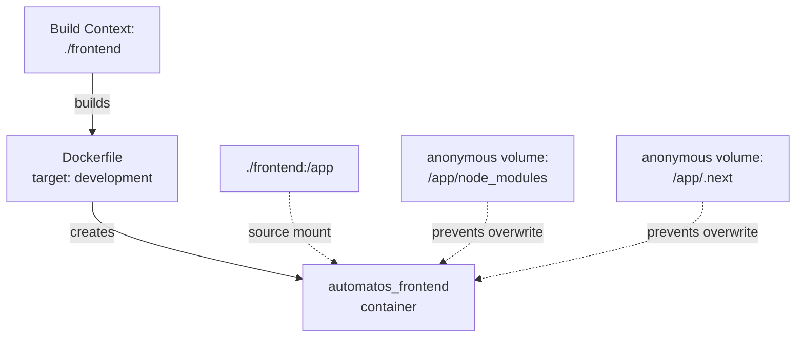

**Build Configuration:**

- **Context:** `./frontend`
- **Dockerfile:** [frontend/Dockerfile:1-120]()
- **Target Stage:** `development` [frontend/Dockerfile:31-48]()
- **Base Image:** `node:20-alpine`

**Runtime Configuration:**

- **Container Name:** `automatos_frontend`
- **Port Mapping:** `${FRONTEND_PORT:-3000}:3000`
- **Command:** `npm run dev` [frontend/Dockerfile:48]()
- **Node Environment:** `development`

**Volume Mounts:**

1. **Source Code:** `./frontend:/app` - Enables hot-reload
2. **Node Modules:** `/app/node_modules` (anonymous volume) - Prevents local `node_modules` from overwriting container's
3. **Next.js Cache:** `/app/.next` (anonymous volume) - Prevents build cache conflicts

**Dependency:** Waits for `backend` service to be healthy before starting.

**Health Check:** `wget --spider http://localhost:3000` every 30 seconds with 60-second start period [frontend/Dockerfile:44-45]().

**Sources:** [docker-compose.yml:131-155](), [frontend/Dockerfile:31-48]()

---

## Admin Tools Profile

Optional administrative tools are available via the `all` profile.

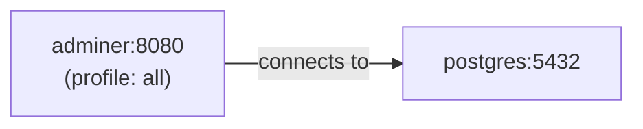

### Adminer Database UI

The `adminer` service provides a web-based database management interface.

**Configuration:**

- **Image:** `adminer:latest`
- **Port Mapping:** `${ADMINER_PORT:-8080}:8080`
- **Profile:** `all` (not started by default)
- **Default Server:** `postgres` (auto-connects to PostgreSQL service)
- **Design Theme:** `nette`

**Usage:**

```bash
# Start with admin tools
docker-compose --profile all up

# Access Adminer
open http://localhost:8080
```

**Login Credentials:**
- System: `PostgreSQL`
- Server: `postgres`
- Username: `${POSTGRES_USER}`
- Password: `${POSTGRES_PASSWORD}`
- Database: `${POSTGRES_DB}`

**Sources:** [docker-compose.yml:161-174]()

---

## Networking Configuration

All services connect to a single bridge network for service discovery.

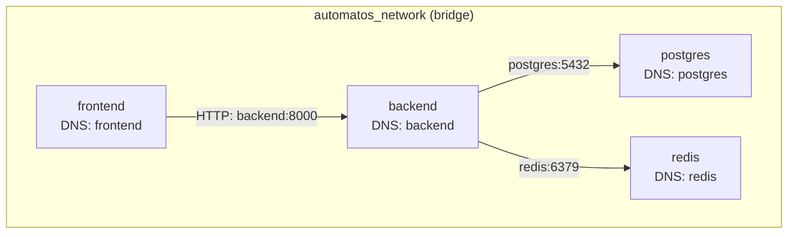

**Network Details:**

- **Name:** `automatos_network`
- **Driver:** `bridge`
- **DNS Resolution:** Each service is accessible by its service name (e.g., `postgres`, `redis`, `backend`)

**Service Discovery Examples:**

- Backend connects to PostgreSQL: `postgres:5432` [docker-compose.yml:85-86]()
- Backend connects to Redis: `redis:6379` [docker-compose.yml:90-91]()
- Frontend API calls: `http://backend:8000` (internal) or `${NEXT_PUBLIC_API_URL}` (external)

**Sources:** [docker-compose.yml:193-196]()

---

## Persistent Volumes

Three named volumes provide persistent storage across container restarts.

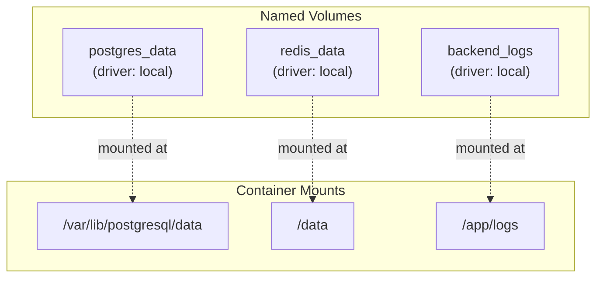

### Volume Definitions

| Volume Name | Full Name | Purpose | Mount Point |
|-------------|-----------|---------|-------------|
| `postgres_data` | `automatos_postgres_data` | PostgreSQL database files | `/var/lib/postgresql/data` |
| `redis_data` | `automatos_redis_data` | Redis persistence files | `/data` |
| `backend_logs` | `automatos_backend_logs` | Backend application logs | `/app/logs` |

**Volume Management:**

```bash
# List volumes
docker volume ls | grep automatos

# Inspect volume
docker volume inspect automatos_postgres_data

# Remove volumes (CAUTION: destroys data)
docker-compose down -v
```

**Sources:** [docker-compose.yml:179-188](), [docker-compose.yml:32-33](), [docker-compose.yml:54-55](), [docker-compose.yml:115]()

---

## Health Checks and Dependency Management

Services use health checks to ensure proper startup order and readiness.

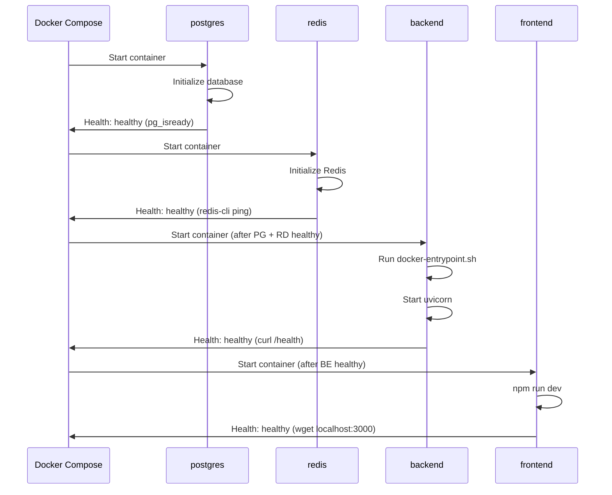

### Health Check Configuration

**PostgreSQL:**
```yaml
healthcheck:
  test: ["CMD-SHELL", "pg_isready -U postgres"]
  interval: 10s
  timeout: 5s
  retries: 5
  start_period: 10s
```

**Redis:**
```yaml
healthcheck:
  test: ["CMD", "redis-cli", "--no-auth-warning", "-a", "$REDIS_PASSWORD", "ping"]
  interval: 10s
  timeout: 3s
  retries: 5
  start_period: 5s
```

**Backend:**
```yaml
healthcheck:
  test: ["CMD", "curl", "-f", "http://localhost:8000/health"]
  interval: 30s
  timeout: 10s
  retries: 3
  start_period: 40s
```

**Frontend:**
```yaml
healthcheck:
  test: ["CMD", "wget", "--no-verbose", "--tries=1", "--spider", "http://localhost:3000"]
  interval: 30s
  timeout: 10s
  retries: 3
  start_period: 60s
```

### Dependency Chain

The `depends_on` configuration with `condition: service_healthy` ensures proper startup order:

1. `postgres` and `redis` start independently
2. `backend` waits for both database and cache to be healthy
3. `frontend` waits for backend to be healthy
4. `adminer` waits for `postgres` to exist (no health condition)

**Sources:** [docker-compose.yml:35-40](), [docker-compose.yml:56-61](), [docker-compose.yml:116-121](), [docker-compose.yml:44-45]()

---

## Development vs Production Configuration

The compose file targets development, but both Dockerfiles support production builds.

### Development Target (Current)

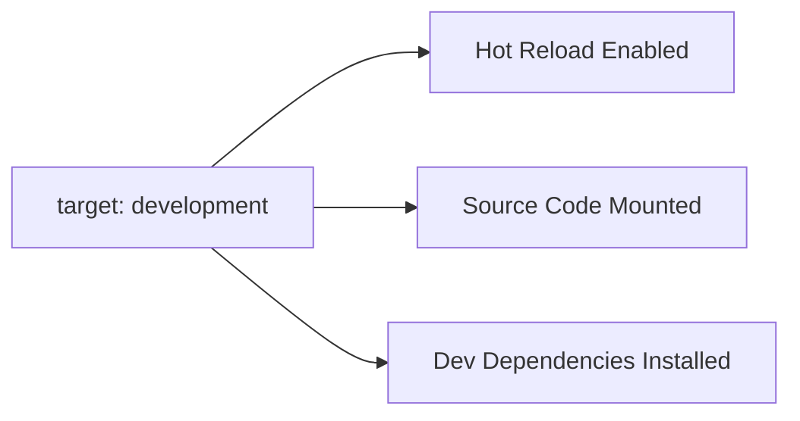

**Backend Development Features:**
- All Python dependencies installed [orchestrator/Dockerfile:33-35]()
- Source code mounted from `./orchestrator` to `/app`
- Uvicorn with `--reload` flag [orchestrator/Dockerfile:71]()
- Entrypoint script mounted for database wait logic

**Frontend Development Features:**
- All npm dependencies including devDependencies [frontend/Dockerfile:35]()
- Source code mounted from `./frontend` to `/app`
- Next.js dev server with hot module replacement [frontend/Dockerfile:48]()
- Anonymous volumes prevent `node_modules` conflicts

### Production Target (Available)

To switch to production:

```yaml
# docker-compose.yml changes
backend:
  build:
    target: production  # Changed from development
  # Remove source code volume mount
  # volumes:
  #   - ./orchestrator:/app

frontend:
  build:
    target: production  # Changed from development
  # Remove source code volume mount
  # volumes:
  #   - ./frontend:/app
```

**Production Optimizations:**

**Backend ([orchestrator/Dockerfile:76-116]()):**
- Non-root user `automatos` (UID 1000)
- Production dependencies only (`pip uninstall pytest`)
- Multi-worker uvicorn (4 workers)
- Environment-aware port binding (`${PORT:-8000}`)
- No source code mounting

**Frontend ([frontend/Dockerfile:85-118]()):**
- Non-root user `nextjs` (UID 1001)
- Production dependencies only (`npm ci --only=production`)
- Static build from `.next` directory
- No source code mounting
- `NODE_ENV=production`

**Sources:** [docker-compose.yml:68-155](), [orchestrator/Dockerfile:76-116](), [frontend/Dockerfile:85-118]()

---

## Environment Variables

The compose file uses environment variable substitution with secure defaults.

### Variable Priority

1. Shell environment (exported variables)
2. `.env` file in project root (if present)
3. Default values in `docker-compose.yml` (e.g., `${POSTGRES_PASSWORD:-automatos_dev_pass}`)

### Core Variables

| Variable | Default | Service | Purpose |
|----------|---------|---------|---------|
| `POSTGRES_DB` | `orchestrator_db` | postgres | Database name |
| `POSTGRES_USER` | `postgres` | postgres | Database user |
| `POSTGRES_PASSWORD` | `automatos_dev_pass` | postgres | Database password |
| `POSTGRES_PORT` | `5432` | postgres | Host port mapping |
| `REDIS_PASSWORD` | `automatos_redis_dev` | redis | Redis authentication |
| `REDIS_PORT` | `6379` | redis | Host port mapping |
| `API_PORT` | `8000` | backend | Backend host port |
| `FRONTEND_PORT` | `3000` | frontend | Frontend host port |
| `NEXT_PUBLIC_API_URL` | `http://localhost:8000` | frontend | Backend API endpoint |
| `OPENAI_API_KEY` | (empty) | backend | OpenAI API key (optional) |
| `ANTHROPIC_API_KEY` | (empty) | backend | Anthropic API key (optional) |

### Security Notes

**No .env Required:** The [docker-compose.yml:9-10]() header states "No .env file needed! Infrastructure uses secure defaults." This is intentional for quick starts - production deployments should override these defaults.

**Credential Management:** API keys for LLM providers are optional at startup. The UI provides a credentials management system (see [Credentials Management](#9.4)) for adding keys after deployment.

**Backend Authentication:** The `API_KEY` variable ([docker-compose.yml:103]()) defaults to `dev_api_key_change_in_production` and should be rotated for production use.

**Sources:** [docker-compose.yml:25-106](), [README.md:9-10]()

---

## Common Operations

### Starting Services

```bash
# Start all default services
docker-compose up

# Start with rebuild
docker-compose up --build

# Start in background (detached)
docker-compose up -d

# Start with admin tools
docker-compose --profile all up
```

### Viewing Logs

```bash
# All services
docker-compose logs -f

# Specific service
docker-compose logs -f backend

# Tail last 100 lines
docker-compose logs --tail=100 backend
```

### Service Management

```bash
# Restart a service
docker-compose restart backend

# Stop all services
docker-compose stop

# Stop and remove containers
docker-compose down

# Stop, remove containers, and delete volumes
docker-compose down -v
```

### Rebuilding Containers

```bash
# Rebuild specific service
docker-compose build backend

# Rebuild without cache
docker-compose build --no-cache backend

# Rebuild and restart
docker-compose up --build -d backend
```

### Database Access

```bash
# PostgreSQL shell
docker-compose exec postgres psql -U postgres -d orchestrator_db

# Redis CLI
docker-compose exec redis redis-cli -a automatos_redis_dev

# Via Adminer UI
docker-compose --profile all up
# Open http://localhost:8080
```

### Troubleshooting

```bash
# Check service health
docker-compose ps

# Inspect service configuration
docker-compose config

# View resource usage
docker stats

# Check network connectivity
docker-compose exec backend ping postgres
docker-compose exec backend ping redis
```

**Sources:** [docker-compose.yml:1-198](), [README.md:69-72]()

---

## Integration with Redis Client

The backend service connects to Redis using the centralized configuration system.

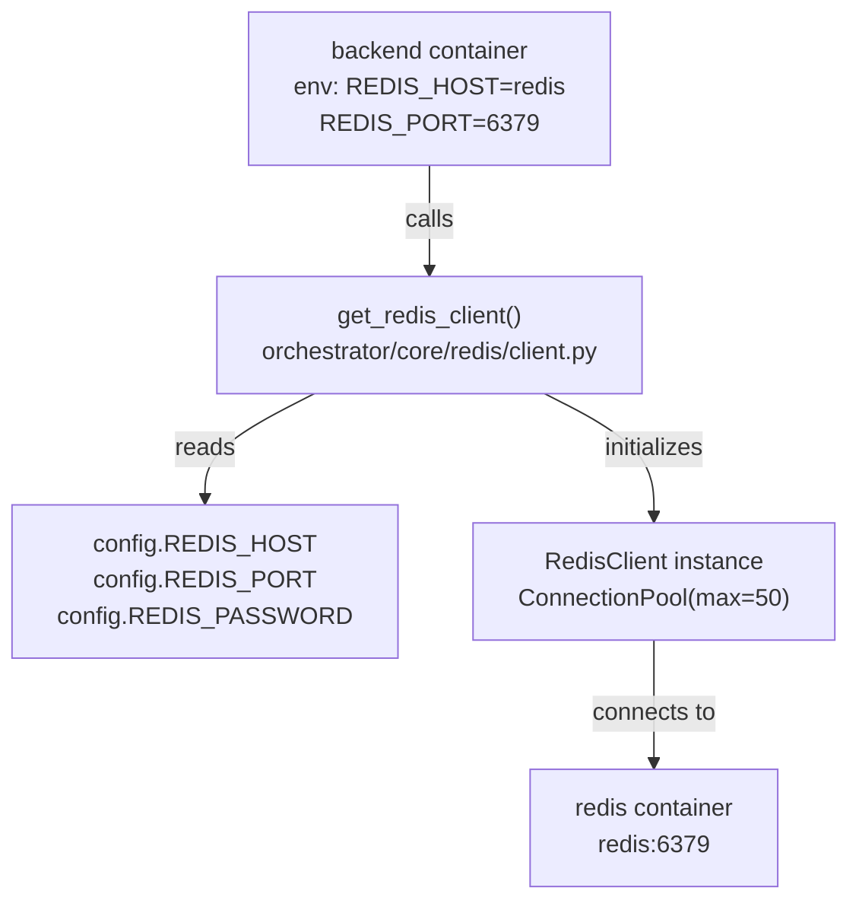

**Connection Resolution:**

The `get_redis_client()` function in [orchestrator/core/redis/client.py:149-198]() attempts connection in this order:

1. **REDIS_URL** (for Railway/Heroku deployments) - parsed for host, port, password, db
2. **Individual variables** - `REDIS_HOST`, `REDIS_PORT`, `REDIS_PASSWORD`
3. **Returns None** if unconfigured (Redis is optional)

**Docker Compose Configuration:**

The backend service receives Redis connection details via environment variables [docker-compose.yml:90-92]():
```yaml
REDIS_HOST: redis  # Service name for DNS resolution
REDIS_PORT: 6379
REDIS_PASSWORD: ${REDIS_PASSWORD:-automatos_redis_dev}
```

**Connection Pooling:**

The `RedisClient` maintains a connection pool with `max_connections=50` [orchestrator/core/redis/client.py:22-29](), which is sized appropriately for the development backend's typical load.

**Sources:** [docker-compose.yml:90-92](), [orchestrator/core/redis/client.py:149-198](), [orchestrator/core/redis/client.py:14-35]()

---