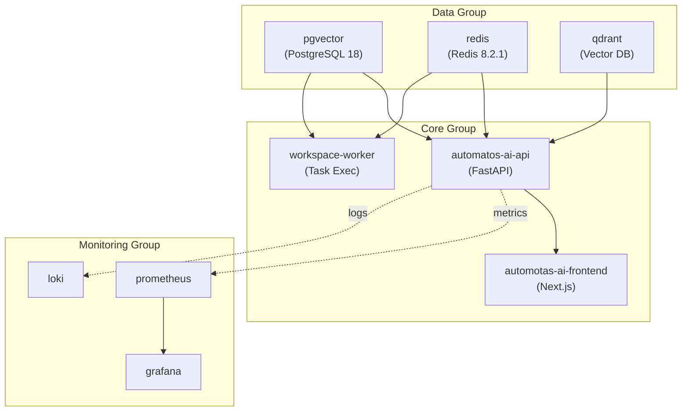
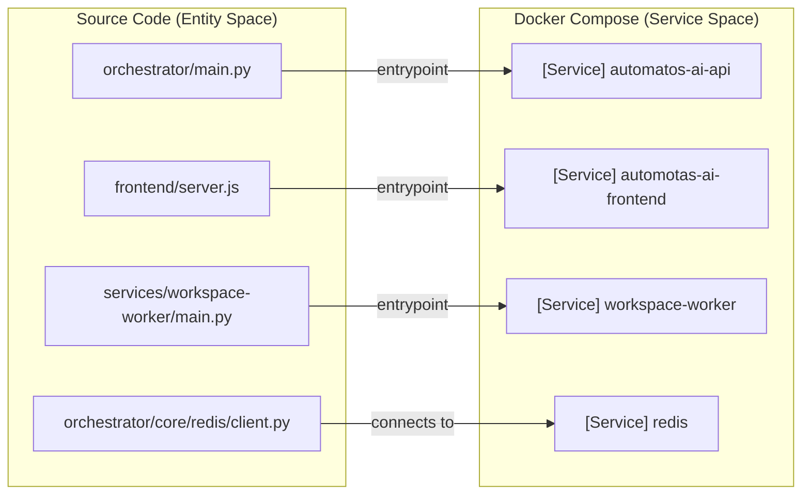

# Docker Compose Setup

<details>
<summary>Relevant source files</summary>

The following files were used as context for generating this wiki page:

- [README.md](README.md)
- [docker-compose.yml](docker-compose.yml)
- [docs/README.md](docs/README.md)
- [frontend/.dockerignore](frontend/.dockerignore)
- [frontend/Dockerfile](frontend/Dockerfile)
- [infrastructure/.env.example](infrastructure/.env.example)
- [infrastructure/docker-compose.core.yml](infrastructure/docker-compose.core.yml)
- [infrastructure/docker-compose.data.yml](infrastructure/docker-compose.data.yml)
- [infrastructure/docker-compose.landing.yml](infrastructure/docker-compose.landing.yml)
- [infrastructure/docker-compose.memory.yml](infrastructure/docker-compose.memory.yml)
- [infrastructure/docker-compose.monitoring.yml](infrastructure/docker-compose.monitoring.yml)
- [infrastructure/docker-compose.voice.yml](infrastructure/docker-compose.voice.yml)
- [infrastructure/docker-compose.yml](infrastructure/docker-compose.yml)
- [infrastructure/railway-manifest.json](infrastructure/railway-manifest.json)
- [orchestrator/Dockerfile](orchestrator/Dockerfile)
- [orchestrator/api/cloud_documents.py](orchestrator/api/cloud_documents.py)
- [orchestrator/core/redis/client.py](orchestrator/core/redis/client.py)
- [orchestrator/modules/tools/services/__init__.py](orchestrator/modules/tools/services/__init__.py)
- [orchestrator/requirements.txt](orchestrator/requirements.txt)

</details>


This page documents the Docker Compose orchestration for Automatos AI, covering service definitions, dependencies, health checks, volumes, networks, and modular deployment strategies. For individual Dockerfile details, see [Docker Containerization](20.1). For environment variable configuration, see [Environment Variables](20.3).

## Purpose and Scope

The Automatos AI platform uses a modular Docker Compose architecture to support environments ranging from local development to full-scale production clusters. The setup is divided into a unified `docker-compose.yml` for quick starts and a suite of specialized infrastructure files for granular control.

- **Unified Composition**: A single entry point that includes all service groups (data, core, monitoring, voice, memory, landing) [infrastructure/docker-compose.yml:31-37]().
- **Core Services**: FastAPI backend, Next.js frontend, and task workers [infrastructure/docker-compose.core.yml:14-167]().
- **Data Infrastructure**: PostgreSQL with pgvector, Redis for caching/queues, and Qdrant for vector storage [infrastructure/docker-compose.data.yml:13-98]().
- **Observability Stack**: Prometheus, Grafana, Loki, and exporters for system health monitoring [infrastructure/docker-compose.monitoring.yml:16-183]().
- **Specialized Services**: Voice (TTS/STT) [infrastructure/docker-compose.voice.yml:12-85]() and Memory (Mem0) [infrastructure/railway-manifest.json:25-29]().

Sources: [infrastructure/docker-compose.yml:1-38](), [infrastructure/railway-manifest.json:14-44]()

---

## Service Architecture Overview

The platform is architected into 6 functional service groups. This modularity allows developers to spin up only the necessary components (e.g., just the data layer) during development.

**Service Dependency and Data Flow**



**Service Startup Sequence**
1. **Infrastructure**: `pgvector`, `redis`, and `qdrant` start first. Health checks verify readiness [infrastructure/docker-compose.data.yml:38-43](), [infrastructure/docker-compose.data.yml:69-74]().
2. **Backend**: `automatos-ai-api` waits for `pgvector` and `redis` to be healthy [infrastructure/docker-compose.core.yml:113-117]().
3. **Frontend**: `automotas-ai-frontend` waits for the API [infrastructure/docker-compose.core.yml:156-158]().
4. **Workers**: `workspace-worker` starts to consume task queues from Redis [infrastructure/docker-compose.core.yml:169-170]().

Sources: [infrastructure/docker-compose.core.yml:14-167](), [infrastructure/docker-compose.data.yml:13-112]()

---

## Core Services

### Backend API (FastAPI)
The backend is the central orchestrator, managing agent lifecycles, tool execution, and database interactions.

| Property | Value | Purpose |
|----------|-------|---------|
| Image | `production` stage | Optimized image without dev tools [orchestrator/Dockerfile:90]() |
| Port | 8000 | Primary API and WebSocket endpoint [infrastructure/docker-compose.core.yml:27]() |
| Health Check | `/health` | Verifies FastAPI app is responsive [infrastructure/docker-compose.core.yml:118-123]() |

**Key Environment Integrations**:
- **Database**: Connects via `DATABASE_URL` using SQLAlchemy [infrastructure/docker-compose.core.yml:30]().
- **Task Runner**: Configurable backend (defaulting to Redis) for async jobs [infrastructure/docker-compose.core.yml:112]().
- **External Services**: Links to `VOICE_SERVICE_URL`, `MEM0_API_URL`, and `AGENT_OPT_WORKER_URL` [infrastructure/docker-compose.core.yml:68-71]().

Sources: [infrastructure/docker-compose.core.yml:19-126](), [orchestrator/Dockerfile:88-130]()

### Frontend (Next.js)
The frontend uses Next.js standalone mode for production, reducing image size by including only necessary node_modules [frontend/Dockerfile:83-114]().

**Build Arguments**:
Next.js bakes `NEXT_PUBLIC_*` variables into the client bundle at build time. These must be provided during the Docker build process [frontend/Dockerfile:58-71]().

Sources: [frontend/Dockerfile:53-81](), [infrastructure/docker-compose.core.yml:131-166]()

---

## Data Infrastructure

### PostgreSQL with pgvector
Uses `pgvector/pgvector:pg18` to support high-performance vector similarity searches for RAG and memory [infrastructure/docker-compose.data.yml:20]().

**Optimization Parameters**:
The service is tuned for agentic workloads with increased connection limits and memory buffers [infrastructure/docker-compose.data.yml:23-28]():
- `max_connections=200`
- `shared_buffers=256MB`

### Redis Cache & Pub/Sub
Redis 8.2.1 acts as the message broker for real-time updates and the task queue for `workspace-worker` [infrastructure/docker-compose.data.yml:48-51]().

**Security Hardening**:
To prevent accidental data loss in production, dangerous commands are renamed to empty strings [docker-compose.yml:52-61]():
- `FLUSHDB` and `FLUSHALL` are disabled [docker-compose.yml:59-60]().
- `DEBUG` is disabled [docker-compose.yml:61]().

Sources: [infrastructure/docker-compose.data.yml:19-76](), [docker-compose.yml:48-73]()

---

## Monitoring and Observability

The platform includes a comprehensive monitoring stack to track LLM costs, agent performance, and system health [infrastructure/docker-compose.monitoring.yml:1-14]().

**Metrics and Logs Pipeline**:
1. **Exporters**: `postgres-exporter` and `redis-exporter` scrape metrics from the data layer [infrastructure/docker-compose.monitoring.yml:156-183]().
2. **Prometheus**: Aggregates metrics from exporters and the FastAPI `/metrics` endpoint [infrastructure/docker-compose.monitoring.yml:22-42]().
3. **Loki & Log-Relay**: Collects logs via a relay that bridges Railway log drains to Loki [infrastructure/docker-compose.monitoring.yml:77-124]().
4. **Grafana**: Provides the visualization layer for the Unified Analytics dashboard [infrastructure/docker-compose.monitoring.yml:48-74]().

Sources: [infrastructure/docker-compose.monitoring.yml:16-183]()

---

## Code-to-Container Mapping

The following diagram bridges the source code entities to their respective Docker services.



Sources: [orchestrator/Dockerfile:129](), [frontend/Dockerfile:114](), [infrastructure/docker-compose.core.yml:19-170](), [orchestrator/core/redis/client.py:17-31]()

---

## Deployment Configuration

### Volumes and Persistence
The setup utilizes named volumes to ensure data persists across container restarts and updates.

| Volume Name | Service | Path | Purpose |
|-------------|---------|------|---------|
| `automatos_pgvector_data` | `pgvector` | `/var/lib/postgresql/data/` | DB Persistence [infrastructure/docker-compose.data.yml:102]() |
| `automatos_redis_data` | `redis` | `/data` | Cache Persistence [infrastructure/docker-compose.data.yml:104]() |
| `automatos_qdrant_data` | `qdrant` | `/qdrant/storage` | Vector Persistence [infrastructure/docker-compose.data.yml:106]() |
| `agent-workspace-data` | `workspace-worker` | `/workspaces` | Agent files (50GB) [infrastructure/railway-manifest.json:136]() |

### Network Configuration
A shared external network `automatos_network` is required to allow communication between modular compose files [infrastructure/docker-compose.yml:21]().

```yaml
networks:
  automatos:
    name: automatos_network
    external: true
```

Sources: [infrastructure/docker-compose.data.yml:100-112](), [infrastructure/docker-compose.yml:21]()

---