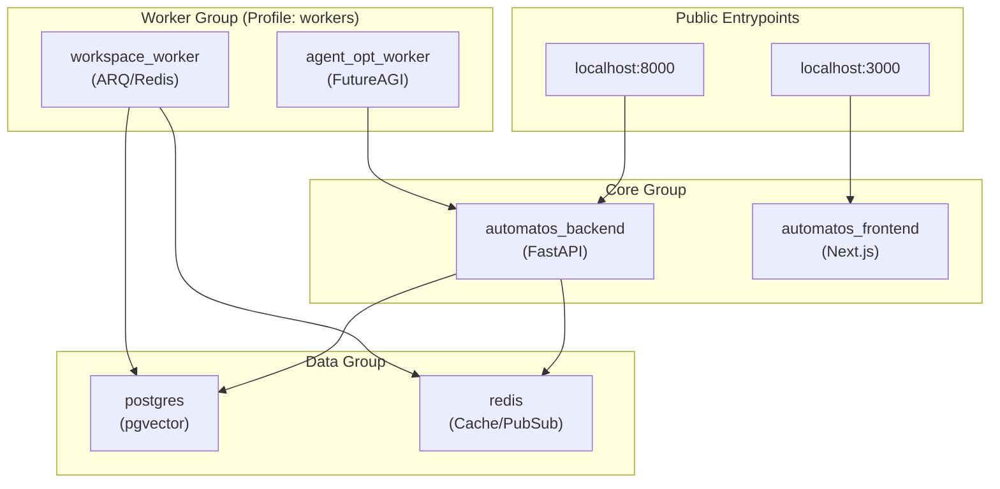
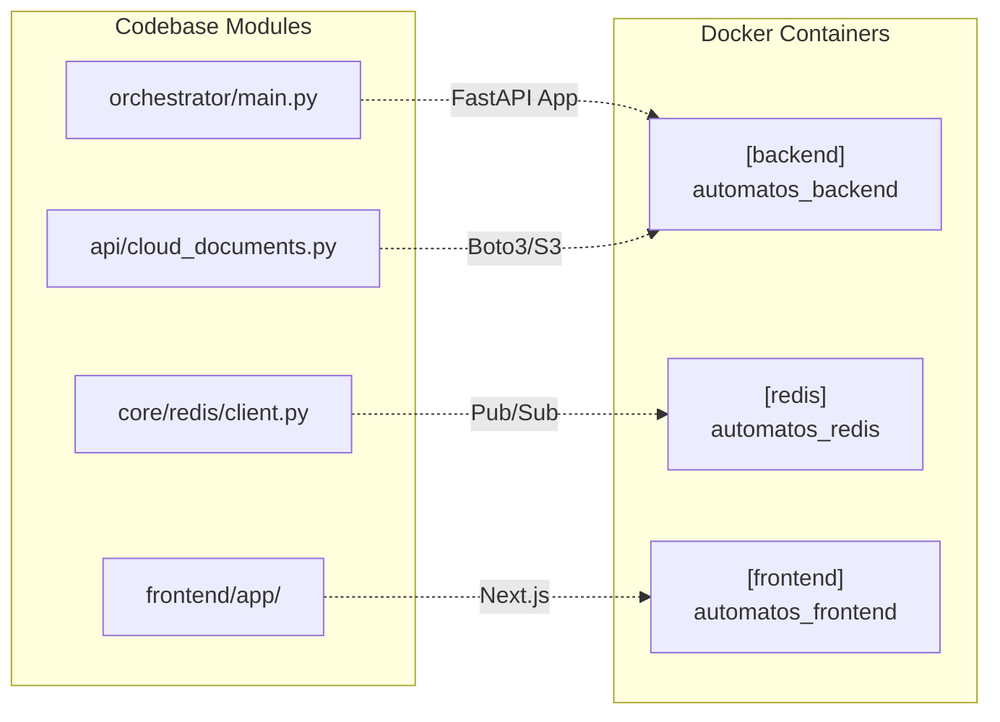

# Docker Compose Setup

Relevant source files

The following files were used as context for generating this wiki page:

- [docker-compose.yml](docker-compose.yml)
- [frontend/.dockerignore](frontend/.dockerignore)
- [frontend/Dockerfile](frontend/Dockerfile)
- [orchestrator/Dockerfile](orchestrator/Dockerfile)
- [orchestrator/api/cloud_documents.py](orchestrator/api/cloud_documents.py)
- [orchestrator/core/redis/client.py](orchestrator/core/redis/client.py)
- [orchestrator/requirements.txt](orchestrator/requirements.txt)

This page documents the Docker Compose orchestration for Automatos AI, covering service definitions, dependencies, health checks, volumes, networks, and deployment profiles. The setup mirrors a 19-service production topology used in Railway deployments, organized into modular functional groups.

## Purpose and Scope

The Docker Compose configuration orchestrates all services required to run Automatos AI in a containerized environment. It defines:

- **Core Services**: PostgreSQL, Redis, FastAPI backend, Next.js frontend [docker-compose.yml:18-170]().
- **Data Infrastructure**: Dedicated pgvector and Redis instances [docker-compose.yml:22-73]().
- **Worker Services**: `workspace-worker` for isolated task execution and `agent-opt-worker` for prompt optimization [docker-compose.yml:178-217]().
- **Support Services**: Gotenberg for document generation (PRD-63) [docker-compose.yml:109]().

Sources: [docker-compose.yml:1-217](), [orchestrator/Dockerfile:1-141](), [frontend/Dockerfile:1-115]()

---

## Modular Architecture

The system uses a unified `docker-compose.yml` with profiles to manage service groups, allowing for both minimal local development and full-scale worker deployments.

### Service Grouping

| Group | Service Name | Role |
|-------|--------------|------|
| **Database** | `postgres` | Primary storage with `pgvector` [docker-compose.yml:22-43]() |
| **Cache** | `redis` | Pub/Sub hub and session store [docker-compose.yml:48-73]() |
| **API** | `backend` | FastAPI orchestrator [docker-compose.yml:78-138]() |
| **UI** | `frontend` | Next.js dashboard [docker-compose.yml:146-170]() |
| **Workers** | `workspace-worker` | Isolated agent task execution [docker-compose.yml:178-202]() |
| **Optimization**| `agent-opt-worker` | FutureAGI prompt scoring/optimization [docker-compose.yml:204-217]() |

**System Data Flow & Networking**

Sources: [docker-compose.yml:18-217](), [orchestrator/core/redis/client.py:141-197]()

---

## Core Infrastructure Implementation

### Backend (FastAPI)
The backend service is built using a multi-stage `Dockerfile` targeting `python:3.11-slim` [orchestrator/Dockerfile:13](). It includes system dependencies for OCR (`tesseract-ocr`), document processing (`ghostscript`), and PDF generation (`libpango`) [orchestrator/Dockerfile:18-32]().

- **Entrypoint**: Runs `alembic upgrade heads` before starting `uvicorn` to ensure schema synchronization [orchestrator/Dockerfile:140]().
- **Hot Reload**: In development mode, the `./orchestrator` directory is mounted to `/app` [docker-compose.yml:126]().

### Frontend (Next.js)
The frontend uses a multi-stage build that outputs a standalone Node.js server for production efficiency [frontend/Dockerfile:83-114]().

- **Environment Injection**: `NEXT_PUBLIC_API_URL` and Clerk keys are baked into the client bundle during the build stage [frontend/Dockerfile:58-71]().
- **Security**: Runs as a non-root `nextjs` user [frontend/Dockerfile:93-101]().

### Redis Pub/Sub & Task Queue
Redis is the central nervous system for real-time updates. The `RedisClient` class manages connection pools and async pub/sub for WebSocket streaming [orchestrator/core/redis/client.py:14-64]().

- **Workflow Events**: The `publish_workflow_event` method routes execution updates to channels like `workflow:{id}:execution:{id}` [orchestrator/core/redis/client.py:110-119]().
- **Security**: The `redis` service renames dangerous commands like `FLUSHALL` and `FLUSHDB` to prevent accidental data loss [docker-compose.yml:59-61]().

Sources: [orchestrator/Dockerfile:1-141](), [frontend/Dockerfile:1-115](), [orchestrator/core/redis/client.py:1-197](), [docker-compose.yml:48-73]()

---

## Code Entity to Service Mapping

This diagram maps specific Python modules and frontend components to their containerized environments.

Sources: [orchestrator/main.py:1-50](), [orchestrator/core/redis/client.py:14-31](), [orchestrator/api/cloud_documents.py:25](), [frontend/Dockerfile:114]()

---

## Data Persistence & Volumes

The setup uses named volumes to ensure state is preserved across container lifecycles.

| Volume Name | Service | Mount Path | Purpose |
|-------------|---------|------------|---------|
| `postgres_data` | `postgres` | `/var/lib/postgresql/data` | Persistent SQL & Vector data [docker-compose.yml:34]() |
| `redis_data` | `redis` | `/data` | Cache and session persistence [docker-compose.yml:65]() |
| `workspace_data` | `backend`, `worker` | `/workspaces` | Shared agent filesystems (RO for API, RW for Worker) [docker-compose.yml:130]() |
| `backend_logs` | `backend` | `/app/logs` | Centralized application logs [docker-compose.yml:128]() |

Sources: [docker-compose.yml:34](), [docker-compose.yml:65](), [docker-compose.yml:128-130]()

---

## Environment Configuration

A `.env` file is mandatory for initialization. Key required variables include:

- **Database**: `POSTGRES_PASSWORD` [docker-compose.yml:29]().
- **Redis**: `REDIS_PASSWORD` [docker-compose.yml:56]().
- **Security**: `API_KEY` for backend authentication [docker-compose.yml:116]().
- **Auth**: `CLERK_SECRET_KEY` and `NEXT_PUBLIC_CLERK_PUBLISHABLE_KEY` [docker-compose.yml:119-121]().
- **LLM Keys**: Optional at startup; can be configured via the UI [docker-compose.yml:105-106]().

### Launching the Stack

- **Standard Development**: `docker-compose up --build` [docker-compose.yml:6]().
- **With Workers**: `docker-compose --profile workers up --build` [docker-compose.yml:184]().
- **Production Mode**: Build using the `production` target in Dockerfiles to exclude dev dependencies like `pytest`, `black`, and `isort` [orchestrator/Dockerfile:110-114]().

Sources: [docker-compose.yml:1-16](), [orchestrator/Dockerfile:95-141](), [frontend/Dockerfile:85-115]()

---