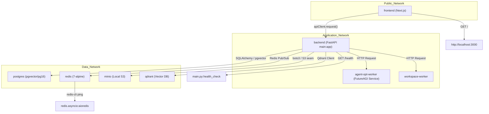
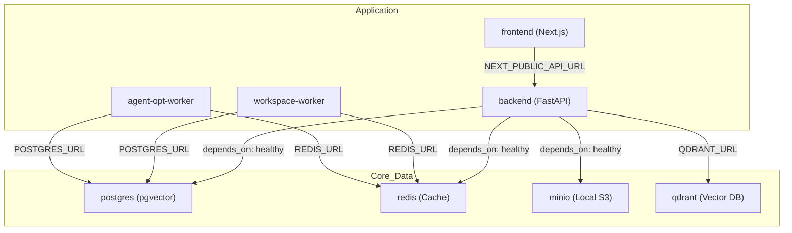

# Docker Containerization

Relevant source files

The following files were used as context for generating this wiki page:

- [.github/workflows/test.yml](.github/workflows/test.yml)
- [docker-compose.yml](docker-compose.yml)
- [frontend/.dockerignore](frontend/.dockerignore)
- [frontend/Dockerfile](frontend/Dockerfile)
- [infrastructure/.env.example](infrastructure/.env.example)
- [infrastructure/railway-manifest.json](infrastructure/railway-manifest.json)
- [orchestrator/Dockerfile](orchestrator/Dockerfile)
- [orchestrator/core/redis/client.py](orchestrator/core/redis/client.py)
- [orchestrator/requirements.txt](orchestrator/requirements.txt)
- [orchestrator/tests/test_dockerfile_prod_parity.py](orchestrator/tests/test_dockerfile_prod_parity.py)

This document describes the Docker containerization strategy for Automatos AI, covering the multi-stage build architecture for the orchestrator, frontend, and specialized worker services. It details image optimization, security hardening, and dependency management.

## Overview

Automatos AI utilizes a distributed container architecture to isolate core platform logic from resource-intensive or specialized tasks like code execution and prompt optimization.

**Key Design Principles:**
- **Multi-stage builds** to minimize final image size by separating build tools from runtimes [orchestrator/Dockerfile:4-8]().
- **Service Isolation**: Distinct containers for the Next.js frontend, FastAPI orchestrator, and specialized workers [docker-compose.yml:18-200]().
- **Non-root execution**: All production images switch to low-privilege users (`automatos` or `nextjs`) [orchestrator/Dockerfile:103-109](), [frontend/Dockerfile:110-112]().
- **Health Monitoring**: Integrated Docker health checks for automated service recovery [orchestrator/Dockerfile:115-117](), [frontend/Dockerfile:43-45]().

Sources: [docker-compose.yml:1-16](), [orchestrator/Dockerfile:1-8]()

## System Container Map

The following diagram maps the logical system components to their respective Docker entities and entrypoint configurations.

**Container to Code Entity Mapping**

Sources: [docker-compose.yml:18-159](), [orchestrator/core/redis/client.py:14-31](), [orchestrator/Dockerfile:115-117](), [frontend/Dockerfile:43-45]()

## 1. Orchestrator (Backend) Container

The orchestrator uses a Python 3.11-slim base with specialized system dependencies for document processing, OCR, and PDF generation.

### Build Stages
- **pybuild**: This initial stage is responsible for compiling Python wheels. It installs `gcc`, `g++`, and `libffi-dev` which are necessary for building certain Python packages but are not needed at runtime, thus reducing the final image size [orchestrator/Dockerfile:19-27](). It also handles conditional installation of `graphifyy[leiden]` extras based on the `INSTALL_GRAPH_EXTRAS` build argument [orchestrator/Dockerfile:44-58]().
- **base**: This stage copies the compiled Python packages from `pybuild` and installs runtime-only system dependencies such as `git`, `postgresql-client`, `libmagic1`, `tesseract-ocr`, `ghostscript`, `libpango-1.0-0`, `libcairo2`, and `libgdk-pixbuf-2.0-0` [orchestrator/Dockerfile:63-81]().
- **development**: Configured for hot-reload using `uvicorn --reload` and mounts the local source directory [orchestrator/Dockerfile:91-131](), [docker-compose.yml:136-144](). It creates necessary directories like `/app/logs`, `/app/vector_stores`, `/app/projects`, `/app/exports`, and `/app/data` and sets ownership to a non-root `automatos` user [orchestrator/Dockerfile:101-108]().
- **production**: Optimized image that removes dev tools and cleans `__pycache__` [orchestrator/Dockerfile:136-150](). It also creates the same necessary directories and sets up the `automatos` user [orchestrator/Dockerfile:148-150]().

### Key Implementation Details
- **Graph Extras**: The `INSTALL_GRAPH_EXTRAS` build argument controls whether the `[leiden]` extra for `graphifyy` is installed. This extra pulls in a significant number of dependencies (~660 MB) for advanced graph clustering. By default, it's `true` for production builds (Railway) and `false` for local development to keep images slim [orchestrator/Dockerfile:38-44]().
- **Dependency Handling**: `futureagi` is installed with `--no-deps` to prevent version conflicts with core requirements like `requests` or `pandas` [orchestrator/Dockerfile:46-50]().
- **Schema Safety**: The `CMD` for the development stage enforces `alembic upgrade heads` before starting `uvicorn`. This ensures the live schema never drifts from the code and handles multiple migration heads [orchestrator/Dockerfile:121-131](). The production stage also includes this in its entrypoint [orchestrator/Dockerfile:178-184]().
- **Non-root User**: A dedicated `automatos` user with UID 1000 is created, and `/app` directories are chowned to this user for enhanced security [orchestrator/Dockerfile:103-109]().

Sources: [orchestrator/Dockerfile:1-184](), [orchestrator/core/redis/client.py:141-154]()

## 2. Frontend Container

The frontend utilizes a 4-stage build process to handle Next.js static generation and standalone optimization.

| Stage | Description | Key Files / Commands |
| :--- | :--- | :--- |
| **base** | Node 20-alpine foundation, installs build tools like `python3`, `make`, `g++` | `package.json` [frontend/Dockerfile:14-26]() |
| **development** | Hot-reload dev server, installs all dependencies including devDependencies | `npm install --legacy-peer-deps`, `npm run dev` [frontend/Dockerfile:31-48]() |
| **builder** | Production build stage, installs all dependencies, copies source, runs `npm run build` | `npm install --legacy-peer-deps`, `npm run build` [frontend/Dockerfile:53-99]() |
| **production** | Minimal standalone runner, copies built assets, creates `nextjs` user, runs `node server.js` | `node server.js` [frontend/Dockerfile:103-132]() |

### Build-time Environment Variables
Next.js requires `NEXT_PUBLIC_*` variables (like `NEXT_PUBLIC_API_URL` and `NEXT_PUBLIC_CLERK_PUBLISHABLE_KEY`) to be available during the `builder` stage to bake them into the client-side bundle [frontend/Dockerfile:58-71](). The default values for these arguments are set for the SaaS production environment, and local development overrides them via `docker-compose.yml` build arguments [frontend/Dockerfile:60-66]().

### Cache Invalidation
A `FRONTEND_CACHE_BUST` build argument is provided to force a clean rebuild of the `COPY` and `npm run build` layers, preventing stale `.next/static` chunks in environments like Railway [frontend/Dockerfile:88-92]().

Sources: [frontend/Dockerfile:1-132]()

## 3. Worker Services & Auth (PRD-203)

Specialized workers, such as the `workspace-worker` and `agent-opt-worker`, operate in isolated environments.

### `agent-opt-worker`
This worker is responsible for prompt optimization and FutureAGI SDK integration [orchestrator/requirements.txt:136-143](). Its Dockerfile is not provided in the current context, but its URL is configured via `AGENT_OPT_WORKER_URL` [infrastructure/.env.example:120]().

### `workspace-worker`
This worker handles sandboxed code execution and file operations. Its Dockerfile is located at `services/workspace-worker/Dockerfile`. It also supports conditional installation of a browser via `INSTALL_BROWSER` build argument, which is `true` by default for production and `false` for local development [orchestrator/tests/test_dockerfile_prod_parity.py:33]().

### Model Credential Handling
Workers utilize a centralized environment configuration via `worker_config.py` to handle model authentication for headless SDK subprocesses (e.g., Claude Agent SDK) [services/workspace-worker/worker_config.py:1-13]().
- **model_auth_env()**: Retrieves `CLAUDE_CODE_OAUTH_TOKEN` or `ANTHROPIC_API_KEY` from the environment [services/workspace-worker/worker_config.py:21-39]().
- **Fail-Fast Policy**: The worker is designed to fail clearly rather than idling silently if model credentials are missing [orchestrator/tests/test_prd203_cs8_worker_auth.py:97-114]().

Sources: [services/workspace-worker/worker_config.py:1-45](), [orchestrator/tests/test_prd203_cs8_worker_auth.py:1-116](), [orchestrator/requirements.txt:136-143](), [infrastructure/.env.example:120](), [orchestrator/tests/test_dockerfile_prod_parity.py:33]()

## Multi-Service Coordination

The `docker-compose.yml` file orchestrates the local stack, including a local S3-compatible store (MinIO) to provide a durable knowledge flywheel during development [docker-compose.yml:83-89](). It also includes an optional Qdrant service for durable and field memory, activated via the `memory` profile [docker-compose.yml:116-133]().

**Service Dependency Graph**

Sources: [docker-compose.yml:18-159](), [orchestrator/core/redis/client.py:141-154]()

### Security & Resource Configuration
- **Redis Hardening**: The Redis container renames dangerous commands like `FLUSHALL` and `FLUSHDB` to empty strings and enforces an `allkeys-lru` memory policy to prevent data wipe if exposed [docker-compose.yml:59-66]().
- **Postgres Initialization**: The `POSTGRES_INITDB_ARGS` environment variable is used to configure `max_connections` and `shared_buffers` for the PostgreSQL container [docker-compose.yml:38]().
- **Network Isolation**: All services reside on the `automatos` bridge network [docker-compose.yml:50]().
- **Environment Variables**: Critical environment variables like `POSTGRES_PASSWORD`, `REDIS_PASSWORD`, and `API_KEY` are marked as required in `docker-compose.yml` using the `:?` syntax, ensuring they are set before the services start [docker-compose.yml:37](), [docker-compose.yml:63](), [docker-compose.yml:156]().
- **Prod Parity Tests**: The `orchestrator/tests/test_dockerfile_prod_parity.py` module contains tests to ensure that Dockerfile `ARG` defaults align with production values and that local `docker-compose.yml` overrides are explicit. This prevents accidental deployment of local development configurations to production [orchestrator/tests/test_dockerfile_prod_parity.py:1-102]().

Sources: [docker-compose.yml:18-159](), [orchestrator/core/redis/client.py:141-154](), [orchestrator/tests/test_dockerfile_prod_parity.py:1-102]()

---