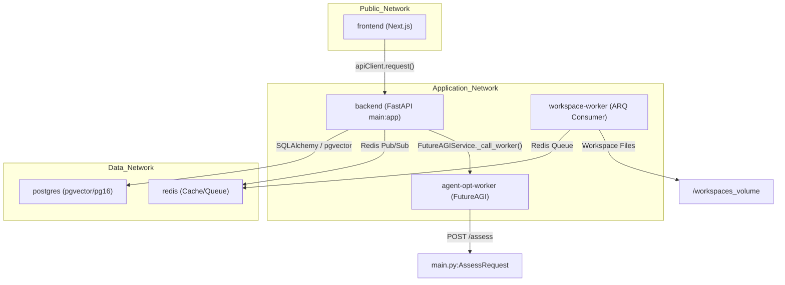
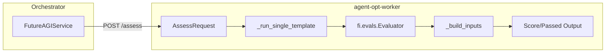
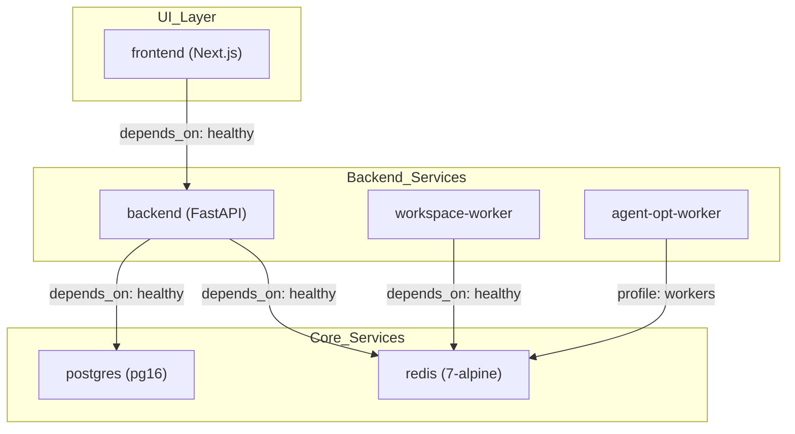

# Docker Containerization

Relevant source files

The following files were used as context for generating this wiki page:

- [README.md](README.md)
- [docker-compose.yml](docker-compose.yml)
- [docs/README.md](docs/README.md)
- [frontend/.dockerignore](frontend/.dockerignore)
- [frontend/Dockerfile](frontend/Dockerfile)
- [frontend/components/settings/SystemPromptsTab.tsx](frontend/components/settings/SystemPromptsTab.tsx)
- [orchestrator/Dockerfile](orchestrator/Dockerfile)
- [orchestrator/api/cloud_documents.py](orchestrator/api/cloud_documents.py)
- [orchestrator/core/redis/client.py](orchestrator/core/redis/client.py)
- [orchestrator/core/services/futureagi_service.py](orchestrator/core/services/futureagi_service.py)
- [orchestrator/modules/tools/services/__init__.py](orchestrator/modules/tools/services/__init__.py)
- [orchestrator/requirements.txt](orchestrator/requirements.txt)
- [services/agent-opt-worker/Dockerfile](services/agent-opt-worker/Dockerfile)
- [services/agent-opt-worker/automatos_logging.py](services/agent-opt-worker/automatos_logging.py)
- [services/agent-opt-worker/automatos_metrics.py](services/agent-opt-worker/automatos_metrics.py)
- [services/agent-opt-worker/main.py](services/agent-opt-worker/main.py)
- [services/agent-opt-worker/requirements.txt](services/agent-opt-worker/requirements.txt)
- [services/shared/automatos_logging.py](services/shared/automatos_logging.py)
- [services/shared/automatos_metrics.py](services/shared/automatos_metrics.py)
- [services/workspace-worker/Dockerfile](services/workspace-worker/Dockerfile)
- [services/workspace-worker/automatos_logging.py](services/workspace-worker/automatos_logging.py)
- [services/workspace-worker/automatos_metrics.py](services/workspace-worker/automatos_metrics.py)
- [services/workspace-worker/entrypoint.sh](services/workspace-worker/entrypoint.sh)
- [services/workspace-worker/requirements.txt](services/workspace-worker/requirements.txt)

This document describes the Docker containerization strategy for Automatos AI, covering the multi-stage build architecture for the orchestrator, frontend, and specialized worker services (`workspace-worker`, `agent-opt-worker`). It details image optimization, security hardening, and dependency management.

## Overview

Automatos AI utilizes a distributed container architecture to isolate core platform logic from resource-intensive or specialized tasks like code execution and prompt optimization.

**Key Design Principles:**
- **Multi-stage builds** to minimize final image size by separating build tools from runtimes [orchestrator/Dockerfile:4-8]().
- **Service Isolation**: Distinct containers for the Next.js frontend, FastAPI orchestrator, and specialized workers [docker-compose.yml:18-200]().
- **Non-root execution**: All production images switch to low-privilege users (`automatos`, `nextjs`, or `worker`) [orchestrator/Dockerfile:111-115](), [frontend/Dockerfile:93-101](), [services/workspace-worker/Dockerfile:33-35](), [services/agent-opt-worker/Dockerfile:10-11]().
- **Health Monitoring**: Integrated Docker health checks for automated service recovery [orchestrator/Dockerfile:121-122](), [services/workspace-worker/Dockerfile:49-50](), [frontend/Dockerfile:107-108]().

Sources: [README.md:112-120](), [docker-compose.yml:1-16]()

## System Container Map

The following diagram maps the logical system components to their respective Docker entities and entrypoint configurations.

**Container to Code Entity Mapping**

Sources: [docker-compose.yml:18-200](), [orchestrator/core/services/futureagi_service.py:79-85](), [services/agent-opt-worker/main.py:166-171]()

## 1. Orchestrator (Backend) Container

The orchestrator uses a Python 3.11-slim base with specialized system dependencies for document processing and OCR.

### Build Stages
- **base**: Installs `gcc`, `tesseract-ocr`, `ghostscript`, and `libpango` (for WeasyPrint) [orchestrator/Dockerfile:13-33]().
- **development**: Configured for hot-reload using `uvicorn --reload` [orchestrator/Dockerfile:57-85]().
- **production**: Optimized image that removes dev tools (`pytest`, `black`) and cleans `__pycache__` [orchestrator/Dockerfile:90-109]().

### Key Implementation Details
- **NLTK Pre-loading**: Downloads `punkt` and `stopwords` to `/usr/local/nltk_data` during build to avoid runtime latency in memory operations [orchestrator/Dockerfile:49-52]().
- **Dependency Handling**: `futureagi` is installed with `--no-deps` to prevent version conflicts with the core stack [orchestrator/Dockerfile:42-43](). Core FastAPI dependencies are managed via `requirements.txt` [orchestrator/requirements.txt:1-4]().
- **User**: Runs as user `automatos` (UID 1000) [orchestrator/Dockerfile:112-113]().

Sources: [orchestrator/Dockerfile:1-130](), [orchestrator/requirements.txt:1-110]()

## 2. Frontend Container

The frontend utilizes a 4-stage build process to handle Next.js static generation and standalone optimization.

| Stage | Description | Key Files |
| :--- | :--- | :--- |
| **base** | Node 20-alpine foundation | `package.json` [frontend/Dockerfile:14-26]() |
| **development** | Hot-reload dev server | `npm run dev` [frontend/Dockerfile:31-48]() |
| **builder** | Static site generation (SSG) | `.next/standalone` [frontend/Dockerfile:53-81]() |
| **production** | Minimal standalone runner | `server.js` [frontend/Dockerfile:85-114]() |

### Build-time Environment Variables
Next.js requires `NEXT_PUBLIC_*` variables (like `NEXT_PUBLIC_API_URL`) to be available during the `builder` stage to bake them into the client-side bundle [frontend/Dockerfile:55-71]().

Sources: [frontend/Dockerfile:1-116]()

## 3. Workspace Worker Container

The `workspace-worker` provides the execution environment for agents. Unlike the orchestrator, it contains a full DevOps toolchain.

### Environment Composition
- **System Tools**: `git`, `jq`, `tree`, `build-essential` [services/workspace-worker/Dockerfile:6-10]().
- **Runtimes**: Node.js 20, Python 3.12, and `pnpm` [services/workspace-worker/Dockerfile:12-16]().
- **Agent Tooling**: Pre-installed `pytest`, `ruff`, `black`, and `uv` to allow agents to run tests and format code immediately [services/workspace-worker/Dockerfile:18-23]().

### Volume Management
The container mounts `/workspaces` to persist agent files across restarts. The `entrypoint.sh` script ensures correct ownership of these volumes for the `worker` user [services/workspace-worker/Dockerfile:33-40]().

Sources: [services/workspace-worker/Dockerfile:1-56](), [services/workspace-worker/requirements.txt:1-20]()

## 4. Agent Optimization Worker (FutureAGI)

The `agent-opt-worker` is a specialized microservice for prompt assessment, safety scoring, and live traffic evaluation.

### Service Architecture
- **Isolation**: It runs the `agent-opt` and `ai-evaluation` SDKs in a separate environment to avoid dependency conflicts in the main orchestrator [services/agent-opt-worker/Dockerfile:1-16]().
- **API Surface**: Exposes `/assess`, `/safety`, `/score`, and `/optimize` endpoints [services/agent-opt-worker/main.py:10-15]().
- **Connectivity**: The orchestrator communicates with this worker via `FutureAGIService` using the `WORKER_URL` derived from `config.AGENT_OPT_WORKER_URL` [orchestrator/core/services/futureagi_service.py:25-27], [orchestrator/core/services/futureagi_service.py:79-85]().
- **Authentication**: Requires `FUTUREAGI_API_KEY` and `FUTUREAGI_SECRET_KEY` (also accepted as `FI_API_KEY`/`FI_SECRET_KEY`) to be set in the worker environment [services/agent-opt-worker/main.py:46-56]().

**Worker Internal Logic Flow**

Sources: [services/agent-opt-worker/main.py:1-141](), [services/agent-opt-worker/requirements.txt:1-8](), [orchestrator/core/services/futureagi_service.py:118-145]()

## Multi-Service Coordination

The `docker-compose.yml` file orchestrates these containers, defining dependencies and networking.

**Service Dependency Graph**

### Security Configuration
- **Redis Hardening**: The Redis container renames dangerous commands like `FLUSHALL`, `FLUSHDB`, and `DEBUG` to empty strings to prevent accidental data loss [docker-compose.yml:52-61]().
- **Network Isolation**: All services reside on the `automatos` bridge network [docker-compose.yml:42-43]().
- **Resource Limits**: Redis is constrained to `256mb` with an `allkeys-lru` policy [docker-compose.yml:57-58]().
- **Data Persistence**: Named volumes `postgres_data`, `redis_data`, and `workspace_data` are used for state persistence [docker-compose.yml:33-34], [docker-compose.yml:64-65], [docker-compose.yml:130]().

Sources: [docker-compose.yml:18-200]()

---