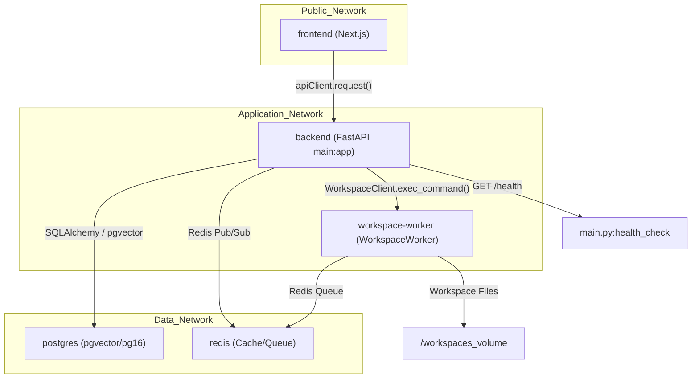
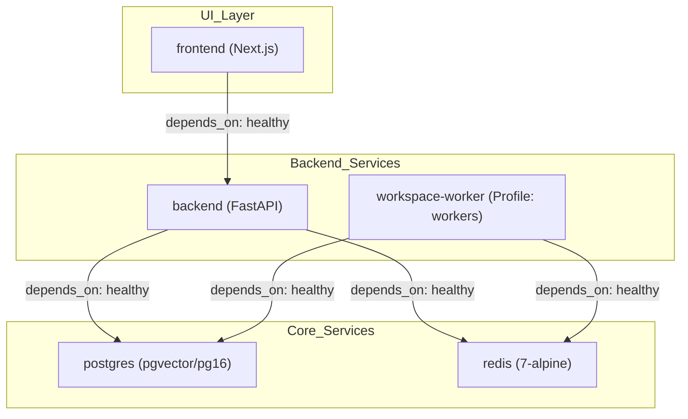

# Docker Containerization

Relevant source files

The following files were used as context for generating this wiki page:

- [docker-compose.yml](docker-compose.yml)
- [frontend/.dockerignore](frontend/.dockerignore)
- [frontend/Dockerfile](frontend/Dockerfile)
- [frontend/components/widgets/CodingCanvasWidget/RepoSelector.tsx](frontend/components/widgets/CodingCanvasWidget/RepoSelector.tsx)
- [frontend/components/widgets/TerminalWidget/InteractiveTerminal.tsx](frontend/components/widgets/TerminalWidget/InteractiveTerminal.tsx)
- [frontend/components/widgets/TerminalWidget/index.tsx](frontend/components/widgets/TerminalWidget/index.tsx)
- [orchestrator/Dockerfile](orchestrator/Dockerfile)
- [orchestrator/api/cloud_documents.py](orchestrator/api/cloud_documents.py)
- [orchestrator/api/workspace_exec.py](orchestrator/api/workspace_exec.py)
- [orchestrator/api/workspace_github.py](orchestrator/api/workspace_github.py)
- [orchestrator/core/redis/client.py](orchestrator/core/redis/client.py)
- [orchestrator/core/workspace_client.py](orchestrator/core/workspace_client.py)
- [orchestrator/modules/tools/discovery/workspace_actions.py](orchestrator/modules/tools/discovery/workspace_actions.py)
- [orchestrator/modules/tools/execution/exec_workspace.py](orchestrator/modules/tools/execution/exec_workspace.py)
- [orchestrator/requirements.txt](orchestrator/requirements.txt)
- [services/workspace-worker/Dockerfile](services/workspace-worker/Dockerfile)
- [services/workspace-worker/entrypoint.sh](services/workspace-worker/entrypoint.sh)
- [services/workspace-worker/executor.py](services/workspace-worker/executor.py)
- [services/workspace-worker/main.py](services/workspace-worker/main.py)
- [services/workspace-worker/requirements.txt](services/workspace-worker/requirements.txt)

This document describes the Docker containerization strategy for Automatos AI, covering the multi-stage build architecture for the orchestrator, frontend, and specialized worker services (`workspace-worker`). It details image optimization, security hardening, and dependency management.

## Overview

Automatos AI utilizes a distributed container architecture to isolate core platform logic from resource-intensive or specialized tasks like code execution and prompt optimization.

**Key Design Principles:**
- **Multi-stage builds** to minimize final image size by separating build tools from runtimes [orchestrator/Dockerfile:4-8]().
- **Service Isolation**: Distinct containers for the Next.js frontend, FastAPI orchestrator, and specialized workers [docker-compose.yml:18-200]().
- **Non-root execution**: All production images switch to low-privilege users (`automatos`, `nextjs`, or `worker`) [orchestrator/Dockerfile:111-115](), [frontend/Dockerfile:93-101](), [services/workspace-worker/Dockerfile:33-35]().
- **Health Monitoring**: Integrated Docker health checks for automated service recovery [orchestrator/Dockerfile:121-122](), [services/workspace-worker/Dockerfile:63-64](), [frontend/Dockerfile:107-108]().

Sources: [docker-compose.yml:1-16](), [orchestrator/Dockerfile:1-8]()

## System Container Map

The following diagram maps the logical system components to their respective Docker entities and entrypoint configurations.

**Container to Code Entity Mapping**

Sources: [docker-compose.yml:18-200](), [orchestrator/core/workspace_client.py:153-171](), [services/workspace-worker/main.py:59-68](), [services/workspace-worker/Dockerfile:63-64]()

## 1. Orchestrator (Backend) Container

The orchestrator uses a Python 3.11-slim base with specialized system dependencies for document processing and OCR.

### Build Stages
- **base**: Installs `gcc`, `tesseract-ocr`, `ghostscript`, and `libpango` (for WeasyPrint/PRD-63) [orchestrator/Dockerfile:13-33]().
- **development**: Configured for hot-reload using `uvicorn --reload` and mounts the local source directory [orchestrator/Dockerfile:57-85](), [docker-compose.yml:124-126]().
- **production**: Optimized image that removes dev tools (`pytest`, `black`, `isort`) and cleans `__pycache__` [orchestrator/Dockerfile:90-109]().

### Key Implementation Details
- **NLTK Pre-loading**: Downloads `punkt` and `stopwords` to `/usr/local/nltk_data` during build to avoid runtime latency in memory operations [orchestrator/Dockerfile:49-52]().
- **Dependency Handling**: `futureagi` is installed with `--no-deps` to prevent version conflicts with core requirements like `requests` or `pandas` [orchestrator/Dockerfile:39-43]().
- **User**: Runs as user `automatos` (UID 1000) for enhanced security [orchestrator/Dockerfile:111-115]().

Sources: [orchestrator/Dockerfile:1-130](), [orchestrator/requirements.txt:1-117]()

## 2. Frontend Container

The frontend utilizes a 4-stage build process to handle Next.js static generation and standalone optimization.

| Stage | Description | Key Files / Commands |
| :--- | :--- | :--- |
| **base** | Node 20-alpine foundation | `package.json` [frontend/Dockerfile:14-26]() |
| **development** | Hot-reload dev server | `npm run dev` [frontend/Dockerfile:31-48]() |
| **builder** | Static site generation (SSG) | `npm run build` [frontend/Dockerfile:53-81]() |
| **production** | Minimal standalone runner | `node server.js` [frontend/Dockerfile:85-114]() |

### Build-time Environment Variables
Next.js requires `NEXT_PUBLIC_*` variables (like `NEXT_PUBLIC_API_URL` and `NEXT_PUBLIC_CLERK_PUBLISHABLE_KEY`) to be available during the `builder` stage to bake them into the client-side bundle [frontend/Dockerfile:55-71]().

Sources: [frontend/Dockerfile:1-116]()

## 3. Workspace Worker Container

The `workspace-worker` provides the execution environment for agents, facilitating PRD-56 Physical Workspaces.

### Environment Composition
- **System Tools**: `git`, `jq`, `tree`, `build-essential`, and `gosu` for privilege dropping [services/workspace-worker/Dockerfile:6-10]().
- **Runtimes**: Node.js 20, Python 3.12, and `pnpm` [services/workspace-worker/Dockerfile:12-16]().
- **Agent Tooling**: Pre-installed `pytest`, `ruff`, `black`, and `uv` to allow agents to run tests and format code immediately [services/workspace-worker/Dockerfile:18-23]().
- **Headless Browsing**: Includes Chromium and Playwright for the `workspace_html_to_png` tool [services/workspace-worker/Dockerfile:37-49]().

### Volume Management
The container mounts `/workspaces` to persist agent files across restarts [docker-compose.yml:130](). The `entrypoint.sh` script fixes ownership of these volumes for the `worker` user (UID 1000) before dropping privileges [services/workspace-worker/Dockerfile:33-35]().

### Process Management
The worker implements an `ARQ-style` consumer in `WorkspaceWorker` that polls Redis priority queues (`critical`, `high`, `normal`, `low`) [services/workspace-worker/main.py:44-68](). It uses an `asyncio.Semaphore` to enforce the `WORKER_CONCURRENCY` limit [services/workspace-worker/main.py:78-79]().

Sources: [services/workspace-worker/Dockerfile:1-70](), [services/workspace-worker/main.py:44-79](), [services/workspace-worker/requirements.txt:1-23]()

## Multi-Service Coordination

The `docker-compose.yml` file orchestrates these containers, defining dependencies and networking.

**Service Dependency Graph**

### Security Configuration
- **Redis Hardening**: The Redis container renames dangerous commands like `FLUSHALL`, `FLUSHDB`, and `DEBUG` to empty strings and requires a password [docker-compose.yml:52-61]().
- **Network Isolation**: All services reside on the `automatos` bridge network [docker-compose.yml:42-43]().
- **Resource Limits**: Redis is constrained to `256mb` with an `allkeys-lru` policy [docker-compose.yml:57-58]().
- **Workspace Sandboxing**: The `WorkspaceToolExecutor` enforces a command whitelist [services/workspace-worker/executor.py:35-73]() and blocks dangerous patterns like `rm -rf /` or `sudo` [services/workspace-worker/executor.py:76-95]().

Sources: [docker-compose.yml:18-200](), [services/workspace-worker/executor.py:31-106]()

---