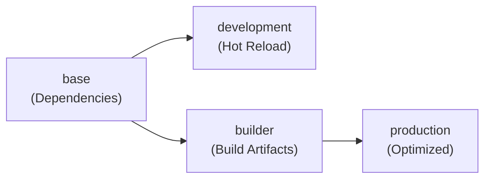
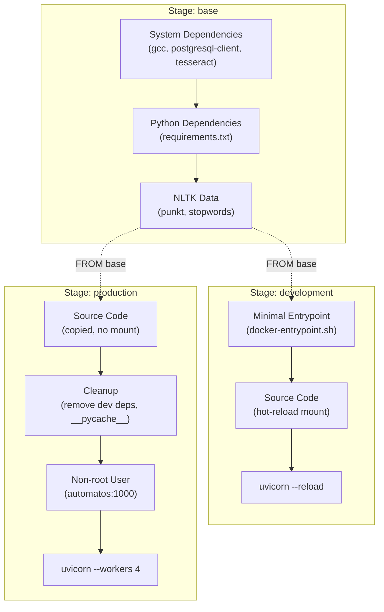
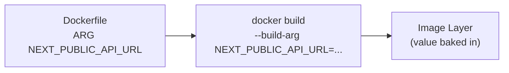

# Docker Containerization

<details>
<summary>Relevant source files</summary>

The following files were used as context for generating this wiki page:

- [docker-compose.yml](docker-compose.yml)
- [frontend/.dockerignore](frontend/.dockerignore)
- [frontend/Dockerfile](frontend/Dockerfile)
- [orchestrator/Dockerfile](orchestrator/Dockerfile)
- [orchestrator/core/redis/client.py](orchestrator/core/redis/client.py)
- [orchestrator/requirements.txt](orchestrator/requirements.txt)

</details>


This document describes the Docker containerization strategy for Automatos AI, including multi-stage build architecture, image optimization, and security considerations for both frontend and backend services. For information about service orchestration and networking, see [Docker Compose Setup](#12.2). For configuration of environment variables, see [Environment Variables](#12.3).

## Overview

Automatos AI uses multi-stage Docker builds to create optimized images for development and production environments. Both the frontend (Next.js) and backend (FastAPI) services are containerized with distinct stages for dependency installation, development hot-reloading, production building, and minimal production deployment.

**Key Design Principles:**
- **Multi-stage builds** to minimize final image size
- **Separate development and production targets** for different use cases
- **Layer caching optimization** to speed up builds
- **Non-root user execution** for security
- **Health checks** for container orchestration
- **Hot-reload support** in development mode

Sources: [README.md:55-78](), [docker-compose.yml:1-15]()

## Build Architecture

Both frontend and backend use a consistent multi-stage approach with the following progression:



Sources: [frontend/Dockerfile:1-9](), [orchestrator/Dockerfile:1-8]()

## Frontend Container Architecture

The frontend container is defined in `frontend/Dockerfile` and implements a 4-stage build process tailored for Next.js applications.

### Stage Breakdown

| Stage | Purpose | Base Image | Key Operations |
|-------|---------|------------|----------------|
| `base` | Install dependencies | `node:20-alpine` | Package file copying, system dependencies |
| `development` | Hot-reload dev server | Extends `base` | Full source mount, `npm run dev` |
| `builder` | Production build | Extends `base` | Next.js build with embedded env vars |
| `production` | Optimized runtime | `node:20-alpine` | Minimal files, non-root user, `npm start` |

Sources: [frontend/Dockerfile:14-119]()

### Base Stage

The base stage establishes the foundation for all subsequent stages:

[frontend/Dockerfile:14-26]()

**Key Features:**
- Uses Alpine Linux for minimal footprint
- Installs `python3`, `make`, `g++` for native module compilation (node-gyp)
- Copies only `package*.json` to enable Docker layer caching
- No source code copied yet to maximize cache hits

Sources: [frontend/Dockerfile:14-26]()

### Development Stage

The development stage extends `base` to support hot-reloading:

[frontend/Dockerfile:31-48]()

**Configuration:**
- Uses `npm install --legacy-peer-deps` for flexibility with lock files
- Copies entire source directory (`.dockerignore` filters unnecessary files)
- Exposes port `3000`
- Health check pings `http://localhost:3000` every 30s
- Runs `npm run dev` for Next.js development server with hot-reload

**Usage in docker-compose:**
```yaml
frontend:
  build:
    context: ./frontend
    target: development
```

Sources: [frontend/Dockerfile:31-48](), [docker-compose.yml:131-135]()

### Builder Stage

The builder stage creates production-optimized assets with build-time configuration:

[frontend/Dockerfile:53-80]()

**Build Arguments:**
The following `ARG` declarations accept build-time values that are embedded into the JavaScript bundle:

| Argument | Purpose | Security Level |
|----------|---------|----------------|
| `NEXT_PUBLIC_API_URL` | Backend API endpoint | Public (safe) |
| `NEXT_PUBLIC_CLERK_PUBLISHABLE_KEY` | Clerk authentication public key | Public (safe) |
| `NEXT_PUBLIC_CLERK_SIGN_IN_URL` | Sign-in route | Public (safe) |
| `NEXT_PUBLIC_CLERK_SIGN_UP_URL` | Sign-up route | Public (safe) |
| `NEXT_PUBLIC_CLERK_AFTER_SIGN_IN_URL` | Post-login redirect | Public (safe) |
| `NEXT_PUBLIC_CLERK_AFTER_SIGN_UP_URL` | Post-registration redirect | Public (safe) |

**Security Note:** The comment at [frontend/Dockerfile:56-57]() explicitly warns that `NEXT_PUBLIC_*` variables are embedded in the client bundle and must NOT contain secrets. API keys should be handled server-side only.

**Build Process:**
1. Install ALL dependencies (including `devDependencies` for build tools)
2. Copy source code
3. Run `npm run build` - this compiles TypeScript, optimizes assets, and generates static pages
4. Output stored in `.next` directory

Sources: [frontend/Dockerfile:53-80]()

### Production Stage

The production stage creates a minimal runtime image:

[frontend/Dockerfile:85-119]()

**Optimizations:**
- Fresh Alpine base (no build tools)
- Only production dependencies: `npm ci --only=production`
- Copies built artifacts from `builder` stage:
  - `.next` directory (compiled application)
  - `public` directory (static assets)
  - `next.config.js` (runtime configuration)
  - `package.json` (for `npm start`)
- Creates non-root user `nextjs` (UID 1001) for security
- Sets `NODE_ENV=production`
- Runs `npm start` which starts Next.js production server

**Security Hardening:**
- No source code in final image
- No build tools or development dependencies
- Runs as non-root user
- Health check uses `curl` instead of `wget`

Sources: [frontend/Dockerfile:85-119]()

## Backend Container Architecture

The backend container is defined in `orchestrator/Dockerfile` and implements a 3-stage build process for the FastAPI application.

### Backend Build Flow



Sources: [orchestrator/Dockerfile:1-116]()

### Base Stage

The base stage installs system and Python dependencies:

[orchestrator/Dockerfile:13-42]()

**System Dependencies:**
- `gcc`, `g++`: C/C++ compilers for native Python extensions
- `postgresql-client`: Database connectivity tools
- `libmagic1`: File type detection
- `tesseract-ocr`: OCR capabilities for document processing
- `ghostscript`: PDF rendering support

**Python Dependencies:**
- Installed from `requirements.txt` using `pip install --no-cache-dir`
- Cache purged after installation to reduce layer size

**NLTK Data:**
The Natural Language Toolkit (NLTK) requires specific data files for text processing. These are downloaded at build time:

[orchestrator/Dockerfile:37-42]()

- **Data Location:** `/usr/local/nltk_data` (system-wide, accessible to all users)
- **Datasets:** `punkt` (sentence tokenizer), `stopwords` (language-specific stop words)
- **Permissions:** Set to `755` for read access by non-root users

Sources: [orchestrator/Dockerfile:13-42]()

### Development Stage

The development stage extends `base` for local development:

[orchestrator/Dockerfile:45-71]()

**Key Features:**
- Creates minimal entrypoint script (Railway deployment doesn't need full entrypoint since database is ready)
- Copies entire source code (for docker-compose, this will be overridden by volume mount)
- Creates necessary directories: `logs`, `vector_stores`, `projects`, `exports`
- Exposes port `8000`
- Health check pings `/health` endpoint
- Runs `uvicorn main:app --reload` for auto-reload on code changes

**docker-compose Integration:**
The development target is used with volume mounting for hot-reload:

[docker-compose.yml:69-73]()

The source directory `./orchestrator` is mounted at `/app`, and a full entrypoint script is mounted at `/usr/local/bin/docker-entrypoint.sh` for database initialization checks.

Sources: [orchestrator/Dockerfile:45-71](), [docker-compose.yml:68-123]()

### Production Stage

The production stage creates an optimized, secure runtime image:

[orchestrator/Dockerfile:74-116]()

**Optimization Steps:**
1. Copy source code (no volume mount)
2. Create minimal entrypoint script
3. Create application directories
4. Remove development dependencies: `pytest`, `black`, `isort`
5. Clean caches: pip cache, pytest cache, `__pycache__`, `.pyc` files
6. Create non-root user `automatos` (UID 1000)
7. Set ownership of `/app` to `automatos:automatos`
8. Switch to non-root user

**Production Command:**
[orchestrator/Dockerfile:115]()

The command uses:
- Shell expansion to read `PORT` from environment (Railway provides this)
- Defaults to `8000` if `PORT` not set
- `--workers 4` for multi-process concurrency (4 worker processes)

**Security Hardening:**
- No development tools in final image
- No cache files or bytecode (smaller image)
- Runs as non-root user
- Health check uses dynamic port from environment

Sources: [orchestrator/Dockerfile:74-116]()

## Build Arguments vs Environment Variables

Understanding the distinction between build arguments and runtime environment variables is critical for secure containerization.

### Build Arguments (ARG)

Build arguments are available **only during image build** and are embedded into the image layers:



**Frontend Build Args:**
[frontend/Dockerfile:58-71]()

These values are embedded into the Next.js JavaScript bundle during `npm run build`. They cannot be changed after the image is built without rebuilding.

**Backend Build Args:**
The backend Dockerfile does not use `ARG` declarations because the FastAPI application reads configuration at runtime via environment variables.

Sources: [frontend/Dockerfile:58-71]()

### Runtime Environment Variables (ENV)

Runtime environment variables are provided when the container **starts** and can be changed without rebuilding:

| Service | Configuration Method | Source |
|---------|---------------------|--------|
| Frontend Development | `docker-compose.yml` environment section | [docker-compose.yml:141-145]() |
| Backend Development | `docker-compose.yml` environment section | [docker-compose.yml:80-108]() |
| Production (Railway) | Platform environment variables | Runtime injection |

**Example - Backend Environment Variables:**
[docker-compose.yml:80-108]()

These variables are read by the FastAPI application at startup via the centralized configuration system.

Sources: [docker-compose.yml:80-145]()

## Health Checks

Both containers implement Docker health checks for orchestration readiness signaling.

### Health Check Configuration

| Parameter | Frontend | Backend | Purpose |
|-----------|----------|---------|---------|
| `interval` | 30s | 30s | Time between checks |
| `timeout` | 10s | 10s | Max time for check to complete |
| `start-period` | 60s | 40s | Grace period before checks start |
| `retries` | 3 | 3 | Consecutive failures before unhealthy |

**Frontend Health Check:**
[frontend/Dockerfile:113-114]()

Uses `curl` to ping the root endpoint. Development stage uses `wget` instead ([frontend/Dockerfile:44-45]()).

**Backend Health Check:**
[orchestrator/Dockerfile:106-108]()

Pings the `/health` endpoint. Uses dynamic `PORT` environment variable for Railway compatibility.

**Health Endpoint Implementation:**
The `/health` endpoint is implemented in the FastAPI application to return service status:

```python
@app.get("/health")
async def health_check():
    return {"status": "healthy", "service": "automatos-backend"}
```

Sources: [frontend/Dockerfile:44-45,113-114](), [orchestrator/Dockerfile:64-65,106-108]()

## Security Considerations

### Non-Root User Execution

Both containers run as non-root users in production to limit privilege escalation risks:

**Frontend:**
[frontend/Dockerfile:102-107]()

- Group: `nodejs` (GID 1001)
- User: `nextjs` (UID 1001)
- Ownership: All `/app` files owned by `nextjs:nodejs`

**Backend:**
[orchestrator/Dockerfile:98-101]()

- User: `automatos` (UID 1000)
- Ownership: All `/app` files owned by `automatos:automatos`

### Secret Management

**Build-Time Secrets:**
Build arguments are **NOT suitable for secrets** because they are stored in image layers and can be extracted:

[frontend/Dockerfile:56-57]()

This comment emphasizes that API keys must be handled server-side via the route handler pattern (see `frontend/app/api/chat/route.ts`).

**Runtime Secrets:**
Secrets are provided as environment variables at container start:
- Development: `docker-compose.yml` environment section
- Production: Platform environment variables (Railway, AWS, etc.)

For credential storage and encryption, see [Credentials Management](#9.4).

Sources: [frontend/Dockerfile:56-57,102-107](), [orchestrator/Dockerfile:98-101]()

## Image Optimization Strategies

### Layer Caching

The Dockerfiles are structured to maximize Docker layer caching:

1. **Copy package files first** - Changes to source code don't invalidate dependency layers
2. **Install dependencies before copying source** - Most builds reuse dependency layers
3. **Separate build and runtime stages** - Final image doesn't contain build tools

**Frontend Example:**
```dockerfile
COPY package*.json ./          # Layer 1: Package files
RUN npm install                # Layer 2: Dependencies (cached)
COPY . .                       # Layer 3: Source code (changes often)
RUN npm run build              # Layer 4: Build artifacts
```

Sources: [frontend/Dockerfile:26,35,38,77,80]()

### Multi-Stage Size Reduction

Comparing stage sizes:

| Stage | Base Image | Includes | Approximate Size |
|-------|------------|----------|------------------|
| Frontend `base` | `node:20-alpine` | Package files, dependencies | ~500 MB |
| Frontend `builder` | Extends `base` | Source code, build tools | ~800 MB |
| Frontend `production` | `node:20-alpine` | Built assets, prod deps only | ~300 MB |
| Backend `base` | `python:3.11-slim` | System deps, Python packages | ~600 MB |
| Backend `production` | Extends `base` | Source code, no dev deps | ~550 MB |

**Production Cleanup:**
[orchestrator/Dockerfile:91-95]()

This removes:
- Development packages (`pytest`, `black`, `isort`)
- Pip cache
- Pytest cache
- Python bytecode (`__pycache__`, `.pyc` files)

Sources: [frontend/Dockerfile:85-94](), [orchestrator/Dockerfile:91-95]()

### .dockerignore Files

Both services use `.dockerignore` files to exclude unnecessary files from the build context, reducing build time and final image size:

**Typical Exclusions:**
- `node_modules/` (frontend)
- `__pycache__/`, `*.pyc` (backend)
- `.git/`
- `.env`, `.env.*`
- `*.log`
- Documentation files
- Test files

## Development vs Production Targets

The multi-stage design enables different container behaviors for different environments:

### Target Selection

**Development (docker-compose):**
```yaml
frontend:
  build:
    target: development
backend:
  build:
    target: development
```

**Production (Railway):**
```bash
docker build --target production -t automatos-frontend ./frontend
docker build --target production -t automatos-backend ./orchestrator
```

### Comparison

| Aspect | Development Target | Production Target |
|--------|-------------------|-------------------|
| **Hot Reload** | Yes (volume mount + `--reload`) | No |
| **Dependencies** | All (including dev) | Production only |
| **User** | Root (for file system access) | Non-root (security) |
| **Optimization** | Debug-friendly | Size and performance optimized |
| **Build Tools** | Included | Excluded |
| **Source Code** | Volume-mounted (external) | Copied (internal) |

Sources: [frontend/Dockerfile:31-48,85-119](), [orchestrator/Dockerfile:45-71,74-116](), [docker-compose.yml:132-135,69-72]()

## Container Entrypoint Strategy

### Frontend

The frontend uses the default Node.js entrypoint with different commands per stage:
- Development: `CMD ["npm", "run", "dev"]`
- Production: `CMD ["npm", "start"]`

No custom entrypoint script is required since Next.js handles initialization.

Sources: [frontend/Dockerfile:48,118]()

### Backend

The backend uses a custom entrypoint script for orchestration:

**Minimal Entrypoint (built into image):**
[orchestrator/Dockerfile:51-52]()

This creates a pass-through entrypoint that simply executes the provided command. It's minimal because Railway deployments don't need database initialization logic (the database is already running).

**Full Entrypoint (docker-compose override):**
[docker-compose.yml:114]()

For local development with docker-compose, a full entrypoint script is mounted that:
1. Waits for PostgreSQL to be ready
2. Runs database migrations
3. Seeds initial data
4. Starts the application

See [Database Setup](#12.4) for details on the initialization process.

Sources: [orchestrator/Dockerfile:51-52,68,84-85,111](), [docker-compose.yml:114]()

## Port Configuration

Both containers expose standard ports that can be remapped by the orchestration layer:

| Service | Internal Port | Default External Port | Configurable Via |
|---------|--------------|----------------------|------------------|
| Frontend | 3000 | 3000 | `FRONTEND_PORT` in docker-compose |
| Backend | 8000 | 8000 | `API_PORT` in docker-compose |
| Backend (Railway) | `$PORT` | Platform-assigned | Railway environment |

**Railway Port Handling:**
The production backend command uses shell expansion to support Railway's dynamic port assignment:

[orchestrator/Dockerfile:115]()

This reads the `PORT` environment variable provided by Railway and defaults to `8000` for local development.

Sources: [frontend/Dockerfile:41,110](), [orchestrator/Dockerfile:61,104,115](), [docker-compose.yml:31,53,110,147]()

---