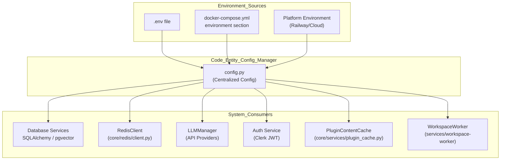
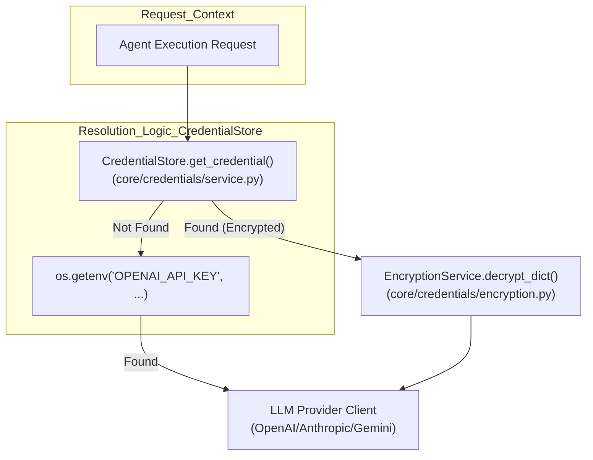

# Environment Variables

Relevant source files

The following files were used as context for generating this wiki page:

- [.gitignore](.gitignore)
- [docs/PRDS/126-BUSINESS-KNOWLEDGE-GRAPH.md](docs/PRDS/126-BUSINESS-KNOWLEDGE-GRAPH.md)
- [graphify-out/snapshots/bucket-1-pre-drop.sql](graphify-out/snapshots/bucket-1-pre-drop.sql)
- [orchestrator/.env.example](orchestrator/.env.example)
- [orchestrator/alembic/versions/prd135_drop_bucket_1.py](orchestrator/alembic/versions/prd135_drop_bucket_1.py)
- [orchestrator/core/credentials/service.py](orchestrator/core/credentials/service.py)
- [orchestrator/core/models/credentials.py](orchestrator/core/models/credentials.py)
- [orchestrator/core/services/plugin_cache.py](orchestrator/core/services/plugin_cache.py)

This document describes the environment variable configuration system used across all Automatos AI services. Environment variables control database connections, external service credentials, feature flags, and service-specific settings in both editions.

For the compose stack end to end, see [Self-hosting — the local edition](../getting-started/self-hosting.md). For deployment infrastructure, see [Production Deployment](production-deployment.md). For credential management in the UI, see [Credentials Management](../authentication-multi-tenancy/credentials-management.md).

---

## Overview

Automatos AI uses environment variables for all external configuration to support multiple deployment targets (Docker Compose locally, Railway for the hosted edition) without code changes. `orchestrator/config.py` is the only module that reads the environment; everything else reads `config`.

In the compose stack the layers are:

| Layer | What it holds | Precedence (backend container) |
| :--- | :--- | :--- |
| `.env` (from the root `.env.example`) | Secrets and the few values only you choose. **Read by compose for substitution only** — a variable reaches a container only if `docker-compose.yml` references it. | — |
| `docker-compose.yml` `environment:` block | The substituted secrets and explicit wiring (`DATABASE_URL`, `S3_ENDPOINT_URL`, the `S3_*` → `AWS_*` mapping, Composio and LLM keys). | Highest |
| `envs/api.local` (gitignored, optional) | Personal overrides for any backend variable — the deep-override lane. | Middle |
| `envs/api.defaults` (committed) | The local topology: `AUTH_EDITION=local`, `DEFAULT_WORKSPACE_ID`, `LOCAL_OPERATOR_EMAIL`, `PLATFORM_KEY_WORKSPACE_ID`, `WORKER_INTERNAL_URL`, `S3_PUBLIC_ENDPOINT_URL`, `S3_VECTORS_ENABLED=false`, observability off. No secrets. | Lowest env file |
| `orchestrator/config.py` | Code defaults for every remaining dial. | Fallback |

The frontend has the same shape (`envs/frontend.defaults`, `envs/frontend.local`). The hosted deployment sets each service's environment itself and never reads the compose file or `envs/*`. `orchestrator/.env.example` is a template for running the backend process outside compose; it is not the supported local path and its values (for example `REQUIRE_AUTH`) predate the edition flag.

**Sources:** [docker-compose.yml](), [envs/api.defaults](), [envs/frontend.defaults](), [orchestrator/config.py](), [.gitignore]()

---

## Environment Variable Loading Flow

The following diagram illustrates how configuration flows from environment sources into the core system entities.

**Diagram: Configuration Injection Pipeline**

**Sources:** [orchestrator/core/services/plugin_cache.py:42-47](), [orchestrator/.env.example:1-65]()

---

## Required Environment Variables

These are the only variables the compose stack **refuses to start without** — declared as `${VAR:?message}` in `docker-compose.yml`, so an unset or empty value stops `docker compose up` with the message shown.

### Core Infrastructure

| Variable | Purpose | Error when missing | Used By |
| :--- | :--- | :--- | :--- |
| `POSTGRES_PASSWORD` | PostgreSQL password (applied when the data volume is first initialised) | `POSTGRES_PASSWORD is required - set in .env file` | `postgres`, `backend`, `workspace-worker` |
| `REDIS_PASSWORD` | Redis authentication | `REDIS_PASSWORD is required - set in .env file` | `redis`, `backend`, `workspace-worker` |
| `API_KEY` | The backend's own API-key principal | `API_KEY is required - set in .env file` | `backend` |

In the hosted edition (`AUTH_EDITION=saas`) the boot guard additionally requires `CLERK_JWKS_URL` and `CLERK_SECRET_KEY` and fails fast without them (`config.validate_auth_edition`); in the local edition it requires `DEFAULT_WORKSPACE_ID`, which `envs/api.defaults` provides.

**Sources:** [docker-compose.yml](), [orchestrator/config.py]()

---

## Edition and Local-Edition Variables

| Variable | Default (compose) | Purpose |
| :--- | :--- | :--- |
| `AUTH_EDITION` | `local` (`envs/api.defaults`; code default `saas`) | The one edition flag. `local` forces `REQUIRE_AUTH=false` (no login, one operator); `saas` requires Clerk. |
| `NEXT_PUBLIC_AUTH_EDITION` | `local` (`envs/frontend.defaults`) | Frontend mirror, read by `frontend/lib/auth-edition.ts`; hides the hosted-only surfaces locally. |
| `DEFAULT_WORKSPACE_ID` | `00000000-0000-0000-0000-0000000000c1` | The single local workspace every anonymous request resolves to. |
| `LOCAL_OPERATOR_EMAIL` | `local@automatos.local` | The operator's `users` row (the session's lookup key; name editable under Settings → Profile). |
| `PLATFORM_KEY_WORKSPACE_ID` | the local workspace id | Whose stored API key acts as the platform key for embeddings and system LLM calls. |
| `AUTOMATOS_WORKSPACE_DIR` | `./workspaces` | Host directory bind-mounted at `/workspaces` — the workspace-worker's host-access dial. |
| `WORKER_INTERNAL_URL` / `WORKER_INTERNAL_TOKEN` | `http://workspace-worker:8081` / empty | Where the backend reaches the worker; optional shared secret. |
| `COMPOSIO_API_KEY` | unset | Bring-your-own Composio key (env-only). Absent ⇒ Composio tools are not offered and the Tools page says integrations are disabled; native tools keep working. |
| `S3_ENDPOINT_URL` | `http://minio:9000` | Points the single S3 client factory at MinIO. |
| `S3_ACCESS_KEY_ID` / `S3_SECRET_ACCESS_KEY` / `S3_REGION` | MinIO root credentials / `us-east-1` | The object store's credentials as the backend sees them (compose maps them onto the backend's `AWS_*`); your own `AWS_*` variables are deliberately not read by the local store. |
| `S3_PUBLIC_ENDPOINT_URL` | `http://localhost:9000` | Host the browser can reach for presigned links; change with `MINIO_PORT`. |
| `S3_VECTORS_ENABLED` | `false` | Local RAG runs on pgvector; S3 Vectors is hosted-only. |
| `CREDENTIAL_KEY_FILE` | `/app/data/.credential_key` | Where the auto-generated credential-encryption key persists (the `backend_data` volume). |

**Sources:** [docker-compose.yml](), [envs/api.defaults](), [envs/frontend.defaults](), [orchestrator/config.py]()

---

## Database and Cache Configuration

### PostgreSQL with pgvector
The system uses `pgvector` for semantic search and `orchestrator_db` for relational data.

| Variable | Default (compose) | Purpose |
| :--- | :--- | :--- |
| `POSTGRES_HOST` | `postgres` | PostgreSQL server hostname (the compose service) |
| `POSTGRES_PORT` | `5432` | PostgreSQL port |
| `POSTGRES_DB` | `orchestrator_db` | Database name |
| `POSTGRES_USER` | `postgres` | Database user |
| `DATABASE_URL` | assembled by compose | The SQLAlchemy connection string |

**Sources:** [docker-compose.yml](), [envs/api.defaults]()

### Redis Configuration
Redis serves as the L1 memory tier, Pub/Sub broker, and task queue.

| Variable | Default (compose) | Purpose |
| :--- | :--- | :--- |
| `REDIS_HOST` | `redis` | Redis server hostname (the compose service) |
| `REDIS_PORT` | `6379` | Redis port |

**Sources:** [docker-compose.yml](), [envs/api.defaults]()

---

## LLM Provider Configuration

Automatos AI supports a multi-provider strategy. While variables can be set in the environment, the system also supports a dynamic **Credential Store** for per-workspace keys managed by `CredentialStore`.

**Diagram: LLM API Key Resolution**

| Variable | Purpose |
| :--- | :--- |
| `OPENAI_API_KEY` | Key for OpenAI models (passed through by compose) |
| `ANTHROPIC_API_KEY` | Key for Anthropic models — also the credential the workspace-worker's Canvas sessions read |
| `OPENROUTER_API_KEY` | Key for OpenRouter (many providers behind one key) |
| `CLAUDE_CODE_OAUTH_TOKEN` | Alternative Canvas-session credential (Claude subscription token), worker only |

Any one of the first three is enough for chat, agents and embeddings; keys can also be added in the UI under Settings → API Keys, where they are stored encrypted.

**Encryption:** Credentials stored in the database are encrypted using `encryption_service.encrypt_dict()` before being persisted in the `credentials` table [orchestrator/core/credentials/service.py:146-150](). The `Credential` model stores this as `encrypted_data` [orchestrator/core/models/credentials.py:74](). The encryption key is generated on first boot and persisted at `CREDENTIAL_KEY_FILE` (the `backend_data` volume) unless `CREDENTIAL_ENCRYPTION_KEY` is set — note that compose does not pass `CREDENTIAL_ENCRYPTION_KEY` from `.env`; set it in `envs/api.local` if you want to pin it.

**Sources:** [docker-compose.yml](), [envs/api.defaults](), [orchestrator/core/credentials/service.py:146-150](), [orchestrator/core/models/credentials.py:60-75]()

---

## Service-Specific Configuration

### Plugin and Marketplace
Controls the marketplace caching and storage.

| Variable | Purpose | Default |
| :--- | :--- | :--- |
| `PLUGIN_CACHE_TTL_SECONDS` | TTL for Redis plugin cache | `3600` |
| `MARKETPLACE_S3_BUCKET` | S3 bucket for plugin storage | `automatos-marketplace` |
| `PLUGIN_MAX_UPLOAD_SIZE_MB` | Max size for plugin uploads | `10` |
| `PLUGIN_LLM_SCAN_MODEL` | Model used for security scanning | `claude-haiku-4-20250414` |

**Sources:** [orchestrator/core/services/plugin_cache.py:43-47](), [orchestrator/.env.example:48-54]()

### Universal Router and Webhooks
| Variable | Purpose | Default |
| :--- | :--- | :--- |
| `COMPOSIO_WEBHOOK_SECRET` | Secret to validate incoming tool webhooks | (none) |
| `ROUTING_CACHE_TTL_HOURS` | TTL for routing decisions in Redis | `24` |
| `ROUTING_LLM_CONFIDENCE_THRESHOLD` | Threshold for Tier 3 routing | `0.5` |

**Sources:** [orchestrator/.env.example:38-40]()

### Object storage (S3 API) — hosted edition
Every S3 client in the backend is built by one factory (`orchestrator/core/storage/s3.py`). With `S3_ENDPOINT_URL` unset it targets AWS S3 with the credentials below; with it set (the compose default, `http://minio:9000`) it targets MinIO with path-style addressing. The hosted deployment sets these itself.

| Variable | Purpose |
| :--- | :--- |
| `AWS_ACCESS_KEY_ID` | AWS authentication ID (locally set by compose from `S3_ACCESS_KEY_ID`) |
| `AWS_SECRET_ACCESS_KEY` | AWS authentication secret (locally from `S3_SECRET_ACCESS_KEY`) |
| `AWS_REGION` | Target AWS region (locally from `S3_REGION`) |
| `S3_DOCUMENTS_BUCKET`, `MARKETPLACE_S3_BUCKET`, `RECIPE_LOG_S3_BUCKET` | Bucket names; against MinIO they self-create on first use, on AWS they must exist |
| `S3_VECTORS_ENABLED` | S3 Vectors for RAG — hosted only; never enable against MinIO |

**Sources:** [orchestrator/config.py](), [orchestrator/core/storage/s3.py](), [docker-compose.yml]()

---

## System and Logging
| Variable | Purpose | Default (compose) |
| :--- | :--- | :--- |
| `ENVIRONMENT` | Deployment stage (`development`, `production`) | `development` |
| `LOG_LEVEL` | Verbosity of backend logs (`DEBUG`, `INFO`, `ERROR`) | `INFO` |
| `LOG_RELAY_ENABLED`, `LOG_RELAY_URL`, `LOKI_URL`, `PROMETHEUS_URL`, `AGENT_OPT_WORKER_URL` | Hosted telemetry and the prompt-optimisation worker; an empty URL disables the feature with a log line | `false` / empty |
| `REQUIRE_AUTH` | Authentication enforcement — **derived**: forced `false` when `AUTH_EDITION=local`, read from the environment (default `true`) in `saas` | derived |

**Sources:** [envs/api.defaults](), [orchestrator/config.py]()

---