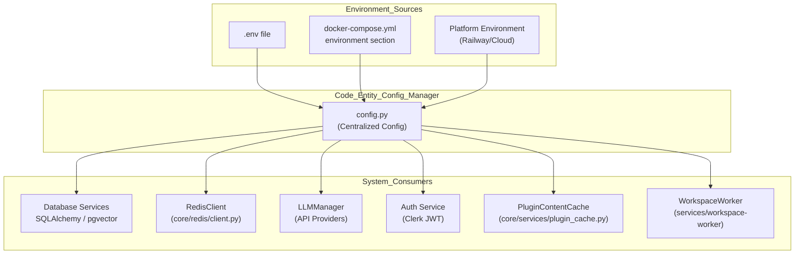
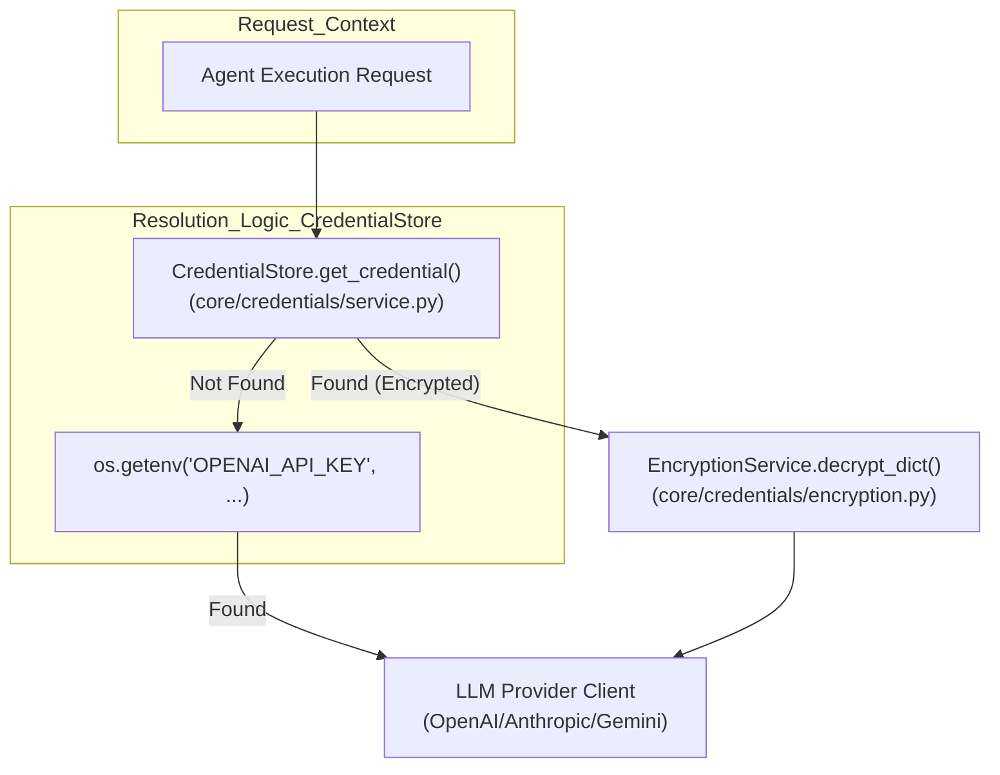

# Environment Variables

Relevant source files

The following files were used as context for generating this wiki page:

- [.gitignore](.gitignore)
- [docs/PRDS/126-BUSINESS-KNOWLEDGE-GRAPH.md](docs/PRDS/126-BUSINESS-KNOWLEDGE-GRAPH.md)
- [graphify-out/snapshots/bucket-1-pre-drop.sql](graphify-out/snapshots/bucket-1-pre-drop.sql)
- [orchestrator/.env.example](orchestrator/.env.example)
- [orchestrator/alembic/versions/prd135_drop_bucket_1.py](orchestrator/alembic/versions/prd135_drop_bucket_1.py)
- [orchestrator/core/credentials/service.py](orchestrator/core/credentials/service.py)
- [orchestrator/core/models/credentials.py](orchestrator/core/models/credentials.py)
- [orchestrator/core/services/plugin_cache.py](orchestrator/core/services/plugin_cache.py)

This document describes the environment variable configuration system used across all Automatos AI services. Environment variables control database connections, external service credentials, feature flags, and service-specific settings across the 19-service production topology.

For deployment infrastructure, see [Production Deployment](20.6). For credential management in the UI, see [Credentials Management](17.5).

---

## Overview

Automatos AI uses environment variables for all external configuration to support multiple deployment targets (Docker Compose, Railway, Kubernetes) without code changes. Variables are loaded from `.env` files in local development and from platform-provided environment in production.

The system follows a three-tier loading strategy:

1.  **Environment variables** (highest priority) — set by hosting platform or shell.
2.  **`.env` file** — loaded via `python-dotenv` in the backend application lifecycle.
3.  **Hardcoded defaults** — fallback values in centralized config.

The codebase includes an service-specific `orchestrator/.env.example` for the core API and a global `.gitignore` that protects sensitive environment files.

**Sources:** [orchestrator/.env.example:1-65](), [.gitignore:102-109]()

---

## Environment Variable Loading Flow

The following diagram illustrates how configuration flows from environment sources into the core system entities.

**Diagram: Configuration Injection Pipeline**

**Sources:** [orchestrator/core/services/plugin_cache.py:42-47](), [orchestrator/.env.example:1-65]()

---

## Required Environment Variables

These variables **must** be set for the system to function. Missing required variables will cause startup failures in production.

### Core Infrastructure

| Variable | Purpose | Example | Used By |
| :--- | :--- | :--- | :--- |
| `POSTGRES_PASSWORD` | PostgreSQL admin password | `secure_db_pass_123` | `pgvector` container, `backend` |
| `REDIS_PASSWORD` | Redis authentication | `secure_redis_pass` | `redis` container, `backend` |
| `API_KEY` | Internal API authentication | `your_secure_api_key_here` | `backend` |
| `API_HOST` | Host binding for the API | `0.0.0.0` | `backend` |
| `API_PORT` | Port binding for the API | `8000` | `backend` |

**Sources:** [orchestrator/.env.example:6,11,14-16]()

---

## Database and Cache Configuration

### PostgreSQL with pgvector
The system uses `pgvector` for semantic search and `orchestrator_db` for relational data.

| Variable | Default | Purpose |
| :--- | :--- | :--- |
| `POSTGRES_HOST` | `localhost` | PostgreSQL server hostname |
| `POSTGRES_PORT` | `5432` | PostgreSQL port |
| `POSTGRES_DB` | `orchestrator_db` | Database name |
| `POSTGRES_USER` | `postgres` | Database user |

**Sources:** [orchestrator/.env.example:1-5]()

### Redis Configuration
Redis serves as the L1 memory tier, Pub/Sub broker, and task queue.

| Variable | Default | Purpose |
| :--- | :--- | :--- |
| `REDIS_HOST` | `localhost` | Redis server hostname |
| `REDIS_PORT` | `6379` | Redis port |

**Sources:** [orchestrator/.env.example:9-11]()

---

## LLM Provider Configuration

Automatos AI supports a multi-provider strategy. While variables can be set in the environment, the system also supports a dynamic **Credential Store** for per-workspace keys managed by `CredentialStore`.

**Diagram: LLM API Key Resolution**

| Variable | Purpose |
| :--- | :--- |
| `OPENAI_API_KEY` | Key for OpenAI models |
| `ANTHROPIC_API_KEY` | Key for Anthropic models |
| `LLM_PROVIDER` | Default provider (e.g., `openai`) |
| `LLM_MODEL` | Default model (e.g., `gpt-4`) |
| `LLM_MAX_TOKENS` | Token limit per request |
| `LLM_TEMPERATURE` | Default model temperature |

**Encryption:** Credentials stored in the database are encrypted using `encryption_service.encrypt_dict()` before being persisted in the `credentials` table [orchestrator/core/credentials/service.py:146-150](). The `Credential` model stores this as `encrypted_data` [orchestrator/core/models/credentials.py:74]().

**Sources:** [orchestrator/.env.example:18-26](), [orchestrator/core/credentials/service.py:146-150](), [orchestrator/core/models/credentials.py:60-75]()

---

## Service-Specific Configuration

### Plugin and Marketplace
Controls the marketplace caching and storage.

| Variable | Purpose | Default |
| :--- | :--- | :--- |
| `PLUGIN_CACHE_TTL_SECONDS` | TTL for Redis plugin cache | `3600` |
| `MARKETPLACE_S3_BUCKET` | S3 bucket for plugin storage | `automatos-marketplace` |
| `PLUGIN_MAX_UPLOAD_SIZE_MB` | Max size for plugin uploads | `10` |
| `PLUGIN_LLM_SCAN_MODEL` | Model used for security scanning | `claude-haiku-4-20250414` |

**Sources:** [orchestrator/core/services/plugin_cache.py:43-47](), [orchestrator/.env.example:48-54]()

### Universal Router and Webhooks
| Variable | Purpose | Default |
| :--- | :--- | :--- |
| `COMPOSIO_WEBHOOK_SECRET` | Secret to validate incoming tool webhooks | (none) |
| `ROUTING_CACHE_TTL_HOURS` | TTL for routing decisions in Redis | `24` |
| `ROUTING_LLM_CONFIDENCE_THRESHOLD` | Threshold for Tier 3 routing | `0.5` |

**Sources:** [orchestrator/.env.example:38-40]()

### AWS and Cloud Integration
Used for S3-backed storage and PRD-42 Cloud Document Sync.

| Variable | Purpose |
| :--- | :--- |
| `AWS_ACCESS_KEY_ID` | AWS authentication ID |
| `AWS_SECRET_ACCESS_KEY` | AWS authentication secret |
| `AWS_REGION` | Target AWS region |
| `S3_VECTORS_ENABLED` | Toggle for cloud vector sync |

**Sources:** [orchestrator/.env.example:49-51,61-64]()

---

## System and Logging
| Variable | Purpose | Default |
| :--- | :--- | :--- |
| `ENVIRONMENT` | Deployment stage (`development`, `production`) | `production` |
| `LOG_LEVEL` | Verbosity of backend logs (`DEBUG`, `INFO`, `ERROR`) | `INFO` |
| `LOG_FILE` | Path to log output | `logs/orchestrator.log` |
| `DEBUG` | Toggle for FastAPI debug mode | `false` |
| `REQUIRE_AUTH` | Toggle for authentication enforcement | `false` (local dev) |

**Sources:** [orchestrator/.env.example:29-30,33,57-58]()

---