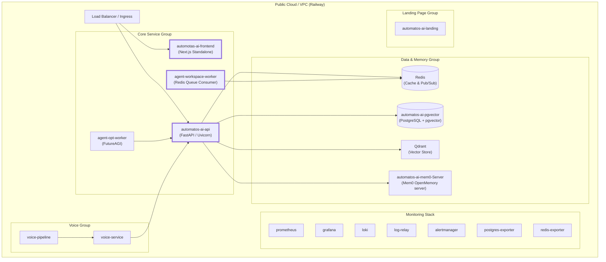
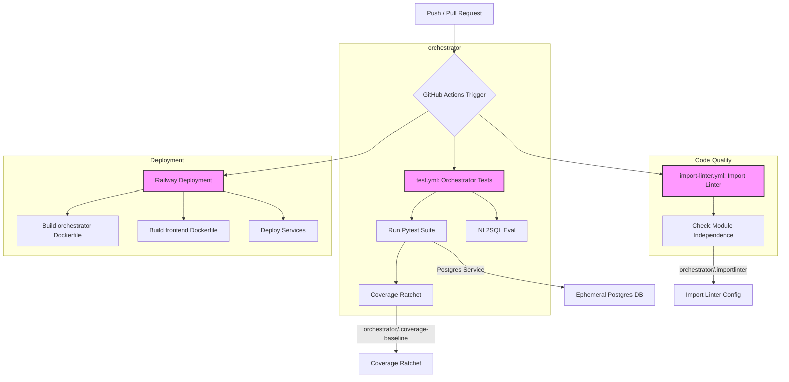

# Production Deployment & CI/CD

Relevant source files

The following files were used as context for generating this wiki page:

- [.github/workflows/import-linter.yml](.github/workflows/import-linter.yml)
- [.github/workflows/test.yml](.github/workflows/test.yml)
- [docker-compose.yml](docker-compose.yml)
- [frontend/.dockerignore](frontend/.dockerignore)
- [frontend/Dockerfile](frontend/Dockerfile)
- [infrastructure/.env.example](infrastructure/.env.example)
- [infrastructure/railway-manifest.json](infrastructure/railway-manifest.json)
- [orchestrator/.importlinter](orchestrator/.importlinter)
- [orchestrator/Dockerfile](orchestrator/Dockerfile)
- [orchestrator/core/redis/client.py](orchestrator/core/redis/client.py)
- [orchestrator/requirements.txt](orchestrator/requirements.txt)
- [orchestrator/tests/test_dockerfile_prod_parity.py](orchestrator/tests/test_dockerfile_prod_parity.py)
- [orchestrator/tests/test_import_contract_present.py](orchestrator/tests/test_import_contract_present.py)
- [orchestrator/tests/test_no_mem0_residue.py](orchestrator/tests/test_no_mem0_residue.py)
- [scripts/ralph/PROMPT_build_prd211.md](scripts/ralph/PROMPT_build_prd211.md)
- [scripts/ralph/PROMPT_review_prd211.md](scripts/ralph/PROMPT_review_prd211.md)
- [scripts/ralph/acceptance-prd211.sh](scripts/ralph/acceptance-prd211.sh)
- [scripts/ralph/prd-211.json](scripts/ralph/prd-211.json)

This page covers production deployment strategies for Automatos AI, focusing on containerization, scaling, worker profiles, monitoring, and state management. The platform uses a modular architecture mirroring a 19-service production topology.

---

## Deployment Architecture

Automatos AI is designed as a distributed system of specialized containers. In production, these services are orchestrated across functional groups (Core, Memory, Monitoring, Data, and Workspace) to handle high-concurrency agent executions and real-time streaming.

### Production Service Map

Title: Railway Production Topology
Sources: [infrastructure/railway-manifest.json:1-66]()

**Key Production Components:**
- **Backend API**: A FastAPI application serving as the central orchestrator. In production, it runs via `uvicorn` with multiple workers to handle concurrent I/O [orchestrator/Dockerfile:140]().
- **Frontend**: A Next.js application deployed in `standalone` mode, which includes only the necessary files for production, significantly reducing image size [frontend/Dockerfile:92-121]().
- **Workspace Worker**: A dedicated service for sandboxed task execution, interacting with the backend via Redis [infrastructure/railway-manifest.json:229-235]().
- **MinIO**: While `docker-compose.yml` includes MinIO for local development [docker-compose.yml:82-111](), the `railway-manifest.json` does not list it as a separate service, implying S3-compatible object storage is handled by a cloud provider in production.

Sources: [orchestrator/Dockerfile:95-140](), [frontend/Dockerfile:92-121](), [docker-compose.yml:18-187](), [infrastructure/railway-manifest.json:1-66]()

---

## Containerization Strategy

The codebase utilizes multi-stage Docker builds to ensure development agility and production efficiency.

### Backend Dockerfile (`orchestrator/Dockerfile`)
The backend build is split into multiple stages:
1.  **pybuild**: Installs build-time dependencies like `gcc`, `g++`, `libffi-dev` and Python packages from `requirements.txt`. This stage is responsible for building wheels and installing `graphifyy[leiden]` if `INSTALL_GRAPH_EXTRAS` is `true` (default for production) [orchestrator/Dockerfile:19-58]().
2.  **base**: Installs runtime-only system dependencies such as `git`, `postgresql-client`, `libmagic1`, `tesseract-ocr`, `ghostscript`, `libpango-1.0-0`, `libcairo2`, `libgdk-pixbuf-2.0-0` [orchestrator/Dockerfile:63-81](). It copies the installed Python packages from the `pybuild` stage [orchestrator/Dockerfile:83]().
3.  **development**: Includes hot-reload via `--reload` and mounts source code for active development [orchestrator/Dockerfile:91-131]().
4.  **production**: An optimized stage that copies only necessary application code, creates directories, and sets up the entrypoint for production execution [orchestrator/Dockerfile:136-150]().

### Frontend Dockerfile (`frontend/Dockerfile`)
The frontend build uses a four-stage process:
1.  **base**: Sets up Node.js 20 environment and installs build dependencies like `python3`, `make`, `g++`, `curl` [frontend/Dockerfile:14-23]().
2.  **development**: Installs all dependencies and runs `npm run dev` [frontend/Dockerfile:31-48]().
3.  **builder**: Injects `NEXT_PUBLIC_*` build arguments (like `NEXT_PUBLIC_API_URL`, `NEXT_PUBLIC_AUTH_EDITION`) and executes `npm run build` [frontend/Dockerfile:53-98](). The default `NEXT_PUBLIC_AUTH_EDITION` for production is `saas` [frontend/Dockerfile:60]().
4.  **production**: Uses the `standalone` output from the builder stage, running directly with `node server.js` to bypass `npm` overhead [frontend/Dockerfile:103-132]().

Sources: [orchestrator/Dockerfile:1-184](), [frontend/Dockerfile:1-132]()

---

## Scaling & Worker Profiles

Production performance is scaled by adjusting the concurrency and resources of specific worker types.

### Worker Profiles

| Worker Type | Primary Responsibility | Concurrency Strategy | Configuration Entity |
| :--- | :--- | :--- | :--- |
| **API Worker** | FastAPI request handling | `uvicorn --workers 4` | `orchestrator/Dockerfile:140` |
| **Workspace Worker** | Tool execution & file ops | Redis Priority Queues | `services/workspace-worker` |
| **Database** | Persistence & Vector Search | `max_connections=200` | `docker-compose.yml:38` |
| **Cache/Queue** | Pub/Sub & Task storage | `maxmemory 256mb` | `docker-compose.yml:64` |

### Database & Schema Management
In production, the backend container applies database migrations automatically using `alembic upgrade heads` before the application starts [orchestrator/Dockerfile:132](). This ensures the live schema always matches the deployed code version, preventing `UndefinedColumn` errors during request time [orchestrator/Dockerfile:132-139]().

Sources: [orchestrator/Dockerfile:132-140](), [docker-compose.yml:38, 64]()

---

## Redis & State Management

Redis serves as the central nervous system for real-time updates and task orchestration.

### Pub/Sub Implementation
The `RedisClient` manages connections for real-time workflow updates.
- **Async Pub/Sub**: Used by WebSocket/SSE endpoints for non-blocking message delivery [orchestrator/core/redis/client.py:48-64]().
- **Workflow Events**: Specialized methods like `publish_workflow_event` route execution updates to specific channels formatted as `workflow:{id}:execution:{id}` [orchestrator/core/redis/client.py:91-119]().

### Security Hardening
In production environments, dangerous Redis commands are renamed or disabled to prevent accidental data loss if the instance is exposed:
- `FLUSHDB`, `FLUSHALL`, and `DEBUG` are renamed to empty strings [docker-compose.yml:66-68]().
- Password authentication is strictly required via the `REDIS_PASSWORD` environment variable [docker-compose.yml:63]().

Sources: [orchestrator/core/redis/client.py:14-119](), [docker-compose.yml:55-73]()

---

## Infrastructure Monitoring

The production stack utilizes a standard Prometheus/Grafana/Loki (PLG) stack for observability.

### Log & Metric Collection
1.  **Health Checks**: Both Backend and Frontend include Docker health checks that query `/health` or perform `curl` requests every 30 seconds [orchestrator/Dockerfile:115-116](), [frontend/Dockerfile:125-126]().
2.  **Object Storage**: MinIO provides a local S3-compatible store for document ingestion and agent outputs, ensuring durability for the knowledge flywheel [docker-compose.yml:82-111]().
3.  **Model Auth Monitoring**: The `workspace-worker` includes fail-fast logic to ensure that model credentials (`ANTHROPIC_API_KEY` or `CLAUDE_CODE_OAUTH_TOKEN`) are correctly threaded into execution environments, preventing silent hangs [orchestrator/tests/test_prd203_cs8_worker_auth.py:97-114](), [services/workspace-worker/worker_config.py:21-39]().

Sources: [orchestrator/Dockerfile:115-116](), [frontend/Dockerfile:125-126](), [docker-compose.yml:82-111](), [services/workspace-worker/worker_config.py:21-45]()

---

## CI/CD Workflows

The project leverages GitHub Actions for continuous integration and deployment, ensuring code quality and preventing regressions.

### GitHub Actions Workflows

Title: GitHub Actions CI/CD Flow
Sources: [.github/workflows/test.yml:1-30](), [.github/workflows/import-linter.yml:1-20](), [orchestrator/.importlinter:1-51]()

#### Orchestrator Tests (`.github/workflows/test.yml`)
This workflow runs the `pytest` suite for the `orchestrator` service.
- **Trigger**: On `push` to any branch and `pull_request` to `main` [.github/workflows/test.yml:23-29]().
- **Services**: An ephemeral PostgreSQL container is spun up for database-touching tests [.github/workflows/test.yml:41-54]().
- **Environment**: Tests run in a `local` authentication edition with a fixed `DEFAULT_WORKSPACE_ID` to ensure consistent behavior [.github/workflows/test.yml:69-76]().
- **Steps**:
    - Checkout code, set up Python, install system libraries and Python dependencies [.github/workflows/test.yml:83-108]().
    - Initialize a test database schema using `scripts/init_test_db.py` [.github/workflows/test.yml:110]().
    - Run `pytest` with coverage reporting (`pytest-cov`) and a per-test timeout to prevent hangs [.github/workflows/test.yml:123-133]().
    - **Coverage Ratchet**: A `python scripts/check_coverage_baseline.py` script enforces a minimum code coverage. The baseline is stored in `orchestrator/.coverage-baseline`. If the measured coverage drops below this baseline, the build fails [.github/workflows/test.yml:135-144]().
- **NL2SQL Evaluation**: A separate, non-required job runs NL2SQL regression evaluations against an in-memory SQLite database [.github/workflows/test.yml:150-153]().

Sources: [.github/workflows/test.yml:1-166](), [orchestrator/requirements.txt:63-64]()

#### Import Linter (`.github/workflows/import-linter.yml`)
This workflow enforces architectural boundaries within the Python codebase.
- **Purpose**: Prevents unintended lateral coupling between feature modules, ensuring the modular monolith architecture is maintained [orchestrator/.importlinter:9-18]().
- **Configuration**: The `orchestrator/.importlinter` file defines an `independence` contract, specifying that feature modules under `orchestrator/modules/*` should not import each other directly, except through `modules.tools` or the `api` package [orchestrator/.importlinter:28-30]().
- **Ratchet Mechanism**: Existing lateral imports are explicitly listed in `ignore_imports` to allow the contract to be green initially. Any *new* lateral import will cause the CI check to fail, acting as a ratchet [orchestrator/.importlinter:19-22]().
- **Implementation**: Uses the `import-linter` tool, pinned in `orchestrator/requirements.txt` [orchestrator/requirements.txt:66-70]().
- **Tests**: `orchestrator/tests/test_import_contract_present.py` verifies the presence and validity of the `.importlinter` configuration [orchestrator/tests/test_import_contract_present.py:1-84](). `orchestrator/tests/test_no_mem0_residue.py` ensures that old `mem0` service references are completely removed and not reintroduced, locking the "un-split" to an in-process Qdrant solution [orchestrator/tests/test_no_mem0_residue.py:1-78]().

Sources: [.github/workflows/import-linter.yml:1-20](), [orchestrator/.importlinter:1-85](), [orchestrator/requirements.txt:66-70](), [orchestrator/tests/test_import_contract_present.py:1-84](), [orchestrator/tests/test_no_mem0_residue.py:1-78]()

### Railway Manifest Topology (`infrastructure/railway-manifest.json`)
The `railway-manifest.json` defines the production deployment topology on Railway.
- **Service Groups**: Services are organized into logical groups like `core`, `voice`, `memory`, `monitoring`, `data`, and `landing` [infrastructure/railway-manifest.json:13-66]().
- **Service Definitions**: Each service specifies its repository, `root_dir`, `builder` (e.g., `DOCKERFILE`), `port`, `restart_policy`, and a list of environment variables (`env_keys`) it expects [infrastructure/railway-manifest.json:68-180]().
- **Domain Mapping**: Custom domains are mapped to specific services, such as `api.automatos.app` to `automatos-ai-api` and `ui.automatos.app` to `automotas-ai-frontend` [infrastructure/railway-manifest.json:8-10]().
- **Dockerfile Usage**: Railway builds services using their respective Dockerfiles, targeting the `production` stage [infrastructure/railway-manifest.json:75, 188](). This is verified by `orchestrator/tests/test_dockerfile_prod_parity.py` to ensure that Dockerfile `ARG` defaults align with production values [orchestrator/tests/test_dockerfile_prod_parity.py:81-102]().

Sources: [infrastructure/railway-manifest.json:1-879](), [orchestrator/tests/test_dockerfile_prod_parity.py:81-102]()

---

## Scaling and Disaster Recovery Scripts

The `scripts/` directory contains various utilities, including those for scaling and disaster recovery. While specific DR scripts are not fully detailed in the provided files, the presence of `scripts/dr` implies a focus on operational resilience.

- **Ralph Automation**: The `scripts/ralph` directory contains automation for PRD (Product Requirement Document) workflows, including prompts for reviewing and building PRDs, and acceptance scripts [scripts/ralph/PROMPT_review_prd211.md:1-38](), [scripts/ralph/prd-211.json:1-46](). These scripts help ensure that changes adhere to defined requirements and architectural contracts.

Sources: [scripts/ralph/PROMPT_review_prd211.md:1-38](), [scripts/ralph/prd-211.json:1-46]()

---