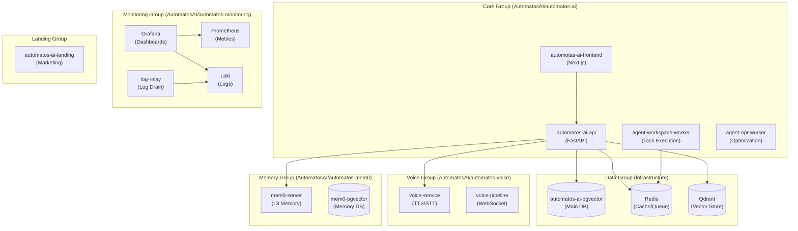
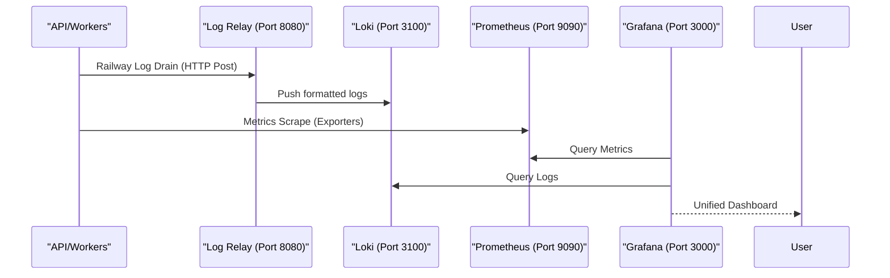

# Production Deployment

Relevant source files

The following files were used as context for generating this wiki page:

- [docs/PRDS/33-MCP-GATEWAY-INTEGRATION.md](docs/PRDS/33-MCP-GATEWAY-INTEGRATION.md)
- [docs/PRDS/34-UNIFIED-INTEGRATIONS-ADAPTER.md](docs/PRDS/34-UNIFIED-INTEGRATIONS-ADAPTER.md)
- [docs/PRDS/35-TOOL-CATALOG-REGISTRY-ARCHITECTURE.md](docs/PRDS/35-TOOL-CATALOG-REGISTRY-ARCHITECTURE.md)
- [frontend/pages/_document.tsx](frontend/pages/_document.tsx)
- [infrastructure/.env.example](infrastructure/.env.example)
- [infrastructure/docker-compose.core.yml](infrastructure/docker-compose.core.yml)
- [infrastructure/docker-compose.data.yml](infrastructure/docker-compose.data.yml)
- [infrastructure/docker-compose.landing.yml](infrastructure/docker-compose.landing.yml)
- [infrastructure/docker-compose.memory.yml](infrastructure/docker-compose.memory.yml)
- [infrastructure/docker-compose.monitoring.yml](infrastructure/docker-compose.monitoring.yml)
- [infrastructure/docker-compose.voice.yml](infrastructure/docker-compose.voice.yml)
- [infrastructure/docker-compose.yml](infrastructure/docker-compose.yml)
- [infrastructure/railway-manifest.json](infrastructure/railway-manifest.json)
- [orchestrator/.dockerignore](orchestrator/.dockerignore)
- [orchestrator/.python-version](orchestrator/.python-version)
- [orchestrator/.railway-watch.json](orchestrator/.railway-watch.json)
- [orchestrator/core/credentials/encryption.py](orchestrator/core/credentials/encryption.py)
- [orchestrator/start.sh](orchestrator/start.sh)
- [railway.json](railway.json)

This page covers production deployment strategies for Automatos AI, focusing on the Railway-optimized topology, scaling strategies, worker profiles, and the integrated monitoring stack.

---

## Railway Production Topology

Automatos AI is deployed as a distributed system consisting of 19 services organized into 6 functional groups. This modular architecture ensures high availability and independent scaling of critical components.

### Service Group Architecture

**Service Definitions:**
- **Core**: The primary application logic, frontend, and specialized workers [infrastructure/railway-manifest.json:15-19]().
- **Data**: High-performance persistence layer including PostgreSQL with `pgvector` [infrastructure/docker-compose.data.yml:19-45]().
- **Monitoring**: Full observability stack for real-time system health [infrastructure/docker-compose.monitoring.yml:1-14]().
- **Voice**: Dedicated services for Whisper STT and Chatterbox TTS [infrastructure/docker-compose.voice.yml:1-10]().
- **Memory**: Isolated long-term memory server using the Mem0 protocol [infrastructure/docker-compose.memory.yml:1-10]().

Sources: [infrastructure/railway-manifest.json:14-44](), [infrastructure/docker-compose.yml:31-38]()

---

## Scaling Strategies & Worker Profiles

Production performance is scaled by adjusting the concurrency and resource allocation of specific worker types.

### Worker Profiles

| Service | Scaling Strategy | Resource Profile | Code Reference |
| :--- | :--- | :--- | :--- |
| `automatos-ai-api` | Horizontal (Replicas) | High CPU/RAM | [infrastructure/railway-manifest.json:47-57]() |
| `agent-workspace-worker` | Vertical (Concurrency) | High RAM (Sandboxing) | [infrastructure/railway-manifest.json:123-134]() |
| `voice-service` | GPU Acceleration | High GPU/RAM | [infrastructure/docker-compose.voice.yml:35-38]() |
| `agent-opt-worker` | Horizontal (Job-based) | Moderate CPU | [infrastructure/railway-manifest.json:146-156]() |

### Deployment Configuration
The system uses `railway.json` to define build parameters, targeting the `production` stage in the Dockerfile [railway.json:1-7](). Deployment stability is maintained via an `ON_FAILURE` restart policy with 10 retries [railway.json:8-11]().

Sources: [railway.json:1-12](), [infrastructure/railway-manifest.json:46-167]()

---

## Monitoring Stack (Prometheus/Grafana/Loki)

Automatos AI features a native observability stack to monitor LLM costs, agent performance, and system health.

### Data Flow for Observability

**Monitoring Components:**
- **Prometheus**: Scrapes metrics from `postgres-exporter` (Port 9187) and `redis-exporter` (Port 9121) [infrastructure/docker-compose.monitoring.yml:153-182]().
- **Loki**: Aggregates logs via the `log-relay` service, which acts as a bridge for Railway's log drain webhooks [infrastructure/docker-compose.monitoring.yml:106-124]().
- **Grafana**: Pre-configured with Loki and Prometheus datasources for visualization [infrastructure/docker-compose.monitoring.yml:48-74]().

Sources: [infrastructure/docker-compose.monitoring.yml:1-193](), [infrastructure/.env.example:170-184]()

---

## Security & Credential Management

Production environments secure sensitive data using a multi-tier encryption and isolation strategy.

### Encryption Implementation
The `EncryptionService` handles sensitive LLM keys using Fernet (AES-128-CBC) [orchestrator/core/credentials/encryption.py:34-35]().

1. **Primary Key**: Loaded from `CREDENTIAL_ENCRYPTION_KEY` environment variable [orchestrator/core/credentials/encryption.py:61-76]().
2. **Fallback**: Persistent file `.credential_key` [orchestrator/core/credentials/encryption.py:79-90]().
3. **Internal Auth**: `WORKER_INTERNAL_TOKEN` secures communication between the API and Workspace Workers [infrastructure/.env.example:58]().

### Network Isolation
All services communicate over a private external network named `automatos_network` [infrastructure/docker-compose.data.yml:109-111](). Databases like `pgvector` and `Redis` are configured with strong passwords and restricted access [infrastructure/docker-compose.data.yml:31-34, 58-60]().

Sources: [orchestrator/core/credentials/encryption.py:24-184](), [infrastructure/docker-compose.data.yml:1-112](), [infrastructure/.env.example:52-59]()

---

## Backup & Persistence Strategies

### Data Volume Management
The production topology utilizes 9 distinct persistent volumes to ensure data durability across container restarts:

| Volume Name | Service | Mount Path | Purpose |
| :--- | :--- | :--- | :--- |
| `pgvector_data` | `pgvector` | `/var/lib/postgresql/data/` | Main application database [infrastructure/docker-compose.data.yml:37]() |
| `redis_data` | `redis` | `/data` | Task queue and cache persistence [infrastructure/docker-compose.data.yml:68]() |
| `qdrant_data` | `qdrant` | `/qdrant/storage` | Vector embeddings [infrastructure/docker-compose.data.yml:90]() |
| `agent-workspace-data` | `workspace-worker` | `/workspaces` | Agent filesystem (50GB) [infrastructure/railway-manifest.json:135-137]() |
| `prometheus_data` | `prometheus` | `/prometheus` | Historical metrics [infrastructure/docker-compose.monitoring.yml:33]() |

### Recovery Procedures
- **Database**: Standard PostgreSQL WAL-based backups should be configured on the `pgvector` service.
- **State**: Redis is configured with `save 60 1` (save every 60 seconds if 1 key changed) to minimize data loss in the task queue [infrastructure/docker-compose.data.yml:59]().

Sources: [infrastructure/docker-compose.data.yml:100-107](), [infrastructure/docker-compose.monitoring.yml:184-193](), [infrastructure/railway-manifest.json:135-137]()

---