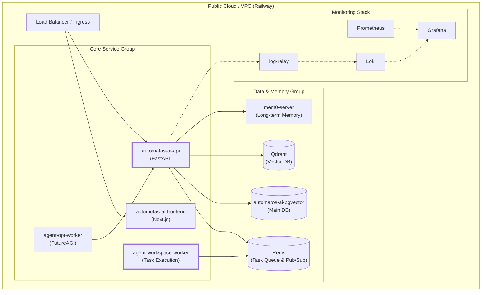
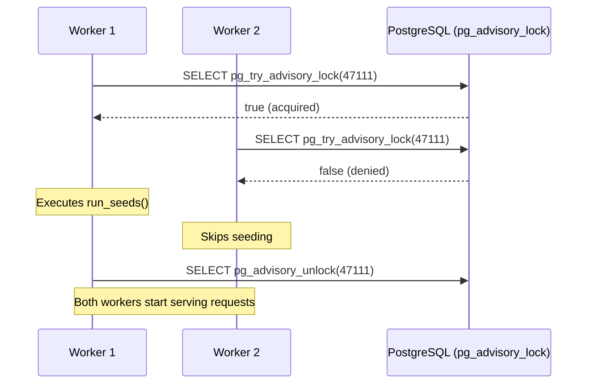
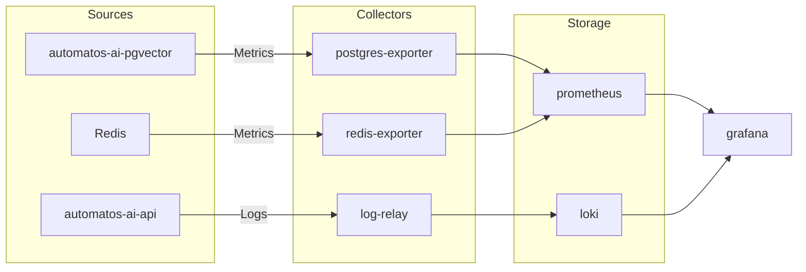

# Production Deployment

Relevant source files

The following files were used as context for generating this wiki page:

- [orchestrator/core/database/boot_lock.py](orchestrator/core/database/boot_lock.py)
- [railway.json](railway.json)

This page covers production deployment strategies for Automatos AI, focusing on scaling, worker profiles, monitoring, and state management. The platform uses a modular architecture mirroring a 19-service Railway production topology.

---

## Deployment Architecture

Automatos AI is designed as a distributed system of specialized containers. In production, these services are orchestrated across functional groups (Core, Voice, Memory, Monitoring, Data, and Landing) to handle high-concurrency agent executions and real-time streaming.

### Production Service Map

**Key Production Components:**
- **automatos-ai-api**: Handles API requests, routing via `UniversalRouter`, and agent lifecycle management.
- **agent-workspace-worker**: Executes sandboxed file operations and shell commands using persistent volumes at `/workspaces`.
- **Monitoring Stack**: A dedicated group for observability including `log-relay` for Railway log drain webhooks and `Grafana` for visualization.

### Railway Build Configuration
The platform uses a `railway.json` configuration for production builds, targeting the `production` stage in the multi-stage `Dockerfile` [railway.json:3-6](). It implements a robust restart policy that allows up to 10 retries on failure [railway.json:9-10]().

Sources: [railway.json:1-12]()

---

## Scaling Strategies & Worker Profiles

Production performance is scaled by adjusting the concurrency of specific worker types based on workload.

### Worker Profiles

| Worker Type | Primary Responsibility | Scaling Metric | Code Entity / Service |
| :--- | :--- | :--- | :--- |
| **API Worker** | FastAPI request handling | Request Latency | `automatos-ai-api` |
| **Workspace Worker** | Sandboxed tool execution | Queue Depth | `agent-workspace-worker` |
| **Optimization Worker** | LLM prompt refinement | Job Backlog | `agent-opt-worker` |

### Bootstrap Concurrency Control
When scaling the API service to multiple workers (e.g., using `uvicorn` with multiple processes), the system uses a PostgreSQL advisory lock to prevent race conditions during database seeding.

The `boot_leader_lock` context manager uses the unique ID `47111` (0xB007) to ensure only one "leader" worker performs initialization tasks [orchestrator/core/database/boot_lock.py:21-45](). This lock is session-scoped and automatically releases if the connection is lost [orchestrator/core/database/boot_lock.py:8-9]().

Sources: [orchestrator/core/database/boot_lock.py:1-55]()

---

## Monitoring & Observability Stack

The platform implements a comprehensive monitoring stack to track LLM costs, system health, and logs.

### Metrics and Logs Data Flow

- **log-relay**: Receives Railway log drain webhooks and bridges them to Loki.
- **Exporters**: Dedicated containers for `postgres-exporter` and `redis-exporter` translate service-specific metrics for Prometheus consumption.
- **Grafana**: Configured with admin security and custom data source UIDs for Loki and Prometheus.

---

## Data Infrastructure & Memory Tiers

Production data is partitioned to ensure performance and isolation of memory workloads.

### Database Allocation
1. **Main Database**: `automatos-ai-pgvector` (PostgreSQL 18) handles core relational data and agent metadata.
2. **Memory Database**: `mem0-pgvector` is a dedicated instance for `mem0-server` to isolate heavy embedding vector workloads from the main API.
3. **Vector Cache**: `Qdrant` provides high-performance vector search for RAG and document ingestion.

### Redis Configuration
Redis is tuned for high-throughput with specific memory policies:
- **Max Memory**: 256MB.
- **Eviction Policy**: `allkeys-lru`.
- **Persistence**: Aggressive saving to ensure task queue durability.

---

## Backup & Recovery

### Data Persistence
- **Main DB**: Standard PostgreSQL volume at `/var/lib/postgresql/data/`.
- **Persistent Volumes**: Production workers map directories for workspaces (`/workspaces`) with a 50GB size allocation.
- **Monitoring Data**: Prometheus, Grafana, Loki, and Alertmanager all utilize dedicated named volumes to ensure observability history is not lost on container restart.

### Advisory Lock Safety
The use of `pg_advisory_unlock` in a `finally` block ensures that even if a seed operation fails, the lock is released for subsequent attempts or other processes [orchestrator/core/database/boot_lock.py:49-54]().

Sources: [orchestrator/core/database/boot_lock.py:47-54](), [railway.json:1-12]()

---