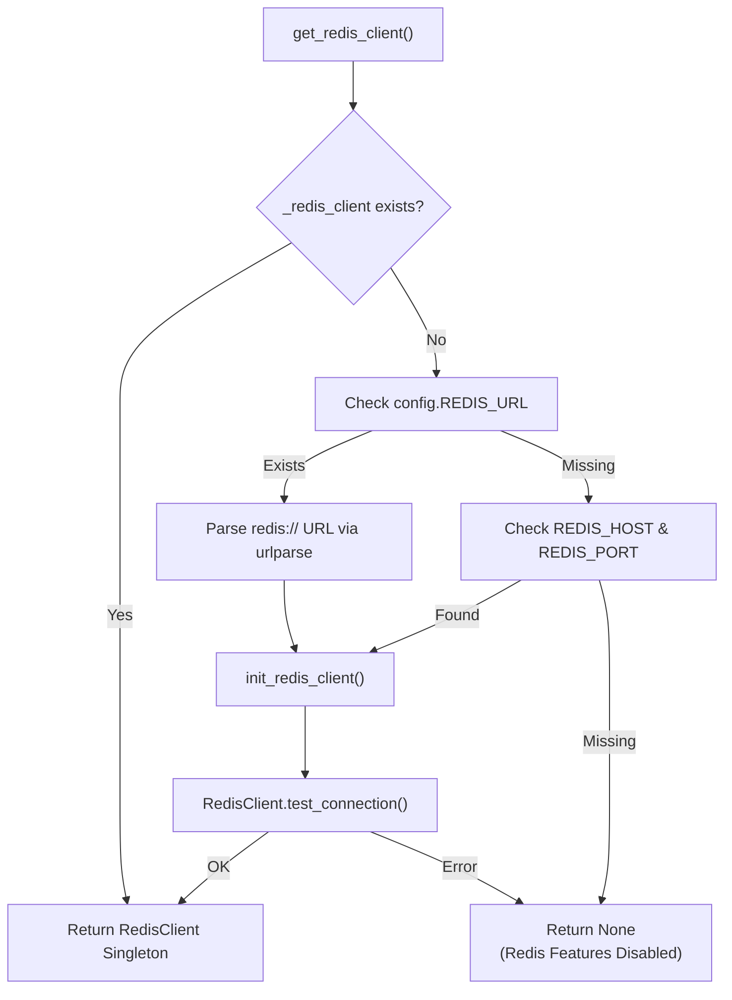
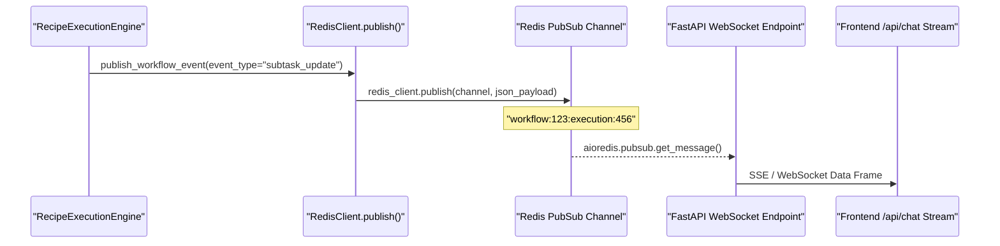

# Redis Configuration

<details>
<summary>Relevant source files</summary>

The following files were used as context for generating this wiki page:

- [docker-compose.yml](docker-compose.yml)
- [frontend/.dockerignore](frontend/.dockerignore)
- [frontend/Dockerfile](frontend/Dockerfile)
- [orchestrator/Dockerfile](orchestrator/Dockerfile)
- [orchestrator/api/cloud_documents.py](orchestrator/api/cloud_documents.py)
- [orchestrator/core/redis/client.py](orchestrator/core/redis/client.py)
- [orchestrator/requirements.txt](orchestrator/requirements.txt)

</details>


## Purpose & Scope

This page covers Redis configuration for caching, real-time pub/sub messaging, and task orchestration in Automatos AI. Redis is an **optional service**; the system is designed to enter a degraded state rather than crashing if Redis is unavailable [orchestrator/core/redis/client.py:153-154](). It serves as the high-speed backbone for transient state and real-time telemetry across the distributed architecture.

**Redis Use Cases in Automatos AI:**
*   **Real-time workflow updates**: Pub/Sub channels stream execution progress to WebSocket clients [orchestrator/core/redis/client.py:2-4]().
*   **Task Queues**: ARQ-style Redis queues for the `WorkspaceWorker` to consume agent tasks [docker-compose.yml:178-182]().
*   **Session & Cache Storage**: Centralized store for transient data across distributed backend workers [docker-compose.yml:46-47]().
*   **Heartbeat Service**: Supports `APScheduler` with a Redis job store for proactive agent checks [orchestrator/requirements.txt:37-38]().

Sources: [orchestrator/core/redis/client.py:1-198](), [docker-compose.yml:46-74](), [orchestrator/requirements.txt:37-38]()

---

## Configuration Variables

Redis configuration follows a **dual-mode strategy**: it prioritizes a unified `REDIS_URL` (standard for cloud platforms like Railway or Heroku) and falls back to discrete environment variables for local development [orchestrator/core/redis/client.py:161-196]().

### Environment Variables

| Variable | Type | Default | Description |
| :--- | :--- | :--- | :--- |
| `REDIS_URL` | string | None | Full connection string (e.g., `redis://:pass@host:6379/0`) [orchestrator/core/redis/client.py:161-162]() |
| `REDIS_HOST` | string | `redis` | Redis server hostname [docker-compose.yml:100-100]() |
| `REDIS_PORT` | int | `6379` | Redis server port [docker-compose.yml:101-101]() |
| `REDIS_PASSWORD` | string | Required | Redis authentication password [docker-compose.yml:56-56]() |

Sources: [orchestrator/core/redis/client.py:141-198](), [docker-compose.yml:88-103]()

### Configuration Resolution Logic

The `get_redis_client` function manages the singleton instance of the `RedisClient`.

**Redis Client Entity Space Mapping**



Sources: [orchestrator/core/redis/client.py:149-198]()

---

## Docker Compose Service Setup

The Redis service is containerized using the `redis:7-alpine` image with specific security hardening for agentic workloads [docker-compose.yml:48-50]().

### Service Configuration (PRD-70)

```yaml
  redis:
    image: redis:7-alpine
    container_name: automatos_redis
    command: >
      redis-server
      --requirepass ${REDIS_PASSWORD}
      --maxmemory 256mb
      --maxmemory-policy allkeys-lru
      --rename-command FLUSHDB ""
      --rename-command FLUSHALL ""
      --rename-command DEBUG ""
```

**Key Security & Performance Settings:**
*   **Command Renaming**: Dangerous commands like `FLUSHALL` and `FLUSHDB` are disabled to prevent data loss via potential prompt injection or unauthorized access [docker-compose.yml:59-61]().
*   **Memory Policy**: Uses `allkeys-lru` to automatically evict the least recently used keys when the 256MB limit is hit, ensuring the cache does not cause OOM (Out of Memory) failures [docker-compose.yml:57-58]().
*   **Health Check**: Uses `redis-cli ping` with the provided password to ensure availability before dependent services (like `backend` or `workspace-worker`) start [docker-compose.yml:66-71]().

Sources: [docker-compose.yml:48-74]()

---

## Pub/Sub Architecture

Automatos AI uses Redis Pub/Sub to provide low-latency updates for long-running agent workflows.

### Channel Naming Convention
Channels are dynamically scoped to prevent cross-workflow message leakage:
`workflow:{workflow_id}:execution:{execution_id}` [orchestrator/core/redis/client.py:110-110]().

### Implementation Details
The `RedisClient` provides both synchronous and asynchronous interfaces to handle different parts of the FastAPI lifecycle.

**Real-Time Data Flow: Code Entity Space**



*   **`get_async_pubsub`**: Used by WebSocket endpoints for non-blocking message delivery via `aioredis` [orchestrator/core/redis/client.py:48-64]().
*   **`publish_workflow_event`**: A high-level helper that wraps event data into a standardized JSON structure including `execution_id` and `workflow_id` [orchestrator/core/redis/client.py:91-119]().

Sources: [orchestrator/core/redis/client.py:48-120]()

---

## Workspace Worker & Task Queues

The `workspace-worker` service (PRD-56) utilizes Redis for distributed task management.

*   **Queueing**: Agent tasks are submitted to Redis-backed queues (priority levels: critical, high, normal, low) [docker-compose.yml:178-182]().
*   **Concurrency**: Workers use Redis semaphores to respect `parallel_limit` settings during recipe execution [docker-compose.yml:178-182]().
*   **Persistence**: The `redis_data` volume ensures that the task queue survives container restarts [docker-compose.yml:64-65]().

Sources: [docker-compose.yml:173-205]()

---

## Graceful Degradation

If the Redis connection fails (e.g., during `test_connection()`), the system logs a warning and continues operation [orchestrator/core/redis/client.py:189-190]().

1.  **WebSocket Fallback**: Real-time UI updates stop, but users can still see progress by refreshing (polling the PostgreSQL database).
2.  **Task Execution**: In single-tenant/development modes without Redis, tasks may execute synchronously or fail if the `workers` profile is explicitly required.
3.  **Logging**: The backend issues a `logger.warning` stating "Redis features disabled" [orchestrator/core/redis/client.py:189-190]().

Sources: [orchestrator/core/redis/client.py:121-135](), [orchestrator/core/redis/client.py:189-190]()

---