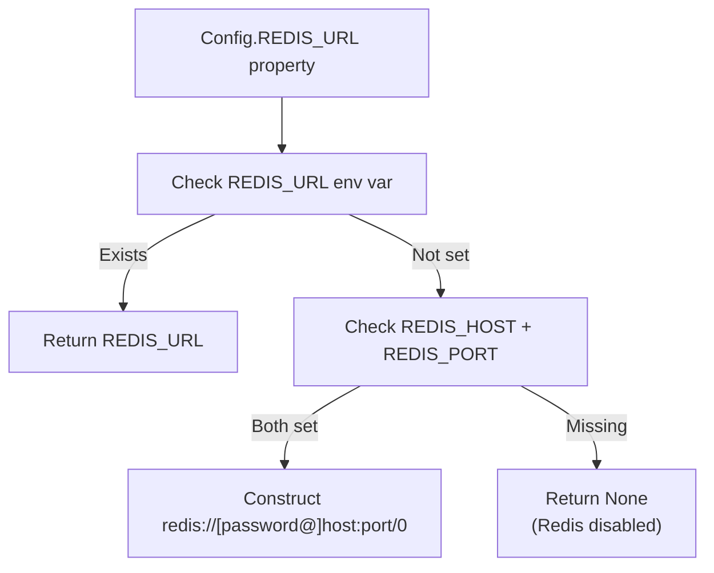
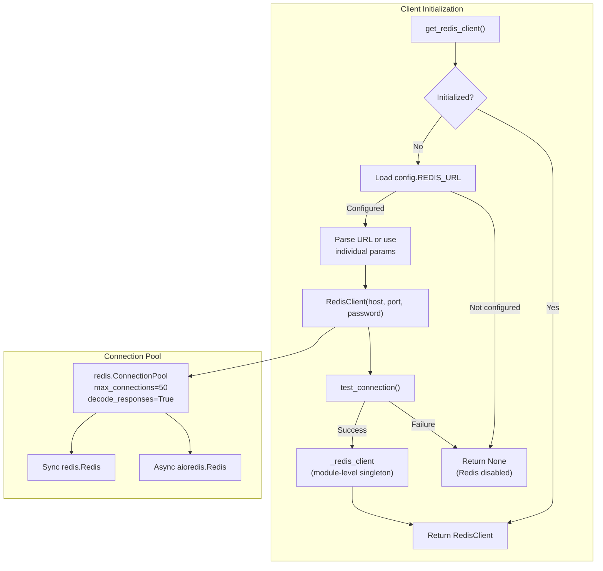
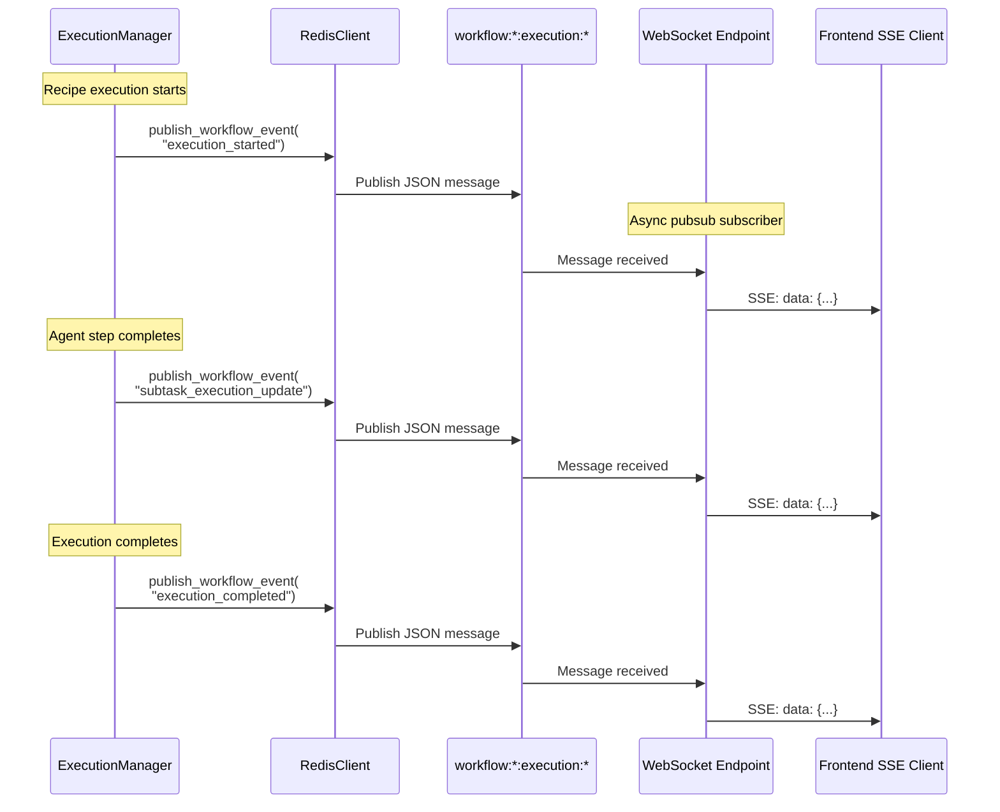
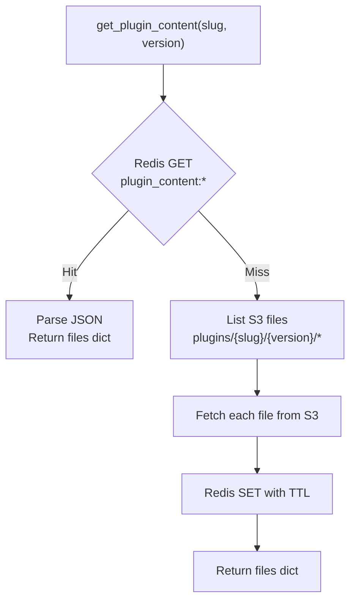
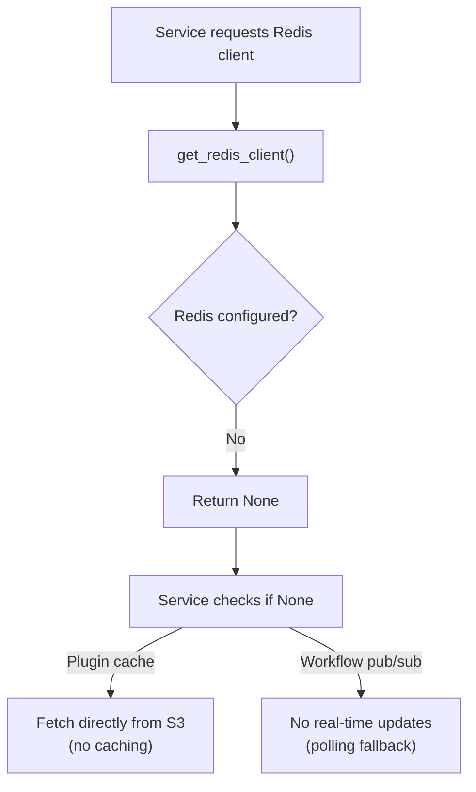

# Redis Configuration

<details>
<summary>Relevant source files</summary>

The following files were used as context for generating this wiki page:

- [docker-compose.yml](docker-compose.yml)
- [frontend/.dockerignore](frontend/.dockerignore)
- [frontend/Dockerfile](frontend/Dockerfile)
- [orchestrator/Dockerfile](orchestrator/Dockerfile)
- [orchestrator/core/redis/client.py](orchestrator/core/redis/client.py)
- [orchestrator/requirements.txt](orchestrator/requirements.txt)

</details>


## Purpose & Scope

This page covers Redis configuration for caching and real-time pub/sub messaging in Automatos AI. Redis is an **optional service** that enhances performance but does not block system operation if unavailable. For database configuration, see [Database Setup](#12.4). For production deployment strategies, see [Production Deployment](#12.6).

**Redis Use Cases in Automatos AI:**
- **Plugin content caching**: Reduces S3 read latency for frequently accessed plugins
- **Composio tool metadata caching**: Stores app and action schemas to avoid repeated API calls
- **Real-time workflow updates**: Pub/Sub channels stream execution progress to WebSocket clients
- **Session storage**: Future use for distributed session management (not yet implemented)

Sources: [orchestrator/config.py:45-62](), [orchestrator/core/redis/client.py:1-198]()

---

## Configuration Variables

Redis configuration follows a **dual-mode strategy**: REDIS_URL for cloud platforms (Railway, Heroku) or individual parameters for local/custom deployments. All configuration is centralized in `config.py`.

### Environment Variables

| Variable | Type | Default | Description |
|----------|------|---------|-------------|
| `REDIS_URL` | string | None | Full Redis connection URL (priority 1) |
| `REDIS_HOST` | string | None | Redis server hostname |
| `REDIS_PORT` | int | None | Redis server port (typically 6379) |
| `REDIS_PASSWORD` | string | None | Redis authentication password |
| `PLUGIN_CACHE_TTL_SECONDS` | int | 3600 | TTL for plugin content cache entries |

Sources: [orchestrator/config.py:45-62](), [orchestrator/config.py:183-186]()

### Configuration Priority

The `Config.REDIS_URL` property implements a resolution waterfall:



**Implementation:**

[orchestrator/config.py:52-62]()

Sources: [orchestrator/config.py:52-62]()

---

## Docker Compose Service Setup

The Redis service is configured with production-ready defaults for memory management and persistence.

### Service Configuration

```yaml
services:
  redis:
    image: redis:7-alpine
    container_name: automatos_redis
    restart: unless-stopped
    command: >
      redis-server
      --requirepass ${REDIS_PASSWORD:-automatos_redis_dev}
      --maxmemory 256mb
      --maxmemory-policy allkeys-lru
    ports:
      - "${REDIS_PORT:-6379}:6379"
    volumes:
      - redis_data:/data
    healthcheck:
      test: ["CMD", "redis-cli", "--no-auth-warning", "-a", "${REDIS_PASSWORD}", "ping"]
      interval: 10s
      timeout: 3s
      retries: 5
      start_period: 5s
```

**Key Configuration Decisions:**

| Parameter | Value | Rationale |
|-----------|-------|-----------|
| `--maxmemory 256mb` | 256MB | Prevents unbounded memory growth |
| `--maxmemory-policy allkeys-lru` | LRU eviction | Removes least-recently-used keys when full |
| `--requirepass` | Required | Enforces authentication |
| Volume mount | `redis_data:/data` | Persists RDB snapshots across restarts |

Sources: [docker-compose.yml:47-63]()

### Health Check Strategy

The health check uses `redis-cli ping` to verify:
1. Redis server is responsive
2. Password authentication succeeds
3. TCP connection is established

This health check gates dependent services (backend) from starting until Redis is ready.

Sources: [docker-compose.yml:57-62]()

---

## Connection Management

The `RedisClient` class provides both synchronous and asynchronous clients with connection pooling.



Sources: [orchestrator/core/redis/client.py:14-198]()

### Synchronous Client

Used for pub/sub publishing and cache operations:

**Key methods:**
- `get_redis()`: Returns a connection from the pool
- `publish(channel, message)`: Publishes JSON message to channel
- `publish_workflow_event(workflow_id, execution_id, event_type, data)`: Workflow-specific helper

[orchestrator/core/redis/client.py:33-119]()

### Asynchronous Client

Used for non-blocking pub/sub subscriptions in WebSocket endpoints:

**Key methods:**
- `get_async_pubsub(channel)`: Returns `(redis_async, pubsub)` tuple for async iteration

[orchestrator/core/redis/client.py:48-64]()

### Lazy Initialization

The global `_redis_client` singleton is initialized on first access via `get_redis_client()`. If Redis is not configured (missing `REDIS_URL` and `REDIS_HOST`), the function logs a warning and returns `None`, allowing the system to operate without Redis.

[orchestrator/core/redis/client.py:149-198]()

Sources: [orchestrator/core/redis/client.py:14-198]()

---

## Pub/Sub Architecture

Redis pub/sub enables real-time streaming of workflow execution progress to WebSocket clients.

### Channel Naming Convention

```
workflow:{workflow_id}:execution:{execution_id}
```

Example: `workflow:42:execution:1337`

### Message Format

All pub/sub messages follow this JSON structure:

```json
{
  "type": "execution_started | subtask_execution_update | execution_completed",
  "data": {
    "execution_id": 1337,
    "workflow_id": 42,
    "status": "running",
    "step": "Step 2: Analyze Code",
    "agent_name": "Code Architect",
    "subtask_output": "...",
    "timestamp": "2025-01-15T10:30:00Z"
  }
}
```

Sources: [orchestrator/core/redis/client.py:91-119]()

### Event Types

| Event Type | Trigger | Payload |
|------------|---------|---------|
| `execution_started` | Recipe execution begins | Execution metadata |
| `subtask_execution_update` | Agent step completes | Step results, agent output |
| `execution_completed` | All steps finish | Final status, aggregated results |
| `execution_failed` | Error occurs | Error message, failed step |

### Pub/Sub Flow Diagram



Sources: [orchestrator/core/redis/client.py:91-119]()

---

## Cache Policies

### Plugin Content Cache

The `PluginContentCache` wraps `MarketplaceS3Service` with a Redis caching layer to reduce S3 read latency.

**Cache Key Prefixes:**
- `plugin_content:{slug}:{version}` - Full plugin file dictionary
- `plugin_manifest:{slug}:{version}` - Parsed manifest.json
- `plugin_files:{slug}:{version}:{file_path}` - Individual file content

**TTL:** Configured via `PLUGIN_CACHE_TTL_SECONDS` (default: 3600 seconds = 1 hour)

[orchestrator/core/services/plugin_cache.py:22-48]()

### Cache Operations



**Graceful Fallback:** If Redis is unavailable (`_redis_available = False`), all cache operations are no-ops, and content is fetched directly from S3.

[orchestrator/core/services/plugin_cache.py:119-159]()

Sources: [orchestrator/core/services/plugin_cache.py:1-263]()

### Cache Invalidation

When a plugin is updated or deleted, all cached entries for that version must be invalidated:

```python
cache.invalidate_plugin(slug="security-scanner", version="1.0.0")
```

**Invalidation Strategy:**
1. Direct key deletion for `plugin_content:*` and `plugin_manifest:*`
2. Pattern scan (`SCAN`) for `plugin_files:*:*` to find all file keys
3. Batch delete matched keys

[orchestrator/core/services/plugin_cache.py:218-249]()

Sources: [orchestrator/core/services/plugin_cache.py:218-249]()

---

## Memory Management

### Eviction Policy

Redis is configured with `allkeys-lru` eviction policy:
- **Scope:** All keys (not just those with TTL)
- **Algorithm:** Least Recently Used (LRU)
- **Trigger:** When `maxmemory` limit (256MB) is reached

**Why LRU?**
- Plugin content access patterns are read-heavy with temporal locality
- Frequently accessed plugins (e.g., core skills) remain cached
- Rarely used plugins are evicted automatically without manual intervention

Sources: [docker-compose.yml:51]()

### Memory Usage Estimates

| Cache Type | Avg Entry Size | Est. Count | Total Memory |
|------------|----------------|------------|--------------|
| Plugin content | ~50KB | 1000 plugins | 50MB |
| Manifest files | ~2KB | 1000 plugins | 2MB |
| Pub/sub messages | ~1KB | Transient | <1MB |
| Composio tool cache | ~10KB | 500 tools | 5MB |
| **Total** | - | - | **~60MB** |

This leaves ~190MB headroom before eviction begins.

Sources: [docker-compose.yml:51]()

---

## Graceful Degradation

Redis is designed as an **optional service** that enhances performance but does not block core functionality.

### Fallback Behavior



### Service-Specific Fallbacks

| Service | Redis Feature | Fallback Behavior |
|---------|---------------|-------------------|
| `PluginContentCache` | Content caching | Direct S3 fetch every time |
| `ExecutionManager` | Workflow pub/sub | No real-time updates (client polling required) |
| `ComposioAppCache` | Tool metadata cache | Direct Composio API calls |

**Detection Logic:**

[orchestrator/core/services/plugin_cache.py:53-74]()

The service sets `_redis_available = False` on first connection failure and stops attempting Redis operations.

Sources: [orchestrator/core/redis/client.py:149-198](), [orchestrator/core/services/plugin_cache.py:53-74]()

---

## Production Considerations

### Connection String Formats

**Railway/Heroku (REDIS_URL):**
```
redis://:[password]@[host]:[port]/[db]
```

**Individual Parameters:**
```bash
REDIS_HOST=redis.example.com
REDIS_PORT=6379
REDIS_PASSWORD=secure_password
```

Sources: [orchestrator/core/redis/client.py:160-182]()

### Security

1. **Authentication:** Always set `REDIS_PASSWORD` (enforced via `--requirepass`)
2. **Network isolation:** Use private networking (VPC) in cloud deployments
3. **TLS:** Not currently configured; add `--tls-port` for encrypted transit

Sources: [docker-compose.yml:51]()

### Monitoring

**Key metrics to track:**
- Memory usage: `INFO memory` - Track used_memory vs maxmemory
- Eviction rate: `INFO stats` - Track evicted_keys counter
- Hit rate: `INFO stats` - Calculate keyspace_hits / (keyspace_hits + keyspace_misses)
- Connection count: `INFO clients` - Track connected_clients

Sources: [docker-compose.yml:47-63]()

### Scaling

For multi-instance deployments:
- **Shared Redis:** All backend instances connect to same Redis server
- **Pub/Sub:** Messages published by any instance are received by all subscribers
- **Caching:** All instances share the same cache (reduces S3 load)

**Limitations:** Current implementation does not support Redis Cluster or Sentinel for high availability.

Sources: [orchestrator/core/redis/client.py:22-29]()

---