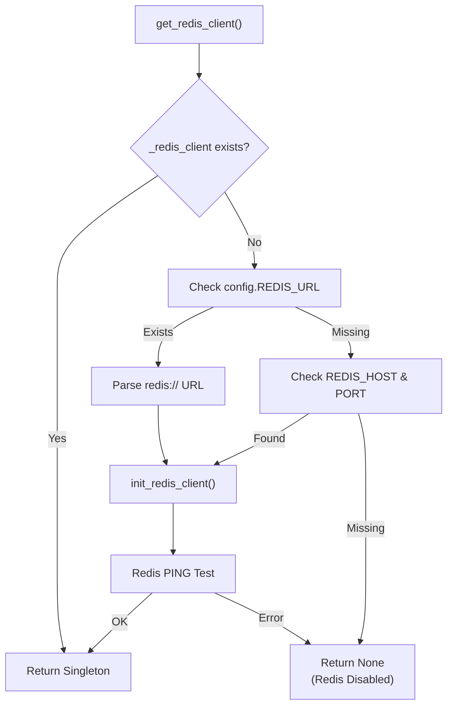
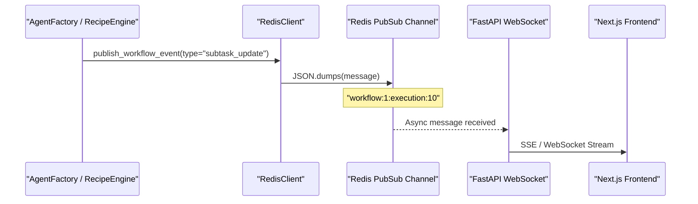

# Redis Configuration

<details>
<summary>Relevant source files</summary>

The following files were used as context for generating this wiki page:

- [README.md](README.md)
- [docker-compose.yml](docker-compose.yml)
- [docs/README.md](docs/README.md)
- [frontend/.dockerignore](frontend/.dockerignore)
- [frontend/Dockerfile](frontend/Dockerfile)
- [orchestrator/Dockerfile](orchestrator/Dockerfile)
- [orchestrator/api/cloud_documents.py](orchestrator/api/cloud_documents.py)
- [orchestrator/core/redis/client.py](orchestrator/core/redis/client.py)
- [orchestrator/modules/tools/services/__init__.py](orchestrator/modules/tools/services/__init__.py)
- [orchestrator/requirements.txt](orchestrator/requirements.txt)

</details>


## Purpose & Scope

This page covers Redis configuration for caching and real-time pub/sub messaging in Automatos AI. Redis is an **optional service** that enhances performance but does not block system operation if unavailable [orchestrator/core/redis/client.py:153-154](). It serves as the primary backbone for real-time telemetry, task orchestration for sandboxed execution, and transient data storage.

**Redis Use Cases in Automatos AI:**
- **Real-time workflow updates**: Pub/Sub channels stream execution progress to WebSocket clients [orchestrator/core/redis/client.py:2-4]().
- **Task Queues**: ARQ-style Redis queues for the `WorkspaceWorker` to consume agent tasks [docker-compose.yml:178-182]().
- **Session & Cache Storage**: Centralized store for transient data across distributed backend workers [docker-compose.yml:46-47]().
- **Rate Limiting**: Used by the widget system to enforce execution quotas [docker-compose.yml:211-214]().

Sources: [orchestrator/core/redis/client.py:1-198](), [docker-compose.yml:46-74](), [orchestrator/requirements.txt:57-58]()

---

## Configuration Variables

Redis configuration follows a **dual-mode strategy**: `REDIS_URL` for cloud platforms (Railway, Heroku) or individual parameters for local/custom deployments [orchestrator/core/redis/client.py:161-196]().

### Environment Variables

| Variable | Type | Default | Description |
|----------|------|---------|-------------|
| `REDIS_URL` | string | None | Full Redis connection URL (priority 1) [orchestrator/core/redis/client.py:161-162]() |
| `REDIS_HOST` | string | `redis` | Redis server hostname [docker-compose.yml:100-100]() |
| `REDIS_PORT` | int | `6379` | Redis server port [docker-compose.yml:101-101]() |
| `REDIS_PASSWORD` | string | Required | Redis authentication password [docker-compose.yml:56-56]() |

Sources: [orchestrator/core/redis/client.py:141-198](), [docker-compose.yml:88-103]()

### Configuration Resolution

The system attempts to initialize the `RedisClient` by first checking for a unified URL, then falling back to discrete components.

**Redis Initialization Logic**



Sources: [orchestrator/core/redis/client.py:149-198]()

---

## Docker Compose Service Setup

The Redis service is configured with security hardening and memory management policies suitable for production agent workloads.

### Service Configuration

```yaml
  redis:
    image: redis:7-alpine
    container_name: automatos_redis
    restart: unless-stopped
    command: >
      redis-server
      --requirepass ${REDIS_PASSWORD:?REDIS_PASSWORD is required}
      --maxmemory 256mb
      --maxmemory-policy allkeys-lru
      --rename-command FLUSHDB ""
      --rename-command FLUSHALL ""
      --rename-command DEBUG ""
    ports:
      - "${REDIS_PORT:-6379}:6379"
    volumes:
      - redis_data:/data
    healthcheck:
      test: ["CMD", "redis-cli", "--no-auth-warning", "-a", "${REDIS_PASSWORD}", "ping"]
```

**Security Hardening (PRD-70):**
Dangerous commands like `FLUSHALL` and `FLUSHDB` are renamed to empty strings to prevent accidental or malicious data wipes [docker-compose.yml:59-61]().

**Memory Management:**
- `maxmemory 256mb`: Limits the footprint of the cache [docker-compose.yml:57-57]().
- `allkeys-lru`: Automatically evicts the least recently used keys when the memory limit is reached [docker-compose.yml:58-58]().

Sources: [docker-compose.yml:48-74]()

---

## Connection Management

The `RedisClient` class in `orchestrator/core/redis/client.py` manages the lifecycle of both synchronous and asynchronous connections using a `ConnectionPool` [orchestrator/core/redis/client.py:22-29]().

### Synchronous Client

Used primarily for publishing events from the FastAPI backend to the streaming layer.

- **`get_redis()`**: Retrieves a standard `redis.Redis` instance from the pool [orchestrator/core/redis/client.py:33-35]().
- **`publish()`**: Encapsulates JSON serialization and message delivery [orchestrator/core/redis/client.py:66-86]().

### Asynchronous Client

Used by WebSocket endpoints and streaming services to handle non-blocking message delivery via `aioredis` [orchestrator/requirements.txt:58]().

- **`get_async_pubsub(channel)`**: Initializes an `aioredis.Redis` client and subscribes to a specific channel [orchestrator/core/redis/client.py:48-64]().

Sources: [orchestrator/core/redis/client.py:14-90](), [orchestrator/requirements.txt:58-58]()

---

## Pub/Sub Architecture

Automatos AI uses Redis Pub/Sub as the backbone for real-time telemetry during multi-agent workflow execution.

### Channel Naming Convention

Channels are scoped to specific workflow executions to ensure data isolation:
`workflow:{workflow_id}:execution:{execution_id}` [orchestrator/core/redis/client.py:110-110]().

### Message Data Flow

**Real-Time Workflow Telemetry Flow**



**Implementation Details:**
The `publish_workflow_event` function automatically structures the payload with `execution_id`, `workflow_id`, and the provided event data [orchestrator/core/redis/client.py:91-119]().

Sources: [orchestrator/core/redis/client.py:91-120]()

---

## Workspace Worker Integration

The `workspace-worker` service relies on Redis as its primary task broker.

- **Queue Consumer**: The worker functions as an ARQ-style consumer, pulling tasks from Redis queues [docker-compose.yml:178-182]().
- **Concurrency Control**: Redis semaphores manage parallel task execution across distributed workers [docker-compose.yml:178-182]().
- **Heartbeat**: Workers report their health status back to the main orchestrator via Redis keys [docker-compose.yml:178-182]().

Sources: [docker-compose.yml:173-205]()

---

## Graceful Degradation

If Redis is unavailable, the system enters a degraded state rather than crashing:

1. **Initialization**: `get_redis_client()` returns `None` if the connection test fails [orchestrator/core/redis/client.py:189-190]().
2. **Feature Toggle**: Real-time updates (WebSocket streaming) are disabled, falling back to database-only state persistence [orchestrator/core/redis/client.py:153-154]().
3. **Logging**: A warning is issued during startup: `"Redis not configured... Redis features disabled."` [orchestrator/core/redis/client.py:189-190]().

Sources: [orchestrator/core/redis/client.py:149-198]()

---