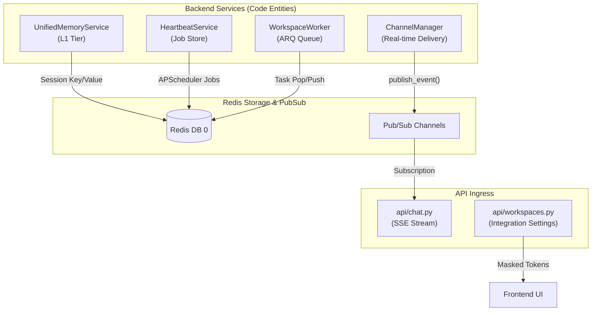
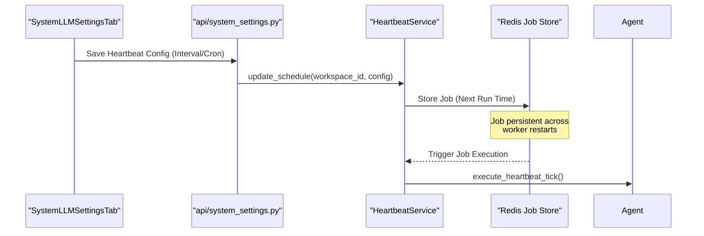
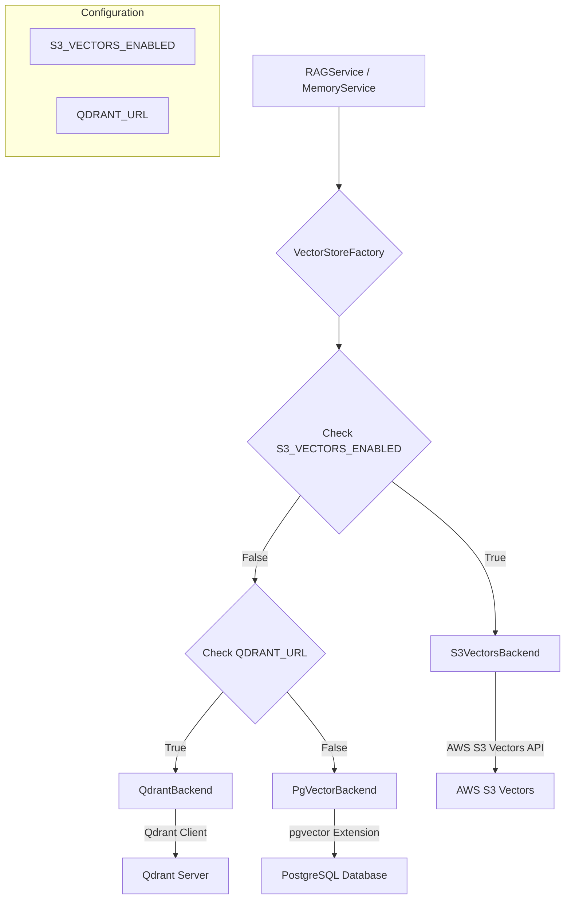

# Redis & Vector Store Configuration

<details>
<summary>Relevant source files</summary>

The following files were used as context for generating this wiki page:

- [.github/workflows/test.yml](.github/workflows/test.yml)
- [docker-compose.yml](docker-compose.yml)
- [frontend/.dockerignore](frontend/.dockerignore)
- [frontend/Dockerfile](frontend/Dockerfile)
- [infrastructure/.env.example](infrastructure/.env.example)
- [infrastructure/railway-manifest.json](infrastructure/railway-manifest.json)
- [orchestrator/Dockerfile](orchestrator/Dockerfile)
- [orchestrator/api/cloud_documents.py](orchestrator/api/cloud_documents.py)
- [orchestrator/core/database/migrations/010_vector_dimensions_4096.sql](orchestrator/core/database/migrations/010_vector_dimensions_4096.sql)
- [orchestrator/core/redis/client.py](orchestrator/core/redis/client.py)
- [orchestrator/evals/retrieval_recall.py](orchestrator/evals/retrieval_recall.py)
- [orchestrator/modules/rag/ingestion/pipeline.py](orchestrator/modules/rag/ingestion/pipeline.py)
- [orchestrator/modules/rag/ingestion/processor.py](orchestrator/modules/rag/ingestion/processor.py)
- [orchestrator/modules/search/__init__.py](orchestrator/modules/search/__init__.py)
- [orchestrator/modules/search/vector_store/__init__.py](orchestrator/modules/search/vector_store/__init__.py)
- [orchestrator/modules/search/vector_store/backends/pgvector_local_backend.py](orchestrator/modules/search/vector_store/backends/pgvector_local_backend.py)
- [orchestrator/modules/search/vector_store/backends/s3_vectors_backend.py](orchestrator/modules/search/vector_store/backends/s3_vectors_backend.py)
- [orchestrator/requirements.txt](orchestrator/requirements.txt)
- [orchestrator/scripts/eval/retrieval_recall/corpus.jsonl](orchestrator/scripts/eval/retrieval_recall/corpus.jsonl)
- [orchestrator/scripts/eval/retrieval_recall/gold_set.jsonl](orchestrator/scripts/eval/retrieval_recall/gold_set.jsonl)
- [orchestrator/scripts/recreate_s3_index.py](orchestrator/scripts/recreate_s3_index.py)
- [orchestrator/scripts/test_cloud_sync.py](orchestrator/scripts/test_cloud_sync.py)
- [orchestrator/tests/test_dockerfile_prod_parity.py](orchestrator/tests/test_dockerfile_prod_parity.py)
- [orchestrator/tests/test_p2w1_retrieval_recall.py](orchestrator/tests/test_p2w1_retrieval_recall.py)

</details>


## Purpose & Scope

Redis serves as the high-performance state and messaging backbone for Automatos AI. It is an **optional but recommended service**; if unavailable, the system gracefully degrades by disabling real-time streaming and background task processing [orchestrator/config.py:61-62]().

**Core Redis Responsibilities:**
*   **L1 Memory Tier**: High-speed session storage for active agent conversations (L1 Focus/Working memory) [orchestrator/config.py:84-85]().
*   **Real-time Pub/Sub**: Streaming workflow progress, heartbeat results, and agent logs to the frontend via SSE [orchestrator/main.py:5-6]().
*   **Task Orchestration**: Priority queues (Critical/High/Normal/Low) for the `WorkspaceWorker` subsystem [docker-compose.yml:178-182]().
*   **Distributed Locking**: Managing concurrent job execution and scheduler heartbeats using file/Redis locks [orchestrator/config.py:127-132]().

Sources: [orchestrator/config.py:61-132](), [orchestrator/main.py:1-20](), [docker-compose.yml:46-74]()

---

## Configuration & Environment

Redis settings are centralized in the `Config` class, which resolves connection strings from either a unified `REDIS_URL` or discrete parameters [orchestrator/config.py:63-79]().

### Connection Parameters

| Variable | Type | Default | Description |
| :--- | :--- | :--- | :--- |
| `REDIS_URL` | string | None | Primary connection string (e.g., `redis://:pass@host:6379/0`) [orchestrator/config.py:71-73]() |
| `REDIS_HOST` | string | None | Redis hostname [orchestrator/config.py:63-63]() |
| `REDIS_PORT` | string | None | Redis port [orchestrator/config.py:64-64]() |
| `REDIS_PASSWORD`| string | None | Redis authentication password [orchestrator/config.py:65-65]() |
| `REDIS_DB` | string | `0` | Redis database index [orchestrator/config.py:66-66]()

Sources: [orchestrator/config.py:63-80]()

### Cache Namespaces & TTLs

The system utilizes Redis for several specialized memory and awareness caches:

| Cache Type | Config Variable | Default | Purpose |
| :--- | :--- | :--- | :--- |
| **L1 Session** | `MEMORY_SESSION_TTL_SECONDS` | 86400 (24h) | TTL for active conversation focus [orchestrator/config.py:85-85]() |
| **Consolidation**| `MEMORY_SESSION_CONSOLIDATION_TTL_SECONDS` | 3600 (1h) | Window to move L1 -> L2 after session end [orchestrator/config.py:87-87]() |
| **Search Cache** | `MEMORY_CACHE_TTL_SECONDS` | 300 (5m) | Caching durable-store search results [orchestrator/config.py:89-89]() |
| **Awareness** | `MEMORY_AWARENESS_CACHE_TTL_SECONDS` | 600 (10m) | Workspace capability map caching [orchestrator/config.py:102-102]()

Sources: [orchestrator/config.py:82-102]()

---

## System Architecture: Code Entity Space

The following diagram bridges the Redis infrastructure to the specific code entities that consume it.

**Redis Consumer Mapping**



Sources: [orchestrator/config.py:82-132](), [orchestrator/api/workspaces.py:78-87](), [orchestrator/main.py:78-107]()

---

## Multi-Tenant Isolation

Automatos AI enforces strict multi-tenancy at the Redis layer through workspace-scoped key prefixes and channel names.

### Key & Channel Patterns

*   **Memory Keys**: `workspace:{workspace_id}:session:{session_id}:focus`
*   **Pub/Sub Channels**: `workspace:{workspace_id}:telemetry`
*   **Integration Secrets**: While secrets are stored in Postgres, the active configuration for channels like Telegram or Slack is cached in Redis to speed up the `ChannelManager` lifecycle [orchestrator/api/workspaces.py:32-40]().

### Integration Token Masking
When the frontend requests workspace settings via `GET /api/workspaces/current`, Redis-related and other integration tokens (e.g., `telegram_bot_token`) are automatically masked, showing only the first and last 4 characters [orchestrator/api/workspaces.py:78-87]().

Sources: [orchestrator/api/workspaces.py:32-87](), [orchestrator/config.py:22-22]()

---

## Background Job Scheduling

Redis acts as the job store for the `APScheduler` instance managed by the `HeartbeatService`.

**Heartbeat Scheduling Flow**



**Configuration Details:**
*   **Intervals**: Defined via `MEMORY_DECAY_INTERVAL_SECONDS` and `MEMORY_CONSOLIDATION_INTERVAL_SECONDS` [orchestrator/config.py:128-129]().
*   **Daily Jobs**: The promotion job (L2 -> L3) defaults to `03:00 UTC` [orchestrator/config.py:130-130]().

Sources: [orchestrator/config.py:127-132](), [frontend/components/settings/SystemLLMSettingsTab.tsx:66-75]()

---

## Infrastructure Deployment

The `docker-compose.yml` defines the Redis service with specific resource constraints and security hardening.

### Production Hardening (PRD-70)
Dangerous Redis commands are disabled in the container configuration to prevent unauthorized data manipulation:
*   `FLUSHDB` -> Renamed to `""`
*   `FLUSHALL` -> Renamed to `""`
*   `DEBUG` -> Renamed to `""`

### Memory Policy
The container uses `maxmemory-policy allkeys-lru` [docker-compose.yml:58-58](). This ensures that when the 256MB limit is hit, the oldest L1 session focus or search cache items are evicted first, preserving system stability.

Sources: [docker-compose.yml:48-74]()

---

## Vector Store Configuration

Automatos AI supports multiple vector store backends for RAG (Retrieval Augmented Generation) and memory, primarily `pgvector` and `Qdrant` for local deployments, and `S3 Vectors` for SaaS.

### `pgvector` (PostgreSQL Extension)

`pgvector` is a PostgreSQL extension that enables efficient vector similarity search directly within the database. It is used for local deployments and is included in the `pgvector/pgvector:pg16` Docker image [docker-compose.yml:31-31]().

**Key Features:**
*   **Integrated Storage**: Vectors are stored alongside other data in PostgreSQL, simplifying data management.
*   **Local Development**: Ideal for local development environments where a separate vector database might be overkill.
*   **Requirements**: The `pgvector` Python package is listed as a core dependency [orchestrator/requirements.txt:17-17]().

### `Qdrant` (Vector Database)

Qdrant is a dedicated vector similarity search engine used for durable (L3) and field memory. It is an opt-in service for local deployments, enabled via a Docker Compose profile [docker-compose.yml:118-119]().

**Key Features:**
*   **Dedicated Vector Store**: Optimized for vector search operations.
*   **Field Memory**: Used for `VectorFieldSharedContext` which handles concepts like resonance, decay, and attractors in agent memory [orchestrator/requirements.txt:73-73]().
*   **Local Deployment**: The `qdrant/qdrant:latest` Docker image is used for local setups [docker-compose.yml:124-124]().
*   **Configuration**: `QDRANT_URL` environment variable is used to connect to the Qdrant instance [docker-compose.yml:119-119](). The `qdrant-client` Python package is a dependency [orchestrator/requirements.txt:73-73]().

### `S3 Vectors` (AWS S3 Backend)

`S3 Vectors` is an AWS S3-compatible backend designed for vector storage and retrieval, primarily used in SaaS deployments. It provides a scalable and managed solution for RAG queries.

**Key Features:**
*   **Cloud-Native**: Leverages AWS S3 for scalable and durable vector storage.
*   **Multi-Tenancy**: Supports shared buckets or templated buckets per workspace (`{workspace_id}` placeholder). Tenant isolation is enforced at query time by filtering on `workspace_id` metadata [orchestrator/modules/search/vector_store/backends/s3_vectors_backend.py:58-67]().
*   **Index Management**: Automatically creates buckets and indexes if they don't exist. It includes a dimension mismatch check (`IndexDimensionMismatchError`) to prevent writing or querying against incorrectly dimensioned indexes [orchestrator/modules/search/vector_store/backends/s3_vectors_backend.py:131-161]().
*   **Configuration**: Configured via environment variables such as `S3_VECTORS_BUCKET`, `S3_VECTORS_INDEX_NAME`, `S3_VECTORS_DIMENSION`, `S3_VECTORS_METRIC`, `AWS_REGION`, `AWS_ACCESS_KEY_ID`, and `AWS_SECRET_ACCESS_KEY` [orchestrator/modules/search/vector_store/backends/s3_vectors_backend.py:43-48]().
*   **Dependencies**: Uses `boto3` for AWS interaction [orchestrator/requirements.txt:124-124]().

**S3 Vectors Backend Initialization Flow**

```mermaid
graph TD
    A[S3VectorsBackend __init__] --> B{Get S3_VECTORS_BUCKET};
    B --> C{Replace {workspace_id} in bucket name};
    C --> D{Get S3_VECTORS_INDEX_NAME, S3_VECTORS_DIMENSION, S3_VECTORS_METRIC};
    D --> E{Get AWS_REGION, AWS_ACCESS_KEY_ID, AWS_SECRET_ACCESS_KEY};
    E --> F[Initialize boto3 s3vectors client];
    F --> G[Call initialize() (async)];
    G --> H[Call _ensure_setup()];
    H --> I{Create vector bucket if not exists};
    I --> J{Create index if not exists};
    J --> K{If index exists, call _assert_index_dimension()};
    K --> L{Check existing index dimension against config};
    L -- Mismatch --> M[Raise IndexDimensionMismatchError];
    L -- Match --> N[Setup complete];
```
Sources: [orchestrator/modules/search/vector_store/backends/s3_vectors_backend.py:36-161]()

### Vector Store Backend Selection

The system dynamically selects the vector store backend based on configuration. The `vector_store` module acts as an abstraction layer [orchestrator/modules/search/vector_store/__init__.py]().

**Vector Store Backend Architecture**


Sources: [orchestrator/modules/search/vector_store/backends/s3_vectors_backend.py](), [orchestrator/modules/search/vector_store/backends/pgvector_local_backend.py](), [orchestrator/modules/search/vector_store/__init__.py]()

### Embedding Dimensions and Migrations

The embedding dimension is a critical configuration parameter that must match the embedding model used. Changes to the embedding model or dimension often require a full reset and re-embedding of all vectors.

For example, a migration to a 4096-dimension embedding model (e.g., OpenRouter/Qwen3-8B) involves:
1.  Wiping all existing document, chunk, entity, knowledge, and memory data from the database.
2.  Deleting and recreating the S3 index (if S3 Vectors is used) with the new dimension.
3.  Updating system settings for `vector_store_dimensions`, `embedding_provider`, and `embedding_model` [orchestrator/core/database/migrations/010_vector_dimensions_4096.sql:70-81]().
4.  Running a script like `scripts.recreate_s3_index` to handle the S3 side of the migration [orchestrator/core/database/migrations/010_vector_dimensions_4096.sql:8-8]().

Sources: [orchestrator/core/database/migrations/010_vector_dimensions_4096.sql:1-86](), [orchestrator/scripts/recreate_s3_index.py]()

---