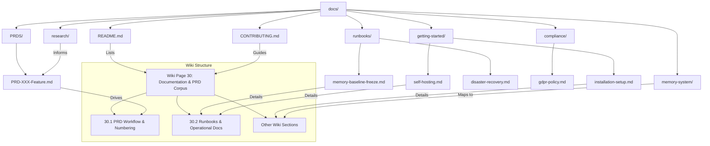
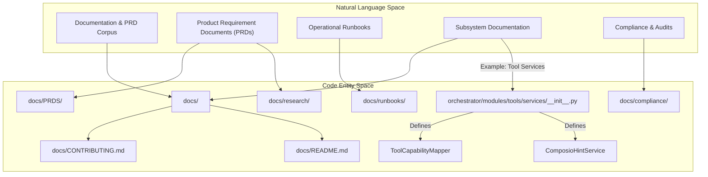

# Documentation & PRD Corpus

Relevant source files

The following files were used as context for generating this wiki page:

- [README.md](README.md)
- [docs/CONTRIBUTING.md](docs/CONTRIBUTING.md)
- [docs/README.md](docs/README.md)
- [orchestrator/modules/tools/services/__init__.py](orchestrator/modules/tools/services/__init__.py)

This page provides a high-level overview of the `docs/` directory within the Automatos AI codebase. This directory serves as the central repository for various forms of documentation, including Product Requirement Documents (PRDs), research materials, subsystem-specific documentation, operational runbooks, and compliance-related artifacts. It also outlines how these documents map to the structure of this wiki.

The `docs/` directory is crucial for maintaining a clear understanding of the system's design, functionality, and operational procedures. It ensures that development is guided by well-defined requirements and that the system can be effectively operated, maintained, and audited.

## Product Requirement Documents (PRDs) and Research

The `docs/PRDS` subdirectory contains Product Requirement Documents that drive the development of new features and functionalities within Automatos AI. These PRDs serve as the primary source of truth for what needs to be built, why, and how it should function. They often include detailed specifications, user stories, and acceptance criteria. Alongside PRDs, the `docs/research` folder may contain exploratory documents, competitive analyses, and foundational research that informs product decisions.

For details on how PRDs influence the development lifecycle, including PRD-numbered tests and migrations, and the use of `prd_parity` and `ralph acceptance scripts`, see [PRD Workflow & Numbering](#30.1).

Sources:
- [docs/README.md:1-108]()

## Per-Subsystem Documentation

Each major subsystem or component of Automatos AI often has its own dedicated documentation within the `docs/` structure. This ensures that detailed technical information, design choices, and implementation specifics are kept close to the relevant code. Examples include documentation for the memory system, context service, agents, workflows, and tools. This modular approach helps developers quickly find information pertinent to the area of the codebase they are working on.

For example, the `docs/getting-started/self-hosting.md` provides specific instructions for running the local edition of Automatos AI [docs/README.md:7](). Similarly, the `orchestrator/modules/tools/README.md` details the mechanics of adding platform actions [docs/CONTRIBUTING.md:38-39]().

Sources:
- [docs/README.md:1-108]()
- [docs/CONTRIBUTING.md:38-39]()
- [orchestrator/modules/tools/services/__init__.py:1-25]()

## Runbooks and Operational Documentation

The `docs/runbooks` directory houses critical operational procedures and guides. These documents are essential for the reliable operation and maintenance of the Automatos AI platform. They cover topics such as disaster recovery (DR) procedures, memory baseline freezes, and other routine or emergency operational tasks. This section also includes the self-hosting guide, which provides comprehensive instructions for deploying and managing the local edition of the platform.

For a deeper dive into operational documentation, including memory baseline freezes, disaster recovery, and the self-hosting guide, see [Runbooks & Operational Docs](#30.2).

Sources:
- [docs/README.md:7-8]()

## Audits and Compliance

The `docs/compliance` folder contains documentation related to audits, regulatory compliance (such as GDPR and EU AI Act), and security reviews. These documents outline the measures taken to ensure the platform adheres to legal and industry standards, providing transparency and accountability. This includes details on data handling, privacy policies, and security hardening practices.

Sources:
- [docs/README.md:1-108]()

## Mapping to Wiki Sections

The structure of the `docs/` directory directly informs the organization of this wiki. Each top-level directory within `docs/` often corresponds to a major section or a parent page in the wiki, with individual markdown files mapping to child pages. This ensures a consistent and navigable documentation experience, allowing users to easily transition between the codebase's documentation and the wiki's structured content.

For instance, the `docs/getting-started/` directory contains files like `self-hosting.md`, `installation-setup.md`, and `configuration-guide.md`, which directly correspond to sections under "Getting Started" in the wiki's table of contents [docs/README.md:16-21]().

### Documentation Structure Overview

Sources:
- [docs/README.md:1-108]()
- [docs/CONTRIBUTING.md:1-143]()

### Bridging Natural Language to Code Entities

The documentation aims to bridge the gap between high-level concepts and their concrete implementations in the codebase. This is achieved by consistently referencing code entities, such as file paths, class names, and function names, within the documentation.

For example, when discussing tool services, the documentation might refer to `orchestrator/modules/tools/services/__init__.py` [orchestrator/modules/tools/services/__init__.py:1-25]() which defines various tool-related services like `ToolCapabilityMapper` and `ComposioHintService`.

Sources:
- [docs/README.md:1-108]()
- [docs/CONTRIBUTING.md:1-143]()
- [orchestrator/modules/tools/services/__init__.py:1-25]()

---