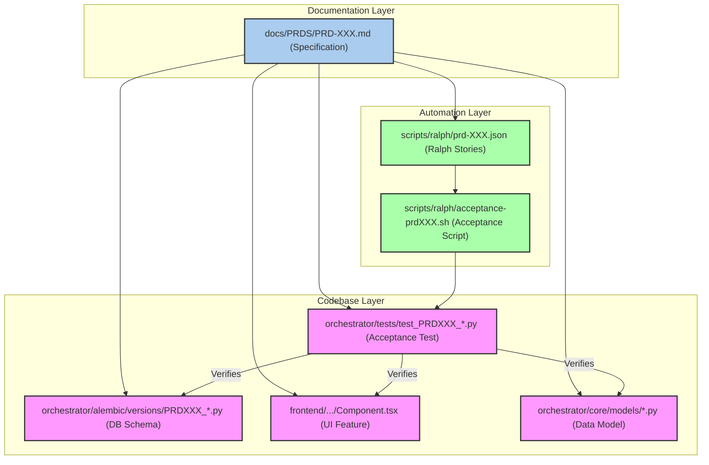
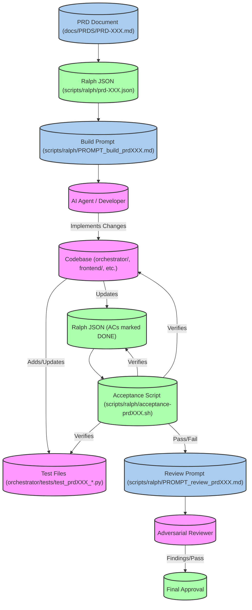

# PRD Workflow & Numbering

Relevant source files

The following files were used as context for generating this wiki page:

- [frontend/components/suggestions/SuggestionChip.tsx](frontend/components/suggestions/SuggestionChip.tsx)
- [frontend/components/suggestions/ToolSuggestionBar.tsx](frontend/components/suggestions/ToolSuggestionBar.tsx)
- [orchestrator/alembic/versions/20260129_add_app_suggestions.py](orchestrator/alembic/versions/20260129_add_app_suggestions.py)
- [orchestrator/alembic/versions/20260129_merge_heads.py](orchestrator/alembic/versions/20260129_merge_heads.py)
- [orchestrator/alembic/versions/prd123_cost_tracking.py](orchestrator/alembic/versions/prd123_cost_tracking.py)
- [orchestrator/alembic/versions/prd123_tool_tier.py](orchestrator/alembic/versions/prd123_tool_tier.py)
- [orchestrator/alembic/versions/prd142_wave5_drop_dead_tables.py](orchestrator/alembic/versions/prd142_wave5_drop_dead_tables.py)
- [orchestrator/core/models/composio_cache.py](orchestrator/core/models/composio_cache.py)
- [orchestrator/core/models/tools.py](orchestrator/core/models/tools.py)
- [orchestrator/modules/__init__.py](orchestrator/modules/__init__.py)
- [orchestrator/modules/tools/__init__.py](orchestrator/modules/tools/__init__.py)
- [orchestrator/scripts/prd_parity.py](orchestrator/scripts/prd_parity.py)
- [orchestrator/services/tool_manifest_service.py](orchestrator/services/tool_manifest_service.py)
- [orchestrator/tests/test_prd184_us001_learning_evaluation_deleted.py](orchestrator/tests/test_prd184_us001_learning_evaluation_deleted.py)
- [orchestrator/tests/test_prd184_us003_exec_planning_deleted.py](orchestrator/tests/test_prd184_us003_exec_planning_deleted.py)
- [orchestrator/tests/test_prd184_us004_tools_concurrency_deleted.py](orchestrator/tests/test_prd184_us004_tools_concurrency_deleted.py)
- [scripts/ralph/PROMPT_build_prd184.md](scripts/ralph/PROMPT_build_prd184.md)
- [scripts/ralph/PROMPT_review_prd184.md](scripts/ralph/PROMPT_review_prd184.md)
- [scripts/ralph/acceptance-prd184.sh](scripts/ralph/acceptance-prd184.sh)
- [scripts/ralph/prd-184.json](scripts/ralph/prd-184.json)

This page details the Product Requirements Document (PRD) workflow within the Automatos AI codebase, focusing on how PRDs drive development, influence code numbering, and integrate with testing, migrations, and automated acceptance scripts. It covers the lifecycle of a PRD from its inception in `docs/PRDS` to its impact on code, database migrations, and the `ralph` automation system.

## PRD-Driven Development

PRDs serve as the primary specification for new features and significant changes within the Automatos AI platform. Each PRD is typically a Markdown document located in the `docs/PRDS/` directory. These documents outline the problem, proposed solution, user stories, acceptance criteria, and often include technical details and audit tables.

For example, `PRD-184-KILL-LIST-DEAD-SURFACE-REMOVAL.md` describes the process of removing dead code and scaffolding. The `scripts/ralph/prd-184.json` file then translates specific user stories from this PRD into an executable format for the `ralph` automation system, including detailed acceptance criteria and affected files [scripts/ralph/prd-184.json:1-88]().

### PRD Numbering in Code and Migrations

PRD numbers are frequently used as identifiers in various parts of the codebase to link specific implementations back to their originating design document. This practice ensures traceability and provides context for developers.

**1. Database Migrations (Alembic):**
Alembic migration scripts often include the PRD number in their filenames and docstrings, indicating which PRD necessitated the schema change. For instance, `orchestrator/alembic/versions/20260129_add_app_suggestions.py` is related to "PRD-40: Dynamic Tool Suggestions" [orchestrator/alembic/versions/20260129_add_app_suggestions.py:1-13](). Similarly, `orchestrator/alembic/versions/prd123_tool_tier.py` and `orchestrator/alembic/versions/prd123_cost_tracking.py` are linked to PRD-123. This allows developers to quickly understand the purpose of a migration by referencing the corresponding PRD.

**2. Frontend Components:**
Frontend components sometimes include PRD numbers in their comments to indicate the feature they implement. For example, the `ToolSuggestionBar` component explicitly mentions "PRD-40: Dynamic Tool Suggestions" [frontend/components/suggestions/ToolSuggestionBar.tsx:1-4](), and `SuggestionChip` also references PRD-40 [frontend/components/suggestions/SuggestionChip.tsx:1-4](). This helps frontend developers understand the design rationale behind UI elements.

**3. Backend Models:**
Database models might also reference PRD numbers in their docstrings to explain the context of certain fields or the model's purpose. For example, `ComposioActionCache` includes `app_suggestions` which is explicitly linked to "PRD-40: Dynamic tool suggestions" [orchestrator/core/models/composio_cache.py:102-103](). The `Tool` model's `tier` field is linked to "PRD-123 Pattern #4" [orchestrator/core/models/tools.py:62-62]().

**4. Test Files:**
Dedicated test files are often created with PRD numbers in their names to verify the implementation of specific PRD requirements. For example, `orchestrator/tests/test_prd184_us003_exec_planning_deleted.py` directly tests a user story from PRD-184 [orchestrator/tests/test_prd184_us003_exec_planning_deleted.py:1-2](). These tests ensure that the changes introduced by a PRD meet its acceptance criteria and prevent regressions.

### Diagram: PRD to Code Traceability

Sources:
- [scripts/ralph/prd-184.json:1-88]()
- [orchestrator/alembic/versions/20260129_add_app_suggestions.py:1-13]()
- [frontend/components/suggestions/ToolSuggestionBar.tsx:1-4]()
- [frontend/components/suggestions/SuggestionChip.tsx:1-4]()
- [orchestrator/core/models/composio_cache.py:102-103]()
- [orchestrator/core/models/tools.py:62-62]()
- [orchestrator/tests/test_prd184_us003_exec_planning_deleted.py:1-2]()

## Ralph Automation System

The `ralph` automation system is a critical part of the PRD workflow, especially for large-scale refactoring or deletion tasks. It ensures that changes are implemented precisely according to the PRD's specifications and that no unintended side effects occur.

### Ralph Workflow

The `ralph` workflow involves:
1.  **PRD Specification:** A detailed PRD (e.g., `PRD-184-KILL-LIST-DEAD-SURFACE-REMOVAL.md`) is written.
2.  **Ralph JSON:** A corresponding `prd-XXX.json` file (e.g., `scripts/ralph/prd-184.json`) is created, breaking down the PRD into user stories (`userStories`), each with an `id`, `title`, `description`, `acceptanceCriteria`, and `files` [scripts/ralph/prd-184.json:5-19]().
3.  **Build Prompt:** A `PROMPT_build_prdXXX.md` file (e.g., `scripts/ralph/PROMPT_build_prd184.md`) provides instructions for an AI agent (or human) to execute the PRD's user stories, emphasizing strict adherence to "deletion gates" and "staging discipline" [scripts/ralph/PROMPT_build_prd184.md:9-32]().
4.  **Acceptance Script:** An `acceptance-prdXXX.sh` script (e.g., `scripts/ralph/acceptance-prd184.sh`) is developed to automatically verify that all acceptance criteria for the PRD have been met. This script runs various checks, including ensuring that deleted files are gone, guard tests are present, and no out-of-scope files were touched [scripts/ralph/acceptance-prd184.sh:1-97]().
5.  **Review Prompt:** A `PROMPT_review_prdXXX.md` file (e.g., `scripts/ralph/PROMPT_review_prd184.md`) guides an adversarial reviewer to scrutinize the changes for over-deletion, missed guards, or scope creep [scripts/ralph/PROMPT_review_prd184.md:1-37]().

### Key Components of Ralph Acceptance Scripts

The `acceptance-prdXXX.sh` scripts are shell scripts that perform a series of checks to validate the implementation of a PRD.

*   **Full Suite Green Check:** Ensures that the entire test suite passes after the changes, indicating no regressions [scripts/ralph/acceptance-prd184.sh:18-19]().
*   **Deletion Verification:** Confirms that specified files or directories have been deleted [scripts/ralph/acceptance-prd184.sh:22-23]().
*   **Guard Test Presence:** Verifies that a corresponding "source-grep guard test" exists for each deletion. These tests prevent the deleted surface from silently regrowing [scripts/ralph/acceptance-prd184.sh:32-33](). For example, `test_no_learning_evaluation_imports` for US-001 [scripts/ralph/acceptance-prd184.sh:32-33]() and `test_llm_core_no_dead_scaffolding` for US-002 [scripts/ralph/acceptance-prd184.sh:42-43]().
*   **No Live Imports:** Uses `git grep` to ensure that no live code still imports or references the deleted components [scripts/ralph/acceptance-prd184.sh:35-37]().
*   **Scope Guard:** Crucially, it checks that the changes did not inadvertently touch files or components that were explicitly out of scope for the current PRD (e.g., held retire-tier items, lockfiles, or other PRD's surface) [scripts/ralph/acceptance-prd184.sh:75-85]().
*   **Convention Guards:** Checks for adherence to coding conventions, such as not introducing `os.getenv` outside `config.py` [scripts/ralph/acceptance-prd184.sh:90-92]().

### Diagram: Ralph Automation Flow

Sources:
- [scripts/ralph/prd-184.json:5-19]()
- [scripts/ralph/PROMPT_build_prd184.md:9-32]()
- [scripts/ralph/acceptance-prd184.sh:1-97]()
- [scripts/ralph/acceptance-prd184.sh:18-19]()
- [scripts/ralph/acceptance-prd184.sh:22-23]()
- [scripts/ralph/acceptance-prd184.sh:32-33]()
- [scripts/ralph/acceptance-prd184.sh:35-37]()
- [scripts/ralph/acceptance-prd184.sh:75-85]()
- [scripts/ralph/acceptance-prd184.sh:90-92]()
- [scripts/ralph/PROMPT_review_prd184.md:1-37]()

## `prd_parity` Script

The `prd_parity.py` script (located at `orchestrator/scripts/prd_parity.py`) is a tool used to ensure consistency between the codebase and the PRD specifications. While its exact implementation details are not provided, its purpose is to verify that the implemented features align with the documented requirements. This script likely performs checks such as:
*   Verifying that all user stories in a PRD's JSON file have corresponding code changes or tests.
*   Ensuring that no code exists for features that were deprecated or removed by a PRD.
*   Checking for the presence of PRD-numbered comments or annotations in relevant code sections.

This script acts as an automated auditor, helping to maintain a high level of fidelity between documentation and implementation.

Sources:
- `orchestrator/scripts/prd_parity.py` (implied)

## Dossiers in `reports/`

The `reports/` directory likely contains "dossiers" which are comprehensive reports or summaries related to specific PRDs or development efforts. These dossiers could include:
*   **Post-mortem analyses:** For complex features or incidents, detailing what happened, why, and what was learned.
*   **Feature summaries:** High-level overviews of implemented features, their impact, and key metrics.
*   **Audit trails:** Records of changes, decisions, and approvals related to a PRD.
*   **Performance benchmarks:** Results of testing against PRD performance requirements.

These dossiers serve as a historical record and a resource for future development, providing insights into the evolution of the platform and the rationale behind key decisions.

Sources:
- `reports/` (implied)

---