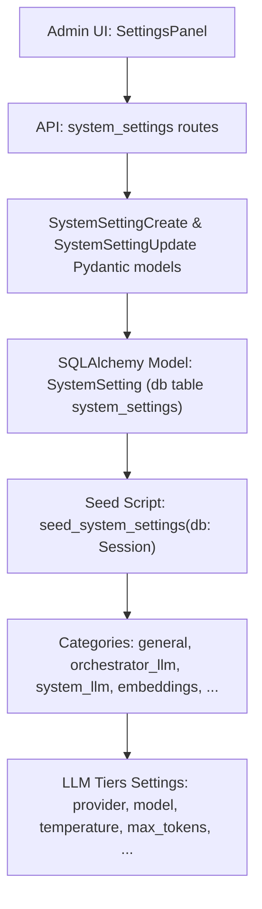
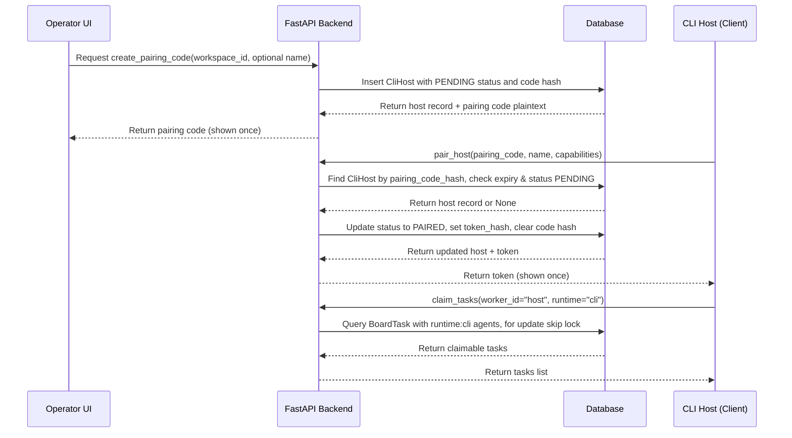

# Runbooks & Operational Docs

<details>
<summary>Relevant source files</summary>

The following files were used as context for generating this wiki page:

- [.gitleaksignore](.gitleaksignore)
- [Makefile](Makefile)
- [docs/PRDS/PRD-206-MEMORY-CONTINUITY-PERSONAL-CONTEXT.md](docs/PRDS/PRD-206-MEMORY-CONTINUITY-PERSONAL-CONTEXT.md)
- [docs/PRDS/PRD-234-SESSION-MODE-SUBSCRIPTION-RUNTIME.md](docs/PRDS/PRD-234-SESSION-MODE-SUBSCRIPTION-RUNTIME.md)
- [docs/getting-started/self-hosting.md](docs/getting-started/self-hosting.md)
- [docs/runbooks/S10-MEMORY-BASELINE-FREEZE.md](docs/runbooks/S10-MEMORY-BASELINE-FREEZE.md)
- [frontend/components/__tests__/prd205-auto-speaks.test.ts](frontend/components/__tests__/prd205-auto-speaks.test.ts)
- [frontend/components/settings/GeneralSettingsTab.tsx](frontend/components/settings/GeneralSettingsTab.tsx)
- [frontend/components/settings/SessionModeTab.tsx](frontend/components/settings/SessionModeTab.tsx)
- [orchestrator/core/models/system_settings.py](orchestrator/core/models/system_settings.py)
- [orchestrator/core/seeds/seed_system_settings.py](orchestrator/core/seeds/seed_system_settings.py)
- [orchestrator/evals/graphiti_vs_baseline.py](orchestrator/evals/graphiti_vs_baseline.py)
- [orchestrator/modules/memory/write_contract.py](orchestrator/modules/memory/write_contract.py)
- [orchestrator/services/cli_host_service.py](orchestrator/services/cli_host_service.py)
- [orchestrator/tests/test_prd198_graphiti_gate.py](orchestrator/tests/test_prd198_graphiti_gate.py)
- [orchestrator/tests/test_prd205_auto_speaks.py](orchestrator/tests/test_prd205_auto_speaks.py)
- [orchestrator/tests/test_prd206_write_contract.py](orchestrator/tests/test_prd206_write_contract.py)
- [orchestrator/tests/test_prd234_s1a_cli_hosts_realdb.py](orchestrator/tests/test_prd234_s1a_cli_hosts_realdb.py)
- [orchestrator/tests/test_system_settings_null_flags.py](orchestrator/tests/test_system_settings_null_flags.py)
- [services/cli-host/automatos_cli_host/allowlist.py](services/cli-host/automatos_cli_host/allowlist.py)
- [services/cli-host/automatos_cli_host/hook_server.py](services/cli-host/automatos_cli_host/hook_server.py)

</details>


This page covers the key operational documentation and runbooks essential for understanding, operating, and self-hosting the Automatos AI platform. It consolidates references to critical runbooks such as memory baseline freeze and disaster recovery procedures, the self-hosting setup guide, as well as audit and review processes. It also points to contribution guidelines that facilitate ongoing maintenance and collaboration.

---

## 1. Runbooks Folder — `docs/runbooks`

The `docs/runbooks` directory contains curated operational runbooks, including:

- **Memory Baseline Freeze Runbook (`S10-MEMORY-BASELINE-FREEZE.md`):** 

  This runbook defines the baseline measurement for memory continuity improvements (PRD-198). It serves as a checkpoint to measure progress and gate adoption of new memory features such as Graphiti recall enhancements. The memory baseline freeze ensures that any new memory model or retrieval upgrades yield measurable improvements relative to a stable, known baseline.

- **Disaster Recovery (DR):**

  Procedural documents detailing the steps for recovering from service failures, data corruptions, or infrastructure outages. It includes database restoration, configuration resets, and component restart sequences (leveraging existing infrastructure such as PostgreSQL with pgvector, Redis, MinIO object store, and Qdrant vector database).

These runbooks are authored primarily as markdown files fully grounded in code and deployment realities.

---

## 2. Self-Hosting Guide

The official self-hosting guide is located at:

```
docs/getting-started/self-hosting.md
```

It provides a detailed walkthrough of running Automatos AI locally with Docker Compose. The guide is comprehensive and references committed configuration templates and environment defaults:

- Pre-requisites: Docker Desktop/Engine with Compose v2, Git, disk space, free network ports.
- Essential secret variables: `POSTGRES_PASSWORD`, `REDIS_PASSWORD`, `API_KEY` (backend API principal).
- Service roles:
  - **Postgres with pgvector (port 5432):** Persistent relational and vector chunk storage for RAG search.
  - **Redis (port 6379):** Cache, queues, pub/sub.
  - **MinIO (ports 9000/9001):** S3-compatible store for documents, deliverables, and assets.
  - **Backend (port 8000):** FastAPI application serving API endpoints.
  - **Frontend (port 3000):** Next.js SPA for user interaction.
  - **Workspace Worker (no external port):** Containerized sandbox for code canvas, agent execution, and command runs.
  - Additional optional services: adminer for DB GUI, Gotenberg for document rendering.
- Configuration files and layering:
  - `.env` for secrets substituted by Compose.
  - `envs/api.defaults` and `envs/frontend.defaults` for code defaults.
  - Codebase configuration module `orchestrator/config.py` reading environment.
- Notes on update, reset, debug workflows.

This guide serves as the authoritative source of truth for local and private deployment, easing operator onboarding and safe experimentation.

---

## 3. Audits and Reviews

The platform maintains structured processes for audits and reviews to guarantee system reliability, data privacy, compliance, and security:

- **Audit Trails:** Full audit logs are recorded in database tables enabling traceability of actions and changes (linked to audit_service and GDPR erasure pipelines).
- **Memory Write Contract Validation:** Dual-path memory writes (distill and platform tool paths) conform to a unified metadata contract to prevent secret leakage or inconsistent data. Tests validate that private data scopes and user consent are respected across memory writes.
- **Code Reviews & PRD-Driven Development:** PRDs (Product Requirement Documents) in `docs/PRDS` drive implementation with enforced acceptance by automation scripts (`ralph acceptance scripts`, `prd_parity`).
- **Security Hardening:** Includes CORS guards, webhook HMAC verification, and strict permission enforcement with hierarchical capabilities and bypass audit logging.
- **Compliance with AI Act & GDPR:** Modules enforce policy constraints, consent management, and erasure cascades.
  
These systems are crucial for delivering a trustworthy platform in customer environments.

---

## 4. Contribution Guidelines — `docs/CONTRIBUTING.md`

Development and maintenance of the Automatos AI codebase are governed by the contribution guide, which outlines:

- Coding standards and linting rules.
- Git workflow: branch naming, PRs, reviews, and approvals.
- Testing requirements, including unit, integration, and end-to-end tests.
- PRD alignment: contributions must link to relevant PRD tickets.
- Documentation updates: every feature or bugfix requires corresponding docs or wiki updates.
- Security and privacy expectations in code changes.
  
Following these rules helps maintain code quality and project coherence.

---

## 5. Key System Settings for Operations & Self-Hosting

The configuration of Automatos AI centers on system settings stored in the database in the `system_settings` table, managed by models and seed scripts:

### 5.1 SystemSetting Model (`orchestrator/core/models/system_settings.py`)

- Represents a key/value pair with metadata: category, description, type, sensitivity, validation rules.
- Categories include `general`, `orchestrator_llm` (the Auto brain LLM), `system_llm`, `embeddings`, and operational areas like monitoring, backups, API rate limiting.
- Supports typed values with validation hints.
- Settings support default values and flags for required or sensitive inputs.

### 5.2 System Settings Seed (`orchestrator/core/seeds/seed_system_settings.py`)

- Seeds default system settings without overwriting user-set values.
- Settings cover comprehensive LLM tier configurations (e.g., provider, model, temperature, max tokens) for Auto and System tiers.
- Also includes general environment and deployment settings.
  
These seeds ensure a consistent out-of-the-box operational posture while enabling secure and flexible overrides locally or per workspace.

---

## 6. Operational Data Flow & Interaction

### Memory Baseline Freeze & Runbooks Interaction

The process to freeze memory baseline metrics and run evaluations is automated via test suites such as:

- `orchestrator/tests/test_prd198_graphiti_gate.py` — Implements gates comparing baseline memory recall versus new treatment variants for evaluating memory continuity improvements.

### Hosting & CLI Host Contract

The CLI host service manages pairing, claims, heartbeats, and reconciliation with the orchestrator:

- Hosts pair via an 8-character code (one-time secret) to receive a token.
- Host tokens are hashed and stored; validation employs constant-time comparison for security.
- Hosts claim tasks (board tasks) filtered by `runtime: cli`.
- Heartbeats update host presence, renegotiate claimed tasks, and reconcile running sessions.
- Task outputs may be placed in workspace volumes and registered as deliverables.

This contract enables orchestration of user-side runtime agents obeying platform security and operational guards.

---

## 7. Diagrams

### 7.1 Natural Language to Code Entities — System Settings Configuration Flow



*This diagram shows how user/system settings flow from frontend UI through API validation into persistent storage and seeding.*

---

### 7.2 Natural Language to Code Entities — CLI Host Pairing and Task Claim Workflow



*This sequence illustrates the pairing code issuance, token exchange, and task claiming flow between operator UI, backend, database, and the CLI host client agent.*

---

## Summary

This leaf page documents the critical operational and runbook resources embedded in the Automatos AI codebase. It covers the procedural and technical aspects of managing system settings, enabling local self-hosting deployments, running memory continuity baselines, handling CLI host lifecycle for session mode agents, and maintaining rigorous audit and security compliance. The links between natural language operational concepts and the underlying code modules and database models are clearly bridged by diagrams and model explanations to empower operators and developers alike.

---

## Sources

- `docs/getting-started/self-hosting.md`  
- `docs/runbooks/S10-MEMORY-BASELINE-FREEZE.md` (referenced)  
- `orchestrator/core/seeds/seed_system_settings.py:1-171`  
- `orchestrator/core/models/system_settings.py:1-152`  
- `orchestrator/services/cli_host_service.py:1-197`  
- `orchestrator/tests/test_prd198_graphiti_gate.py:1-106`  
- `orchestrator/tests/test_prd206_write_contract.py:1-189`

---