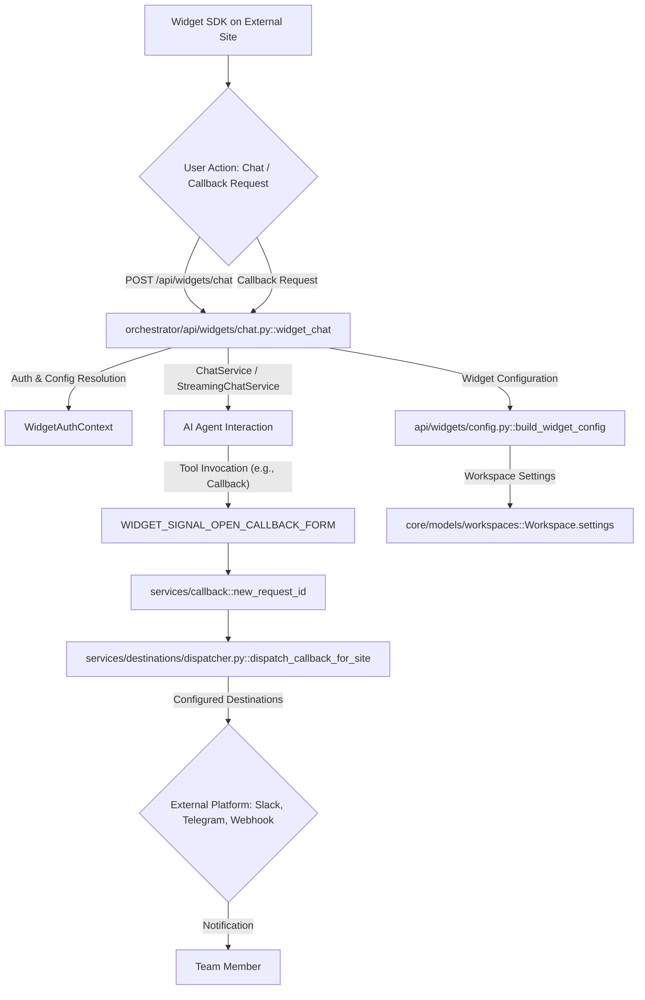

# Embedded Widgets, Sites & Verticals

<details>
<summary>Relevant source files</summary>

The following files were used as context for generating this wiki page:

- [frontend/components/settings/WidgetSdkTab.tsx](frontend/components/settings/WidgetSdkTab.tsx)
- [frontend/components/sites/CallbackPanel.tsx](frontend/components/sites/CallbackPanel.tsx)
- [frontend/components/sites/CartIdlePanel.tsx](frontend/components/sites/CartIdlePanel.tsx)
- [frontend/components/sites/ShopifyTab.tsx](frontend/components/sites/ShopifyTab.tsx)
- [frontend/components/sites/SyncPanel.tsx](frontend/components/sites/SyncPanel.tsx)
- [frontend/lib/sites/api.ts](frontend/lib/sites/api.ts)
- [frontend/lib/sites/types.ts](frontend/lib/sites/types.ts)
- [orchestrator/api/sites.py](orchestrator/api/sites.py)
- [orchestrator/api/widgets/chat.py](orchestrator/api/widgets/chat.py)
- [orchestrator/integrations/__init__.py](orchestrator/integrations/__init__.py)
- [orchestrator/integrations/shopify/__init__.py](orchestrator/integrations/shopify/__init__.py)
- [orchestrator/integrations/shopify/context_fields.py](orchestrator/integrations/shopify/context_fields.py)
- [orchestrator/integrations/shopify/tests/__init__.py](orchestrator/integrations/shopify/tests/__init__.py)
- [orchestrator/integrations/shopify/tests/conftest.py](orchestrator/integrations/shopify/tests/conftest.py)
- [orchestrator/integrations/shopify/tests/test_widget_proactive.py](orchestrator/integrations/shopify/tests/test_widget_proactive.py)
- [orchestrator/integrations/shopify/widget_proactive.py](orchestrator/integrations/shopify/widget_proactive.py)
- [orchestrator/integrations/tests/__init__.py](orchestrator/integrations/tests/__init__.py)
- [orchestrator/integrations/tests/test_registry_contract.py](orchestrator/integrations/tests/test_registry_contract.py)
- [orchestrator/services/destinations/base.py](orchestrator/services/destinations/base.py)
- [orchestrator/services/destinations/dispatcher.py](orchestrator/services/destinations/dispatcher.py)
- [orchestrator/tests/test_api_key_domain_check.py](orchestrator/tests/test_api_key_domain_check.py)
- [orchestrator/tests/test_prd008a_callback_test_endpoint.py](orchestrator/tests/test_prd008a_callback_test_endpoint.py)
- [orchestrator/tests/test_prd008a_destinations.py](orchestrator/tests/test_prd008a_destinations.py)
- [orchestrator/tests/test_prd183_s5_vertical_provision.py](orchestrator/tests/test_prd183_s5_vertical_provision.py)
- [orchestrator/tests/test_widget_proactive_prd007.py](orchestrator/tests/test_widget_proactive_prd007.py)

</details>


This page provides a high-level overview of Automatos AI's capabilities for embedding AI agents into external websites and applications. It covers the core components that enable the embeddable chat widget SDK, the configuration of sites and destinations for these widgets, and specialized vertical integrations, particularly with Shopify. Detailed technical information for each of these areas is provided in their respective child pages.

## Widget API & Session Model

The embeddable chat widget interacts with the Automatos AI backend through a dedicated API router. This API handles core functionalities such as chat message exchange, user authentication for the widget, session management, and configuration resolution. It also provides endpoints for accessing documents and data relevant to the widget's context, adhering to a defined schema for data exchange. Internationalization (i18n) is supported to cater to diverse user bases. Security measures like Cross-Origin Resource Sharing (CORS) and rate limiting are enforced, and SDK API keys are used for authentication, coupled with domain checks to prevent unauthorized usage.

The `api/widgets` router [orchestrator/api/widgets/chat.py:50-50]() is the central entry point for widget interactions. It reuses existing `ChatService` and `StreamingChatService` [orchestrator/api/widgets/chat.py:176-176]() from `consumers.chatbot` to ensure consistent agent, memory, and tool-loop capabilities. Widget users are mapped to a default internal user ID to satisfy foreign-key constraints [orchestrator/api/widgets/chat.py:89-104]().

For details, see [Widget API & Session Model](#28.1).

## Sites, Destinations & Callbacks

The platform allows for the configuration of "Sites," which represent external websites or applications where the widget is embedded. Each site can have various "Destinations" configured for handling specific events, such as callback requests. The `services/sites` module manages the CRUD operations for these sites [orchestrator/api/sites.py:43-52]().

A key feature is the callback service, which dispatches callback requests from the widget to configured destinations. This dispatching is handled by the `services.destinations.dispatcher` [orchestrator/services/destinations/dispatcher.py:1-18](), which routes requests to various platforms like Telegram, Slack, or webhooks. The frontend provides UI components like `SyncPanel` [frontend/components/sites/SyncPanel.tsx:30-55](), `CallbackPanel` [frontend/components/sites/CallbackPanel.tsx:64-69](), and `CartIdlePanel` [frontend/components/sites/CartIdlePanel.tsx:1-1](), which allow users to configure these settings. The `WidgetSdkTab` [frontend/components/settings/WidgetSdkTab.tsx:31-36]() in the frontend settings provides embedding instructions and access to these configuration panels.

### Widget Interaction Flow

Sources:
- [orchestrator/api/widgets/chat.py:50-50]()
- [orchestrator/api/widgets/chat.py:176-176]()
- [orchestrator/api/widgets/chat.py:89-104]()
- [orchestrator/services/destinations/dispatcher.py:1-18]()
- [frontend/components/sites/SyncPanel.tsx:30-55]()
- [frontend/components/sites/CallbackPanel.tsx:64-69]()
- [frontend/components/sites/CartIdlePanel.tsx:1-1]()
- [frontend/components/settings/WidgetSdkTab.tsx:31-36]()

For details, see [Sites, Destinations & Callbacks](#28.2).

## Shopify & Vertical Integrations

Automatos AI offers specialized integrations for vertical markets, with Shopify being a prominent example. The `integrations/shopify` package [orchestrator/integrations/shopify/__init__.py:1-1]() provides specific functionalities tailored for Shopify stores. This includes proactive engagement features (`widget_proactive`) [orchestrator/integrations/shopify/widget_proactive.py:1-31]() that leverage `context_fields` [orchestrator/integrations/shopify/context_fields.py:1-1]() to generate context-aware messages, such as product page openers or cart-idle nudges.

The integration involves provisioning and connecting to the Shopify API, handling events, and debouncing catalog synchronization to keep the AI's knowledge graph up-to-date with product information. Secure credential management is ensured through a credential bridge encryption service. The `integrations` registry contract [orchestrator/integrations/__init__.py:1-1]() ensures that these vertical integrations are properly registered and discoverable by the system.

### Shopify Integration Architecture
```mermaid
graph TD
    A[Shopify Store] --> B{Shopify API / Webhooks};
    B --> C[integrations/shopify package];
    C -- "Provision / Connect" --> D[Credential Bridge Encryption];
    D --> E[Automatos AI Backend];
    E -- "Debounced Catalog Sync" --> F[Knowledge Graph (Product Data)];
    E -- "Widget Proactive Engagement" --> G[Embedded Widget on Shopify Store];
    G -- "Context Fields (e.g., productTitle)" --> C;
    C -- "handle_widget_message" --> H[PLUGIN_REGISTRY["shopify"]];
    H --> I[integrations/shopify/widget_proactive.py];
    I -- "_build_proactive_opener_message" --> J[Context-aware Message];
    J --> G;
```
Sources:
- [orchestrator/integrations/shopify/__init__.py:1-1]()
- [orchestrator/integrations/shopify/widget_proactive.py:1-31]()
- [orchestrator/integrations/shopify/context_fields.py:1-1]()
- [orchestrator/integrations/__init__.py:1-1]()

For details, see [Shopify & Vertical Integrations](#28.3).

---