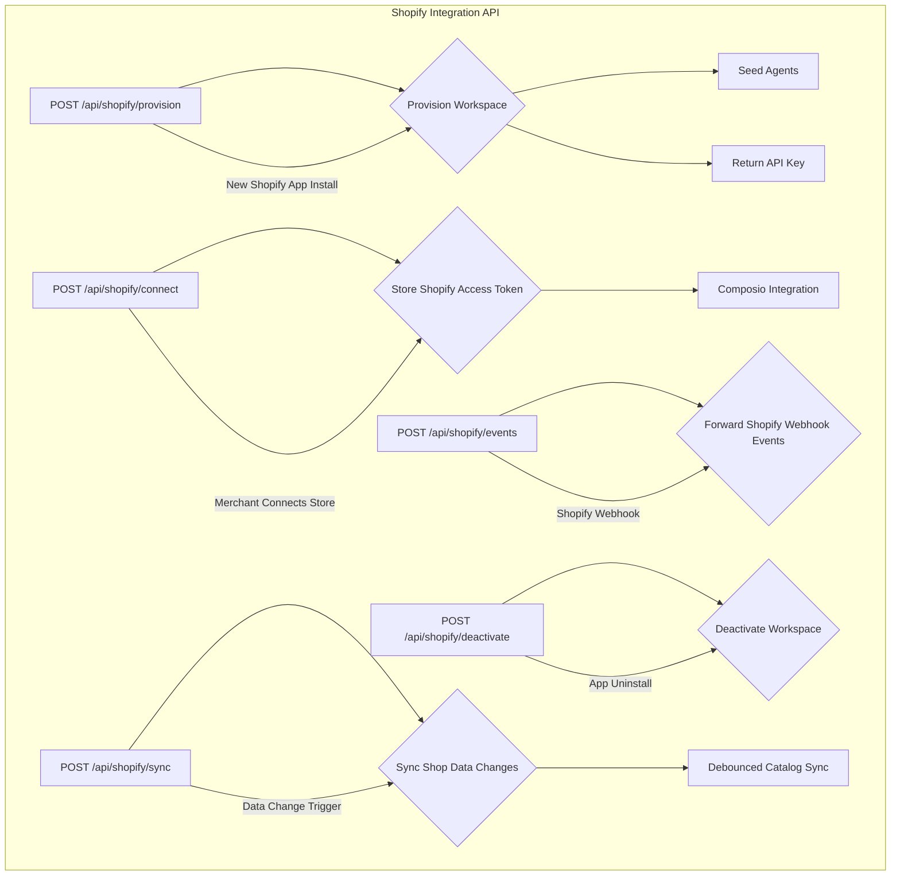
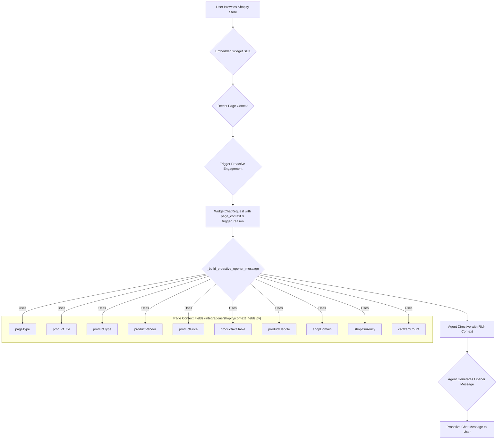

# Shopify & Vertical Integrations

Relevant source files

The following files were used as context for generating this wiki page:

- [frontend/components/knowledge/BusinessGraphPanel.tsx](frontend/components/knowledge/BusinessGraphPanel.tsx)
- [frontend/components/knowledge/BusinessGraphVisualization.tsx](frontend/components/knowledge/BusinessGraphVisualization.tsx)
- [frontend/components/knowledge/KnowledgeGraphExplorer.tsx](frontend/components/knowledge/KnowledgeGraphExplorer.tsx)
- [frontend/components/settings/DynamicCredentialForm.tsx](frontend/components/settings/DynamicCredentialForm.tsx)
- [frontend/lib/api/credentials.ts](frontend/lib/api/credentials.ts)
- [orchestrator/api/credentials.py](orchestrator/api/credentials.py)
- [orchestrator/api/knowledge_graph.py](orchestrator/api/knowledge_graph.py)
- [orchestrator/api/shopify.py](orchestrator/api/shopify.py)
- [orchestrator/api/widgets/chat.py](orchestrator/api/widgets/chat.py)
- [orchestrator/core/credentials/integration_bridges/__init__.py](orchestrator/core/credentials/integration_bridges/__init__.py)
- [orchestrator/core/credentials/integration_bridges/base.py](orchestrator/core/credentials/integration_bridges/base.py)
- [orchestrator/core/credentials/integration_bridges/shopify.py](orchestrator/core/credentials/integration_bridges/shopify.py)
- [orchestrator/core/credentials/service.py](orchestrator/core/credentials/service.py)
- [orchestrator/core/models/credentials.py](orchestrator/core/models/credentials.py)
- [orchestrator/integrations/__init__.py](orchestrator/integrations/__init__.py)
- [orchestrator/integrations/shopify/__init__.py](orchestrator/integrations/shopify/__init__.py)
- [orchestrator/integrations/shopify/context_fields.py](orchestrator/integrations/shopify/context_fields.py)
- [orchestrator/integrations/shopify/tests/__init__.py](orchestrator/integrations/shopify/tests/__init__.py)
- [orchestrator/integrations/shopify/tests/conftest.py](orchestrator/integrations/shopify/tests/conftest.py)
- [orchestrator/integrations/shopify/tests/test_widget_proactive.py](orchestrator/integrations/shopify/tests/test_widget_proactive.py)
- [orchestrator/integrations/shopify/widget_proactive.py](orchestrator/integrations/shopify/widget_proactive.py)
- [orchestrator/integrations/tests/__init__.py](orchestrator/integrations/tests/__init__.py)
- [orchestrator/integrations/tests/test_registry_contract.py](orchestrator/integrations/tests/test_registry_contract.py)
- [orchestrator/modules/context/sections/graph_context.py](orchestrator/modules/context/sections/graph_context.py)
- [orchestrator/modules/knowledge/community_reports.py](orchestrator/modules/knowledge/community_reports.py)
- [orchestrator/modules/knowledge/graph_extraction.py](orchestrator/modules/knowledge/graph_extraction.py)
- [orchestrator/modules/knowledge/graph_service.py](orchestrator/modules/knowledge/graph_service.py)
- [orchestrator/modules/tools/discovery/actions_graph.py](orchestrator/modules/tools/discovery/actions_graph.py)
- [orchestrator/modules/tools/discovery/handlers_graph.py](orchestrator/modules/tools/discovery/handlers_graph.py)
- [orchestrator/tests/test_api_key_domain_check.py](orchestrator/tests/test_api_key_domain_check.py)
- [orchestrator/tests/test_graph_relation_vocab.py](orchestrator/tests/test_graph_relation_vocab.py)
- [orchestrator/tests/test_p2w2_credentials_null_workspace.py](orchestrator/tests/test_p2w2_credentials_null_workspace.py)
- [orchestrator/tests/test_prd165_s2_graph.py](orchestrator/tests/test_prd165_s2_graph.py)
- [orchestrator/tests/test_prd165_s3_community.py](orchestrator/tests/test_prd165_s3_community.py)
- [orchestrator/tests/test_prd183_s1_catalog_webhook.py](orchestrator/tests/test_prd183_s1_catalog_webhook.py)
- [orchestrator/tests/test_prd183_s5_vertical_provision.py](orchestrator/tests/test_prd183_s5_vertical_provision.py)
- [orchestrator/tests/test_prd189_s3_webhook_debounce.py](orchestrator/tests/test_prd189_s3_webhook_debounce.py)
- [orchestrator/tests/test_widget_proactive_prd007.py](orchestrator/tests/test_widget_proactive_prd007.py)

This page details the implementation of the Shopify integration within the Automatos AI platform, focusing on the `integrations/shopify` package. It covers the provisioning and connection flows, event handling, proactive widget features, catalog synchronization, credential management, and the overall integration registry contract.

## Shopify Integration Overview

The Shopify integration enables Automatos AI to interact with Shopify stores, providing functionalities such as workspace provisioning, handling Shopify webhooks, and proactive engagement through the embedded widget. The core of this integration resides in the `orchestrator/api/shopify.py` and `integrations/shopify` packages.

### Key Components

*   **`orchestrator/api/shopify.py`**: FastAPI endpoints for provisioning new Shopify workspaces, connecting to Shopify stores, handling webhook events, deactivating workspaces, and syncing shop data.
*   **`integrations/shopify/provision.py`**: Contains the logic for provisioning a new Automatos AI workspace specifically tailored for Shopify merchants, including seeding agents and configuring widget defaults.
*   **`integrations/shopify/widget_proactive.py`**: Implements the proactive widget functionality, generating opener messages based on page context (e.g., product pages, cart idle).
*   **`integrations/shopify/context_fields.py`**: Defines the structure and extraction logic for various Shopify-specific context fields used by the proactive widget.
*   **`core/credentials/integration_bridges/shopify.py`**: Handles the secure storage and management of Shopify API credentials, bridging them to Composio for tool execution.
*   **`integrations/__init__.py`**: Defines the `IntegrationRegistry` contract, ensuring all vertical integrations adhere to a common interface.

Sources:
* [orchestrator/api/shopify.py:1-12]()
* [orchestrator/integrations/shopify/provision.py]()
* [orchestrator/integrations/shopify/widget_proactive.py]()
* [orchestrator/integrations/shopify/context_fields.py]()
* [orchestrator/core/credentials/integration_bridges/shopify.py]()
* [orchestrator/integrations/__init__.py]()

## Shopify API Endpoints

The `orchestrator/api/shopify.py` module exposes several FastAPI endpoints to manage the Shopify integration lifecycle.

**Shopify Integration API Endpoints**

### `POST /api/shopify/provision`

This endpoint is called when a Shopify merchant installs the Automatos app. It provisions a new Automatos workspace, seeds initial agents, and returns a public widget API key. This is a thin compatibility wrapper over the generic vertical provisioning flow.

*   **Request Body**: `ProvisionRequest` [orchestrator/api/shopify.py:109-113]()
    *   `source`: "shopify"
    *   `external_id`: Shop domain (e.g., `store.myshopify.com`)
    *   `name`: Shop display name
    *   `metadata`: Additional metadata
*   **Response Body**: `ProvisionResponse` [orchestrator/api/shopify.py:116-123]()
    *   `id`, `public_id`, `name`: Workspace identifiers
    *   `api_key`: Public widget API key (shown once)
    *   `agents_installed`: Number of agents seeded
    *   `is_new`: True if a new workspace was created

The actual provisioning logic is delegated to `integrations.provisioning.provision_vertical` [orchestrator/api/shopify.py:166-174]().

### `POST /api/shopify/connect`

This endpoint stores the Shopify access token for Composio integration. It's part of the merchant connection flow.

*   **Request Body**: `ConnectRequest` [orchestrator/api/shopify.py:125-128]()
    *   `workspace_id`
    *   `shop_domain`
    *   `access_token`

### `POST /api/shopify/events`

This endpoint forwards Shopify webhook events to the Automatos AI platform for processing.

*   **Request Body**: `EventRequest` [orchestrator/api/shopify.py:131-134]()
    *   `shop`: Shop domain
    *   `event`: Webhook event type
    *   `data`: Event payload

### `POST /api/shopify/deactivate`

Handles the deactivation of a workspace when the Shopify app is uninstalled.

*   **Request Body**: `DeactivateRequest` [orchestrator/api/shopify.py:137-140]()
    *   `external_id`: Shop domain
    *   `source`: "shopify"

### `POST /api/shopify/sync`

Triggers a synchronization of shop data changes, often leading to a debounced catalog sync.

*   **Request Body**: `SyncRequest` [orchestrator/api/shopify.py:143-145]()
    *   `shop`: Shop domain
    *   `data`: Data payload

Sources:
* [orchestrator/api/shopify.py:1-12]()
* [orchestrator/api/shopify.py:109-113]()
* [orchestrator/api/shopify.py:116-123]()
* [orchestrator/api/shopify.py:125-128]()
* [orchestrator/api/shopify.py:131-134]()
* [orchestrator/api/shopify.py:137-140]()
* [orchestrator/api/shopify.py:143-145]()
* [orchestrator/api/shopify.py:166-174]()

## Proactive Widget (`widget_proactive`)

The `integrations/shopify/widget_proactive.py` module is responsible for generating proactive opener messages for the embedded chat widget based on the user's current page context. This feature aims to engage users contextually, for example, by offering help on a product page or nudging them on an idle cart page.

### Proactive Opener Message Generation

The `_build_proactive_opener_message` function [integrations/shopify/widget_proactive.py:100-100]() constructs a detailed directive for the agent, incorporating various `page_context` fields. This grounding context helps the agent provide relevant and accurate responses without inventing facts.

**Proactive Widget Flow**

The `PROACTIVE_TRIGGER_REASONS` [orchestrator/api/widgets/chat.py:71-74]() set defines specific triggers like `"proactive_opener"` (for product pages) and `"cart_idle"` (for idle cart pages). When these triggers are active, the chat service uses an opener prompt variant instead of treating the message as a user utterance.

The `DEFAULT_WIDGET_PROACTIVE_CONFIG` [integrations/shopify/provision.py:10-20]() defines the default settings for proactive engagement, including:
*   `enabled`: Defaults to `False` (opt-in).
*   `page_types`: E.g., `["product"]`.
*   `triggers`: E.g., `[{"type": "time_on_page", "seconds": 20}]`.
*   `frequency_cap`: Controls how often proactive messages are shown.
*   `greeting_source`: `agent_with_canned_fallback`.
*   `canned_fallback`: A default message if the agent times out.
*   `agent_timeout_ms`: Timeout for agent response.
*   `popup_style`: Visual style of the popup.
*   `respect_consent`: Whether to respect user consent.
*   `dismissal_persistence`: How long dismissal preferences last.

These settings are projected from `workspace.settings` via `build_widget_config` [orchestrator/api/widgets/config.py:10-10]() and only public keys are exposed to the frontend [orchestrator/tests/test_widget_proactive_prd007.py:86-99]().

Sources:
* [integrations/shopify/widget_proactive.py:100-100]()
* [orchestrator/api/widgets/chat.py:71-74]()
* [integrations/shopify/provision.py:10-20]()
* [orchestrator/api/widgets/config.py:10-10]()
* [orchestrator/tests/test_widget_proactive_prd007.py:86-99]()

## Context Fields (`context_fields`)

The `integrations/shopify/context_fields.py` module defines the specific data points extracted from a Shopify store's frontend to enrich the agent's understanding of the user's context. These fields are crucial for the proactive widget and other context-aware functionalities.

The `ShopifyPageContext` class [integrations/shopify/context_fields.py:10-22]() defines the schema for the page context, including fields like `pageType`, `productTitle`, `productType`, `productVendor`, `productPrice`, `productAvailable`, `productHandle`, `shopDomain`, `shopCurrency`, and `cartItemCount`.

The `extract_shopify_page_context` function [integrations/shopify/context_fields.py:25-25]() is responsible for parsing raw page context data and validating it against the `ShopifyPageContext` schema.

Sources:
* [integrations/shopify/context_fields.py:10-22]()
* [integrations/shopify/context_fields.py:25-25]()

## Shopify API Provision, Connect, and Events

The Shopify integration handles the full lifecycle of connecting a Shopify store to Automatos AI.

### Provisioning

When a Shopify app is installed, the `POST /api/shopify/provision` endpoint is invoked. This triggers the `provision_vertical` function [orchestrator/api/shopify.py:166-174](), which creates a new workspace, seeds default agents, and configures initial settings, including the `DEFAULT_WIDGET_PROACTIVE_CONFIG` [integrations/shopify/provision.py:10-20]().

### Connection

The `POST /api/shopify/connect` endpoint is used to store the Shopify access token. This token is critical for allowing Automatos AI to interact with the Shopify store via Composio.

### Events and Debounced Catalog Sync

Shopify webhooks are received by the `POST /api/shopify/events` endpoint. These events can trigger various actions, including catalog synchronization. The `_handle_product_update` function [integrations/shopify/webhook_handlers.py:10-10]() processes product update webhooks. To prevent excessive updates, a debounced catalog sync mechanism is employed. The `_schedule_debounced_catalog_sync` function [integrator/integrations/shopify/webhook_handlers.py:10-10]() schedules a catalog sync with a delay, ensuring that multiple rapid updates to the same product only trigger a single sync operation.

Sources:
* [orchestrator/api/shopify.py:166-174]()
* [integrations/shopify/provision.py:10-20]()
* [integrator/integrations/shopify/webhook_handlers.py:10-10]()

## Credential Bridge Encryption

Shopify API credentials, particularly the Admin access token (`shpat_*`), are sensitive and require secure handling. The platform employs a canonical Fernet encryption path for at-rest storage.

The `_encrypt_secret` and `_decrypt_secret` functions [orchestrator/api/shopify.py:47-59]() utilize the `core.credentials.encryption` service to encrypt and decrypt these tokens. The encryption key is sourced from `config.CREDENTIAL_ENCRYPTION_KEY`. This ensures that sensitive credentials stored in `workspace.settings.shopify_access_token` are protected.

The `core/credentials/integration_bridges/shopify.py` module acts as a bridge, converting saved n8n-style credentials into working Composio `connected_account` entries. It supports different Shopify credential types:
*   `shopifyAccessTokenApi`: Handles `shpat_` tokens directly via Composio's API\_KEY auth.
*   `shopifyOAuth2Api`: Manages OAuth2 flow for Shopify Partner Apps, returning a redirect URL for frontend authentication.
*   `shopifyApi`: Legacy private-app credentials, reported as unsupported.

The `shopify_access_token` function [orchestrator/core/credentials/integration_bridges/shopify.py:115-115]() intelligently branches based on the `accessToken` format, either using it directly as an API key or initiating an OAuth bounce.

Sources:
* [orchestrator/api/shopify.py:47-59]()
* [orchestrator/core/credentials/integration_bridges/shopify.py:115-115]()

## Integrations Registry Contract

The `integrations` package defines a registry for various vertical integrations, ensuring a consistent interface and lifecycle management.

The `IntegrationRegistry` [integrations/__init__.py:10-10]() acts as a central hub for registering and managing integration-specific logic. This includes:
*   **`provision_vertical`**: A function to provision a new workspace for a specific vertical.
*   **`deactivate_vertical`**: A function to deactivate a workspace.
*   **`get_vertical_settings`**: A function to retrieve vertical-specific settings.

This registry allows the platform to dynamically load and manage integrations, ensuring extensibility and maintainability.

Sources:
* [integrations/__init__.py:10-10]()

---