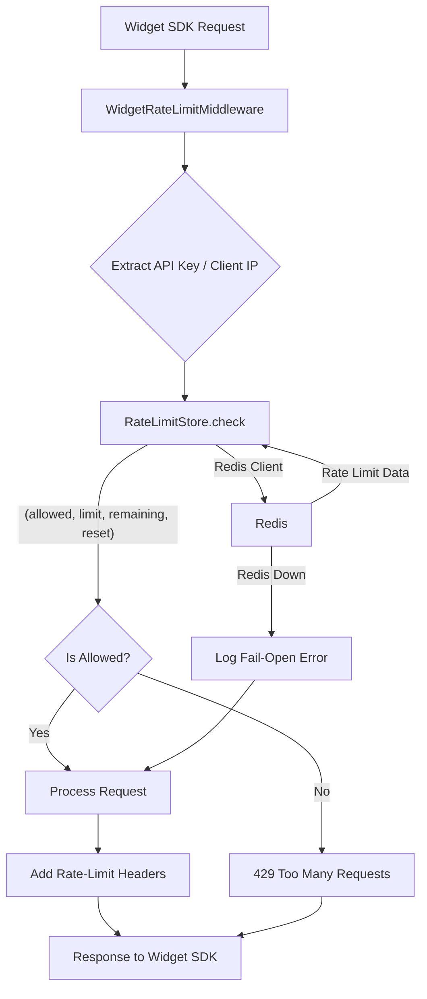

# Widget API & Session Model

<details>
<summary>Relevant source files</summary>

The following files were used as context for generating this wiki page:

- [orchestrator/api/api_keys.py](orchestrator/api/api_keys.py)
- [orchestrator/api/widgets/auth.py](orchestrator/api/widgets/auth.py)
- [orchestrator/api/widgets/callback.py](orchestrator/api/widgets/callback.py)
- [orchestrator/api/widgets/chat.py](orchestrator/api/widgets/chat.py)
- [orchestrator/api/widgets/config.py](orchestrator/api/widgets/config.py)
- [orchestrator/api/widgets/docs.py](orchestrator/api/widgets/docs.py)
- [orchestrator/api/widgets/rate_limit.py](orchestrator/api/widgets/rate_limit.py)
- [orchestrator/api/widgets/router.py](orchestrator/api/widgets/router.py)
- [orchestrator/api/widgets/session.py](orchestrator/api/widgets/session.py)
- [orchestrator/core/database/migrations/043_team_based_document_scoping.sql](orchestrator/core/database/migrations/043_team_based_document_scoping.sql)
- [orchestrator/core/models/sdk_api_keys.py](orchestrator/core/models/sdk_api_keys.py)
- [orchestrator/core/services/api_key_service.py](orchestrator/core/services/api_key_service.py)
- [orchestrator/integrations/__init__.py](orchestrator/integrations/__init__.py)
- [orchestrator/integrations/shopify/__init__.py](orchestrator/integrations/shopify/__init__.py)
- [orchestrator/integrations/shopify/context_fields.py](orchestrator/integrations/shopify/context_fields.py)
- [orchestrator/integrations/shopify/tests/__init__.py](orchestrator/integrations/shopify/tests/__init__.py)
- [orchestrator/integrations/shopify/tests/conftest.py](orchestrator/integrations/shopify/tests/conftest.py)
- [orchestrator/integrations/shopify/tests/test_widget_proactive.py](orchestrator/integrations/shopify/tests/test_widget_proactive.py)
- [orchestrator/integrations/shopify/widget_proactive.py](orchestrator/integrations/shopify/widget_proactive.py)
- [orchestrator/integrations/tests/__init__.py](orchestrator/integrations/tests/__init__.py)
- [orchestrator/integrations/tests/test_registry_contract.py](orchestrator/integrations/tests/test_registry_contract.py)
- [orchestrator/modules/widgets/i18n.py](orchestrator/modules/widgets/i18n.py)
- [orchestrator/services/callback.py](orchestrator/services/callback.py)
- [orchestrator/services/destinations/__init__.py](orchestrator/services/destinations/__init__.py)
- [orchestrator/services/sites.py](orchestrator/services/sites.py)
- [orchestrator/tests/test_api_key_domain_check.py](orchestrator/tests/test_api_key_domain_check.py)
- [orchestrator/tests/test_p2w2_widget_fail_closed.py](orchestrator/tests/test_p2w2_widget_fail_closed.py)
- [orchestrator/tests/test_p2w2_widget_rate_limit.py](orchestrator/tests/test_p2w2_widget_rate_limit.py)
- [orchestrator/tests/test_prd008a_callback_endpoint.py](orchestrator/tests/test_prd008a_callback_endpoint.py)
- [orchestrator/tests/test_prd008a_callback_service.py](orchestrator/tests/test_prd008a_callback_service.py)
- [orchestrator/tests/test_prd008a_i18n.py](orchestrator/tests/test_prd008a_i18n.py)
- [orchestrator/tests/test_prd008a_sites_service.py](orchestrator/tests/test_prd008a_sites_service.py)
- [orchestrator/tests/test_prd008a_widget_config_resolver.py](orchestrator/tests/test_prd008a_widget_config_resolver.py)
- [orchestrator/tests/test_prd183_s5_vertical_provision.py](orchestrator/tests/test_prd183_s5_vertical_provision.py)
- [orchestrator/tests/test_widget_proactive_prd007.py](orchestrator/tests/test_widget_proactive_prd007.py)

</details>


This page details the implementation of the `/api/widgets` router, which provides endpoints for the embeddable chat widget SDK. It covers the core functionalities including chat, authentication, session management, configuration resolution, document handling, data access, documentation schema, internationalization (i18n), Cross-Origin Resource Sharing (CORS), rate limiting, and SDK API key and domain checks.

## Widget Chat API

The widget chat API provides a streaming Server-Sent Events (SSE) endpoint for embedded SDK widgets, allowing real-time conversational interactions. It reuses existing `ChatService` and `StreamingChatService` components from `consumers.chatbot` to ensure that widget conversations benefit from the same agent, memory, and tool-loop capabilities as the main chat UI.

The primary endpoint is `POST /api/widgets/chat` [orchestrator/api/widgets/chat.py:127-128](), which accepts a `WidgetChatRequest` [orchestrator/api/widgets/chat.py:57-68]() containing the user's message, an optional `conversation_id`, `agent_id`, `model_id`, `page_context`, and `trigger_reason`. The `page_context` and `trigger_reason` fields are crucial for proactive engagement scenarios, such as contextual openers on product pages or cart-idle nudges [orchestrator/api/widgets/chat.py:62-67]().

The API streams back various SSE event types: `message` (text delta), `tool-start`, `tool-end`, `tool-data`, and `done` [orchestrator/api/widgets/chat.py:141-145]().

### Data Flow for Widget Chat

When a chat request arrives:
1. **Request Tagging**: Each request is tagged with a unique ID for log correlation [orchestrator/api/widgets/chat.py:151-160]().
2. **Service Import**: The `ChatService` and `StreamingChatService` are dynamically imported. If unavailable, a `503 SERVICE_UNAVAILABLE` error is raised [orchestrator/api/widgets/chat.py:175-182]().
3. **User and Workspace Resolution**: A default user ID (typically `id=1`) is resolved for widget-initiated chats to satisfy foreign-key constraints, as widgets are not tied to specific platform users [orchestrator/api/widgets/chat.py:89-104](). The workspace vertical (e.g., "shopify", "generic") is resolved from `workspace.settings.vertical` to enable plugin dispatch [orchestrator/api/widgets/chat.py:107-121]().
4. **Plugin Dispatch**: The `handle_widget_message` function from the appropriate plugin (e.g., `integrations.shopify.widget_proactive` for Shopify workspaces) is called to process the message. This allows for vertical-specific logic, such as proactive openers or cart recommendations [orchestrator/api/widgets/chat.py:184-185]().
5. **Chat Orchestration**: The `StreamingChatService` orchestrates the conversation, potentially involving agents, memory retrieval, and tool execution.
6. **SSE Streaming**: The generated responses are streamed back to the client as SSE events.

#### Widget Chat Data Flow
```mermaid
graph TD
    A[Widget SDK] --> B{POST /api/widgets/chat};
    B --> C{WidgetAuthContext};
    C --> D[Log Request];
    D --> E{Import Chat Services};
    E -- Success --> F[Resolve Widget User ID];
    F --> G[Resolve Workspace Vertical];
    G --> H{Plugin Dispatch (e.g., Shopify)};
    H -- `handle_widget_message` --> I[StreamingChatService];
    I --> J[Agent Execution];
    I --> K[Memory Retrieval];
    I --> L[Tool Loop];
    J & K & L --> M[Generate SSE Events];
    M --> N[StreamingResponse];
    N --> A;
    E -- Failure --> O[503 Service Unavailable];
    O --> A;
```
Sources:
- [orchestrator/api/widgets/chat.py:1-185]()
- [orchestrator/integrations/shopify/widget_proactive.py:1-31]()

## Widget Authentication and Session Management

The widget API employs a hybrid authentication mechanism for SDK requests, supporting both JWT session tokens and raw API keys.

### Authentication Flow
1. **Bearer Token Extraction**: The `_extract_bearer_token` function attempts to retrieve a Bearer token from the `Authorization` header [orchestrator/api/widgets/auth.py:62-70]().
2. **JWT Session Token (Fast Path)**: If a token is found, `_try_jwt` attempts to decode it as a JWT using `WIDGET_TOKEN_SECRET` and `WIDGET_TOKEN_ALGORITHM` [orchestrator/api/widgets/auth.py:73-94](). If successful, the payload (containing `workspace_id`, `api_key_id`, `permissions`, `default_agent_id`, and `team`) is used to construct a `WidgetAuthContext` [orchestrator/api/widgets/auth.py:137-166]().
3. **Raw API Key Validation (Fallback)**: If no JWT is present or decoding fails, the system falls back to validating the raw API key against the `sdk_api_keys` table using `ApiKeyService.validate_api_key` [orchestrator/api/widgets/auth.py:169-179]().
4. **Domain/Origin Check**: For public keys, the request's origin is checked against the `allowed_domains` configured for the API key. Requests from unauthorized origins are rejected with a `403 Forbidden` error [orchestrator/api/widgets/auth.py:181-184]().
5. **`WidgetAuthContext`**: Upon successful authentication, a `WidgetAuthContext` dataclass is populated with the resolved identity and permissions, which is then passed to downstream route handlers [orchestrator/api/widgets/auth.py:47-56]().

### Session Token Exchange
The `POST /widgets/auth` endpoint [orchestrator/api/widgets/session.py:77-78]() allows SDK users to exchange a **server-type** API key for a short-lived JWT session token. This is crucial for browser clients, as it prevents them from needing direct access to the secret API key [orchestrator/api/widgets/session.py:4-7]().

The `SessionTokenRequest` [orchestrator/api/widgets/session.py:48-55]() includes the `api_key`, optional `user_id`, `permissions`, and `expires_in`. The `expires_in` value is clamped to a maximum of 24 hours (`MAX_EXPIRES_IN`) and defaults to 1 hour (`DEFAULT_EXPIRES_IN`) [orchestrator/api/widgets/session.py:38-39, orchestrator/api/widgets/session.py:57-59]().

The exchange process involves:
1. **Configuration Check**: Ensures `WIDGET_TOKEN_SECRET` is configured for signing [orchestrator/api/widgets/session.py:85-89]().
2. **API Key Validation**: The provided `api_key` is validated using `ApiKeyService.validate_api_key` [orchestrator/api/widgets/session.py:92-97]().
3. **Key Type Check**: Only `server`-type API keys are permitted to exchange for session tokens [orchestrator/api/widgets/session.py:100-104]().
4. **Permission Resolution**: Effective permissions for the session token are determined. Requested permissions must be a subset of the API key's granted permissions [orchestrator/api/widgets/session.py:107-122]().
5. **JWT Generation**: A JWT is built with `workspace_id`, `api_key_id`, `permissions`, `exp` (expiration), `iat` (issued at), and optionally `user_id` and `default_agent_id`. The `team` associated with the API key is also included for team-scoped requests [orchestrator/api/widgets/session.py:124-150]().
6. **Widget Configuration Resolution**: The `resolve_widget_config` function is called to fetch the widget configuration for the workspace, which is then included in the `SessionTokenResponse` [orchestrator/api/widgets/session.py:153-155]().

#### Widget Authentication Flow
```mermaid
graph TD
    A[Widget SDK] --> B{Authorization Header};
    B -- Bearer Token --> C{_extract_bearer_token};
    C -- Token Present --> D{_try_jwt};
    D -- JWT Valid --> E[WidgetAuthContext (from JWT)];
    D -- JWT Invalid/Missing --> F[ApiKeyService.validate_api_key];
    F -- API Key Valid --> G[WidgetAuthContext (from API Key)];
    G --> H{Domain/Origin Check};
    H -- Valid --> I[Authenticated Request];
    H -- Invalid --> J[403 Forbidden];
    C -- No Token --> K[401 Unauthorized];

    subgraph Session Token Exchange
        L[Backend Server] --> M{POST /widgets/auth};
        M -- API Key, Permissions, Expires In --> N[ApiKeyService.validate_api_key];
        N -- Valid Server Key --> O[Resolve Effective Permissions];
        O --> P[Build & Sign JWT];
        P --> Q[Resolve Widget Config];
        Q --> R[SessionTokenResponse (JWT, Config)];
        R --> L;
    end
```
Sources:
- [orchestrator/api/widgets/auth.py:1-184]()
- [orchestrator/api/widgets/session.py:1-164]()
- [orchestrator/core/services/api_key_service.py:1-202]()

## SDK API Keys and Domain Checks

SDK API keys are managed by the `ApiKeyService` [orchestrator/core/services/api_key_service.py:43-44](), which handles their creation, validation, and revocation. Keys are stored as SHA-256 hashes, with the plaintext key returned only once at creation [orchestrator/core/services/api_key_service.py:4-6]().

### Key Types and Permissions
SDK API keys can be of two types:
- **`public`**: Intended for client-side use, these keys require `allowed_domains` to be specified for security [orchestrator/api/api_keys.py:134-139]().
- **`server`**: Intended for backend-to-backend communication, these keys can be exchanged for short-lived JWT session tokens [orchestrator/api/widgets/session.py:99-104]().

Each key can have a list of `permissions` [orchestrator/core/models/sdk_api_keys.py:50](), defining what actions it can perform (e.g., `chat`, `documents:read`, `missions:execute`). A `default_agent_id` can also be associated with a key to lock all widget chats to a specific agent [orchestrator/core/models/sdk_api_keys.py:55]().

### Domain and IP Restrictions
`SdkApiKey` records include `allowed_domains` and `allowed_ips` fields [orchestrator/core/models/sdk_api_keys.py:61-62]().
- **`allowed_domains`**: For `public` keys, requests are only permitted from origins matching these domains. This is a critical security measure to prevent unauthorized embedding [orchestrator/api/widgets/auth.py:181-184](). The `_extract_origin` helper extracts the hostname from the request's `Origin` header, and `_host_only` normalizes domain patterns for matching [orchestrator/api/widgets/auth.py:28, orchestrator/core/services/api_key_service.py:29-39]().
- **`allowed_ips`**: An optional IP allowlist can restrict access to specific IP addresses.

### API Key Management Endpoints
The `/api/api-keys` router [orchestrator/api/api_keys.py:26]() provides CRUD operations for SDK API keys:
- `POST /api/api-keys`: Creates a new API key. The full key is returned only once [orchestrator/api/api_keys.py:123-162]().
- `GET /api/api-keys`: Lists all API keys for a workspace, with keys masked to show only the prefix [orchestrator/api/api_keys.py:165-175]().
- `DELETE /api/api-keys/{key_id}`: Revokes an API key by setting `is_active` to `False` [orchestrator/api/api_keys.py:178-183]().

#### SDK API Key Management
```mermaid
graph TD
    A[Admin Dashboard] --> B{POST /api/api-keys};
    B -- ApiKeyCreateRequest --> C[ApiKeyService.create_api_key];
    C --> D[SdkApiKey (DB)];
    D -- Raw Key, Masked Prefix --> E[ApiKeyCreateResponse];
    E --> A;

    A --> F{GET /api/api-keys};
    F --> G[ApiKeyService.list_api_keys];
    G --> H[List[ApiKeyListItem]];
    H --> A;

    A --> I{DELETE /api/api-keys/{key_id}};
    I --> J[ApiKeyService.revoke_api_key];
    J --> K[RevokeResponse];
    K --> A;

    subgraph Widget SDK Usage
        L[Widget SDK] --> M{Request to /api/widgets/*};
        M -- Bearer Token --> N[widget_auth];
        N -- Public Key --> O{Check allowed_domains};
        O -- Valid --> P[Access Granted];
        O -- Invalid --> Q[403 Forbidden];
    end
```
Sources:
- [orchestrator/core/models/sdk_api_keys.py:1-73]()
- [orchestrator/core/services/api_key_service.py:1-202]()
- [orchestrator/api/api_keys.py:1-183]()
- [orchestrator/api/widgets/auth.py:1-282]()

## Configuration Resolver

The widget configuration is resolved by `resolve_widget_config` [orchestrator/api/widgets/session.py:155](), which fetches settings relevant to the widget from the workspace's default `Site` [orchestrator/services/sites.py:40-56](). This ensures that widget behavior (e.g., proactive engagement settings) is dynamically configured based on the workspace's setup.

The `build_widget_config` function [orchestrator/api/widgets/config.py:1-10]() projects only public-facing keys from `workspace.settings` to prevent sensitive information from leaking to the browser [orchestrator/tests/test_widget_proactive_prd007.py:86-99]().

Sources:
- [orchestrator/api/widgets/session.py:153-155]()
- [orchestrator/services/sites.py:40-56]()
- [orchestrator/tests/test_widget_proactive_prd007.py:86-99]()

## Documents and Data Access

The widget API can interact with documents and data through the permissions granted to the SDK API key. For example, `documents:read` and `data:query` permissions allow the widget to access relevant information. The `team` field in `SdkApiKey` [orchestrator/core/models/sdk_api_keys.py:58-59]() enables team-based document scoping, ensuring that widget requests are restricted to data relevant to a specific team.

Sources:
- [orchestrator/api/api_keys.py:35-38]()
- [orchestrator/core/models/sdk_api_keys.py:58-59]()

## Docs Schema

The API endpoints for widgets are documented using FastAPI's automatic OpenAPI generation. The `APIRouter` for widgets is tagged with "Widget Chat" and "Widget Auth" [orchestrator/api/widgets/chat.py:50, orchestrator/api/widgets/session.py:41](), ensuring proper categorization in the generated API documentation. Pydantic models like `WidgetChatRequest`, `WidgetMessageOut`, `SessionTokenRequest`, and `SessionTokenResponse` define the request and response schemas [orchestrator/api/widgets/chat.py:56-83, orchestrator/api/widgets/session.py:48-70]().

Sources:
- [orchestrator/api/widgets/chat.py:50]()
- [orchestrator/api/widgets/session.py:41]()
- [orchestrator/api/widgets/chat.py:56-83]()
- [orchestrator/api/widgets/session.py:48-70]()

## Internationalization (i18n)

While not explicitly detailed in the provided snippets for the widget API, the system supports internationalization. The `modules.widgets.i18n` module likely handles language-specific content for widgets.

Sources:
- `orchestrator/modules/widgets/i18n.py` (not shown)

## CORS and Rate Limiting

### CORS
CORS (Cross-Origin Resource Sharing) is implicitly handled by the FastAPI application's middleware stack. For widget APIs, the `allowed_domains` configured for SDK API keys play a crucial role in enforcing CORS-like restrictions at the application level, ensuring that requests only originate from trusted domains [orchestrator/api/widgets/auth.py:181-184]().

### Rate Limiting
The widget API implements robust rate limiting using a Redis-backed sliding window mechanism [orchestrator/api/widgets/rate_limit.py:1-10](). This ensures fair usage and protects against abuse.

Key aspects of the rate limiting implementation:
- **Redis-backed**: Uses a Redis sorted set to store request timestamps, allowing for a shared sliding window across all uvicorn workers [orchestrator/api/widgets/rate_limit.py:107-112]().
- **Identifier Resolution**: The rate limiter identifies requests by a SHA-256 hash of the API key if present, or by the client's IP address as a fallback [orchestrator/api/widgets/rate_limit.py:13-16]().
- **Per-IP Ceiling**: Money-spending endpoints like `/api/widgets/chat` and `/api/widgets/callback` have an additional per-IP ceiling, even when an API key is provided, to prevent abuse from a single source [orchestrator/api/widgets/rate_limit.py:20-24]().
- **Fail Open**: If Redis is unreachable, the rate limiter fails open, allowing requests to proceed but logging errors loudly. This prioritizes availability over strict rate limiting during a cache outage [orchestrator/api/widgets/rate_limit.py:25-28, orchestrator/api/widgets/rate_limit.py:138-141]().
- **Rate-Limit Headers**: Responses include `X-RateLimit-Limit`, `X-RateLimit-Remaining`, and `X-RateLimit-Reset` headers to inform clients about their rate limit status [orchestrator/api/widgets/rate_limit.py:34-37]().
- **429 Too Many Requests**: When limits are exceeded, a `429 Too Many Requests` status with a `Retry-After` header is returned [orchestrator/api/widgets/rate_limit.py:40-41]().
- **`RateLimitStore`**: The `RateLimitStore` class manages the Redis interactions for checking and updating rate limits [orchestrator/api/widgets/rate_limit.py:107-167]().
- **`WidgetRateLimitMiddleware`**: This ASGI middleware applies the rate limiting logic before any route handler is executed [orchestrator/api/widgets/rate_limit.py:174-178]().

#### Widget Rate Limiting

Sources:
- [orchestrator/api/widgets/rate_limit.py:1-178]()
- [orchestrator/api/widgets/auth.py:181-184]()

---