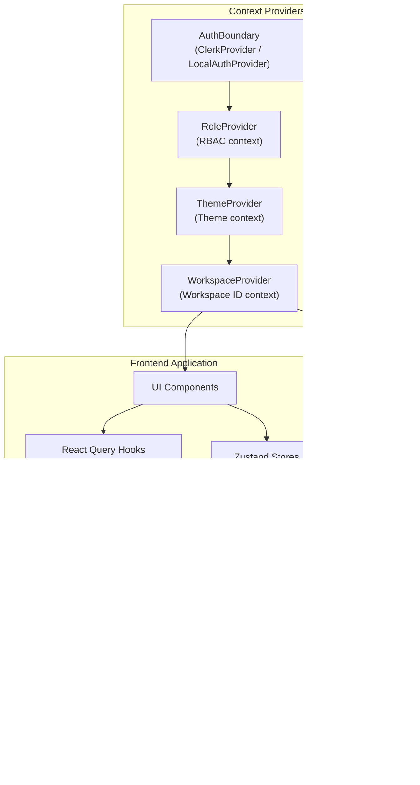
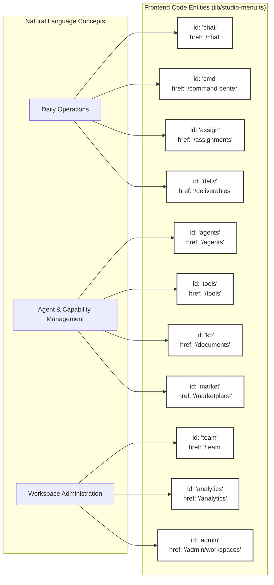

# Frontend Architecture

<details>
<summary>Relevant source files</summary>

The following files were used as context for generating this wiki page:

- [frontend/DESIGN_SYSTEM.md](frontend/DESIGN_SYSTEM.md)
- [frontend/app/accept-invitation/page.tsx](frontend/app/accept-invitation/page.tsx)
- [frontend/app/reset-password/page.tsx](frontend/app/reset-password/page.tsx)
- [frontend/app/sso-callback/page.tsx](frontend/app/sso-callback/page.tsx)
- [frontend/components/auth/sign-in-form.tsx](frontend/components/auth/sign-in-form.tsx)
- [frontend/components/providers.tsx](frontend/components/providers.tsx)
- [frontend/components/shared/empty-state.tsx](frontend/components/shared/empty-state.tsx)
- [frontend/components/shared/index.ts](frontend/components/shared/index.ts)
- [frontend/components/shared/page-header.tsx](frontend/components/shared/page-header.tsx)
- [frontend/components/ui/dialog.tsx](frontend/components/ui/dialog.tsx)
- [frontend/components/ui/glossary-tooltip.tsx](frontend/components/ui/glossary-tooltip.tsx)
- [frontend/components/ui/input.tsx](frontend/components/ui/input.tsx)
- [frontend/components/ui/select.tsx](frontend/components/ui/select.tsx)
- [frontend/components/ui/tabs.tsx](frontend/components/ui/tabs.tsx)
- [frontend/components/ui/theme-toggle.tsx](frontend/components/ui/theme-toggle.tsx)
- [frontend/components/workflows/json-schema-editor.tsx](frontend/components/workflows/json-schema-editor.tsx)
- [frontend/components/workflows/playbook-step-progress.tsx](frontend/components/workflows/playbook-step-progress.tsx)
- [frontend/components/workflows/theater/theater-step-execution.tsx](frontend/components/workflows/theater/theater-step-execution.tsx)
- [frontend/hooks/use-studio-theme.ts](frontend/hooks/use-studio-theme.ts)
- [frontend/lib/design-utils.ts](frontend/lib/design-utils.ts)
- [frontend/lib/glossary.ts](frontend/lib/glossary.ts)
- [frontend/lib/studio-menu.ts](frontend/lib/studio-menu.ts)
- [frontend/middleware.ts](frontend/middleware.ts)
- [frontend/next.config.js](frontend/next.config.js)
- [frontend/package-lock.json](frontend/package-lock.json)
- [frontend/package.json](frontend/package.json)
- [frontend/tailwind.config.ts](frontend/tailwind.config.ts)
- [orchestrator/alembic/versions/add_clerk_invitation_id.py](orchestrator/alembic/versions/add_clerk_invitation_id.py)

</details>


## Purpose and Scope

This document describes the technical architecture of the Automatos AI frontend application, including its Next.js structure, state management patterns, component hierarchies, and the "Studio" rebrand design system. The frontend serves as the primary interface for managing autonomous agents, complex workflows (Playbooks), and multi-agent coordination (Missions).

---

## Next.js Application Structure

The frontend is built with **Next.js** using the App Router. It features a dual-shell architecture that supports both a "Classic" glassmorphic look and a high-editorial "Studio" theme [frontend/components/providers.tsx:93-94](). The `next.config.js` file defines build configurations, security headers, and redirects [frontend/next.config.js:13-122]().

### Project Layout

```
frontend/
├── app/                          # Next.js App Router pages
│   ├── globals.css              # Design system tokens & themes [frontend/app/globals.css:1-236]()
│   └── assignments/             # Mission & Playbook hub [frontend/app/assignments/page.tsx]()
├── components/                   # React components
│   ├── layout/                  # MainLayout, Sidebar, StudioHeader [frontend/components/layout/main-layout.tsx:1-30]()
│   ├── assignments/             # Studio-specific workforce components [frontend/components/assignments/studio/assignments-hub.tsx:1-41]()
│   └── ui/                      # Shadcn/ui primitives [frontend/tailwind.config.ts:38-42]()
├── hooks/                       # Theme detection & API hooks [frontend/hooks/use-studio-theme.ts:1-43]()
├── lib/                         # Menu definitions & API client [frontend/lib/studio-menu.ts:1-72]()
└── contexts/                    # RBAC and workspace contexts [frontend/components/providers.tsx:89-100]()
```

**Sources:** [frontend/app/globals.css:1-236](), [frontend/components/layout/main-layout.tsx:1-30](), [frontend/lib/studio-menu.ts:1-72](), [frontend/next.config.js:13-122]()

### Theme & Layout Orchestration

The `Providers` component wraps the entire application, providing context for authentication, theming, and data fetching [frontend/components/providers.tsx:76-114](). It includes a `ThemeProvider` that supports `light`, `dark`, `matte`, and `studio` themes, with the `studio` theme being activated via a URL flag and persisted in local storage [frontend/components/providers.tsx:90-94](), [frontend/hooks/use-studio-theme.ts:16-26]().

**Sources:** [frontend/components/providers.tsx:76-114](), [frontend/hooks/use-studio-theme.ts:16-26]()

---

## State Management & Data Fetching

The application uses **TanStack React Query** for server state management, configured with a 1-minute default `staleTime` [frontend/components/providers.tsx:78-85](). Client-side state is managed using a combination of React Context and Zustand stores.

### State Architecture Diagram



**Sources:** [frontend/components/providers.tsx:78-113](), [frontend/hooks/use-studio-theme.ts:1-43](), [frontend/lib/api-client.ts]()

### Authentication Editions

The frontend supports two authentication modes defined in `AuthBoundary` [frontend/components/providers.tsx:29-75]():
*   **SaaS Edition:** Uses **Clerk** for JWT management and user profiles [frontend/components/providers.tsx:33-74](). The `middleware.ts` file uses `clerkMiddleware` to protect routes [frontend/middleware.ts:20-23]().
*   **Local Edition:** Uses `LocalAuthProvider`, a no-op token getter for self-hosted environments [frontend/components/providers.tsx:30-32](). In this edition, `middleware.ts` acts as a pass-through, making all routes public [frontend/middleware.ts:27-27]().

**Sources:** [frontend/components/providers.tsx:29-75](), [frontend/middleware.ts:1-33]()

---

## UI Component Patterns

### Studio Design System

The "Studio" theme introduces an editorial-first design language characterized by:
*   **Typography:** Serif headlines (`Tiempos Headline`) paired with Mono detail surfaces (`JetBrains Mono`) [frontend/tailwind.config.ts:17-30]().
*   **Editorial Headers:** The `PageHeader` component supports an `eyebrow` (mono uppercase) and a `lede` (relaxed paragraph) to establish context [frontend/components/shared/page-header.tsx:38-86]().
*   **Color Palette:** A "Cream Paper" aesthetic using CSS variables like `--background` and `--primary` (near-black) [frontend/app/globals.css:210-225]().
*   **Shadcn/ui:** The project leverages Shadcn/ui primitives for consistent and accessible UI components [frontend/package.json:58-83]().

**Sources:** [frontend/tailwind.config.ts:17-30](), [frontend/components/shared/page-header.tsx:38-86](), [frontend/app/globals.css:210-225](), [frontend/package.json:58-83]()

### Navigation Mapping

The navigation system uses a single source of truth in `STUDIO_MENU_PRIMARY`, grouping routes into `OPERATIONS`, `WORKFORCE`, and `WORKSPACE` [frontend/lib/studio-menu.ts:55-72](). The `resolveActiveMenuId` function maps current pathnames to active menu items [frontend/lib/studio-menu.ts:105-125]().



**Sources:** [frontend/lib/studio-menu.ts:55-72](), [frontend/lib/studio-menu.ts:105-125]()

---

## Child Pages

For deep technical details on specific frontend subsystems, refer to the following child pages:

*   [Application Structure](#19.1) — Next.js App router, page components, and layout hierarchy.
*   [State Management](#19.2) — React Query hooks, query keys with `wsScope`, and optimistic updates.
*   [API Client](#19.3) — `apiClient` implementation, authentication injection, and workspace context.
*   [UI Component Patterns & Design System](#19.4) — Shared components (StatsBar, page-header, item-card, empty-state), Shadcn/ui primitives, Tailwind theme, premium icons and icon registry, glossary tooltips, DESIGN_SYSTEM.md.
*   [Navigation & Layout](#19.5) — Sidebar navigation, role-based filtering, and page context tracking.
*   [Settings UI](#19.6) — SettingsPanel and its tabs: System, LLM models, system LLM, credentials, channels, webhooks, notifications, API keys, session mode, widget SDK, icons.

**Sources:** [frontend/components/providers.tsx:1-114]()

---