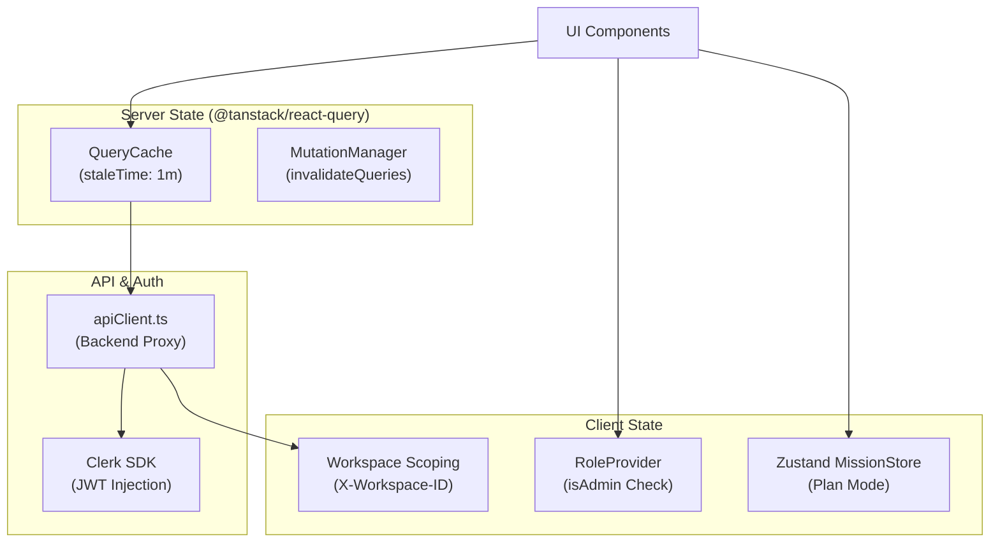
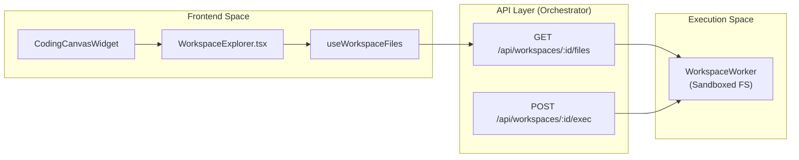

# Frontend Architecture

<details>
<summary>Relevant source files</summary>

The following files were used as context for generating this wiki page:

- [frontend/app/chat/page.tsx](frontend/app/chat/page.tsx)
- [frontend/app/tools/page.tsx](frontend/app/tools/page.tsx)
- [frontend/components/chatbot/chat-widget.tsx](frontend/components/chatbot/chat-widget.tsx)
- [frontend/components/layout/header.tsx](frontend/components/layout/header.tsx)
- [frontend/components/layout/main-layout.tsx](frontend/components/layout/main-layout.tsx)
- [frontend/components/layout/mobile-sidebar.tsx](frontend/components/layout/mobile-sidebar.tsx)
- [frontend/components/layout/sidebar.tsx](frontend/components/layout/sidebar.tsx)
- [frontend/components/tools/my-tools-dashboard.tsx](frontend/components/tools/my-tools-dashboard.tsx)
- [frontend/components/widgets/CodingCanvasWidget/CodeEditor.tsx](frontend/components/widgets/CodingCanvasWidget/CodeEditor.tsx)
- [frontend/components/widgets/CodingCanvasWidget/EditorTabs.tsx](frontend/components/widgets/CodingCanvasWidget/EditorTabs.tsx)
- [frontend/components/widgets/CodingCanvasWidget/FileExplorer.tsx](frontend/components/widgets/CodingCanvasWidget/FileExplorer.tsx)
- [frontend/components/widgets/CodingCanvasWidget/index.tsx](frontend/components/widgets/CodingCanvasWidget/index.tsx)
- [frontend/components/widgets/CodingCanvasWidget/useWorkspaceFiles.ts](frontend/components/widgets/CodingCanvasWidget/useWorkspaceFiles.ts)
- [frontend/components/widgets/FileWidget/FilePreview.tsx](frontend/components/widgets/FileWidget/FilePreview.tsx)
- [frontend/components/widgets/FileWidget/index.tsx](frontend/components/widgets/FileWidget/index.tsx)
- [frontend/components/widgets/index.ts](frontend/components/widgets/index.ts)
- [frontend/components/widgets/router.ts](frontend/components/widgets/router.ts)
- [frontend/components/widgets/types.ts](frontend/components/widgets/types.ts)
- [frontend/components/workspace/WorkspaceExplorer.tsx](frontend/components/workspace/WorkspaceExplorer.tsx)
- [frontend/components/workspace/gallery-view/deliverable-preview.tsx](frontend/components/workspace/gallery-view/deliverable-preview.tsx)
- [frontend/package-lock.json](frontend/package-lock.json)
- [frontend/package.json](frontend/package.json)
- [frontend/public/brand/jira-logo.svg](frontend/public/brand/jira-logo.svg)
- [frontend/yarn.lock](frontend/yarn.lock)
- [orchestrator/api/workspace_files.py](orchestrator/api/workspace_files.py)

</details>


## Purpose and Scope

This document describes the technical architecture of the Automatos AI frontend application, including its Next.js structure, state management patterns, component hierarchies, and API integration layer. The frontend serves as the primary interface for managing autonomous agents, complex workflows, and multi-channel integrations.

---

## Next.js Application Structure

The frontend is built with **Next.js** using the App Router pattern. It follows a standard project structure with a clear separation between page routes, reusable components, and global providers.

### Project Layout

```
frontend/
├── app/                          # Next.js App Router pages
│   ├── chat/                     # Dedicated chat interface [frontend/app/chat/page.tsx:1-145]()
│   ├── layout.tsx               # Root layout with providers [frontend/app/layout.tsx:1-29]()
│   └── (auth)/                  # Auth route group (Clerk integration)
├── components/                   # React components
│   ├── layout/                  # MainLayout, Sidebar, Header [frontend/components/layout/main-layout.tsx:1-119]()
│   ├── chatbot/                 # Chat UI and AutoWidget [frontend/components/chatbot/chat-widget.tsx:1-216]()
│   ├── widgets/                 # Canvas-based widget system [frontend/components/widgets/types.ts:1-179]()
│   └── ui/                      # Shadcn/ui (Radix) primitives [frontend/package.json:58-84]()
├── hooks/                       # Custom React hooks (useAutoTour, useChat)
├── lib/                         # Utilities & Third-party configs
│   └── chat/                    # Chat hooks and streaming logic [frontend/components/chatbot/chat-widget.tsx:32-32]()
└── contexts/                    # React Contexts (role-context) [frontend/components/layout/sidebar.tsx:28-28]()
```

**Sources:** [frontend/app/chat/page.tsx:1-145](), [frontend/components/layout/main-layout.tsx:1-119](), [frontend/package.json:1-142]()

### Layout Hierarchy

The application uses a nested layout strategy. The `MainLayout` provides the persistent desktop `Sidebar` [frontend/components/layout/sidebar.tsx:127-148](), a `Header` containing the `NotificationBell` [frontend/components/layout/header.tsx:7-93](), and a floating `AutoWidget` assistant [frontend/components/layout/main-layout.tsx:112-116](). For mobile users, it dynamically switches to a `MobileSidebar` within a Radix `Sheet` [frontend/components/layout/main-layout.tsx:80-89]().

**Sources:** [frontend/components/layout/main-layout.tsx:61-119](), [frontend/components/layout/sidebar.tsx:127-176](), [frontend/components/layout/mobile-sidebar.tsx:114-124]()

---

## State Management & Data Fetching

The frontend uses a **hybrid state management approach** combining React Query for server state and React Context for workspace/role scoping.

### State Architecture Diagram



**Sources:** [frontend/package.json:88-135](), [frontend/components/layout/sidebar.tsx:130-137](), [frontend/app/chat/page.tsx:14-25]()

### Navigation & RBAC

Navigation items are filtered based on the user's `systemRole`. Admin-only pages like `Workspace Admin` or `Settings` are conditionally rendered using the `isAdmin` flag from `useSystemRole` [frontend/components/layout/sidebar.tsx:134-137]().

**Sources:** [frontend/components/layout/sidebar.tsx:35-125](), [frontend/components/layout/mobile-sidebar.tsx:116-122]()

---

## UI Component Patterns

Automatos AI utilizes a "Glassmorphism" design system, implemented via Tailwind CSS and Framer Motion for smooth transitions.

### The Widget System (PRD-38.1)

The application features a flexible widget architecture used in the Command Center and Chat Canvas. All widgets implement `WidgetBaseProps` and are registered in a central registry [frontend/components/widgets/types.ts:121-148]().

*   **CodingCanvasWidget:** A Monaco-based file browser that proxies requests to the workspace worker [frontend/components/widgets/CodingCanvasWidget/index.tsx:29-73]().
*   **AutoWidget:** A persistent floating assistant that tracks `currentPage` context to provide relevant help [frontend/components/chatbot/chat-widget.tsx:41-62]().

### Workspace File Integration

The frontend interacts with sandboxed environments through a proxy API that handles directory listing and file content retrieval [orchestrator/api/workspace_files.py:52-92]().



**Sources:** [frontend/components/widgets/CodingCanvasWidget/index.tsx:66-71](), [orchestrator/api/workspace_files.py:9-12](), [frontend/components/widgets/CodingCanvasWidget/useWorkspaceFiles.ts:1-13]()

---

## Child Pages

For deep technical details on specific frontend subsystems, refer to the following child pages:

*   [Application Structure](#19.1) — App router, page components, layout hierarchy, and navigation structure. For details, see [Application Structure](#19.1).
*   [State Management](#19.2) — React Query hooks, query keys with `wsScope`, cache invalidation, and optimistic updates. For details, see [State Management](#19.2).
*   [API Client](#19.3) — `apiClient` implementation, authentication injection, and workspace context. For details, see [API Client](#19.3).
*   [UI Component Patterns](#19.4) — Shared components (StatsBar, modals), Framer Motion animations, and Shadcn/ui integration. For details, see [UI Component Patterns](#19.4).
*   [Navigation & Layout](#19.5) — Sidebar navigation, role-based filtering, page context tracking, and Shepherd.js tours. For details, see [Navigation & Layout](#19.5).

**Sources:** [frontend/components/layout/main-layout.tsx:1-119](), [frontend/components/widgets/types.ts:1-179](), [frontend/package.json:1-142]()

---