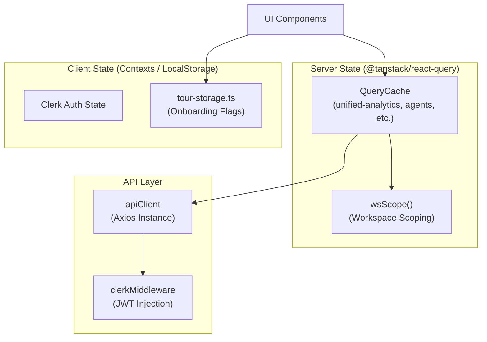
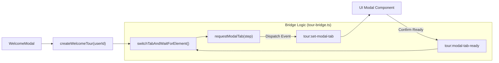

# Frontend Architecture

<details>
<summary>Relevant source files</summary>

The following files were used as context for generating this wiki page:

- [docs/PRDS/52-UNIFIED-ANALYTICS.md](docs/PRDS/52-UNIFIED-ANALYTICS.md)
- [frontend/app/analytics/page.tsx](frontend/app/analytics/page.tsx)
- [frontend/app/auth/signin/[[...rest]]/page.tsx](frontend/app/auth/signin/[[...rest]]/page.tsx)
- [frontend/app/auth/signup/[[...rest]]/page.tsx](frontend/app/auth/signup/[[...rest]]/page.tsx)
- [frontend/app/chat/[id]/page.tsx](frontend/app/chat/[id]/page.tsx)
- [frontend/app/sso-callback/page.tsx](frontend/app/sso-callback/page.tsx)
- [frontend/components/analytics/analytics-admin.tsx](frontend/components/analytics/analytics-admin.tsx)
- [frontend/components/analytics/analytics-agents.tsx](frontend/components/analytics/analytics-agents.tsx)
- [frontend/components/analytics/analytics-documents.tsx](frontend/components/analytics/analytics-documents.tsx)
- [frontend/components/analytics/analytics-memory.tsx](frontend/components/analytics/analytics-memory.tsx)
- [frontend/components/analytics/analytics-overview.tsx](frontend/components/analytics/analytics-overview.tsx)
- [frontend/components/analytics/analytics-plan-usage.tsx](frontend/components/analytics/analytics-plan-usage.tsx)
- [frontend/components/analytics/analytics-recommendations.tsx](frontend/components/analytics/analytics-recommendations.tsx)
- [frontend/components/analytics/analytics-workflows.tsx](frontend/components/analytics/analytics-workflows.tsx)
- [frontend/components/onboarding/first-login-guard.tsx](frontend/components/onboarding/first-login-guard.tsx)
- [frontend/components/onboarding/welcome-modal.tsx](frontend/components/onboarding/welcome-modal.tsx)
- [frontend/hooks/use-tour-tab-bridge.ts](frontend/hooks/use-tour-tab-bridge.ts)
- [frontend/hooks/use-unified-analytics.ts](frontend/hooks/use-unified-analytics.ts)
- [frontend/lib/shepherd/tour-bridge.ts](frontend/lib/shepherd/tour-bridge.ts)
- [frontend/lib/shepherd/tour-storage.ts](frontend/lib/shepherd/tour-storage.ts)
- [frontend/middleware.ts](frontend/middleware.ts)
- [frontend/next.config.js](frontend/next.config.js)
- [frontend/styles/shepherd-custom.css](frontend/styles/shepherd-custom.css)
- [frontend/tsconfig.tsbuildinfo](frontend/tsconfig.tsbuildinfo)

</details>


## Purpose and Scope

This document describes the technical architecture of the Automatos AI frontend application, including its Next.js structure, state management patterns, component hierarchies, and API integration layer. The frontend serves as the primary interface for managing autonomous agents, complex workflows, and multi-channel integrations.

---

## Next.js Application Structure

The frontend is built with **Next.js** using the App Router pattern. It follows a standard project structure with a clear separation between page routes, reusable components, and global providers.

### Project Layout

```
frontend/
├── app/                          # Next.js App Router pages
│   ├── layout.tsx               # Root layout with providers
│   ├── (auth)/                  # Auth route group (Clerk) [frontend/middleware.ts:1-18]()
│   ├── sso-callback/            # SSO redirect handler [frontend/app/sso-callback/page.tsx:1-8]()
│   └── analytics/               # Unified analytics dashboard [frontend/app/analytics/page.tsx:1-20]()
├── components/                   # React components
│   ├── analytics/               # Modular analytics panels [frontend/components/analytics/analytics-overview.tsx:1-172]()
│   ├── ui/                      # Shadcn/ui (Radix) primitives
│   ├── shared/                  # Reusable components like StatsBar [frontend/components/shared/stats-bar.tsx:1-50]()
│   └── onboarding/              # Welcome & Tour components [frontend/components/onboarding/welcome-modal.tsx:1-148]()
├── hooks/                       # Custom React hooks
│   └── use-unified-analytics.ts # Centralized data fetching [frontend/hooks/use-unified-analytics.ts:1-43]()
├── lib/                         # Utilities & Third-party configs
│   ├── api-client.ts            # Axios wrapper with auth [frontend/lib/api-client.ts:1-50]()
│   └── shepherd/                # Onboarding tour logic [frontend/lib/shepherd/tour-bridge.ts:1-89]()
└── next.config.js               # Next.js configuration [frontend/next.config.js:1-85]()
```

**Sources:** [frontend/next.config.js:1-85](), [frontend/app/sso-callback/page.tsx:1-8](), [frontend/hooks/use-unified-analytics.ts:1-43]()

### Next.js Configuration & Security

The application uses a standalone output mode optimized for Docker containerization [frontend/next.config.js:5](). Security is enforced through strict HTTP headers, including a comprehensive **Content Security Policy (CSP)** that restricts script, style, and connection sources to trusted domains like Clerk, Composio, and the Automatos API [frontend/next.config.js:23-81]().

**Sources:** [frontend/next.config.js:5-81]()

---

## State Management & Data Fetching

The frontend uses a **hybrid state management approach** combining React Query for server state and context-based providers for UI state.

### State Architecture Diagram



**Sources:** [frontend/hooks/use-unified-analytics.ts:12-43](), [frontend/middleware.ts:1-18](), [frontend/lib/shepherd/tour-storage.ts:1-20]()

### Workspace Scoping (`wsScope`)

To prevent data bleeding between environments, all React Query keys are scoped using `wsScope()`. This function retrieves the current workspace ID or an admin override, ensuring that cached data for "Workspace A" is never displayed when the user switches to "Workspace B" [frontend/hooks/use-unified-analytics.ts:10-14]().

**Sources:** [frontend/hooks/use-unified-analytics.ts:10-43]()

---

## UI Component Patterns

Automatos AI utilizes a "Glassmorphism" design system, featuring translucent cards and panels with vibrant accent glows.

### Unified Analytics Components

The analytics system is built on a modular architecture where specific hooks feed specialized UI components:

| Component | Hook | Purpose |
|-----------|------|---------|
| `AnalyticsOverview` | `useAnalyticsOverview` | High-level KPIs (Agents, Missions, Costs) [frontend/components/analytics/analytics-overview.tsx:32-115]() |
| `AnalyticsWorkflows` | `useWorkflowAnalytics` | Mission execution trends and success rates [frontend/components/analytics/analytics-workflows.tsx:36-150]() |
| `AnalyticsAgents` | `useAgentAnalytics` | Per-agent token usage, cost, and memory stats [frontend/components/analytics/analytics-agents.tsx:162-200]() |
| `AnalyticsAdmin` | `useAdminDashboard` | Platform-wide spend and workspace distribution [frontend/components/analytics/analytics-admin.tsx:164-210]() |

### Shared UI Primitives

*   **StatsBar:** A standardized horizontal bar for displaying critical metrics with trend indicators [frontend/components/shared/stats-bar.tsx:1-50]().
*   **Framer Motion:** Used extensively for entry animations and layout transitions in lists and cards [frontend/components/analytics/analytics-overview.tsx:118-142]().
*   **Skeleton Loaders:** Integrated into all analytics components to handle asynchronous data fetching gracefully [frontend/components/analytics/analytics-recommendations.tsx:44-57]().

**Sources:** [frontend/components/analytics/analytics-overview.tsx:1-172](), [frontend/components/analytics/analytics-workflows.tsx:1-180](), [frontend/components/shared/stats-bar.tsx:1-50]()

---

## Onboarding & Interactive Tours

A robust onboarding system uses **Shepherd.js** to guide users through the platform via interactive tours.

### Tour Integration Diagram



**Sources:** [frontend/lib/shepherd/tour-bridge.ts:1-89](), [frontend/components/onboarding/welcome-modal.tsx:24-37]()

### The Tour-Modal Bridge

To allow tours to interact with complex UI elements like multi-tab modals, a bridge was implemented using `CustomEvents`. The tour dispatches `tour:set-modal-tab` (via `requestModalTab`), and the system waits for the UI to signal `tour:modal-tab-ready` before proceeding. It also uses a `MutationObserver` to ensure elements are actually rendered before the tour attempts to attach to them [frontend/lib/shepherd/tour-bridge.ts:10-88]().

**Sources:** [frontend/lib/shepherd/tour-bridge.ts:10-88](), [frontend/components/onboarding/welcome-modal.tsx:24-37]()

---

## Child Pages

For deep technical details on specific frontend subsystems, refer to the following child pages:

*   [Application Structure](#19.1) — App router, page components, layout hierarchy, and navigation structure.
*   [State Management](#19.2) — React Query hooks, query keys with `wsScope`, and cache invalidation.
*   [API Client](#19.3) — `apiClient` implementation, authentication injection, and workspace context.
*   [UI Component Patterns](#19.4) — Shared components (`StatsBar`, modals), Framer Motion animations, and Shadcn/ui.
*   [Navigation & Layout](#19.5) — Sidebar navigation, role-based filtering, and page context tracking.

---