# Frontend Architecture

<details>
<summary>Relevant source files</summary>

The following files were used as context for generating this wiki page:

- [frontend/app/tools/page.tsx](frontend/app/tools/page.tsx)
- [frontend/components/agents/agent-management.tsx](frontend/components/agents/agent-management.tsx)
- [frontend/components/chatbot/chat-widget.tsx](frontend/components/chatbot/chat-widget.tsx)
- [frontend/components/chatbot/chat.tsx](frontend/components/chatbot/chat.tsx)
- [frontend/components/chatbot/multimodal-input.tsx](frontend/components/chatbot/multimodal-input.tsx)
- [frontend/components/documents/document-management.tsx](frontend/components/documents/document-management.tsx)
- [frontend/components/layout/main-layout.tsx](frontend/components/layout/main-layout.tsx)
- [frontend/components/layout/sidebar.tsx](frontend/components/layout/sidebar.tsx)
- [frontend/components/settings/SettingsPanel.tsx](frontend/components/settings/SettingsPanel.tsx)
- [frontend/components/tools/my-tools-dashboard.tsx](frontend/components/tools/my-tools-dashboard.tsx)
- [frontend/components/tools/tools-dashboard.tsx](frontend/components/tools/tools-dashboard.tsx)
- [frontend/components/workflows/workflow-management.tsx](frontend/components/workflows/workflow-management.tsx)
- [frontend/public/brand/jira-logo.svg](frontend/public/brand/jira-logo.svg)
- [orchestrator/modules/documents/generation_service.py](orchestrator/modules/documents/generation_service.py)
- [orchestrator/modules/tools/discovery/platform_actions.py](orchestrator/modules/tools/discovery/platform_actions.py)
- [orchestrator/modules/tools/discovery/platform_executor.py](orchestrator/modules/tools/discovery/platform_executor.py)

</details>


## Purpose and Scope

This document describes the technical architecture of the Automatos AI frontend application, including its Next.js structure, state management patterns, component hierarchies, and API integration layer. For backend API architecture, see [Backend Architecture](#10). For deployment configuration, see [Deployment & Infrastructure](#12).

---

## Next.js Application Structure

The frontend is built with **Next.js 15** using the App Router pattern, React 18.2.0, and TypeScript 5.2.2. The application follows a standard Next.js project structure with server and client component separation.

### Project Layout

```
frontend/
├── app/                          # Next.js App Router pages
│   ├── layout.tsx               # Root layout with providers
│   ├── (auth)/                  # Auth route group
│   │   ├── sign-in/[[...sign-in]]/
│   │   └── sign-up/[[...sign-up]]/
│   ├── sso-callback/            # Clerk SSO handler
│   ├── chat/[id]/page.tsx       # Dynamic chat routes
│   └── agents/, workflows/, marketplace/, etc.
├── components/                   # React components
│   ├── agents/                  # Agent management UI
│   ├── chatbot/                 # Chat interface
│   ├── marketplace/             # Marketplace UI
│   ├── shared/                  # Reusable components
│   └── ui/                      # Radix UI primitives
├── lib/                         # Utilities & helpers
│   ├── api-client.ts            # HTTP client
│   └── shepherd/                # Onboarding tours
├── hooks/                       # React hooks
│   ├── use-agent-api.ts
│   ├── use-tools-api.ts
│   └── use-marketplace-api.ts
├── middleware.ts                # Clerk authentication
└── next.config.js               # Next.js configuration
```

**Sources:** [frontend/package.json:1-145](), [frontend/next.config.js:1-18](), [frontend/middleware.ts:1-19]()

---

## Next.js Configuration

The application uses a minimal Next.js configuration optimized for Railway deployment:

```typescript
// Key configuration options
{
  reactStrictMode: false,           // Disabled for Clerk compatibility
  typescript: {
    ignoreBuildErrors: true         // Production builds continue on type errors
  },
  typedRoutes: true,                // Generate typed route helpers
  turbopack: {
    root: __dirname                 // Turbopack bundler config
  }
}
```

**API proxying is disabled** — the frontend makes direct requests to `NEXT_PUBLIC_API_URL` instead of using Next.js rewrites, because Railway requires runtime environment variable resolution.

**Sources:** [frontend/next.config.js:1-18]()

---

## Provider Hierarchy

The application wraps all pages in a centralized provider stack defined in the root layout. This establishes authentication, theming, workspace context, and data fetching infrastructure.

### Provider Stack Diagram

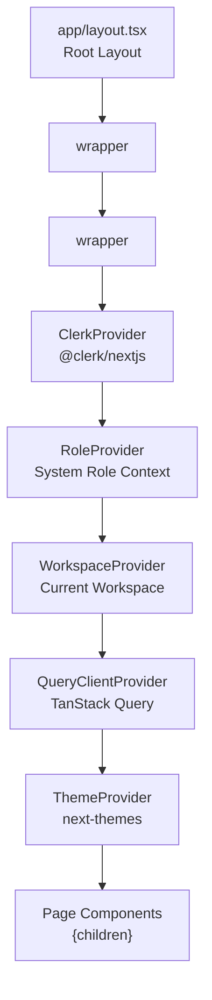

**Sources:** High-level system diagram 3 (Frontend Application Architecture), [frontend/components/agents/agent-management.tsx:38-66]()

### Provider Responsibilities

| Provider | Purpose | Key Props |
|----------|---------|-----------|
| `ClerkProvider` | User authentication & session management | Wraps entire app |
| `RoleProvider` | System role context (admin/user) | Derived from Clerk user metadata |
| `WorkspaceProvider` | Current workspace selection & switching | Stores `last_active_workspace` in localStorage |
| `QueryClientProvider` | React Query cache & request deduplication | Configured with stale times & retry logic |
| `ThemeProvider` | Dark/light mode toggle | Persists preference to localStorage |

**Sources:** High-level system diagram 3, [frontend/components/agents/agent-management.tsx:35-36]()

---

## State Management

The frontend uses a **hybrid state management approach**: React Query for server state and Zustand for client-side UI state.

### State Management Architecture

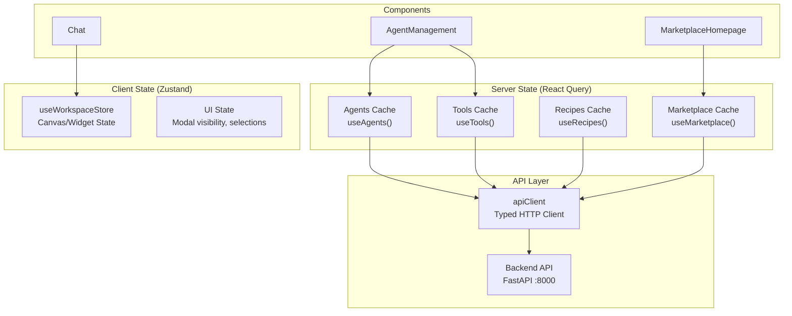

**Sources:** [frontend/components/agents/agent-management.tsx:34-48](), [frontend/package.json:70]()

### React Query (Server State)

React Query manages all **server data** — agents, workflows, tools, marketplace items, etc. It provides automatic caching, background refetching, and request deduplication.

**Hook Examples:**
- `useAgents()` — Fetch agent list
- `useAgent(id)` — Fetch single agent with cache key
- `useCreateAgent()` — Mutation for creating agents
- `useAgentStats()` — Fetch aggregate statistics

**Configuration:**
- **Stale time:** Data remains fresh for configurable duration
- **Cache time:** Unused data is garbage collected
- **Retry logic:** Failed requests retry with exponential backoff
- **Refetch on window focus:** Ensures data freshness

**Sources:** [frontend/components/agents/agent-management.tsx:46-48](), [frontend/package.json:43]()

### Zustand (Client State)

Zustand manages **UI-specific state** that doesn't need server synchronization:

| Store | State | Usage |
|-------|-------|-------|
| `useWorkspaceStore` | Canvas widget positions, sizes, types | Chat canvas [frontend/components/chatbot/chat-widget.tsx:1-155]() |
| Modal state | Open/closed, selected IDs | Ephemeral component state |
| Search filters | Current search terms, active filters | Local filtering |

**Sources:** [frontend/package.json:138](), High-level system diagram 3

---

## API Client Layer

The `apiClient` abstraction centralizes all HTTP communication with the backend, handling authentication, workspace context, and error formatting.

### API Client Architecture

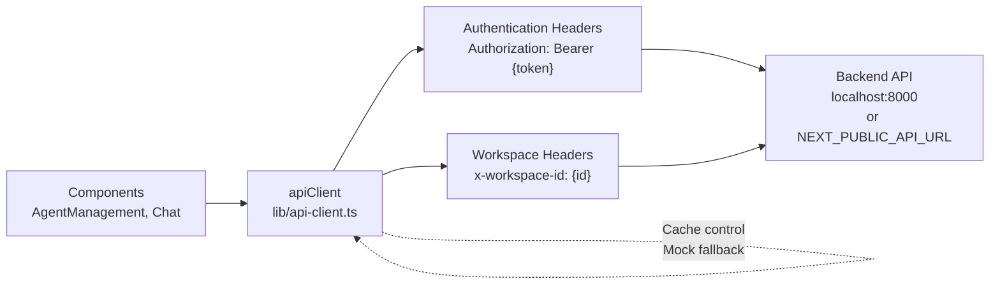

**Sources:** [frontend/components/agents/agent-management.tsx:36](), [frontend/components/marketplace/marketplace-plugins-tab.tsx:40]()

### Key Methods

```typescript
// GET request
const agents = await apiClient.get('/api/agents', { status: 'active' })

// POST request with body
const newAgent = await apiClient.post('/api/agents', {
  name: 'MyAgent',
  agent_type: 'custom'
})

// Generic request method
const result = await apiClient.request('/api/agents/123', {
  method: 'PUT',
  body: { status: 'active' }
})
```

**Features:**
- **Automatic authentication:** Injects Clerk JWT from session
- **Workspace isolation:** Adds `x-workspace-id` header from localStorage
- **Error normalization:** Converts backend errors to consistent format
- **Mock data fallback:** Returns mock data if backend is unreachable (dev mode)
- **Page tracking:** Sets `currentPage` for context-aware error messages

**Sources:** [frontend/components/agents/agent-management.tsx:65](), [frontend/components/marketplace/marketplace-plugins-tab.tsx:110-145]()

### Workspace Resolution

The API client determines the active workspace using this priority:

1. `localStorage.getItem('last_active_workspace')` — Set by workspace switcher
2. `localStorage.getItem('last_active_org')` — Clerk organization ID
3. Backend defaults to `DEFAULT_TENANT_ID` if header is missing

**Sources:** [frontend/components/marketplace/marketplace-plugins-tab.tsx:110-113]()

---

## Component Architecture

The frontend organizes components into **feature modules**, **shared utilities**, and **UI primitives**. Each feature module contains page components, modals, forms, and feature-specific state.

### Component Organization Diagram

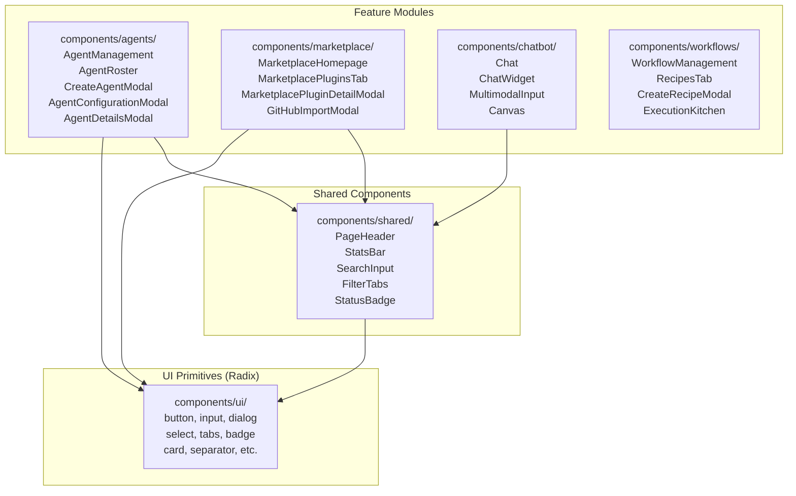

**Sources:** [frontend/components/agents/agent-management.tsx:1-278](), [frontend/components/marketplace/marketplace-plugins-tab.tsx:1-877]()

### Feature Module Pattern

Each major feature follows a consistent structure:

```
components/{feature}/
├── {feature}-management.tsx      # Main page component with tabs
├── {feature}-roster.tsx          # Grid/list display
├── create-{feature}-modal.tsx    # Multi-step creation wizard
├── {feature}-configuration-modal.tsx  # Settings editor
└── {feature}-details-modal.tsx   # Read-only detail view
```

**Example: Agent Management Module**

- **AgentManagement** — Main container with tabs (Roster, Configuration, Coordination)
- **AgentRoster** — Grid of agent cards with status, tools, plugins
- **CreateAgentModal** — 5-step wizard (Config → Persona → Model → Tools → Capabilities)
- **AgentConfigurationModal** — Edit agent settings, assign plugins/tools
- **AgentDetailsModal** — View agent details, performance metrics, activity logs

**Sources:** [frontend/components/agents/agent-management.tsx:38-278](), [frontend/components/agents/agent-roster.tsx:1-508](), [frontend/components/agents/create-agent-modal.tsx:1-1281]()

---

## Page Components

Page components live in the `app/` directory and use Next.js App Router conventions. Most pages are **client components** (`'use client'` directive) due to interactivity requirements.

### Key Page Routes

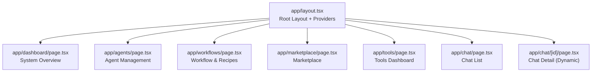

**Sources:** [frontend/app/chat/[id]/page.tsx:1-37]()

### Dynamic Route Example: Chat Detail

The chat detail page demonstrates Next.js 15's async params pattern:

```typescript
// app/chat/[id]/page.tsx
export default async function ChatDetailPage({ 
  params 
}: { 
  params: Promise<{ id: string }> 
}) {
  const { id } = await params  // Async unwrap in Next.js 15
  
  const [chat, messages] = await Promise.all([
    getChat(id),
    getChatMessages(id),
  ])
  
  return (
    <Chat
      id={chat.id}
      initialMessages={messages}
      initialChatModel="gpt-4"
    />
  )
}
```

**Sources:** [frontend/app/chat/[id]/page.tsx:7-37]()

---

## Modal Wizard Pattern

Complex creation flows use **multi-step modal wizards** with progressive disclosure. Each step validates input before allowing advancement.

### Example: Create Agent Modal (5 Steps)

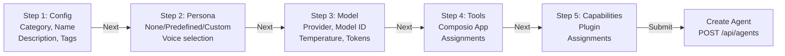

**Sources:** [frontend/components/agents/create-agent-modal.tsx:63-353]()

### Wizard State Management

The wizard maintains state in a single component:

```typescript
const [step, setStep] = useState(1)  // Current step (1-5)
const [agentData, setAgentData] = useState({
  name: '',
  category: '',
  description: '',
  tags: '',
  plugins: [] as string[],
  tools: [] as number[],
  shareToMarketplace: false
})
const [modelConfig, setModelConfig] = useState({ ... })
const [personaMode, setPersonaMode] = useState<PersonaMode>('none')
```

**Navigation:** Tabs are disabled until previous steps are completed. The **Shepherd.js tour** can programmatically switch tabs using `useTourTabBridge()` hook.

**Sources:** [frontend/components/agents/create-agent-modal.tsx:64-111](), [frontend/hooks/use-tour-tab-bridge.ts:1-22]()

### Form Submission Flow

On final step submission:

1. **Validate required fields** (name, category)
2. **POST /api/agents** — Create base agent
3. **PUT /api/agents/{id}/model** — Set model configuration
4. **PUT /api/agents/{id}/persona** — Set persona (if selected)
5. **PUT /api/agents/{id}/plugins** — Assign plugins (if any)
6. **(Optional) POST /api/marketplace/submit** — Share to marketplace

**Sources:** [frontend/components/agents/create-agent-modal.tsx:184-353]()

---

## Data Grid Pattern

List/grid views follow a consistent pattern with filtering, search, and real-time updates.

### Agent Roster Grid

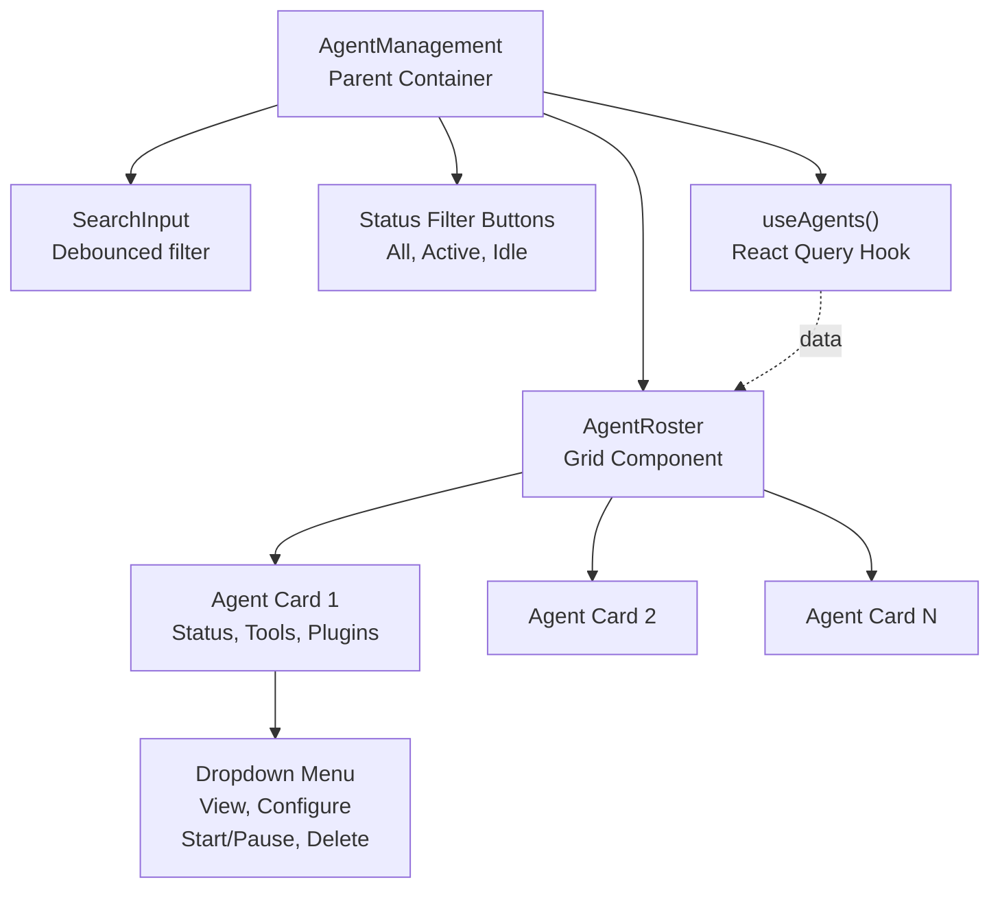

**Sources:** [frontend/components/agents/agent-management.tsx:116-255](), [frontend/components/agents/agent-roster.tsx:188-507]()

### Filtering Logic

The roster applies **client-side filtering** to cached data:

```typescript
const filteredAgents = agents.filter(agent => {
  const matchesSearch = 
    agent.name.toLowerCase().includes(searchTerm.toLowerCase()) ||
    agent.agent_type.toLowerCase().includes(searchTerm.toLowerCase()) ||
    agent.skills.some(skill => 
      skill.name.toLowerCase().includes(searchTerm.toLowerCase())
    )
  
  const matchesStatus = 
    statusFilter === 'all' || agent.status === statusFilter
  
  return matchesSearch && matchesStatus
})
```

**Sources:** [frontend/components/agents/agent-roster.tsx:244-252]()

### Card Actions

Each card has a dropdown menu with contextual actions:

- **View Details** — Opens `AgentDetailsModal`
- **Configure** — Opens `AgentConfigurationModal`
- **Start/Pause** — Toggles agent status via `POST /api/agents/{id}/start` or `/stop`
- **Delete** — Opens confirmation modal, then `DELETE /api/agents/{id}`

**Sources:** [frontend/components/agents/agent-roster.tsx:292-340]()

---

## UI Component Library

The frontend uses **Radix UI** primitives styled with **Tailwind CSS** and animated with **Framer Motion**.

### Radix UI Integration

All interactive components are built on Radix primitives for accessibility:

| Component | Radix Primitive | Purpose |
|-----------|----------------|---------|
| `Button` | `@radix-ui/react-slot` | Buttons with variants (default, outline, ghost) |
| `Dialog`/`Modal` | `@radix-ui/react-dialog` | Modal overlays with backdrop |
| `Select` | `@radix-ui/react-select` | Native-like dropdowns |
| `Tabs` | `@radix-ui/react-tabs` | Tab navigation |
| `DropdownMenu` | `@radix-ui/react-dropdown-menu` | Context menus |
| `Switch` | `@radix-ui/react-switch` | Toggle switches |
| `Slider` | `@radix-ui/react-slider` | Range inputs |

**Sources:** [frontend/package.json:43-69]()

### Custom Styling Classes

The design system uses semantic CSS variables and Tailwind utilities:

```css
.glass-card {
  /* Frosted glass effect for cards */
  background: rgba(0, 0, 0, 0.4);
  backdrop-filter: blur(12px);
  border: 1px solid rgba(255, 255, 255, 0.1);
}

.card-glow {
  /* Subtle glow effect on hover */
  transition: all 0.3s ease;
}

.card-glow:hover {
  box-shadow: 0 0 20px rgba(var(--primary-rgb), 0.2);
}

.gradient-text {
  /* Orange gradient for accent text */
  background: linear-gradient(to right, #ff6b35, #f7931e);
  -webkit-background-clip: text;
  -webkit-text-fill-color: transparent;
}
```

**Sources:** [frontend/components/agents/agent-roster.tsx:277](), [frontend/components/agents/create-agent-modal.tsx:376]()

### Framer Motion Animations

Entry animations use staggered delays for visual polish:

```typescript
<motion.div
  initial={{ opacity: 0, y: 20 }}
  animate={{ opacity: 1, y: 0 }}
  transition={{ duration: 0.5, delay: index * 0.1 }}
>
  {/* Card content */}
</motion.div>
```

**Modal animations:**

```typescript
<AnimatePresence>
  {open && (
    <>
      {/* Backdrop */}
      <motion.div
        initial={{ opacity: 0 }}
        animate={{ opacity: 1 }}
        exit={{ opacity: 0 }}
      />
      
      {/* Modal */}
      <motion.div
        initial={{ opacity: 0, scale: 0.95 }}
        animate={{ opacity: 1, scale: 1 }}
        exit={{ opacity: 0, scale: 0.95 }}
      />
    </>
  )}
</AnimatePresence>
```

**Sources:** [frontend/components/agents/agent-roster.tsx:275-280](), [frontend/components/agents/create-agent-modal.tsx:356-374]()

---

## Authentication & Route Protection

Authentication is handled by **Clerk** with middleware-based route protection.

### Authentication Flow

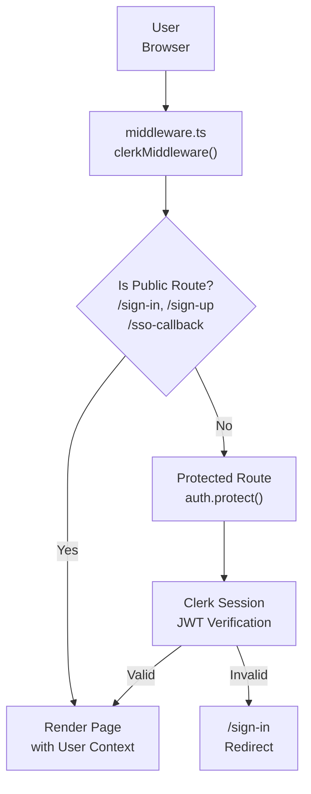

**Sources:** [frontend/middleware.ts:1-19]()

### Middleware Configuration

```typescript
// middleware.ts
import { clerkMiddleware, createRouteMatcher } from "@clerk/nextjs/server"

const isPublicRoute = createRouteMatcher([
  "/sign-in(.*)",
  "/sign-up(.*)",
  "/sso-callback(.*)",
  "/api/webhooks(.*)",
])

export default clerkMiddleware(async (auth, request) => {
  if (!isPublicRoute(request)) {
    await auth.protect()
  }
})
```

**Matcher:** Applies to all routes except static assets and Next.js internals:

```typescript
export const config = {
  matcher: ["/((?!.+\\.[\\w]+$|_next).*)", "/", "/(api|trpc)(.*)"],
}
```

**Sources:** [frontend/middleware.ts:1-19]()

### SSO Callback Handling

Clerk's SSO flow completes via a dedicated callback page:

```typescript
// app/sso-callback/page.tsx
'use client'
import { AuthenticateWithRedirectCallback } from '@clerk/nextjs'

export default function SSOCallbackPage() {
  return <AuthenticateWithRedirectCallback />
}
```

**Sources:** [frontend/app/sso-callback/page.tsx:1-7]()

### User Context Access

Components access the authenticated user via Clerk hooks:

```typescript
import { useUser } from '@clerk/nextjs'

const { user, isLoaded, isSignedIn } = useUser()

// user.emailAddresses[0].emailAddress
// user.fullName
// user.imageUrl
```

**Admin detection example:**

```typescript
const isAdmin = user?.emailAddresses?.[0]?.emailAddress?.includes('automatos.app') || false
```

**Sources:** [frontend/components/marketplace/marketplace-plugins-tab.tsx:89-92](), [frontend/components/chatbot/chat-widget.tsx:118]()

---

## Navigation & Layout

The application uses a **persistent sidebar** for navigation across all pages.

### Sidebar Navigation Structure

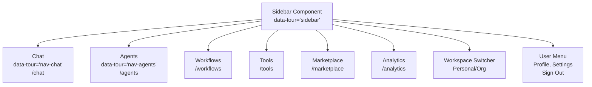

**Sources:** [frontend/lib/shepherd/first-login-tour.ts:64-71]()

### Tour Data Attributes

Navigation items use `data-tour` attributes for Shepherd.js onboarding:

- `[data-tour="sidebar"]` — Entire sidebar container
- `[data-tour="nav-agents"]` — Agents navigation link
- `[data-tour="nav-chat"]` — Chat navigation link
- `[data-tour="create-agent-btn"]` — Create Agent button

**Sources:** [frontend/lib/shepherd/first-login-tour.ts:48-87]()

### Main Layout Pattern

Pages render within a consistent layout wrapper:

```typescript
// app/chat/[id]/page.tsx
export default async function ChatDetailPage({ params }) {
  return (
    <MainLayout>
      <div className="flex h-[calc(100vh-8rem)]">
        <AppSidebar />
        <div className="flex-1">
          <Chat {...props} />
        </div>
      </div>
    </MainLayout>
  )
}
```

**Sources:** [frontend/app/chat/[id]/page.tsx:15-30]()

---

## Onboarding System

The frontend includes a **Shepherd.js-based onboarding tour** that triggers on first login and guides users through agent creation.

### Tour Architecture

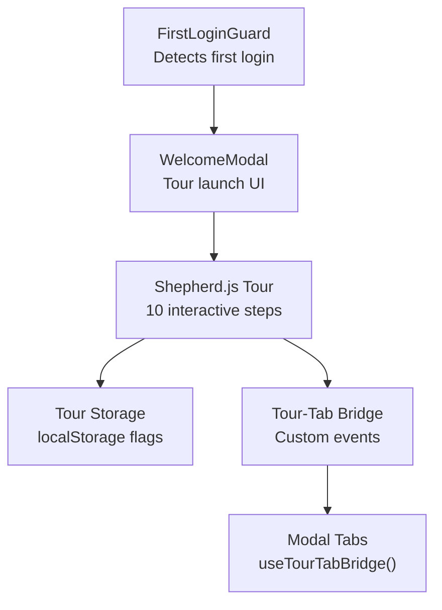

**Sources:** [frontend/lib/shepherd/first-login-tour.ts:1-371](), [frontend/lib/shepherd/tour-bridge.ts:1-89]()

### Tour Steps

The tour consists of 10 steps guiding the user through:

1. **Welcome** — Introduction to Automatos AI
2. **Navigation** — Sidebar overview
3. **Go to Agents** — Click Agents link
4. **Agent Roster** — View agent grid
5. **Create Agent** — Click Create Agent button
6. **Agent Config** — Select category and name
7. **Agent Persona** — Choose personality
8. **Agent Model** — Select LLM provider and model
9. **Agent Tools** — Connect Composio apps
10. **Complete** — Finish agent creation

**Sources:** [frontend/lib/shepherd/first-login-tour.ts:6-371]()

### Tour-Modal Bridge

The tour needs to programmatically switch modal tabs. This is implemented with **custom DOM events**:

```typescript
// Tour requests tab switch
export function requestModalTab(step: number) {
  window.dispatchEvent(
    new CustomEvent('tour:set-modal-tab', { detail: { step } })
  )
}

// Modal listens and confirms
export function useTourTabBridge(setStep: (step: number) => void) {
  useEffect(() => {
    const handler = (e: Event) => {
      const { step } = (e as CustomEvent).detail
      setStep(step)  // Switch tab
      requestAnimationFrame(() => {
        // Confirm after React renders
        window.dispatchEvent(new CustomEvent('tour:modal-tab-ready'))
      })
    }
    window.addEventListener('tour:set-modal-tab', handler)
    return () => window.removeEventListener('tour:set-modal-tab', handler)
  }, [setStep])
}
```

**Sources:** [frontend/lib/shepherd/tour-bridge.ts:1-89](), [frontend/hooks/use-tour-tab-bridge.ts:1-22]()

### Storage & Completion

Tour state is persisted in `localStorage`:

- `onboarding_completed:{userId}` — Set to `true` when tour completes
- `onboarding_skipped:{userId}` — Set to `true` if user skips tour

**Sources:** [frontend/lib/shepherd/first-login-tour.ts:4]()

---

## Key Feature Modules

### Agent Management Module

The agent management system is the most complex feature module, with a 5-step creation wizard, configuration editor, and detail view.

#### Component Breakdown

| Component | File | Lines | Purpose |
|-----------|------|-------|---------|
| `AgentManagement` | agent-management.tsx | 278 | Main container with tabs (Roster, Configuration, Coordination) |
| `AgentRoster` | agent-roster.tsx | 508 | Grid display of agent cards with filtering |
| `CreateAgentModal` | create-agent-modal.tsx | 1281 | 5-step agent creation wizard |
| `AgentConfigurationModal` | agent-configuration-modal.tsx | 1138 | Edit agent settings, assign plugins/tools |
| `AgentDetailsModal` | agent-details-modal.tsx | 704 | View agent details and metrics |

**Sources:** [frontend/components/agents/agent-management.tsx:1-278](), [frontend/components/agents/agent-roster.tsx:1-508](), [frontend/components/agents/create-agent-modal.tsx:1-1281](), [frontend/components/agents/agent-configuration-modal.tsx:1-1138](), [frontend/components/agents/agent-details-modal.tsx:1-704]()

#### Agent Creation Flow

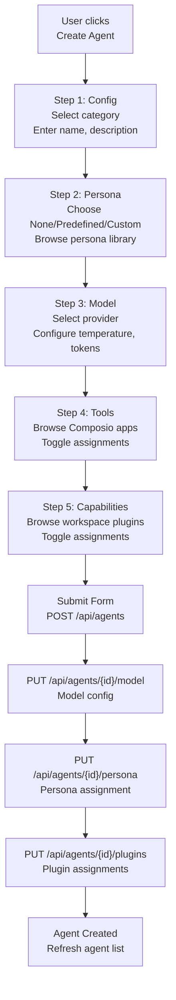

**Sources:** [frontend/components/agents/create-agent-modal.tsx:184-353]()

#### Agent Configuration Editor

The configuration modal provides **6 tabs** for editing agent settings:

1. **General** — Name, description, tags, category
2. **Persona** — Switch between no persona, predefined, or custom
3. **Resources** — Priority level, concurrency, timeouts, resource limits
4. **Plugins** — Toggle plugin assignments (persists immediately on change)
5. **Model** — Change LLM provider, model, temperature, tokens
6. **Tools** — Toggle Composio app assignments

**Immediate vs. Deferred Saves:**
- **Plugin assignments** save immediately via `PUT /api/agents/{id}/plugins`
- **All other settings** save on "Save Changes" button click

**Sources:** [frontend/components/agents/agent-configuration-modal.tsx:88-474]()

### Marketplace Module

The marketplace allows users to browse and enable plugins, tools, and agents shared by the community.

#### Marketplace Tab Structure

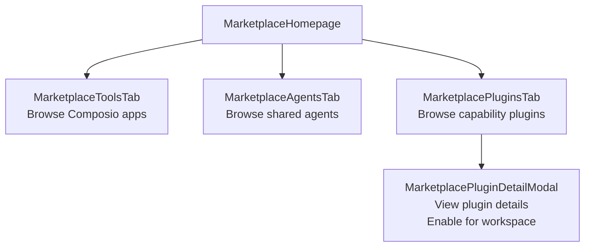

**Sources:** [frontend/components/marketplace/marketplace-plugins-tab.tsx:1-877](), [frontend/components/marketplace/marketplace-plugin-detail-modal.tsx:1-533]()

#### Plugin Enablement Flow

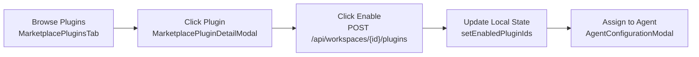

**Sources:** [frontend/components/marketplace/marketplace-plugins-tab.tsx:284-338]()

#### Marketplace Admin Actions

Admin users (email contains `automatos.app`) see additional actions:

- **Approve** — Publish pending plugins to marketplace
- **Deactivate** — Hide plugins from marketplace
- **Delete** — Permanently remove plugins

**Sources:** [frontend/components/marketplace/marketplace-plugins-tab.tsx:89-92](), [frontend/components/marketplace/marketplace-plugins-tab.tsx:215-267]()

### Chat Interface Module

The chat interface provides real-time conversational AI with streaming responses and widget-based artifacts.

#### Chat Components

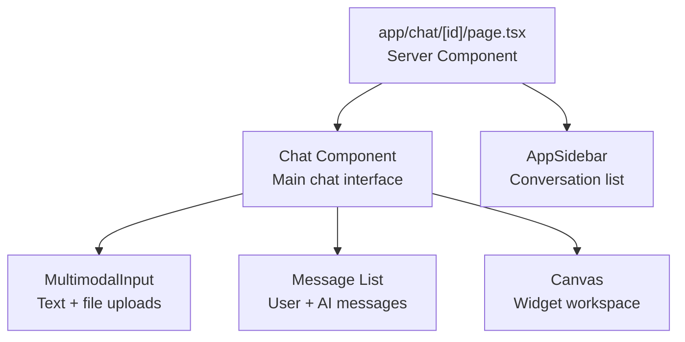

**Sources:** [frontend/app/chat/[id]/page.tsx:1-37]()

#### Widget Architecture

The chat canvas supports **VS Code-style widgets** for rich AI-generated content:

- **Code Widget** — Syntax-highlighted code blocks
- **Data Widget** — Tables and structured data
- **Document Widget** — Markdown documents
- **Email Widget** — Email composition
- **Terminal Widget** — Command outputs

**Widget state is managed by Zustand:**

```typescript
interface WidgetState {
  widgets: Widget[]
  addWidget: (widget: Widget) => void
  updateWidget: (id: string, updates: Partial<Widget>) => void
  removeWidget: (id: string) => void
}

const useWorkspaceStore = create<WidgetState>(...)
```

**Sources:** [frontend/components/chatbot/chat-widget.tsx:1-155]()

---

## Dependencies & Versions

### Core Framework

| Package | Version | Purpose |
|---------|---------|---------|
| `next` | 15.5.12 | React framework with App Router |
| `react` | 18.2.0 | UI library |
| `react-dom` | 18.2.0 | React renderer |
| `typescript` | 5.2.2 | Type system |

### Authentication

| Package | Version | Purpose |
|---------|---------|---------|
| `@clerk/nextjs` | 6.37.3 | Authentication & user management |

### State Management

| Package | Version | Purpose |
|---------|---------|---------|
| `@tanstack/react-query` | 4.36.1 | Server state management |
| `zustand` | 4.4.1 | Client state management |
| `swr` | 2.2.4 | Stale-while-revalidate pattern |

### UI Framework

| Package | Version | Purpose |
|---------|---------|---------|
| `@radix-ui/*` | Various | Accessible UI primitives (30+ packages) |
| `framer-motion` | 11.18.2 | Animations |
| `lucide-react` | 0.279.0 | Icon library |
| `tailwindcss` | 3.3.3 | Utility-first CSS |
| `next-themes` | 0.2.1 | Dark mode support |

### Specialized Features

| Package | Version | Purpose |
|---------|---------|---------|
| `react-shepherd` | 6.1.9 | Onboarding tours (Shepherd.js wrapper) |
| `shepherd.js` | 14.5.1 | Tour engine |
| `@xyflow/react` | 12.8.6 | Flow diagram editor |
| `react-markdown` | 9.0.1 | Markdown rendering |
| `react-hot-toast` | 2.4.1 | Toast notifications |

**Sources:** [frontend/package.json:1-145]()

---

## Build & Development

### Development Server

```bash
npm run dev
# or
yarn dev
```

Starts Next.js development server on `http://localhost:3000` with:
- **Hot module replacement**
- **Fast refresh**
- **TypeScript error overlay**

### Production Build

```bash
npm run build
npm run start
```

Creates optimized production build with:
- **Static optimization** for pages without server-side logic
- **Image optimization** via Next.js Image component
- **Bundle analysis** via Webpack stats

### Environment Variables

The frontend requires these runtime environment variables:

| Variable | Purpose | Example |
|----------|---------|---------|
| `NEXT_PUBLIC_API_URL` | Backend API base URL | `http://localhost:8000` |
| `NEXT_PUBLIC_CLERK_PUBLISHABLE_KEY` | Clerk public key | `pk_test_...` |
| `CLERK_SECRET_KEY` | Clerk secret key (server-side) | `sk_test_...` |

**Public variables** (`NEXT_PUBLIC_*`) are embedded in client bundle at build time.

**Sources:** [frontend/next.config.js:1-18]()

---

## Summary

The Automatos AI frontend is a **Next.js 15 application** using:

- **App Router** for file-based routing with server/client component separation
- **Clerk** for authentication with middleware-based route protection
- **React Query + Zustand** for hybrid state management (server state + UI state)
- **Radix UI + Tailwind** for accessible, styled components
- **Framer Motion** for polished animations
- **TypeScript** for type safety throughout

Key architectural patterns include:

- **Provider hierarchy** for global context (auth, workspace, theme, query cache)
- **Modal wizards** for complex multi-step flows (agent creation, recipe creation)
- **Data grids** with client-side filtering and real-time updates
- **API client abstraction** with automatic auth headers and workspace isolation
- **Feature modules** grouping related components, hooks, and logic
- **Onboarding system** using Shepherd.js with custom tour-modal bridge

**Sources:** All sections above

---