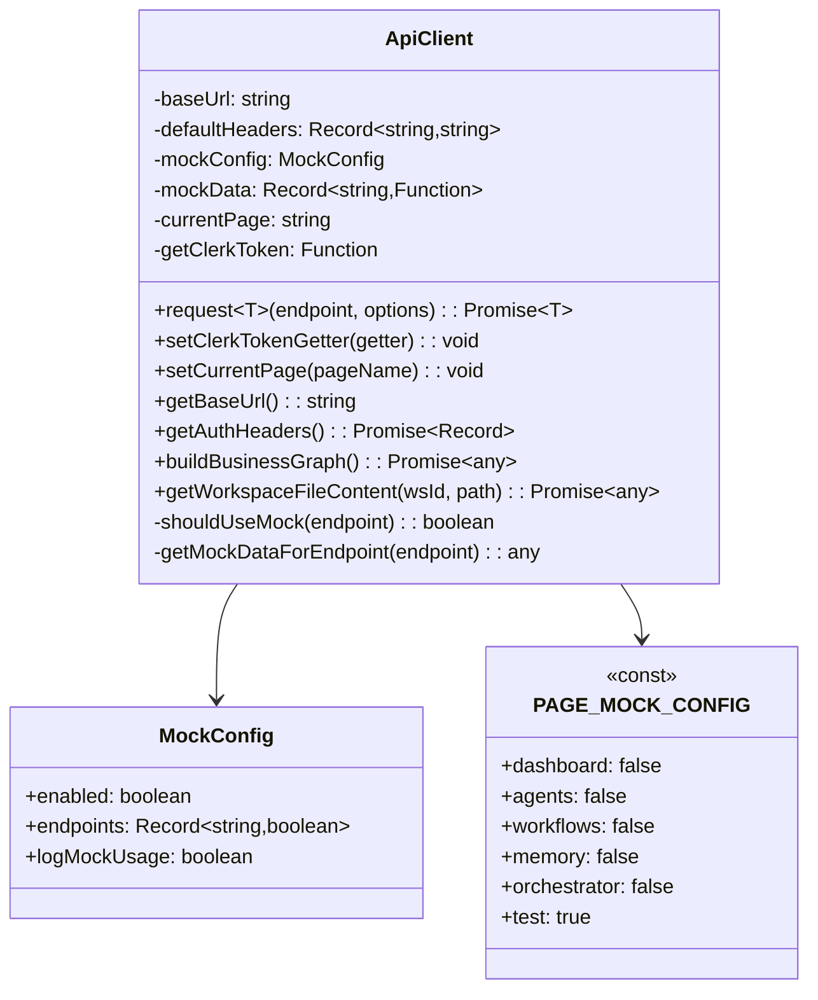
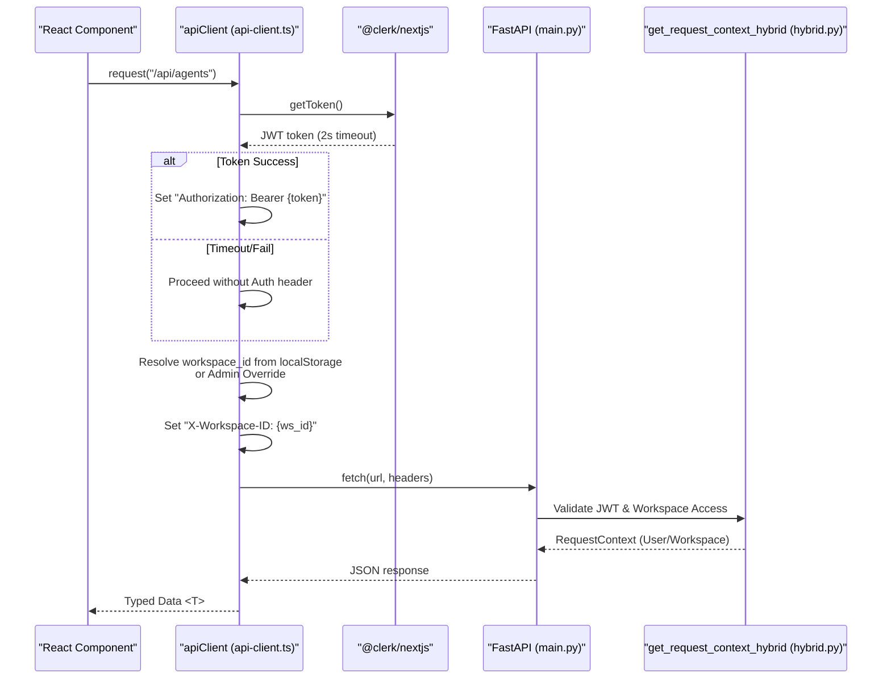
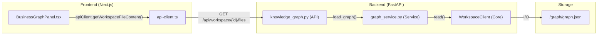

# API Client

Relevant source files

The following files were used as context for generating this wiki page:

- [.env.example](.env.example)
- [frontend/components/knowledge/BusinessGraphPanel.tsx](frontend/components/knowledge/BusinessGraphPanel.tsx)
- [frontend/components/knowledge/BusinessGraphVisualization.tsx](frontend/components/knowledge/BusinessGraphVisualization.tsx)
- [frontend/components/knowledge/GraphDiffBanner.tsx](frontend/components/knowledge/GraphDiffBanner.tsx)
- [frontend/lib/api-client.ts](frontend/lib/api-client.ts)
- [orchestrator/api/knowledge_graph.py](orchestrator/api/knowledge_graph.py)
- [orchestrator/modules/context/sections/graph_context.py](orchestrator/modules/context/sections/graph_context.py)
- [orchestrator/modules/knowledge/__init__.py](orchestrator/modules/knowledge/__init__.py)
- [orchestrator/modules/knowledge/graph_extraction.py](orchestrator/modules/knowledge/graph_extraction.py)
- [orchestrator/modules/knowledge/graph_service.py](orchestrator/modules/knowledge/graph_service.py)
- [orchestrator/modules/tools/discovery/actions_graph.py](orchestrator/modules/tools/discovery/actions_graph.py)
- [orchestrator/modules/tools/discovery/handlers_graph.py](orchestrator/modules/tools/discovery/handlers_graph.py)

## Purpose and Scope

The API Client is a centralized TypeScript client class that handles all HTTP communication between the Next.js frontend and the FastAPI backend. It provides authentication injection via Clerk JWT, workspace context management through custom headers, request/response logging, and a robust development mock system with automatic fallback capabilities. It serves as the single source of truth for frontend-to-backend data flow, ensuring that multi-tenancy constraints are respected at the network layer.

**Sources:** [frontend/lib/api-client.ts:1-11]()

---

## Architecture Overview

The API Client is implemented as a singleton class (`ApiClient`) that wraps the browser's native `fetch` API. It is designed to be workspace-aware, injecting the necessary multi-tenancy headers into every outgoing request.

### Class Structure

The `ApiClient` maintains internal state for base URL resolution, default headers, and mock configuration. It supports an admin override mechanism to allow administrators to "impersonate" or view other workspace contexts without changing their primary session.

**ApiClient Class Diagram**

**Sources:** [frontend/lib/api-client.ts:94-155](), [frontend/lib/api-client.ts:55-79](), [frontend/lib/api-client.ts:84-92](), [frontend/lib/api-client.ts:174-186]()

---

## Authentication System

The system utilizes a hybrid authentication model. The frontend fetches a JWT from Clerk, which the `ApiClient` injects into the `Authorization` header.

### Authentication Flow

The backend uses `get_request_context_hybrid` to validate these tokens and extract the workspace context.

**Frontend-to-Backend Auth Flow**

**Sources:** [frontend/lib/api-client.ts:819-841](), [frontend/lib/api-client.ts:156-164](), [orchestrator/api/knowledge_graph.py:17-18]()

### Token Injection Implementation

The client requires a token getter to be registered, typically from a top-level provider or hook that has access to Clerk's `useAuth()`.

- **Timeout Protection:** The token fetch is wrapped in a 2-second timeout to prevent UI hangs if the auth provider is slow [frontend/lib/api-client.ts:829-840]().
- **Header Composition:** Headers include `Content-Type: application/json` by default [frontend/lib/api-client.ts:121-123]().
- **Hybrid Support:** If no Clerk token is available, the client still proceeds, allowing the backend to fall back to API Key authentication if applicable [frontend/lib/api-client.ts:841-842]().

**Sources:** [frontend/lib/api-client.ts:156-164](), [frontend/lib/api-client.ts:819-853]()

---

## Request Lifecycle

The `request<T>` method is the primary entry point for all data fetching.

### Lifecycle Logic

1.  **Token Retrieval:** Calls the registered `getClerkToken` [frontend/lib/api-client.ts:827-828]().
2.  **Header Assembly:** Merges default headers, auth headers, and workspace ID [frontend/lib/api-client.ts:849-863]().
3.  **Body Serialization:** Automatically stringifies objects unless the body is an instance of `FormData` (used for file uploads or graph imports) [frontend/lib/api-client.ts:844-847]().
4.  **Execution:** Performs the native `fetch` call.
5.  **Error Handling:** If the response is not `ok`, it attempts to parse the backend's `detail` error message [frontend/lib/api-client.ts:884-895]().
6.  **Mock Fallback:** If the network call fails and mocks are enabled for that context, it returns mock data instead of throwing [frontend/lib/api-client.ts:909-927]().

**Sources:** [frontend/lib/api-client.ts:819-927]()

---

## Workspace Context & Multi-Tenancy

The `ApiClient` ensures data isolation by attaching the active workspace ID to every request. This is critical for the backend's `RequestContext` to filter database queries by `workspace_id`.

### Workspace Resolution Hierarchy

The client resolves the workspace ID using the following priority:
1.  **Admin Override:** A module-level variable `_adminWorkspaceOverride` set via `setAdminWorkspaceOverride()` [frontend/lib/api-client.ts:84-92]().
2.  **Local Storage:** Checks `last_active_workspace` or `last_active_org` keys [frontend/lib/api-client.ts:858-861]().

**Sources:** [frontend/lib/api-client.ts:80-92](), [frontend/lib/api-client.ts:855-862]()

---

## Mock System

The client features a tiered mock system that allows developers to work offline or against unimplemented endpoints.

### Mock Control Hierarchy

Mocks are evaluated in the following order:
1.  **Production Check:** Mocks are strictly disabled in production environments [frontend/lib/api-client.ts:241-243]().
2.  **Page-Level Override:** `PAGE_MOCK_CONFIG` defines which pages should use mocks (e.g., `test` or `demo` pages) [frontend/lib/api-client.ts:55-79]().
3.  **Global Toggle:** A global `enabled` flag in `mockConfig` [frontend/lib/api-client.ts:251-253]().
4.  **Endpoint Toggle:** Specific endpoint overrides within `mockConfig.endpoints` [frontend/lib/api-client.ts:256-259]().

**Sources:** [frontend/lib/api-client.ts:238-264](), [frontend/lib/api-client.ts:753-796](), [frontend/lib/api-client.ts:909-927]()

---

## Specialized Implementation: Knowledge Graph

The `ApiClient` includes specific methods for interacting with the Knowledge Graph system, which involves file-based storage in the workspace filesystem.

### Graph Data Flow
The client retrieves graph data (`graph.json`) and metadata (`meta.json`) from the workspace storage via the `getWorkspaceFileContent` method.

**Knowledge Graph Entity Mapping**

- **`buildBusinessGraph()`**: Triggers the backend pipeline to collect sources and build the NetworkX graph [frontend/lib/api-client.ts:174-186]().
- **`getWorkspaceFileContent()`**: Fetches raw or parsed JSON files (like `graph.json`) from the `/graph/` directory of a specific workspace [frontend/lib/api-client.ts:197-200]().

**Sources:** [frontend/lib/api-client.ts:174-200](), [frontend/components/knowledge/BusinessGraphPanel.tsx:190-217](), [orchestrator/modules/knowledge/graph_service.py:145-152]()

---

## Configuration & Environment

The client's behavior is dictated by environment variables and build-time settings.

| Variable | Source | Usage |
| :--- | :--- | :--- |
| `NEXT_PUBLIC_API_URL` | `.env` / Docker | Primary backend URL [frontend/lib/api-client.ts:107-111]() |
| `NODE_ENV` | Build System | Toggles developer logging and mock availability [frontend/lib/api-client.ts:126-126]() |

**Sources:** [frontend/lib/api-client.ts:101-155](), [.env.example:34-34]()

---