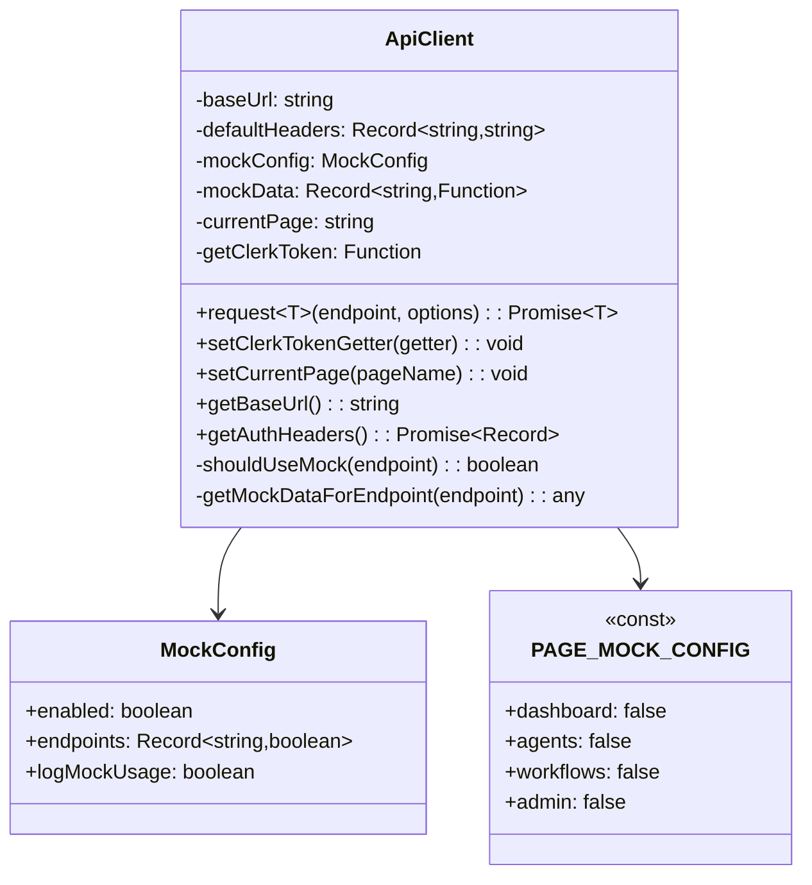
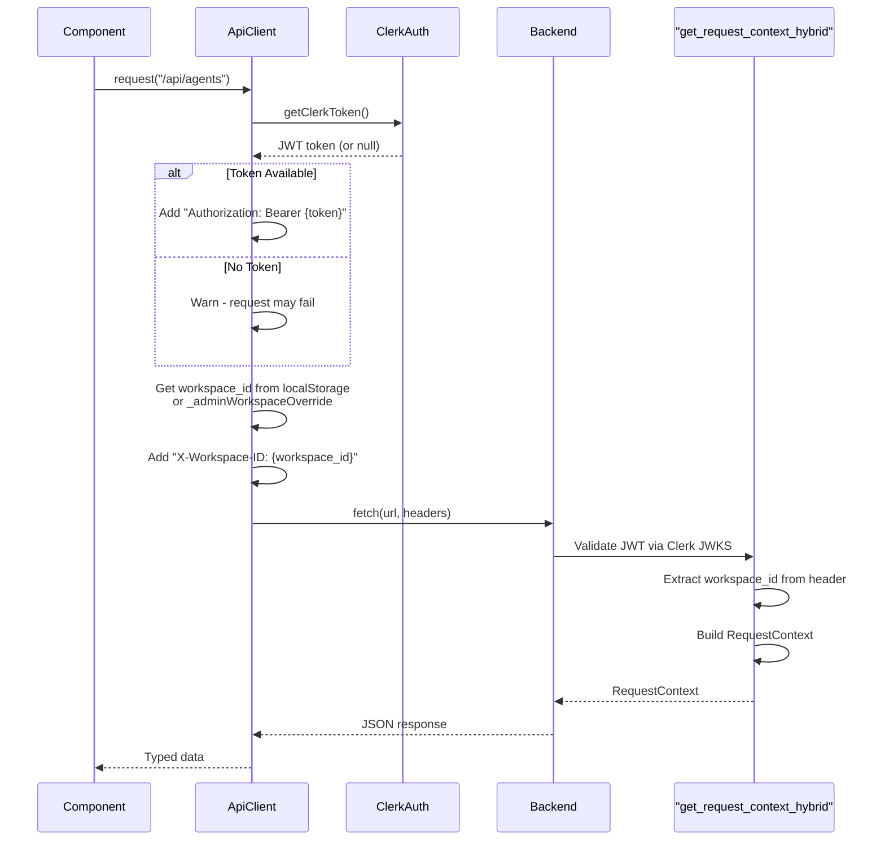
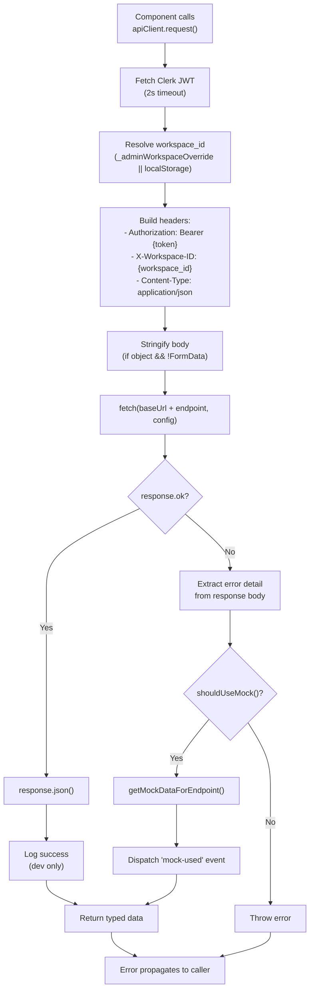
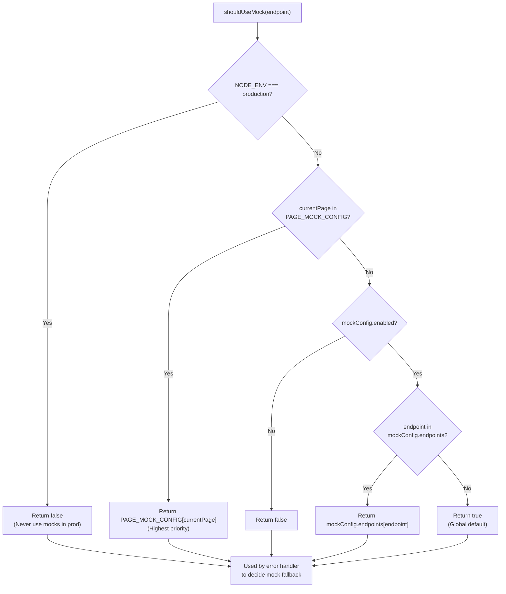
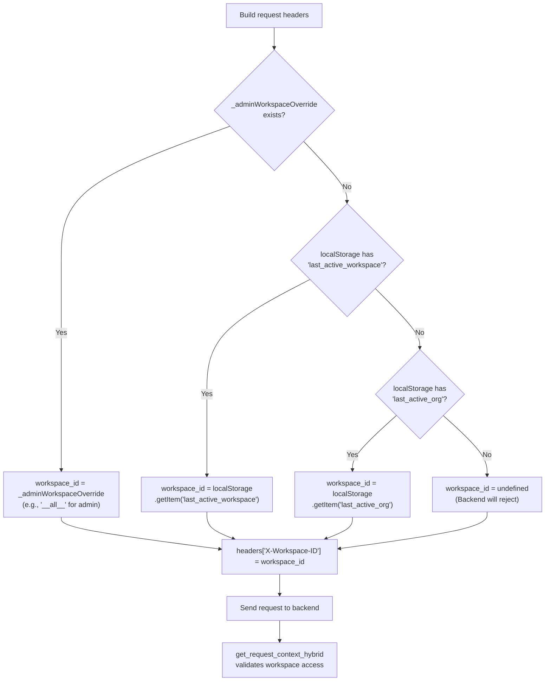
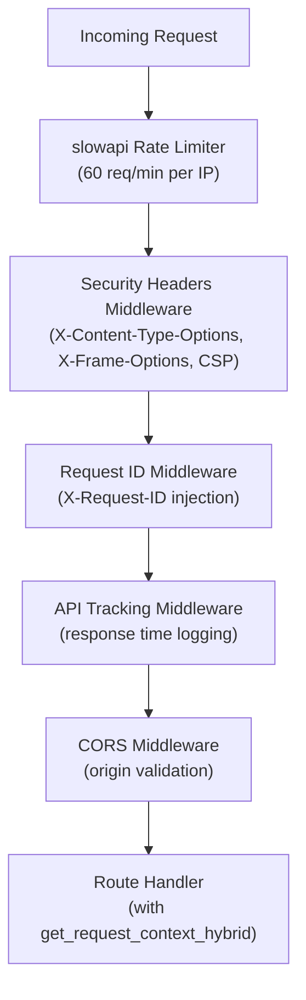

# API Client

<details>
<summary>Relevant source files</summary>

The following files were used as context for generating this wiki page:

- [frontend/app/admin/plugins/page.tsx](frontend/app/admin/plugins/page.tsx)
- [frontend/app/tools/page.tsx](frontend/app/tools/page.tsx)
- [frontend/components/agents/agent-management.tsx](frontend/components/agents/agent-management.tsx)
- [frontend/components/documents/document-management.tsx](frontend/components/documents/document-management.tsx)
- [frontend/components/layout/main-layout.tsx](frontend/components/layout/main-layout.tsx)
- [frontend/components/layout/sidebar.tsx](frontend/components/layout/sidebar.tsx)
- [frontend/components/settings/SettingsPanel.tsx](frontend/components/settings/SettingsPanel.tsx)
- [frontend/components/tools/my-tools-dashboard.tsx](frontend/components/tools/my-tools-dashboard.tsx)
- [frontend/components/tools/tools-dashboard.tsx](frontend/components/tools/tools-dashboard.tsx)
- [frontend/components/workflows/workflow-management.tsx](frontend/components/workflows/workflow-management.tsx)
- [frontend/lib/api-client.ts](frontend/lib/api-client.ts)
- [orchestrator/.env.example](orchestrator/.env.example)
- [orchestrator/api/agent_plugins.py](orchestrator/api/agent_plugins.py)
- [orchestrator/config.py](orchestrator/config.py)
- [orchestrator/core/database/load_seed_data.py](orchestrator/core/database/load_seed_data.py)
- [orchestrator/core/seeds/seed_personas.py](orchestrator/core/seeds/seed_personas.py)
- [orchestrator/core/seeds/seed_plugin_categories.py](orchestrator/core/seeds/seed_plugin_categories.py)
- [orchestrator/core/services/plugin_cache.py](orchestrator/core/services/plugin_cache.py)
- [orchestrator/main.py](orchestrator/main.py)
- [scripts/ralph/prd.json](scripts/ralph/prd.json)

</details>


## Purpose and Scope

The API Client is a centralized TypeScript client class that handles all HTTP communication between the Next.js frontend and the FastAPI backend. It provides authentication injection, workspace context management, request/response logging, and a development mock system.

For information about backend authentication and multi-tenancy, see [Authentication & Multi-Tenancy](#12). For frontend state management patterns, see [State Management](#14.2).

**Sources:** [frontend/lib/api-client.ts:1-100]()

---

## Architecture Overview

The API Client is implemented as a singleton class (`ApiClient`) that wraps the browser's native `fetch` API with workspace-aware authentication, standardized error handling, and a development-time mock system.

### Class Structure



**Sources:** [frontend/lib/api-client.ts:93-154]()

---

## Authentication System

The API Client uses Clerk JWT tokens for authentication, which are injected into every request via the `Authorization` header. Workspace context is passed via the `X-Workspace-ID` header.

### Authentication Flow



**Sources:** [frontend/lib/api-client.ts:819-903](), [orchestrator/core/auth/hybrid.py]() (referenced)

### Token Injection

The API Client requires a Clerk token getter function to be registered at app initialization:

```typescript
// From a React component with useAuth() access
const { getToken } = useAuth()
apiClient.setClerkTokenGetter(async () => {
  return await getToken()
})
```

**Implementation Details:**

- Token fetch has a **2-second timeout** to prevent hanging ([frontend/lib/api-client.ts:829-840]())
- Falls back to `null` on timeout, logs warning
- Request proceeds without auth (backend will return 401 if required)

**Sources:** [frontend/lib/api-client.ts:156-163](), [frontend/lib/api-client.ts:827-841]()

---

## Request Lifecycle

Every API call flows through the single `request<T>()` method, which handles authentication, serialization, error handling, and optional mock fallback.

### Request Flow Diagram



**Sources:** [frontend/lib/api-client.ts:819-927]()

### Request Method Signature

```typescript
async request<T>(
  endpoint: string,
  options: RequestInit = {}
): Promise<T>
```

**Key Behaviors:**

- **Automatic Body Serialization:** Objects are JSON.stringify'd unless they are `FormData` ([frontend/lib/api-client.ts:844-847]())
- **Workspace Injection:** Admin override takes priority over localStorage ([frontend/lib/api-client.ts:855-862]())
- **Error Detail Extraction:** Attempts to parse `detail` field from error response body ([frontend/lib/api-client.ts:887-895]())
- **HTTP 401 Handling:** Throws user-friendly message about missing Clerk token ([frontend/lib/api-client.ts:896-901]())

**Sources:** [frontend/lib/api-client.ts:819-927]()

---

## Mock System

The API Client includes a comprehensive mock system for development that allows page-level or endpoint-level mock control with automatic fallback when the backend is unavailable.

### Mock Configuration Hierarchy



**Sources:** [frontend/lib/api-client.ts:238-264]()

### Page-Level Mock Configuration

The `PAGE_MOCK_CONFIG` constant provides simple on/off switches per page:

```typescript
const PAGE_MOCK_CONFIG: Record<string, boolean> = {
  'dashboard': false,        // Use real APIs
  'agents': false,           // Use real APIs
  'workflows': false,        // Use real APIs
  'admin': false,            // Use real APIs
  'test': true,              // Always use mocks for testing
  'demo': true,              // Always use mocks for demos
}
```

**Usage Pattern:**

```typescript
// In a page component
useEffect(() => {
  apiClient.setCurrentPage('dashboard')
  return () => apiClient.setCurrentPage('') // Clear on unmount
}, [])
```

**Sources:** [frontend/lib/api-client.ts:55-78](), [frontend/lib/api-client.ts:277-283]()

### Mock Data Storage

Mock data is stored in the `mockData` object, keyed by endpoint path:

```typescript
private initializeMockData(): Record<string, () => any> {
  return {
    '/api/system/health': () => ({
      status: 'healthy',
      version: '2.0.0',
      // ...
    }),
    '/api/agents/': () => [
      { id: 1, name: 'MOCK: Data Analyst', ... },
      // ...
    ],
    // Pattern matching for dynamic endpoints
    'default': () => ({})
  }
}
```

**Dynamic Endpoint Matching:**

The `getMockDataForEndpoint()` method supports pattern matching for dynamic paths like `/api/agents/123/logs` ([frontend/lib/api-client.ts:769-796]()).

**Sources:** [frontend/lib/api-client.ts:302-750](), [frontend/lib/api-client.ts:753-796]()

---

## Workspace Management

The API Client implements workspace context management through the `X-Workspace-ID` header, with special handling for admin workspace override.

### Workspace Resolution Flow



**Sources:** [frontend/lib/api-client.ts:855-862]()

### Admin Workspace Override

The admin workspace override is a module-level variable that takes priority over localStorage. It's used by the `AdminWorkspaceSwitcher` component to switch between workspaces or view platform-wide data:

```typescript
// Module-level variable (not class instance)
let _adminWorkspaceOverride: string | null = null

export function setAdminWorkspaceOverride(wsId: string | null) {
  _adminWorkspaceOverride = wsId
}

export function getAdminWorkspaceOverride(): string | null {
  return _adminWorkspaceOverride
}
```

**Usage Example:**

```typescript
// In AdminWorkspaceSwitcher component
setAdminWorkspaceOverride('__all__')  // View all workspaces
// or
setAdminWorkspaceOverride(null)       // Reset to localStorage
```

**Backend Behavior:**

When `X-Workspace-ID: __all__` is sent, `get_request_context_hybrid` in the backend sets `admin_all_workspaces=True` and removes workspace filters from queries (see [Data Isolation](#12.3)).

**Sources:** [frontend/lib/api-client.ts:80-91](), [orchestrator/main.py:855-862]()

---

## Configuration

The API Client is configured at instantiation through environment variables and runtime settings.

### Environment Variables

| Variable | Purpose | Default | Set By |
|----------|---------|---------|--------|
| `NEXT_PUBLIC_API_URL` | Backend API base URL | `''` | Build-time or runtime injection |
| `NODE_ENV` | Environment mode | `'development'` | Next.js |

**Base URL Resolution:**

The base URL is resolved with multiple fallbacks to support different deployment scenarios:

```typescript
this.baseUrl =
  (typeof window !== 'undefined' && (window as any).__NEXT_PUBLIC_API_URL__) || // Runtime injection
  process.env.NEXT_PUBLIC_API_URL || // Build-time env var
  (typeof window !== 'undefined' && (window as any).NEXT_PUBLIC_API_URL) || // Runtime fallback
  ''
```

**Critical:** If `NEXT_PUBLIC_API_URL` is not set, API calls will fail with 404 errors ([frontend/lib/api-client.ts:106-117]()).

**Sources:** [frontend/lib/api-client.ts:101-123]()

### Default Headers

```typescript
this.defaultHeaders = {
  'Content-Type': 'application/json',
}
```

These are merged with request-specific headers and auth headers before each request ([frontend/lib/api-client.ts:849-852]()).

**Sources:** [frontend/lib/api-client.ts:120-122]()

---

## Usage Patterns

### Basic Request

```typescript
// GET request
const agents = await apiClient.request<Agent[]>('/api/agents')

// POST request with body
const newAgent = await apiClient.request<Agent>('/api/agents', {
  method: 'POST',
  body: { name: 'My Agent', type: 'analysis' }
})
```

**Note:** The body is automatically JSON.stringify'd if it's an object ([frontend/lib/api-client.ts:844-847]()).

### With Custom Headers

```typescript
const data = await apiClient.request('/api/custom', {
  method: 'GET',
  headers: {
    'X-Custom-Header': 'value'
  }
})
```

### File Upload (FormData)

```typescript
const formData = new FormData()
formData.append('file', file)

const result = await apiClient.request('/api/upload', {
  method: 'POST',
  body: formData  // NOT stringified
})
```

**Sources:** [frontend/lib/api-client.ts:844-847]()

### Page-Scoped Mock Control

```typescript
// In a page component
export default function DashboardPage() {
  useEffect(() => {
    apiClient.setCurrentPage('dashboard')
    return () => apiClient.setCurrentPage('')
  }, [])
  
  // All API calls from this page now use dashboard's mock config
  const data = await apiClient.request('/api/agents')
}
```

**Sources:** [frontend/lib/api-client.ts:277-283]()

### Raw Fetch with Auth Headers

For APIs that don't use the standard `request()` method (e.g., skills API with raw fetch):

```typescript
const baseUrl = apiClient.getBaseUrl()
const authHeaders = await apiClient.getAuthHeaders()

const response = await fetch(`${baseUrl}/api/skills`, {
  method: 'GET',
  headers: {
    'Content-Type': 'application/json',
    ...authHeaders
  }
})
```

**Sources:** [frontend/lib/api-client.ts:798-817]()

---

## Error Handling

### HTTP Error Extraction

When a request fails, the client attempts to extract detailed error messages from the response body:

```typescript
if (!response.ok) {
  let detail = response.statusText
  try {
    const errorBody = await response.json()
    if (errorBody?.detail) {
      detail = typeof errorBody.detail === 'string' 
        ? errorBody.detail 
        : JSON.stringify(errorBody.detail)
    }
  } catch {
    // Response body not JSON, use statusText
  }
  
  if (response.status === 401) {
    throw new Error('HTTP 401: Unauthorized (missing/invalid Clerk token)...')
  }
  throw new Error(detail || `HTTP ${response.status}`)
}
```

**Sources:** [frontend/lib/api-client.ts:884-903]()

### Mock Fallback

If an API call fails and mocks are enabled for that endpoint/page, the client automatically falls back to mock data:

```typescript
catch (error: any) {
  if (this.shouldUseMock(endpoint)) {
    if (this.mockConfig.logMockUsage) {
      console.warn(`⚠️ API failed for ${endpoint}, falling back to mock data`, error.message)
    }
    
    const mockData = this.getMockDataForEndpoint(endpoint)
    
    // Emit event for UI to show mock indicator
    if (typeof window !== 'undefined') {
      window.dispatchEvent(new CustomEvent('mock-used', {
        detail: { endpoint, data: mockData }
      }))
    }
    
    return mockData
  }
  
  throw error
}
```

**Mock Usage Events:**

The `mock-used` event allows UI components to display indicators when mock data is being used ([frontend/lib/api-client.ts:923-926]()).

**Sources:** [frontend/lib/api-client.ts:909-927]()

---

## Integration Points

### Backend API Routes

The API Client communicates with FastAPI routes registered in `main.py`. Key router groups include:

| Router | Prefix | Purpose |
|--------|--------|---------|
| `agents_router` | `/api/agents` | Agent CRUD and lifecycle |
| `workflows_router` | `/api/workflows` | Workflow execution |
| `workflow_recipes_router` | `/api/workflow-recipes` | Recipe management |
| `composio_router` | `/api/composio` | Tool integration |
| `admin_plugins_router` | `/api/admin/plugins` | Plugin marketplace admin |
| `llm_analytics_router` | `/api/analytics/llm` | Usage analytics |

**CORS Configuration:**

The backend CORS middleware is configured to accept requests from origins listed in `CORS_ALLOW_ORIGINS` ([orchestrator/config.py:78-79](), [orchestrator/main.py:433-445]()).

**Sources:** [orchestrator/main.py:538-636](), [orchestrator/config.py:71-79]()

### Middleware Stack

All requests pass through the backend middleware stack:



**Sources:** [orchestrator/main.py:448-535]()

---

## Development Tools

### Console API (Development Only)

In development, the API Client exposes mock control via `window.automatos.mocks`:

```javascript
// In browser console
window.automatos.mocks.enable()          // Enable all mocks
window.automatos.mocks.disable()         // Disable all mocks
window.automatos.mocks.toggle('/api/agents')  // Toggle specific endpoint
window.automatos.mocks.status()          // View current config
window.automatos.mocks.config()          // View full config object
```

**Sources:** [frontend/lib/api-client.ts:130-141]()

### Logging

Development mode logs are emitted for all requests:

```typescript
// Request start
console.log('🔍 API Call:', { url, method: options.method || 'GET' })

// Auth token status
console.log('🔐 Added Clerk JWT to request')
// or
console.warn('⚠️ No Clerk token available - request may fail')

// Success
console.log('✅ API Success:', endpoint, 'Data type:', ...)

// Mock fallback
console.warn(`⚠️ API failed for ${endpoint}, falling back to mock data`)
console.log('🎭 Using mock data for:', endpoint, mockData)
```

**Sources:** [frontend/lib/api-client.ts:825-926]()

---

## Related Components

- **Authentication Flow:** See [Authentication & Multi-Tenancy](#12) for backend JWT validation
- **Request Context:** See [Workspace Management](#12.2) for workspace resolution logic
- **State Management:** See [State Management](#14.2) for React Query integration with the API Client
- **Credentials System:** See [Credentials Management](#12.4) for credential resolution cascade

**Sources:** [frontend/lib/api-client.ts:1-927](), [orchestrator/main.py:1-869]()

---