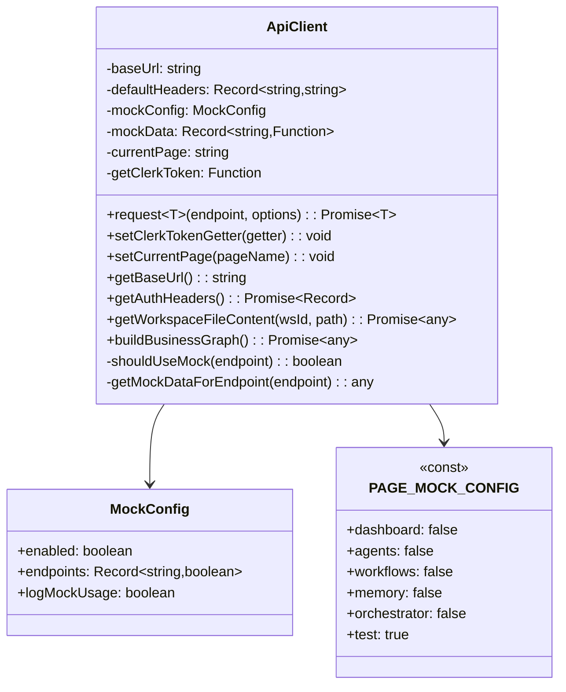
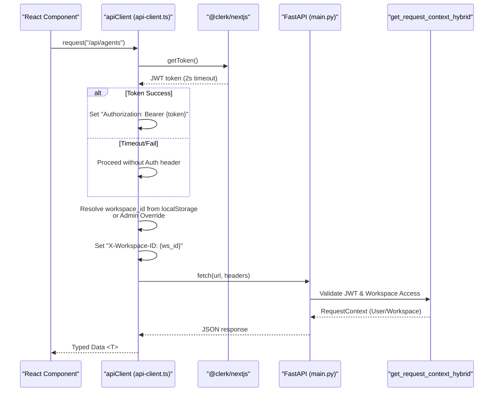
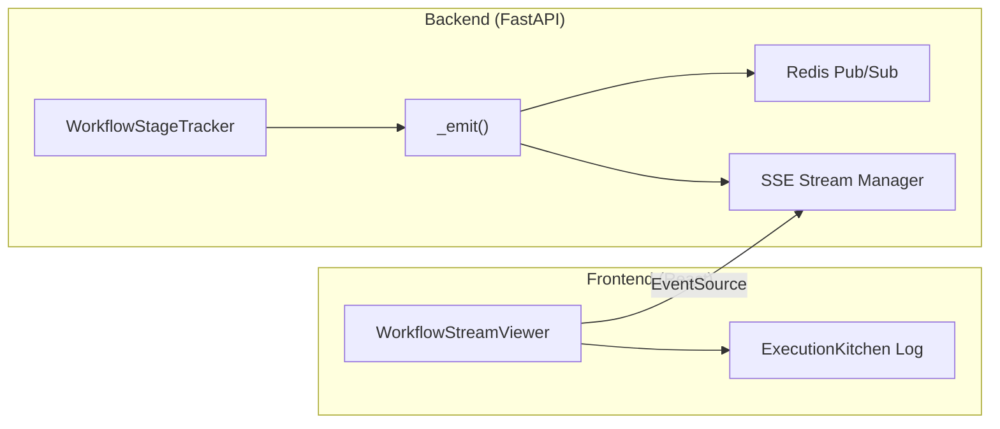
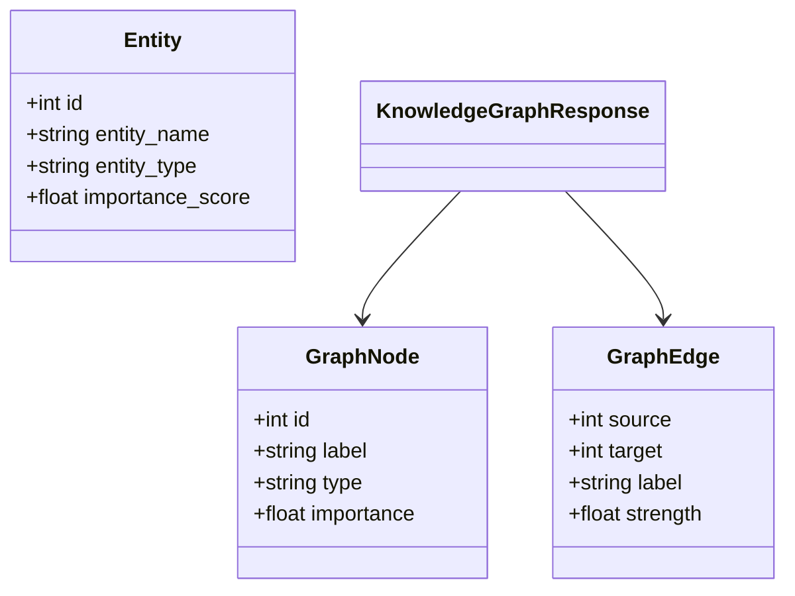

# API Client

Relevant source files

The following files were used as context for generating this wiki page:

- [frontend/components/knowledge/BusinessGraphPanel.tsx](frontend/components/knowledge/BusinessGraphPanel.tsx)
- [frontend/components/workflows/execution-kitchen.tsx](frontend/components/workflows/execution-kitchen.tsx)
- [frontend/lib/api-client.ts](frontend/lib/api-client.ts)
- [orchestrator/api/knowledge_graph.py](orchestrator/api/knowledge_graph.py)
- [orchestrator/api/workflows.py](orchestrator/api/workflows.py)
- [orchestrator/modules/context/sections/graph_context.py](orchestrator/modules/context/sections/graph_context.py)
- [orchestrator/modules/knowledge/graph_extraction.py](orchestrator/modules/knowledge/graph_extraction.py)
- [orchestrator/modules/knowledge/graph_service.py](orchestrator/modules/knowledge/graph_service.py)
- [orchestrator/modules/tools/discovery/actions_graph.py](orchestrator/modules/tools/discovery/actions_graph.py)
- [orchestrator/modules/tools/discovery/handlers_graph.py](orchestrator/modules/tools/discovery/handlers_graph.py)

## Purpose and Scope

The API Client is a centralized TypeScript client class that handles all HTTP communication between the Next.js frontend and the FastAPI backend. It provides authentication injection via Clerk JWT, workspace context management through custom headers, request/response logging, and a robust development mock system with automatic fallback capabilities. It serves as the single source of truth for frontend-to-backend data flow, ensuring that multi-tenancy constraints are respected at the network layer.

**Sources:** [frontend/lib/api-client.ts:1-11]()

---

## Architecture Overview

The API Client is implemented as a singleton class (`ApiClient`) that wraps the browser's native `fetch` API. It is designed to be workspace-aware, injecting the necessary multi-tenancy headers into every outgoing request.

### Class Structure

The `ApiClient` maintains internal state for base URL resolution, default headers, and mock configuration. It supports an admin override mechanism to allow administrators to "impersonate" or view other workspace contexts without changing their primary session.

**Sources:** [frontend/lib/api-client.ts:94-155](), [frontend/lib/api-client.ts:55-79](), [frontend/lib/api-client.ts:84-92](), [frontend/components/knowledge/BusinessGraphPanel.tsx:179-179](), [frontend/components/knowledge/BusinessGraphPanel.tsx:197-197]()

---

## Authentication System

The system utilizes a hybrid authentication model. The frontend fetches a JWT from Clerk, which the `ApiClient` injects into the `Authorization` header.

### Authentication Flow

The backend uses `get_request_context_hybrid` in `core/auth/hybrid.py` to validate these tokens and extract the workspace context.

**Sources:** [frontend/lib/api-client.ts:819-841](), [orchestrator/api/knowledge_graph.py:17-17](), [frontend/lib/api-client.ts:156-164]()

### Token Injection Implementation

The client requires a token getter to be registered, typically from a top-level provider or hook that has access to Clerk's `useAuth()`.

- **Timeout Protection:** The token fetch is wrapped in a 2-second timeout to prevent UI hangs if the auth provider is slow [frontend/lib/api-client.ts:829-840]().
- **Header Composition:** Headers include `Content-Type: application/json` by default [frontend/lib/api-client.ts:121-123]().
- **Hybrid Support:** If no Clerk token is available, the client still proceeds, allowing the backend to fall back to API Key authentication if applicable [frontend/lib/api-client.ts:841-842]().

**Sources:** [frontend/lib/api-client.ts:156-164](), [frontend/lib/api-client.ts:819-853]()

---

## Request Lifecycle

The `request<T>` method is the primary entry point for all data fetching.

### Lifecycle Logic

1.  **Token Retrieval:** Calls the registered `getClerkToken` [frontend/lib/api-client.ts:827-828]().
2.  **Header Assembly:** Merges default headers, auth headers, and workspace ID [frontend/lib/api-client.ts:849-863]().
3.  **Body Serialization:** Automatically stringifies objects unless the body is an instance of `FormData`. For example, the `BusinessGraphPanel` bypasses the standard `apiClient.request` for multipart uploads to `/api/knowledge/graph/import` to handle `FormData` manually [frontend/components/knowledge/BusinessGraphPanel.tsx:102-110]().
4.  **Execution:** Performs the native `fetch` call.
5.  **Error Handling:** If the response is not `ok`, it attempts to parse the backend's `detail` error message [frontend/lib/api-client.ts:884-895]().
6.  **Mock Fallback:** If the network call fails and mocks are enabled for that context, it returns mock data instead of throwing [frontend/lib/api-client.ts:909-927]().

**Sources:** [frontend/lib/api-client.ts:819-927](), [frontend/components/knowledge/BusinessGraphPanel.tsx:102-110]()

---

## Workspace Context & Multi-Tenancy

The `ApiClient` ensures data isolation by attaching the active workspace ID to every request. This is critical for the backend's `RequestContext` to filter database queries by `workspace_id`.

### Workspace Resolution Hierarchy

The client resolves the workspace ID using the following priority:
1.  **Admin Override:** A module-level variable `_adminWorkspaceOverride` set via `setAdminWorkspaceOverride()` [frontend/lib/api-client.ts:84-92]().
2.  **Local Storage:** Checks `last_active_workspace` or `last_active_org` keys [frontend/lib/api-client.ts:858-861]().

### Team-Based Access Control (PRD-124)

The API Client and its corresponding backend routers support team-scoped filtering. Backend services like `GraphifyService` and handlers like `handle_query_graph` use `team_filtered_view` to restrict data access based on the agent's assigned team [orchestrator/modules/knowledge/graph_service.py:107-121](), [orchestrator/modules/tools/discovery/handlers_graph.py:64-67]().

**Sources:** [frontend/lib/api-client.ts:80-92](), [frontend/lib/api-client.ts:855-862](), [orchestrator/modules/knowledge/graph_service.py:107-121](), [orchestrator/modules/tools/discovery/handlers_graph.py:64-67]()

---

## Mock System

The client features a tiered mock system that allows developers to work offline or against unimplemented endpoints.

### Mock Control Hierarchy

Mocks are evaluated in the following order:
1.  **Production Check:** Mocks are strictly disabled in production environments [frontend/lib/api-client.ts:126-126]().
2.  **Page-Level Override:** `PAGE_MOCK_CONFIG` defines which pages should use mocks (e.g., `test` or `demo` pages) [frontend/lib/api-client.ts:55-79]().
3.  **Global Toggle:** A global `enabled` flag in `mockConfig` [frontend/lib/api-client.ts:251-253]().
4.  **Endpoint Toggle:** Specific endpoint overrides within `mockConfig.endpoints` [frontend/lib/api-client.ts:256-259]().

### Mock Data Matching

The system supports exact path matching and fallback "default" data. It can also match dynamic patterns like `/api/agents/[id]` using substring checks. If a real API call fails (network error), the client will attempt to find a mock for that endpoint as a safety fallback [frontend/lib/api-client.ts:909-915]().

**Sources:** [frontend/lib/api-client.ts:238-264](), [frontend/lib/api-client.ts:753-796](), [frontend/lib/api-client.ts:909-927]()

---

## Backend Integration

The `ApiClient` targets the FastAPI backend routers, including specialized routers for Workflow tracking and Knowledge Graph.

### Key Knowledge & RAG Endpoints

The API Client supports advanced knowledge graph and RAG operations:

| Frontend Method | Backend Route | Purpose |
| :--- | :--- | :--- |
| `getWorkspaceFileContent` | `/api/workspaces/{ws_id}/files/content` | Fetches JSON graph data (e.g., `graph/graph.json`) [frontend/components/knowledge/BusinessGraphPanel.tsx:197-197]() |
| `buildBusinessGraph` | `/api/knowledge/graph/build` | Triggers background graph construction [frontend/components/knowledge/BusinessGraphPanel.tsx:179-179]() |
| N/A (Manual Fetch) | `/api/knowledge/graph/import` | Uploads `.json` graph exports via `FormData` [frontend/components/knowledge/BusinessGraphPanel.tsx:102-102]() |
| N/A | `/api/knowledge/entities` | Lists extracted entities with importance scores [orchestrator/api/knowledge_graph.py:84-84]() |

### Workflow Execution Tracking

The frontend consumes workflow progress via SSE (Server-Sent Events). The `WorkflowStageTracker` on the backend emits events for both legacy 9-stage workflows and PRD-59 dynamic phases (PLAN, PREPARE, EXECUTE, EVALUATE, LEARN) [orchestrator/api/workflows.py:37-68]().

**Sources:** [orchestrator/api/workflows.py:37-68](), [orchestrator/api/workflows.py:161-178](), [frontend/components/workflows/execution-kitchen.tsx:29-29]()

### Platform Graph Actions

Agents interact with the knowledge graph through `PlatformActionExecutor` using handlers defined in the backend. These handlers, such as `handle_query_graph`, apply PRD-124 team filtering to ensure agents only see nodes visible to their assigned team [orchestrator/modules/tools/discovery/handlers_graph.py:98-132]().

| Action Name | Handler Function | Description |
| :--- | :--- | :--- |
| `platform_query_graph` | `handle_query_graph` | Natural-language traversal (BFS/DFS) [orchestrator/modules/tools/discovery/actions_graph.py:9-10]() |
| `platform_graph_neighbors` | `handle_graph_neighbors` | Finds direct node connections [orchestrator/modules/tools/discovery/actions_graph.py:62-63]() |
| `platform_graph_impact` | `handle_graph_impact` | Analyzes downstream ripple effects [orchestrator/modules/tools/discovery/actions_graph.py:138-139]() |

**Sources:** [orchestrator/api/knowledge_graph.py:84-142](), [orchestrator/modules/tools/discovery/handlers_graph.py:98-177](), [orchestrator/modules/tools/discovery/actions_graph.py:9-140]()

### Entity Search & Visualization

The backend provides structured models for the `ApiClient` to consume, specifically for the `BusinessGraphVisualization` component.

**Sources:** [orchestrator/api/knowledge_graph.py:29-71](), [frontend/components/knowledge/BusinessGraphPanel.tsx:20-41]()

---

## Configuration & Environment

The client's behavior is dictated by environment variables and build-time settings.

| Variable | Usage |
| :--- | :--- |
| `NEXT_PUBLIC_API_URL` | Primary backend URL resolved at runtime or build-time [frontend/lib/api-client.ts:107-111]() |
| `NODE_ENV` | Toggles developer logging and mock availability [frontend/lib/api-client.ts:126-126]() |

**Sources:** [frontend/lib/api-client.ts:101-155]()

---