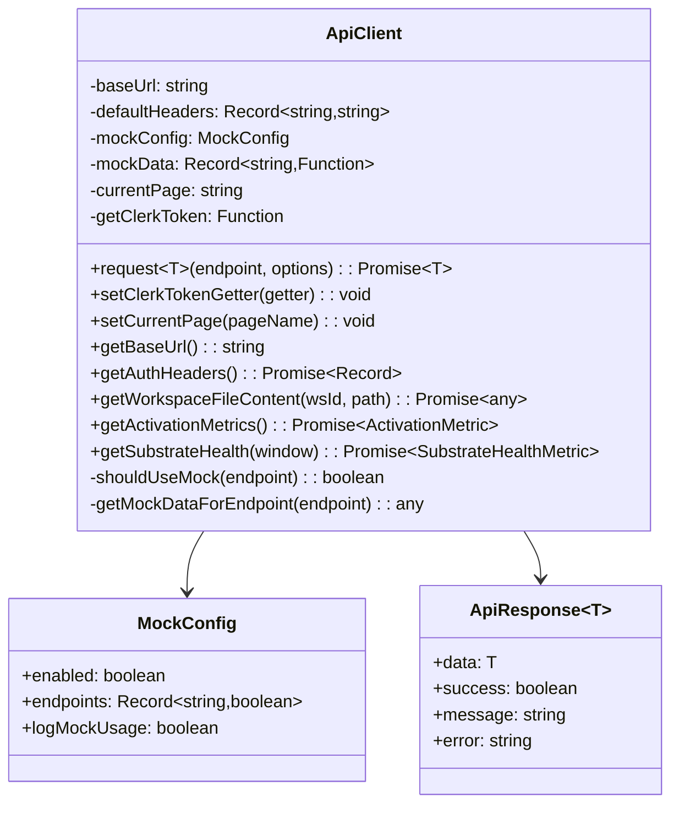
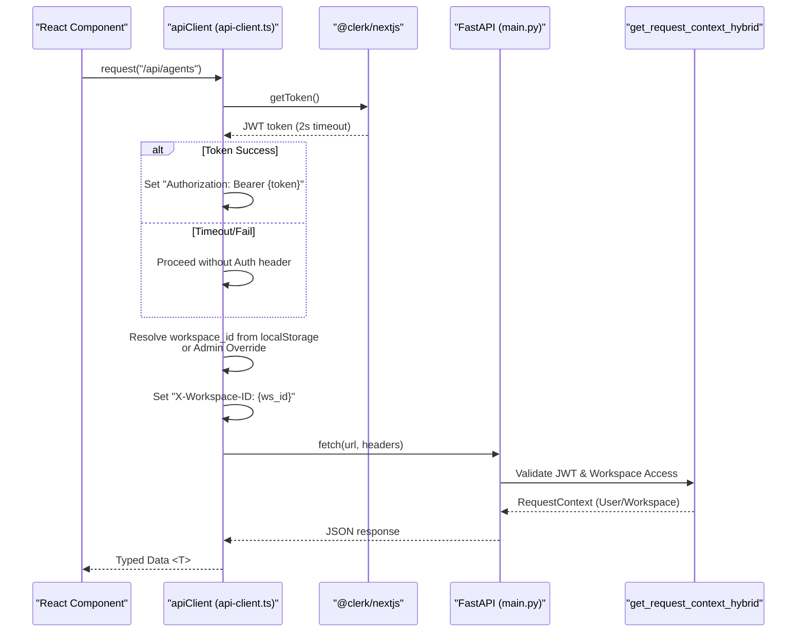
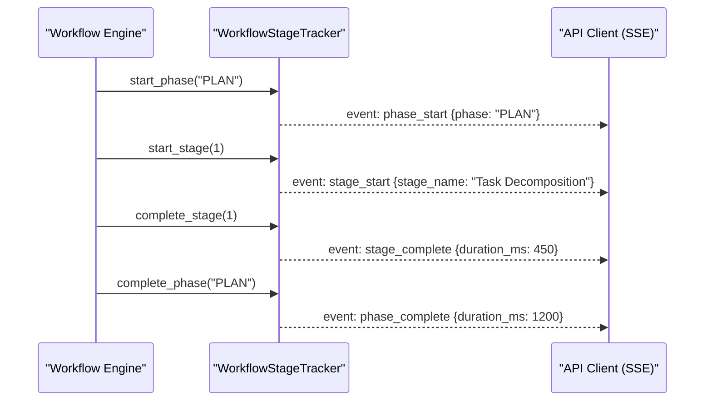

# API Client

Relevant source files

The following files were used as context for generating this wiki page:

- [frontend/components/__tests__/prd197-substrate-tile.test.tsx](frontend/components/__tests__/prd197-substrate-tile.test.tsx)
- [frontend/components/command-center/is-it-working-strip.tsx](frontend/components/command-center/is-it-working-strip.tsx)
- [frontend/hooks/use-analytics-api.ts](frontend/hooks/use-analytics-api.ts)
- [frontend/lib/api-client.ts](frontend/lib/api-client.ts)
- [orchestrator/api/workflows.py](orchestrator/api/workflows.py)
- [orchestrator/config.py](orchestrator/config.py)
- [orchestrator/core/models/substrate_metrics.py](orchestrator/core/models/substrate_metrics.py)
- [orchestrator/core/observability/substrate_metrics.py](orchestrator/core/observability/substrate_metrics.py)
- [orchestrator/main.py](orchestrator/main.py)
- [orchestrator/reports/route-manifest.json](orchestrator/reports/route-manifest.json)
- [orchestrator/router_manifest.py](orchestrator/router_manifest.py)
- [orchestrator/tests/authz_sweep_probe.py](orchestrator/tests/authz_sweep_probe.py)
- [orchestrator/tests/test_p2w2_authz_boundary_sweep.py](orchestrator/tests/test_p2w2_authz_boundary_sweep.py)
- [orchestrator/tests/test_prd154_s5_missions.py](orchestrator/tests/test_prd154_s5_missions.py)
- [orchestrator/tests/test_prd222_w2s1_plan_tiers.py](orchestrator/tests/test_prd222_w2s1_plan_tiers.py)

## Purpose and Scope

The API Client is a centralized TypeScript client class that handles all HTTP communication between the Next.js frontend and the FastAPI backend. It provides authentication injection via Clerk JWT, workspace context management through custom headers, request/response logging, and a robust development mock system with automatic fallback capabilities. It serves as the single source of truth for frontend-to-backend data flow, ensuring that multi-tenancy constraints are respected at the network layer [frontend/lib/api-client.ts:2-7]().

## Architecture Overview

The API Client is implemented as a singleton class (`ApiClient`) that wraps the browser's native `fetch` API. It is designed to be workspace-aware, injecting the necessary multi-tenancy headers into every outgoing request.

### Class Structure

The `ApiClient` maintains internal state for base URL resolution, default headers, and mock configuration. It supports an admin override mechanism to allow administrators to "impersonate" or view other workspace contexts without changing their primary session [frontend/lib/api-client.ts:137-149]().

Sources: [frontend/lib/api-client.ts:9-20](), [frontend/lib/api-client.ts:38-91](), [frontend/lib/api-client.ts:137-149]()

## Authentication System

The system utilizes a hybrid authentication model. The frontend fetches a JWT from Clerk, which the `ApiClient` injects into the `Authorization` header.

### Authentication Flow

The backend uses `get_request_context_hybrid` in `core/auth/hybrid.py` to validate these tokens and extract the workspace context.

Sources: [frontend/lib/api-client.ts:140-149](), [orchestrator/api/workflows.py:29-29]()

## Workspace Context & Multi-Tenancy

The `ApiClient` ensures data isolation by attaching the active workspace ID to every request. This is critical for the backend's `RequestContext` to filter database queries by `workspace_id`.

### Workspace Resolution Hierarchy

The client resolves the workspace ID using the following priority:
1.  **Admin Override:** A module-level variable `_adminWorkspaceOverride` set via `setAdminWorkspaceOverride()` [frontend/lib/api-client.ts:140-144]().
2.  **Local Storage:** Checks `last_active_workspace` or `last_active_org` keys.

### Durable Memory Scoping (PRD-187)

The `DurableMemoryStore` (L3) utilizes the workspace ID to ensure fail-closed tenancy for long-term memory. It extracts the workspace ID from the `MemoryNamespace` (e.g., `mem:{workspace_id}`) [orchestrator/modules/memory/durable_store.py:63-73](). This ensures that operations like GDPR erasure can target specific workspaces or subjects via `_workspace_filter` and `_subject_filter` [orchestrator/modules/memory/durable_store.py:153-166]().

Sources: [frontend/lib/api-client.ts:137-149](), [orchestrator/modules/memory/durable_store.py:63-73](), [orchestrator/modules/memory/durable_store.py:153-166]()

## Analytics & Observability Integration

The API Client provides specialized methods for the "Is It Working?" dashboard tiles (PRD-142), consuming real-time metrics from the backend.

### Substrate Health Monitoring (PRD-197)

The client tracks the health of retrieval "seams" (documents, memory, field). The backend records these events via `record_substrate_search` [orchestrator/core/observability/substrate_metrics.py:79-88](), which populates the `substrate_metric_events` table [orchestrator/core/models/substrate_metrics.py:22-30]().

| Metric Type | Interface | Description |
| :--- | :--- | :--- |
| **Substrate Health** | `SubstrateHealthMetric` | Latency and error rates for RAG/Memory seams [frontend/lib/api-client.ts:87-91]() |
| **Activation** | `ActivationMetric` | Tracks if a workspace has reached "first value" [frontend/lib/api-client.ts:38-43]() |
| **Mission Success** | `MissionSuccessRateMetric` | Percentage of successful multi-agent missions [frontend/lib/api-client.ts:45-51]() |
| **Primitive Health** | `PrimitiveHealthMetric` | Status of core services (Qdrant, Redis, etc.) [frontend/lib/api-client.ts:67-74]()

### Frontend Consumption

The `IsItWorkingStrip` component uses the `useSubstrateHealth` hook, which calls the `apiClient`, to render the retrieval status. If a seam like "memory" is degraded, it is explicitly named in the UI [frontend/components/command-center/is-it-working-strip.tsx:85-91](), [frontend/components/__tests__/prd197-substrate-tile.test.tsx:67-76]().

Sources: [frontend/lib/api-client.ts:35-91](), [orchestrator/core/observability/substrate_metrics.py:37-40](), [frontend/hooks/use-analytics-api.ts:112-118](), [frontend/components/command-center/is-it-working-strip.tsx:83-91]()

## Workflow Execution Tracking

The API Client interacts with the `WorkflowStageTracker` to provide real-time updates on recipe and mission execution.

### Stage and Phase Events

The backend emits Server-Sent Events (SSE) during workflow execution, supporting both legacy 9-stage paths and PRD-59 dynamic phases (PLAN, PREPARE, EXECUTE, EVALUATE, LEARN) [orchestrator/api/workflows.py:38-69]().

Sources: [orchestrator/api/workflows.py:89-125](), [orchestrator/api/workflows.py:127-161]()

## Mock System

The client features a tiered mock system that allows developers to work offline or against unimplemented endpoints. Mocks are strictly disabled in production [frontend/lib/api-client.ts:4-5]().

### Mock Fallback Logic

If a real API call fails (network error), the client will attempt to find a mock for that endpoint as a safety fallback. This system was partially superseded by the requirement for real local stacks (PRD-153), but remains for rapid UI prototyping.

Sources: [frontend/lib/api-client.ts:2-7]()

---