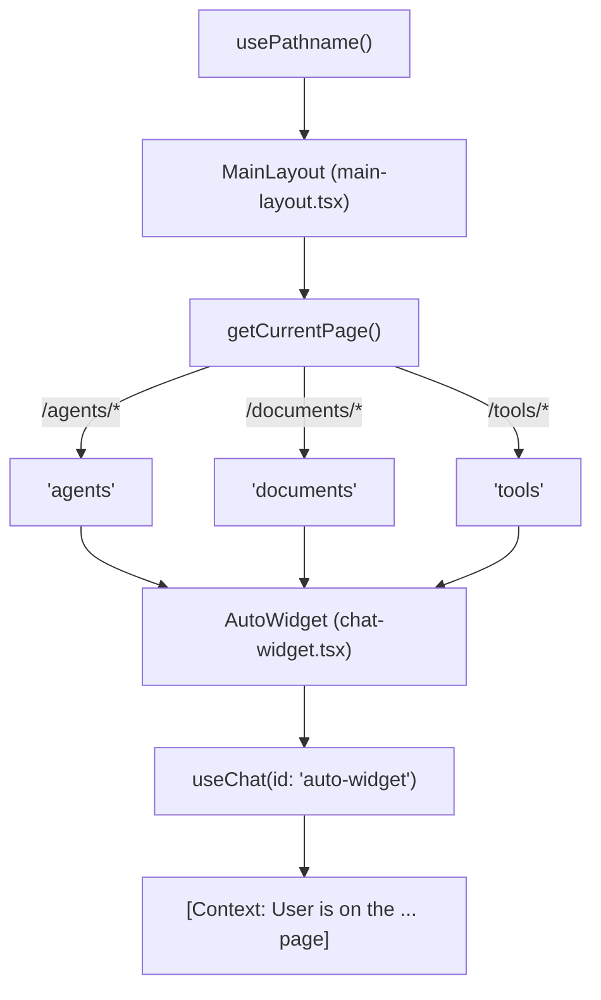
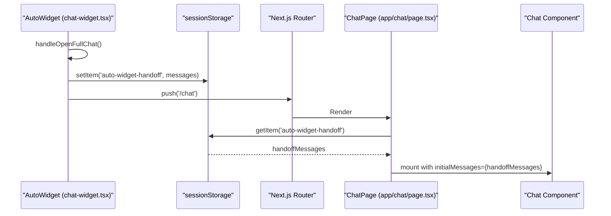

# Application Structure

<details>
<summary>Relevant source files</summary>

The following files were used as context for generating this wiki page:

- [frontend/app/chat/page.tsx](frontend/app/chat/page.tsx)
- [frontend/app/tools/page.tsx](frontend/app/tools/page.tsx)
- [frontend/components/chatbot/chat-widget.tsx](frontend/components/chatbot/chat-widget.tsx)
- [frontend/components/layout/header.tsx](frontend/components/layout/header.tsx)
- [frontend/components/layout/main-layout.tsx](frontend/components/layout/main-layout.tsx)
- [frontend/components/layout/mobile-sidebar.tsx](frontend/components/layout/mobile-sidebar.tsx)
- [frontend/components/layout/sidebar.tsx](frontend/components/layout/sidebar.tsx)
- [frontend/components/tools/my-tools-dashboard.tsx](frontend/components/tools/my-tools-dashboard.tsx)
- [frontend/public/brand/jira-logo.svg](frontend/public/brand/jira-logo.svg)

</details>


**Purpose**: This page documents the frontend application structure, including the Next.js configuration, directory organization, layout hierarchy, and navigation structure. It covers the foundational setup of the React application and the layout patterns used to provide a consistent multi-tenant user experience.

---

## Framework & Runtime

The frontend is built on **Next.js 15** using the **App Router** architecture. It utilizes React 18 and TypeScript.

### Next.js Configuration

The application uses a specific Next.js configuration optimized for deployment and security:

```typescript
// next.config.js key settings
const nextConfig = {
  output: 'standalone',            // Optimized for Docker/Kubernetes
  reactStrictMode: false,          // Strict mode disabled
  poweredByHeader: false,          // Security: Disable X-Powered-By
  typescript: {
    ignoreBuildErrors: true        // Build-time type checking disabled (Temporary)
  },
  typedRoutes: true,               // Type-safe routing enabled
}
```

**Key Configuration Decisions**:
- **Standalone Output**: The `output: 'standalone'` setting creates a minimal build folder containing only the necessary files for production.
- **Security Headers**: The configuration injects strict security headers, including a robust `Content-Security-Policy` (CSP) to prevent XSS.
- **API Strategy**: The application uses absolute URLs via `NEXT_PUBLIC_API_URL` for backend communication.

---

## Application Hierarchy

### Root Layout & Providers

The `RootLayout` serves as the entry point, wrapping the application in a `Providers` tree. This tree initializes critical global services:

| Provider | Responsibility |
| :--- | :--- |
| `ClerkProvider` | Authentication and user session management |
| `QueryClientProvider` | Server state management via React Query |
| `WorkspaceProvider` | Multi-tenancy context and workspace switching |
| `ThemeProvider` | Dark/Light/Matte mode management |
| `RoleProvider` | RBAC (Role-Based Access Control) state |

### Main Layout & Navigation

The `MainLayout` [frontend/components/layout/main-layout.tsx:19-119]() component establishes the structural shell for the internal application pages. It manages:

- **Sidebar Navigation**: Desktop sidebar with collapse state [frontend/components/layout/main-layout.tsx:64-77]() and a mobile-specific `Sheet` navigation [frontend/components/layout/main-layout.tsx:80-89]().
- **Page Header**: Contains the menu toggle, branding, and user profile [frontend/components/layout/main-layout.tsx:97-97]().
- **Floating Assistant**: The `AutoWidget` [frontend/components/layout/main-layout.tsx:112-116]() is injected globally except on the dedicated `/chat` route.
- **Onboarding**: Automatically starts page tours via `useAutoTour()` [frontend/components/layout/main-layout.tsx:26-26]().

**Sources**: [frontend/components/layout/main-layout.tsx:1-120]()

---

## System Flow Diagrams

### Page Context & Assistant Integration

The following diagram bridges the "Natural Language Space" of "Page-Aware Assistance" to the "Code Entity Space" by showing how `MainLayout` determines context for the `AutoWidget`.


**Sources**: [frontend/components/layout/main-layout.tsx:29-51](), [frontend/components/chatbot/chat-widget.tsx:107-112]()

### Chat Routing & Handoff

This diagram illustrates the data flow when a user transitions from the floating widget to the full-screen chat interface.


**Sources**: [frontend/components/chatbot/chat-widget.tsx:84-93](), [frontend/app/chat/page.tsx:63-75]()

---

## Navigation & UI Structure

### Sidebar & Role Access
The `Sidebar` [frontend/components/layout/sidebar.tsx:127-215]() and `MobileSidebar` [frontend/components/layout/mobile-sidebar.tsx:114-187]() manage application-wide navigation.
- **RBAC Filtering**: Navigation items are filtered based on the user's `systemRole` and `isAdmin` status [frontend/components/layout/sidebar.tsx:134-137]().
- **Admin Section**: Routes like `/admin/workspaces` are restricted to users with the `admin` role [frontend/components/layout/sidebar.tsx:117-124]().
- **Premium Icons**: Navigation supports dynamic icon mapping via `useSystemIcons()` [frontend/components/layout/sidebar.tsx:131-131]().

### Chat Interface
The dedicated `/chat` page [frontend/app/chat/page.tsx:20-145]() features unique layout behaviors:
- **Viewport Management**: Uses `dvh` (Dynamic Viewport Height) for mobile to account for browser toolbars [frontend/app/chat/page.tsx:87-87]().
- **History Panel**: Integrates a dedicated `AppSidebar` for chat history [frontend/app/chat/page.tsx:106-106]().
- **Deep Linking**: Supports specific modes like `?mode=plan` which activates the mission planning interface via `useMissionStore` [frontend/app/chat/page.tsx:32-36]().
- **History Toggle**: Responds to the `automatos:chat-history-toggle` custom event dispatched from the main sidebar [frontend/app/chat/page.tsx:78-82]().

### Tools Dashboard
The `/tools` page [frontend/app/tools/page.tsx:7-15]() hosts the `ToolsDashboard` and `MyToolsDashboard` [frontend/components/tools/my-tools-dashboard.tsx:13-113]().
- **Connectivity Status**: Displays real-time status (Active, Error, Disconnected) for third-party integrations via `useConnectedApps()` [frontend/hooks/use-composio-api:10-10]().
- **Marketplace Link**: Provides direct access to the marketplace for discovering new tools [frontend/components/tools/my-tools-dashboard.tsx:66-72]().

**Sources**: [frontend/components/layout/sidebar.tsx:35-125](), [frontend/app/chat/page.tsx:1-145](), [frontend/components/tools/my-tools-dashboard.tsx:1-188]()

---

## Styling & Theme System

The application uses **Tailwind CSS** with a custom theme engine supporting three primary modes:

| Theme | Description | CSS Trigger |
| :--- | :--- | :--- |
| **Light** | High-contrast, crisp borders, standard surfaces | `:root` |
| **Dark** | Neon accents, glassmorphism, glowing shadows | `.dark` |
| **Matte** | Cool-grey palette, flat surfaces, no glow | `.matte` |

**Key Styling Entities**:
- **Glassmorphism**: Layout components use `glass-card` and `backdrop-blur` for a layered UI feel [frontend/components/layout/main-layout.tsx:84-84]().
- **Branding**: The brand mark (`automatos-mark-hi.png`) is consistently used across the header [frontend/components/layout/header.tsx:37-42]() and mobile sidebar [frontend/components/layout/mobile-sidebar.tsx:128-133]().

**Sources**: [frontend/components/layout/header.tsx:1-102](), [frontend/components/layout/main-layout.tsx:62-62]()

---