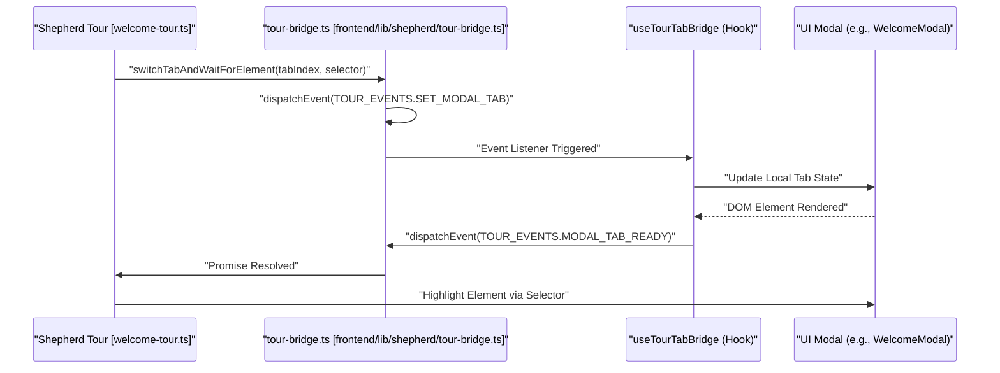

# Application Structure

<details>
<summary>Relevant source files</summary>

The following files were used as context for generating this wiki page:

- [frontend/app/auth/signin/[[...rest]]/page.tsx](frontend/app/auth/signin/[[...rest]]/page.tsx)
- [frontend/app/auth/signup/[[...rest]]/page.tsx](frontend/app/auth/signup/[[...rest]]/page.tsx)
- [frontend/app/chat/[id]/page.tsx](frontend/app/chat/[id]/page.tsx)
- [frontend/app/globals.css](frontend/app/globals.css)
- [frontend/app/layout.tsx](frontend/app/layout.tsx)
- [frontend/app/sso-callback/page.tsx](frontend/app/sso-callback/page.tsx)
- [frontend/components/activity/widgets/command-centre-dashboard.tsx](frontend/components/activity/widgets/command-centre-dashboard.tsx)
- [frontend/components/onboarding/first-login-guard.tsx](frontend/components/onboarding/first-login-guard.tsx)
- [frontend/components/onboarding/welcome-modal.tsx](frontend/components/onboarding/welcome-modal.tsx)
- [frontend/components/providers.tsx](frontend/components/providers.tsx)
- [frontend/components/shared/page-header.tsx](frontend/components/shared/page-header.tsx)
- [frontend/components/ui/dialog.tsx](frontend/components/ui/dialog.tsx)
- [frontend/components/ui/input.tsx](frontend/components/ui/input.tsx)
- [frontend/components/ui/select.tsx](frontend/components/ui/select.tsx)
- [frontend/components/ui/tabs.tsx](frontend/components/ui/tabs.tsx)
- [frontend/hooks/use-tour-tab-bridge.ts](frontend/hooks/use-tour-tab-bridge.ts)
- [frontend/lib/shepherd/tour-bridge.ts](frontend/lib/shepherd/tour-bridge.ts)
- [frontend/lib/shepherd/tour-storage.ts](frontend/lib/shepherd/tour-storage.ts)
- [frontend/middleware.ts](frontend/middleware.ts)
- [frontend/next.config.js](frontend/next.config.js)
- [frontend/styles/shepherd-custom.css](frontend/styles/shepherd-custom.css)
- [frontend/tailwind.config.ts](frontend/tailwind.config.ts)

</details>


**Purpose**: This page documents the frontend application structure, including the Next.js configuration, directory organization, core dependencies, and navigation hierarchy. It covers the foundational setup of the React application and the layout patterns used to provide a consistent user experience.

---

## Framework & Runtime

The frontend is built on **Next.js 15** using the **App Router** architecture. It utilizes React 18 and TypeScript.

### Next.js Configuration

The application uses a specific Next.js configuration optimized for deployment and security:

```typescript
// next.config.js key settings
const nextConfig = {
  output: 'standalone',            // Optimized for Docker/Kubernetes
  reactStrictMode: false,          // Strict mode disabled
  poweredByHeader: false,          // Security: Disable X-Powered-By
  typescript: {
    ignoreBuildErrors: true        // Build-time type checking disabled (Temporary)
  },
  typedRoutes: true,               // Type-safe routing enabled
}
```

**Key Configuration Decisions**:
- **Standalone Output**: The `output: 'standalone'` setting [frontend/next.config.js:5-5]() creates a minimal build folder containing only the necessary files for production, reducing image size.
- **Security Headers**: The configuration injects strict security headers, including a robust `Content-Security-Policy` (CSP) [frontend/next.config.js:62-77]() to prevent XSS and data injection.
- **API Strategy**: Rewrites are disabled; the application uses absolute URLs via `NEXT_PUBLIC_API_URL` [frontend/next.config.js:18-20]() to avoid build-time environment variable requirements.

**Sources**: [frontend/next.config.js:1-82]()

---

## Root Architecture

### Global Providers & Layout
The `RootLayout` [frontend/app/layout.tsx:15-29]() serves as the entry point, wrapping the application in a `Providers` component. This provider tree initializes critical application services:

| Provider | Responsibility | File Reference |
| :--- | :--- | :--- |
| `ClerkProvider` | Authentication and user session management | [frontend/components/providers.tsx:27-54]() |
| `ThemeProvider` | Dark/Light mode management with system preference sync | [frontend/components/providers.tsx:57-63]() |
| `QueryClientProvider` | React Query instance for server-state management | [frontend/components/providers.tsx:64-82]() |
| `WorkspaceProvider` | Multi-tenant workspace context and isolation | [frontend/components/providers.tsx:65-65]() |
| `RoleProvider` | RBAC (Role-Based Access Control) state | [frontend/components/providers.tsx:56-56]() |

**Sources**: [frontend/app/layout.tsx:1-30](), [frontend/components/providers.tsx:1-89]()

### Route Protection & Middleware
The application uses **Clerk** for authentication and session management.

- **Middleware**: The `middleware.ts` [frontend/middleware.ts:1-14]() file defines public routes (sign-in, sign-up, webhooks) and protects all other routes using `auth.protect()`.
- **SSO Callback**: A dedicated `SSOCallbackPage` [frontend/app/sso-callback/page.tsx:5-7]() handles the return from third-party identity providers.

**Sources**: [frontend/middleware.ts:1-19](), [frontend/app/sso-callback/page.tsx:1-8]()

---

## UI Composition & Design System

### Styling & Theming
The application uses **Tailwind CSS** with a sophisticated CSS variable system for "Glassmorphism" and "Execution Theater" effects.

- **Global Variables**: Defined in `globals.css`, these variables control alpha levels for glass cards, borders, and shadows [frontend/app/globals.css:35-51]().
- **Semantic Status Colors**: Custom HSL tokens for success, warning, info, and agent-specific elements [frontend/app/globals.css:53-60]().
- **Glass Card Pattern**: A reusable `.glass-card` class [frontend/app/globals.css:184-205]() provides backdrop blur, subtle borders, and glow effects used throughout the dashboard and chat.

**Sources**: [frontend/app/globals.css:1-240]()

### Component Architecture
The UI is built using a combination of **Radix UI** primitives (via Shadcn/ui) and custom Framer Motion animations.

- **Tabs**: Implementation using `@radix-ui/react-tabs` with custom styling for horizontal scrolling and backdrop blur [frontend/components/ui/tabs.tsx:10-55]().
- **Dialogs**: Accessible modals using `@radix-ui/react-dialog`, styled as glass cards with entrance/exit animations [frontend/components/ui/dialog.tsx:32-123]().

---

## System Flow Diagrams

### Application Bootstrapping & Auth Flow

The following diagram illustrates how the Next.js Middleware and Clerk work together to protect the application and initialize providers.

```mermaid
graph TD
    "User_Request"["User Request"] --> "middleware.ts"["middleware.ts"]
    "middleware.ts" --> "isPublicRoute"["isPublicRoute() Check"]
    "isPublicRoute" -- "No" --> "auth.protect"["auth.protect()"]
    "auth.protect" -- "Success" --> "RootLayout"["RootLayout [frontend/app/layout.tsx]"]
    "RootLayout" --> "Providers"["Providers [frontend/components/providers.tsx]"]
    
    subgraph "Provider_Stack"["Provider Stack"]
        "ClerkProvider"["ClerkProvider"]
        "QueryClientProvider"["QueryClientProvider"]
        "WorkspaceProvider"["WorkspaceProvider"]
        "ThemeProvider"["ThemeProvider"]
    end
    
    "Providers" --> "Provider_Stack"
    "Provider_Stack" --> "FirstLoginGuard"["FirstLoginGuard [frontend/components/onboarding/first-login-guard.tsx]"]
    "FirstLoginGuard" --> "WelcomeModal"["WelcomeModal [frontend/components/onboarding/welcome-modal.tsx]"]
```
**Sources**: [frontend/middleware.ts:1-18](), [frontend/app/layout.tsx:15-29](), [frontend/components/providers.tsx:27-82](), [frontend/components/onboarding/first-login-guard.tsx:9-37]()

### UI Interaction: Tour-Modal Bridge

This diagram bridges the Natural Language concept of "Interactive Onboarding" to the specific code entities managing the tab-switching logic during a guided tour.


**Sources**: [frontend/lib/shepherd/tour-bridge.ts:10-88](), [frontend/components/onboarding/welcome-modal.tsx:24-37]()

---

## Dashboard & Widgets

The application features a customizable **Command Centre Dashboard** [frontend/components/activity/widgets/command-centre-dashboard.tsx:92-164]() that uses a registry-based approach for widget management.

- **Widget Registry**: Defines available widgets like `active-now`, `cost-tracker`, and `agent-performance` [frontend/components/activity/widgets/command-centre-dashboard.tsx:37-51]().
- **Persistence**: Dashboard layout (order and visibility) is persisted to `localStorage` via the `STORAGE_KEY` "automatos:command-centre-v3" [frontend/components/activity/widgets/command-centre-dashboard.tsx:59-82]().
- **Drag-and-Drop**: Users can reorder widgets using native drag events handled by `handleDragStart` and `handleDragOver` [frontend/components/activity/widgets/command-centre-dashboard.tsx:140-158]().

**Sources**: [frontend/components/activity/widgets/command-centre-dashboard.tsx:1-165]()

---