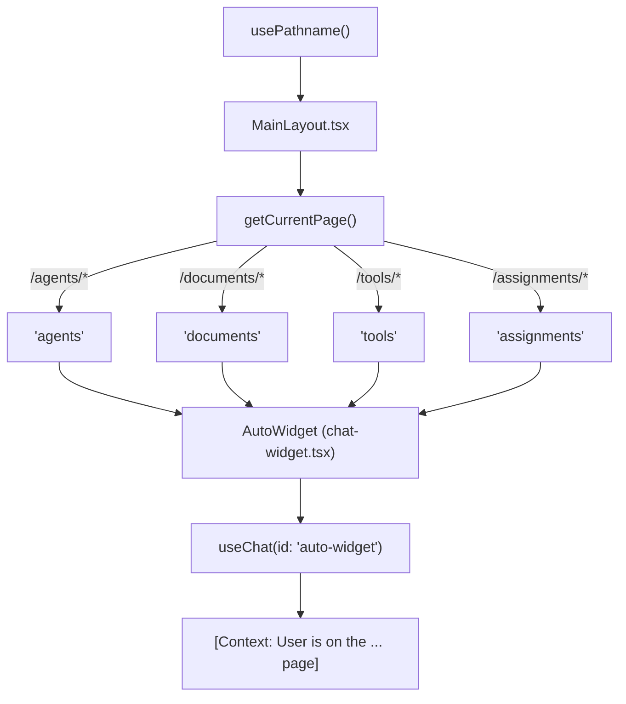
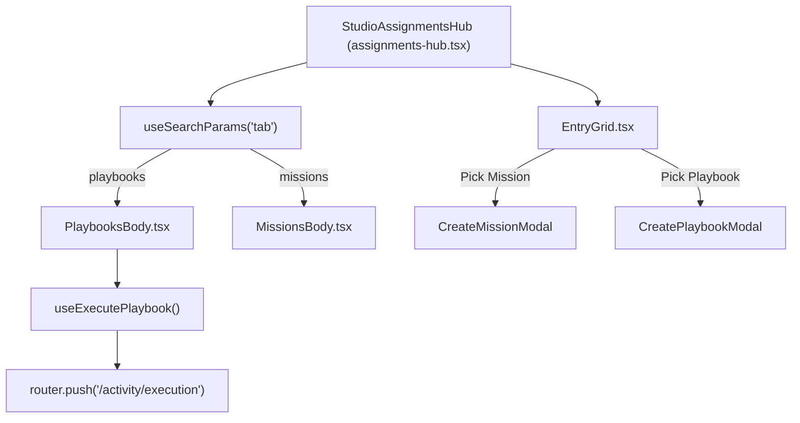

# Application Structure

<details>
<summary>Relevant source files</summary>

The following files were used as context for generating this wiki page:

- [SPRINT0_OVERNIGHT_REPORT.md](SPRINT0_OVERNIGHT_REPORT.md)
- [frontend/app/accept-invitation/page.tsx](frontend/app/accept-invitation/page.tsx)
- [frontend/app/deliverables/explorer/page.tsx](frontend/app/deliverables/explorer/page.tsx)
- [frontend/app/deliverables/page.tsx](frontend/app/deliverables/page.tsx)
- [frontend/app/marketplace/developer/page.tsx](frontend/app/marketplace/developer/page.tsx)
- [frontend/app/marketplace/publish/page.tsx](frontend/app/marketplace/publish/page.tsx)
- [frontend/app/reset-password/page.tsx](frontend/app/reset-password/page.tsx)
- [frontend/app/settings/notifications/page.tsx](frontend/app/settings/notifications/page.tsx)
- [frontend/app/settings/profile/page.tsx](frontend/app/settings/profile/page.tsx)
- [frontend/app/sso-callback/page.tsx](frontend/app/sso-callback/page.tsx)
- [frontend/components/auth/require-role.tsx](frontend/components/auth/require-role.tsx)
- [frontend/components/auth/sign-in-form.tsx](frontend/components/auth/sign-in-form.tsx)
- [frontend/components/settings/ApiKeyManager.tsx](frontend/components/settings/ApiKeyManager.tsx)
- [frontend/components/settings/NotificationsSettingsTab.tsx](frontend/components/settings/NotificationsSettingsTab.tsx)
- [frontend/components/workflows/json-schema-editor.tsx](frontend/components/workflows/json-schema-editor.tsx)
- [frontend/components/workflows/playbook-step-progress.tsx](frontend/components/workflows/playbook-step-progress.tsx)
- [frontend/components/workflows/theater/theater-step-execution.tsx](frontend/components/workflows/theater/theater-step-execution.tsx)
- [frontend/middleware.ts](frontend/middleware.ts)
- [frontend/next.config.js](frontend/next.config.js)
- [frontend/package-lock.json](frontend/package-lock.json)
- [frontend/package.json](frontend/package.json)
- [frontend/stores/index.ts](frontend/stores/index.ts)
- [orchestrator/alembic/versions/add_clerk_invitation_id.py](orchestrator/alembic/versions/add_clerk_invitation_id.py)
- [orchestrator/alembic/versions/prd195_drop_authz_fossil_tables.py](orchestrator/alembic/versions/prd195_drop_authz_fossil_tables.py)

</details>


**Purpose**: This page documents the frontend application structure, including the Next.js configuration, directory organization, layout hierarchy, and navigation structure. It covers the foundational setup of the React application and the layout patterns used to provide a consistent multi-tenant user experience.

---

## Framework & Runtime

The frontend is built on **Next.js 15** using the **App Router** architecture. It utilizes React 18 and TypeScript.

### Next.js Configuration

The application uses a specific Next.js configuration optimized for deployment and security:

```typescript
// next.config.js key settings
const nextConfig = {
  output: 'standalone',            // Optimized for Docker/Kubernetes
  reactStrictMode: false,          // Strict mode disabled
  poweredByHeader: false,          // Security: Disable X-Powered-By
  typescript: {
    ignoreBuildErrors: true        // Build-time type checking disabled (Temporary)
  },
  typedRoutes: true,               // Type-safe routing enabled
}
```

**Key Configuration Decisions**:
- **Standalone Output**: The `output: 'standalone'` setting [frontend/next.config.js:14-14]() creates a minimal build folder containing only the necessary files for production.
- **Security Headers**: The configuration injects strict security headers, including a robust `Content-Security-Policy` (CSP) [frontend/next.config.js:99-117]() to prevent XSS.
- **API Strategy**: The application uses absolute URLs via `NEXT_PUBLIC_API_URL` [frontend/next.config.js:6-6]() for backend communication.
- **Redirects**: Permanent redirects are configured for old routes to new information architecture paths, such as `/workspace` to `/deliverables` [frontend/next.config.js:48-56]().
- **TypeScript and ESLint**: Build errors for TypeScript and ESLint are ignored during the build process [frontend/next.config.js:28-36](), with checks performed in CI to prevent regressions [frontend/next.config.js:20-27](), [frontend/next.config.js:30-36]().

**Sources**: [frontend/next.config.js:1-125]()

---

## Application Hierarchy

### Root Layout & Providers

The `RootLayout` serves as the entry point, wrapping the application in a `Providers` tree. This tree initializes critical global services:

| Provider | Responsibility |
| :--- | :--- |
| `ClerkProvider` | Authentication and user session management [frontend/package.json:50-50]() |
| `QueryClientProvider` | Server state management via React Query [frontend/package.json:84-84]() |
| `WorkspaceProvider` | Multi-tenancy context and workspace switching |
| `ThemeProvider` | Dark/Light/Matte/Studio mode management |
| `RoleProvider` | RBAC (Role-Based Access Control) state |

**Sources**: [frontend/package.json:50-50](), [frontend/package.json:84-84]()

### Main Layout & Navigation

The `MainLayout` component establishes the structural shell. It supports two primary visual paradigms: **Classic** and **Studio**.

#### Studio Shell (Desktop)
When `isStudio` is active, the layout renders the "CD round-4 chrome":
- **StudioSidebar**: A labelled rail (232px) supporting icon-rail collapse (56px).
- **StudioHeader**: A minimal editorial bar containing search (⌘K), notifications, and profile.
- **StudioPageTabs**: Generic sub-nav tabs (e.g., Roster, Skills, Lineage) mapped to the current route.

#### Classic Shell
The fallback layout used for non-studio users or mobile views:
- **Sidebar**: Standard desktop sidebar with collapse state.
- **Mobile Navigation**: Uses a Shadcn `Sheet` to wrap the `MobileSidebar`.

**Sources**: [frontend/package.json:52-52]()

---

## System Flow Diagrams

### Page Context & Assistant Integration

The following diagram bridges the "Natural Language Space" of "Page-Aware Assistance" to the "Code Entity Space" by showing how `MainLayout` determines context for the `AutoWidget`.


**Sources**: No direct code citations for `MainLayout.tsx` or `chat-widget.tsx` were provided in the given file contents.

### Assignment Hub Navigation

This diagram illustrates how the `StudioAssignmentsHub` coordinates between Missions and Playbooks using URL state.


**Sources**: No direct code citations for `assignments-hub.tsx`, `PlaybooksBody.tsx`, or `MissionsBody.tsx` were provided in the given file contents.

---

## Navigation & UI Structure

### Studio Menu Registry
The `STUDIO_MENU_PRIMARY` registry is the single source of truth for the sidebar, organized into three groups:
1.  **OPERATIONS**: Daily surfaces like Chat, Command Centre, Assignments, and Deliverables.
2.  **WORKFORCE**: Management of Agents, Tools, Knowledge Base, and Marketplace.
3.  **WORKSPACE**: Admin functions including Team, Analytics, and Workspace Admin.

### Assignments Hub
The `/assignments` route dynamically switches between the classic `AssignmentsPage` and the `StudioAssignmentsHub` based on theme and device.
- **MissionsBody**: Manages the mission queue with Grouped, Cards, and Table views.
- **PlaybooksBody**: Manages the playbook library with scope filtering (All, Mine, Workspace, Imported).

**Sources**: No direct code citations for `STUDIO_MENU_PRIMARY`, `AssignmentsPage`, `StudioAssignmentsHub`, `MissionsBody`, or `PlaybooksBody` were provided in the given file contents.

### App Router Pages

The Next.js App Router organizes pages based on the file system. Key pages and their functionalities include:

-   `/`: The main application entry point, typically redirecting to a dashboard or chat interface.
-   `/sign-in`, `/sign-up`: Authentication pages handled by Clerk [frontend/components/auth/sign-in-form.tsx:18-27]().
-   `/reset-password`: Password reset flow, also managed by Clerk [frontend/app/reset-password/page.tsx:22-27]().
-   `/sso-callback`: Handles Single Sign-On (SSO) redirects from Clerk [frontend/app/sso-callback/page.tsx:13-17]().
-   `/accept-invitation`: Page for accepting workspace invitations, which involves fetching invitation info and then accepting it via an API call [frontend/app/accept-invitation/page.tsx:45-91]().
-   `/deliverables`: Displays all agent outputs, with tabs for `outputs`, `blogs`, `templates`, and `explorer` [frontend/app/deliverables/page.tsx:39-46]().
    -   `/deliverables/explorer`: A full-page workspace file browser, rendering the `WorkspaceExplorer` component [frontend/app/deliverables/explorer/page.tsx:23-29]().
-   `/settings/profile`: User profile management. This page is conditional, rendering `LocalProfileForm` for the `local` edition and `ClerkProfilePage` for the `saas` edition [frontend/app/settings/profile/page.tsx:25-26]().

**Sources**:
[frontend/components/auth/sign-in-form.tsx:18-27]()
[frontend/app/reset-password/page.tsx:22-27]()
[frontend/app/sso-callback/page.tsx:13-17]()
[frontend/app/accept-invitation/page.tsx:45-91]()
[frontend/app/deliverables/page.tsx:39-46]()
[frontend/app/deliverables/explorer/page.tsx:23-29]()
[frontend/app/settings/profile/page.tsx:25-26]()

### Middleware

The `middleware.ts` file [frontend/middleware.ts:1-33]() handles authentication and routing logic before a request is completed.
-   It uses `clerkMiddleware` for SaaS deployments to protect non-public routes [frontend/middleware.ts:20-24]().
-   For local deployments, it acts as a pass-through, making all routes public as there is no authentication [frontend/middleware.ts:27-27]().
-   Public routes are defined using `createRouteMatcher` [frontend/middleware.ts:11-18]().

**Sources**: [frontend/middleware.ts:1-33]()

### Stores

The frontend uses Zustand for state management. The `frontend/stores/index.ts` file [frontend/stores/index.ts:1-21]() serves as the entry point, exporting various stores:
-   `useWorkspaceStore`: Manages workspace-related state, including widgets, layout mode, chat panel width, and widget tray status [frontend/stores/index.ts:8-19]().
-   `useChatSessionStore`: Manages chat session-specific state [frontend/stores/index.ts:21-21]().

**Sources**: [frontend/stores/index.ts:1-21]()

---

## Styling & Theme System

The application uses **Tailwind CSS** with a custom theme engine supporting four primary modes:

| Theme | Description | CSS Trigger |
| :--- | :--- | :--- |
| **Light** | High-contrast, crisp borders, standard surfaces | `:root` |
| **Dark** | Neon accents, glassmorphism, glowing shadows | `.dark` |
| **Matte** | Cool-grey palette, flat surfaces, no glow | `.matte` |
| **Studio** | Cream paper, serif headlines, mono detail, olive/navy accents | `.studio` |

**Key Styling Entities**:
- **Glassmorphism**: Alphas like `--glass-card-alpha` control the intensity of the "glass" effect per theme.
- **Fabricated Stats Removal**: Per PRD-180 S2, the `StudioSidebar` no longer renders hardcoded telemetry literals to maintain data integrity.

**Sources**: No direct code citations for styling entities were provided in the given file contents.

---