# Application Structure

<details>
<summary>Relevant source files</summary>

The following files were used as context for generating this wiki page:

- [frontend/app/tools/page.tsx](frontend/app/tools/page.tsx)
- [frontend/components/agents/agent-management.tsx](frontend/components/agents/agent-management.tsx)
- [frontend/components/documents/document-management.tsx](frontend/components/documents/document-management.tsx)
- [frontend/components/layout/main-layout.tsx](frontend/components/layout/main-layout.tsx)
- [frontend/components/layout/sidebar.tsx](frontend/components/layout/sidebar.tsx)
- [frontend/components/settings/SettingsPanel.tsx](frontend/components/settings/SettingsPanel.tsx)
- [frontend/components/tools/my-tools-dashboard.tsx](frontend/components/tools/my-tools-dashboard.tsx)
- [frontend/components/tools/tools-dashboard.tsx](frontend/components/tools/tools-dashboard.tsx)
- [frontend/components/workflows/workflow-management.tsx](frontend/components/workflows/workflow-management.tsx)

</details>


**Purpose**: This page documents the frontend application structure, including the Next.js configuration, directory organization, core dependencies, and routing architecture. It covers the foundational setup of the React application and how different parts are organized.

For information about state management patterns and data fetching, see [State Management](#11.2). For details about the API client implementation, see [API Client](#11.3). For navigation and layout components, see [Navigation & Layout](#11.5).

---

## Framework & Runtime

The frontend is built on **Next.js 15.5.12** using the **App Router** architecture. It uses React 18.2.0 and TypeScript 5.2.2 as the core runtime and type system.

### Next.js Configuration

The application uses a minimal Next.js configuration with specific optimizations:

```typescript
// next.config.js key settings
{
  reactStrictMode: false,          // Strict mode disabled
  typescript: {
    ignoreBuildErrors: true        // Build-time type checking disabled
  },
  typedRoutes: true,               // Type-safe routing enabled
  turbopack: {
    root: __dirname               // Turbopack bundler configuration
  }
}
```

**Key Configuration Decisions**:
- **API Rewrites Disabled**: The frontend uses absolute URLs (`NEXT_PUBLIC_API_URL`) for backend calls instead of Next.js rewrites. This avoids environment variable issues on Railway deployments where build-time environment variables are problematic.
- **Turbopack Support**: The configuration enables the experimental Turbopack bundler for faster development builds.
- **Typed Routes**: Type-safe routing via `typedRoutes: true` provides compile-time route validation.

**Sources**: [frontend/next.config.js:1-18]()

### TypeScript Configuration

The application uses TypeScript with automatically generated type definitions for Next.js routes and image types:

```typescript
/// <reference types="next" />
/// <reference types="next/image-types/global" />
/// <reference types="next/navigation-types/compat/navigation" />
/// <reference path="./.next/types/routes.d.ts" />
```

The `.next/types/routes.d.ts` file is auto-generated during development, providing type-safe route parameters and query strings.

**Sources**: [frontend/next-env.d.ts:1-8]()

---

## Directory Structure

The frontend follows Next.js 13+ App Router conventions with a clear separation of concerns:

```mermaid
graph TB
    Root["frontend/"]
    
    Root --> App["app/"]
    Root --> Components["components/"]
    Root --> Hooks["hooks/"]
    Root --> Lib["lib/"]
    Root --> Public["public/"]
    
    App --> Pages["Page Routes"]
    App --> Layouts["layout.tsx"]
    App --> Middleware["Root Middleware"]
    
    Pages --> Chat["chat/[id]/page.tsx"]
    Pages --> Auth["auth/signin|signup"]
    Pages --> SSO["sso-callback/page.tsx"]
    
    Components --> UI["ui/"]
    Components --> Chatbot["chatbot/"]
    Components --> Layout["layout/"]
    
    Hooks --> Custom["Custom Hooks"]
    Hooks --> API["API Hooks"]
    
    Lib --> Utils["Utilities"]
    Lib --> API_Client["API Client"]
    Lib --> Shepherd["shepherd/"]
    
    style Root fill:#1a1a1a
    style App fill:#2a2a2a
    style Components fill:#2a2a2a
    style Hooks fill:#2a2a2a
    style Lib fill:#2a2a2a
```



**Directory Purposes**:

| Directory | Purpose | Key Files |
|-----------|---------|-----------|
| `app/` | Next.js App Router pages, layouts, and route handlers | `layout.tsx`, `page.tsx`, route segments |
| `components/` | Reusable React components organized by feature | UI primitives, feature components, layouts |
| `hooks/` | Custom React hooks for shared logic | Data fetching hooks, state hooks, effect hooks |
| `lib/` | Utility functions, API clients, and configurations | API client, auth utilities, helpers |
| `public/` | Static assets served directly | Images, fonts, icons |
| `styles/` | Global CSS and Tailwind configuration | `globals.css`, Tailwind config |

**Sources**: [frontend/app/chat/[id]/page.tsx:1-38](), [frontend/app/auth/signin/[[...rest]]/page.tsx:1-13](), [frontend/components/chatbot/chat-widget.tsx:1-30](), [frontend/hooks/use-tour-tab-bridge.ts:1-23](), [frontend/lib/shepherd/tour-bridge.ts:1-89]()

---

## Core Dependencies

### UI & Component Libraries

The application uses a comprehensive set of UI libraries for building the interface:

```mermaid
graph LR
    App["Application"]
    
    App --> Radix["@radix-ui/*<br/>Accessible Primitives"]
    App --> Tailwind["TailwindCSS<br/>Utility Styling"]
    App --> Framer["framer-motion<br/>Animations"]
    App --> Lucide["lucide-react<br/>Icons"]
    
    Radix --> Dialog["Dialog/Modal"]
    Radix --> Dropdown["Dropdown Menu"]
    Radix --> Select["Select/Combobox"]
    Radix --> Toast["Toast/Alert"]
    
    Tailwind --> CVA["class-variance-authority"]
    Tailwind --> Merge["tailwind-merge"]
    
    style App fill:#1a1a1a
    style Radix fill:#2a2a2a
    style Tailwind fill:#2a2a2a
    style Framer fill:#2a2a2a
```



**Key UI Dependencies**:

| Package | Version | Purpose |
|---------|---------|---------|
| `@radix-ui/react-*` | 1.x | Headless accessible UI primitives (Dialog, Select, Dropdown, etc.) |
| `tailwindcss` | 3.3.3 | Utility-first CSS framework |
| `class-variance-authority` | 0.7.0 | Type-safe component variants |
| `tailwind-merge` | 2.0.0 | Intelligent Tailwind class merging |
| `framer-motion` | 11.18.2 | Animation library for React components |
| `lucide-react` | 0.279.0 | Icon library (forked from Feather Icons) |
| `cmdk` | 0.2.0 | Command palette component |
| `sonner` | 1.7.4 | Toast notification library |
| `vaul` | 0.8.0 | Drawer/bottom sheet component |

**Sources**: [frontend/package.json:35-70]()

### State Management & Data Fetching

```mermaid
graph TB
    State["State Management"]
    
    State --> Query["@tanstack/react-query<br/>Server State"]
    State --> Zustand["zustand<br/>Client State"]
    State --> Context["React Context<br/>Scoped State"]
    
    Query --> Cache["Query Cache"]
    Query --> Mutations["Mutations"]
    Query --> Invalidation["Invalidation"]
    
    Zustand --> Store["Global Store"]
    Zustand --> Persist["Persistence"]
    
    Context --> Clerk["Clerk Context"]
    Context --> Workspace["Workspace Context"]
    Context --> Role["Role Context"]
    
    style State fill:#1a1a1a
    style Query fill:#2a2a2a
    style Zustand fill:#2a2a2a
    style Context fill:#2a2a2a
```



**State Management Dependencies**:

| Package | Version | Purpose |
|---------|---------|---------|
| `@tanstack/react-query` | 4.36.1 | Server state management, caching, and synchronization |
| `zustand` | 4.4.1 | Lightweight global state management (for canvas, widgets) |
| `swr` | 2.2.4 | Alternative data fetching library (used by Clerk) |
| `use-local-storage-state` | 19.1.0 | Persistent local storage state |
| `jotai` | 2.4.3 | Atomic state management (minimal usage) |

**Sources**: [frontend/package.json:70-73]()

### Authentication & API

```mermaid
graph LR
    Auth["Authentication"]
    
    Auth --> Clerk["@clerk/nextjs<br/>v6.37.3"]
    Auth --> Backend["@clerk/backend"]
    Auth --> React["@clerk/clerk-react"]
    
    Clerk --> Middleware["middleware.ts<br/>Route Protection"]
    Clerk --> Components["Auth Components"]
    Clerk --> Hooks["useUser, useAuth"]
    
    Backend --> JWT["JWT Verification"]
    Backend --> Webhooks["Webhook Handling"]
    
    style Auth fill:#1a1a1a
    style Clerk fill:#2a2a2a
```



**Authentication Dependencies**:

| Package | Version | Purpose |
|---------|---------|---------|
| `@clerk/nextjs` | 6.37.3 | Next.js integration for Clerk authentication |
| `@clerk/backend` | 2.30.1 | Server-side Clerk utilities |
| `@clerk/clerk-react` | 5.60.0 | React hooks and components for Clerk |

**Sources**: [frontend/package.json:38](), [frontend/middleware.ts:1-18]()

### Form Management & Validation

| Package | Version | Purpose |
|---------|---------|---------|
| `react-hook-form` | 7.47.0 | Performant form state management |
| `@hookform/resolvers` | 3.3.1 | Validation schema resolvers |
| `zod` | 3.25.0 | TypeScript-first schema validation |
| `yup` | 1.3.0 | Alternative schema validation library |

### Data Visualization

| Package | Version | Purpose |
|---------|---------|---------|
| `recharts` | 2.8.0 | Composable charting library |
| `chart.js` | 4.4.0 | Canvas-based charting |
| `react-chartjs-2` | 5.2.0 | React wrapper for Chart.js |
| `plotly.js` | 2.26.2 | Advanced scientific plotting |
| `d3` | 7.9.0 | Low-level data visualization primitives |
| `@xyflow/react` | 12.8.6 | Interactive node-based graphs (workflow editor) |

### Rich Content & Editor

| Package | Version | Purpose |
|---------|---------|---------|
| `react-markdown` | 9.0.1 | Markdown rendering |
| `remark-gfm` | 4.0.1 | GitHub Flavored Markdown support |
| `prismjs` | 1.30.0 | Syntax highlighting |
| `dompurify` | 3.3.1 | HTML sanitization |
| `react-grid-layout` | 2.2.2 | Draggable/resizable grid layout (canvas) |

### AI & Chat

| Package | Version | Purpose |
|---------|---------|---------|
| `ai` | 5.0.87 | Vercel AI SDK core |
| `@ai-sdk/react` | 2.0.87 | React hooks for streaming AI responses |
| `@anthropic-ai/sdk` | 0.65.0 | Direct Anthropic API client (frontend use) |

**Sources**: [frontend/package.json:36-138]()

---

## Routing Architecture

### App Router Structure

The application uses Next.js 13+ App Router with file-system based routing:

```mermaid
graph TB
    Root["app/"]
    
    Root --> Layout["layout.tsx<br/>Root Layout"]
    Root --> Page["page.tsx<br/>Home Page"]
    
    Root --> Chat["chat/"]
    Root --> Auth["auth/"]
    Root --> SSO["sso-callback/"]
    Root --> Agents["agents/"]
    Root --> Workflows["workflows/"]
    Root --> Marketplace["marketplace/"]
    Root --> Tools["tools/"]
    
    Chat --> ChatDynamic["[id]/<br/>page.tsx"]
    
    Auth --> SignIn["signin/<br/>[[...rest]]/page.tsx"]
    Auth --> SignUp["signup/<br/>[[...rest]]/page.tsx"]
    
    SSO --> SSOPage["page.tsx"]
    
    ChatDynamic --> ChatDetail["Chat Detail Page"]
    SignIn --> Redirect1["Redirect to /sign-in"]
    SignUp --> Redirect2["Redirect to /sign-up"]
    SSOPage --> ClerkSSO["Clerk SSO Callback"]
    
    style Root fill:#1a1a1a
    style Chat fill:#2a2a2a
    style Auth fill:#2a2a2a
```



**Route Segments**:

| Route | File | Type | Purpose |
|-------|------|------|---------|
| `/chat/:id` | `app/chat/[id]/page.tsx` | Dynamic | Individual chat session |
| `/auth/signin/*` | `app/auth/signin/[[...rest]]/page.tsx` | Catch-all | Legacy sign-in redirect |
| `/auth/signup/*` | `app/auth/signup/[[...rest]]/page.tsx` | Catch-all | Legacy sign-up redirect |
| `/sso-callback` | `app/sso-callback/page.tsx` | Static | Clerk SSO callback handler |

**Sources**: [frontend/app/chat/[id]/page.tsx:1-38](), [frontend/app/auth/signin/[[...rest]]/page.tsx:1-13](), [frontend/app/auth/signup/[[...rest]]/page.tsx:1-13](), [frontend/app/sso-callback/page.tsx:1-8]()

### Dynamic Route Example: Chat Detail

The chat detail page demonstrates dynamic route handling with async params:

```typescript
// app/chat/[id]/page.tsx
export default async function ChatDetailPage({ 
  params 
}: { 
  params: Promise<{ id: string }> 
}) {
  const { id } = await params  // Async params unwrapping (Next.js 15)
  
  const [chat, messages] = await Promise.all([
    getChat(id),
    getChatMessages(id),
  ])
  
  return (
    <MainLayout>
      <Chat 
        id={chat.id}
        initialMessages={messages}
        initialChatModel="gpt-4"
        initialVisibilityType={chat.visibility}
      />
    </MainLayout>
  )
}
```

**Key Patterns**:
- **Async Params**: Next.js 15 requires `await params` for dynamic route parameters
- **Parallel Data Fetching**: Uses `Promise.all` to fetch chat metadata and messages concurrently
- **Server Components**: Page components are server components by default, enabling server-side data fetching
- **Error Handling**: Falls back to `notFound()` on fetch failure

**Sources**: [frontend/app/chat/[id]/page.tsx:7-37]()

### Catch-All Route Redirects

Legacy authentication routes use catch-all segments to redirect to canonical URLs:

```typescript
// app/auth/signin/[[...rest]]/page.tsx
export default async function SignInCatchAllPage({
  params,
}: {
  params: Promise<{ rest?: string[] }>
}) {
  const { rest } = await params
  const suffix = rest?.length ? `/${rest.join('/')}` : ''
  redirect(`/sign-in${suffix}`)  // Canonical Clerk route
}
```

The `[[...rest]]` syntax creates an **optional catch-all** route that matches:
- `/auth/signin` → redirects to `/sign-in`
- `/auth/signin/verify` → redirects to `/sign-in/verify`
- `/auth/signin/factor-one` → redirects to `/sign-in/factor-one`

**Sources**: [frontend/app/auth/signin/[[...rest]]/page.tsx:1-13](), [frontend/app/auth/signup/[[...rest]]/page.tsx:1-13]()

---

## Authentication Flow

### Clerk Middleware

The application uses Clerk's Next.js middleware to protect routes:

```mermaid
graph TB
    Request["Incoming Request"]
    
    Request --> Middleware["clerkMiddleware()<br/>middleware.ts"]
    
    Middleware --> Public{"isPublicRoute?"}
    
    Public -->|Yes| SignIn["/sign-in/*"]
    Public -->|Yes| SignUp["/sign-up/*"]
    Public -->|Yes| SSO["/sso-callback/*"]
    Public -->|Yes| Webhooks["/api/webhooks/*"]
    
    Public -->|No| Protect["auth.protect()"]
    
    Protect --> Authenticated{"Authenticated?"}
    
    Authenticated -->|Yes| Page["Render Page"]
    Authenticated -->|No| RedirectSignIn["Redirect to /sign-in"]
    
    SignIn --> Render1["Render Page"]
    SignUp --> Render1
    SSO --> Render1
    Webhooks --> Render1
    
    style Request fill:#1a1a1a
    style Middleware fill:#2a2a2a
    style Protect fill:#3a3a3a
```



**Middleware Configuration**:

```typescript
// middleware.ts
import { clerkMiddleware, createRouteMatcher } from "@clerk/nextjs/server"

const isPublicRoute = createRouteMatcher([
    "/sign-in(.*)",      // Clerk sign-in flow
    "/sign-up(.*)",      // Clerk sign-up flow
    "/sso-callback(.*)", // SSO authentication callback
    "/api/webhooks(.*)", // Webhook endpoints (no auth required)
])

export default clerkMiddleware(async (auth, request) => {
    if (!isPublicRoute(request)) {
        await auth.protect()  // Enforce authentication
    }
})

export const config = {
    matcher: [
        "/((?!.+\\.[\\w]+$|_next).*)",  // Match all routes except static files
        "/",                             // Root route
        "/(api|trpc)(.*)"               // API and tRPC routes
    ],
}
```

**Authentication Flow**:
1. **Request Arrives**: All requests pass through the middleware
2. **Route Matching**: The middleware checks if the route is public using `isPublicRoute()`
3. **Protection**: Non-public routes call `auth.protect()` to enforce authentication
4. **Redirect**: Unauthenticated users are redirected to `/sign-in` with a return URL
5. **Session**: Authenticated requests proceed with the Clerk session context

**Sources**: [frontend/middleware.ts:1-18]()

### SSO Callback Handler

The SSO callback route handles OAuth redirects from external identity providers:

```typescript
// app/sso-callback/page.tsx
'use client'

import { AuthenticateWithRedirectCallback } from '@clerk/nextjs'

export default function SSOCallbackPage() {
  return <AuthenticateWithRedirectCallback />
}
```

This page:
- Receives the OAuth callback from providers (Google, Microsoft, etc.)
- Completes the Clerk authentication flow
- Redirects the user to their original destination

**Sources**: [frontend/app/sso-callback/page.tsx:1-8]()

---

## Build & Development Scripts

The `package.json` defines the core build and development commands:

```json
{
  "scripts": {
    "dev": "next dev",           // Development server on port 3000
    "build": "next build",       // Production build
    "start": "next start",       // Production server
    "lint": "next lint"          // ESLint checks
  },
  "engines": {
    "node": ">=20.0.0"          // Requires Node.js 20+
  }
}
```

**Development Workflow**:
1. **Local Development**: `yarn dev` starts the Next.js dev server with hot reload
2. **Type Checking**: TypeScript runs in the background (but build errors are ignored per config)
3. **Linting**: `yarn lint` runs ESLint with Next.js rules
4. **Production Build**: `yarn build` creates optimized static and server bundles
5. **Production Server**: `yarn start` serves the production build

**Sources**: [frontend/package.json:4-12]()

---

## Custom Hooks & Utilities

### Tour Tab Bridge

The application includes a custom event-based system for coordinating the Shepherd.js onboarding tour with modal tab switching:

```mermaid
graph LR
    Tour["Shepherd Tour Step"]
    
    Tour --> Request["requestModalTab(step)<br/>tour-bridge.ts"]
    
    Request --> Event["CustomEvent<br/>'tour:set-modal-tab'"]
    
    Event --> Hook["useTourTabBridge()<br/>use-tour-tab-bridge.ts"]
    
    Hook --> SetState["setStep(step)"]
    
    SetState --> Confirm["CustomEvent<br/>'tour:modal-tab-ready'"]
    
    Confirm --> Wait["switchTabAndWaitForElement()"]
    
    Wait --> Resolve["Promise Resolves"]
    
    Resolve --> TourContinue["Tour Continues"]
    
    style Tour fill:#1a1a1a
    style Request fill:#2a2a2a
    style Hook fill:#2a2a2a
```



**Event Flow**:

```typescript
// 1. Tour requests tab switch
export function requestModalTab(step: number) {
  window.dispatchEvent(
    new CustomEvent(TOUR_EVENTS.SET_MODAL_TAB, { detail: { step } })
  )
}

// 2. Modal listens and switches tab
export function useTourTabBridge(setStep: (step: number) => void) {
  useEffect(() => {
    const handler = (e: Event) => {
      const { step } = (e as CustomEvent).detail
      setStep(step)  // Update modal tab state
      requestAnimationFrame(() => {
        // Confirm tab switched
        window.dispatchEvent(new CustomEvent(TOUR_EVENTS.MODAL_TAB_READY))
      })
    }
    window.addEventListener(TOUR_EVENTS.SET_MODAL_TAB, handler)
    return () => window.removeEventListener(TOUR_EVENTS.SET_MODAL_TAB, handler)
  }, [setStep])
}

// 3. Tour waits for element to appear
export function switchTabAndWaitForElement(
  targetTab: number,
  selector: string,
  timeout = 5000
): Promise<void> {
  return new Promise((resolve, reject) => {
    requestModalTab(targetTab)
    // Wait for MODAL_TAB_READY event + MutationObserver for element
    // ...
  })
}
```

This pattern allows the Shepherd tour to:
- Request a specific modal tab be displayed
- Wait for the tab to render and the target element to appear
- Continue the tour step only after the UI has settled

**Sources**: [frontend/lib/shepherd/tour-bridge.ts:1-89](), [frontend/hooks/use-tour-tab-bridge.ts:1-23]()

---

## Component Example: Chat Widget

The `PilotHelperWidget` demonstrates common frontend patterns:

```typescript
interface ChatWidgetProps {
  position?: 'bottom-right' | 'bottom-left'
  context?: {
    currentPage: string      // Current route for context-aware help
    selectedItems: any[]
    userRole: string
    recentActions: any[]
  }
}

export function PilotHelperWidget({ position, context }: ChatWidgetProps) {
  const { user } = useUser()                        // Clerk authentication
  const submitBugReport = useSubmitBugReport()      // React Query mutation
  
  const [isOpen, setIsOpen] = useState(false)       // Local UI state
  const [activeTab, setActiveTab] = useState('help')
  const consoleErrorsRef = useRef<string[]>([])     // Ref for console capture
  
  // Capture console errors for bug reports
  useEffect(() => {
    const originalError = console.error
    const capture = (...args: any[]) => {
      const msg = args.map(a => typeof a === 'string' ? a : JSON.stringify(a)).join(' ')
      consoleErrorsRef.current = [...consoleErrorsRef.current.slice(-19), msg]
      originalError.apply(console, args)
    }
    console.error = capture
    return () => { console.error = originalError }
  }, [])
  
  // Keyboard shortcut handling
  useEffect(() => {
    const onKey = (e: KeyboardEvent) => {
      if (e.key === 'Escape') setIsOpen(false)
    }
    window.addEventListener('keydown', onKey)
    return () => window.removeEventListener('keydown', onKey)
  }, [])
}
```

**Patterns Demonstrated**:
- **Clerk Hooks**: `useUser()` provides authentication state
- **React Query Mutations**: `useSubmitBugReport()` handles API mutations
- **Local State**: `useState` for UI-only state
- **Refs**: `useRef` for non-reactive data (console errors)
- **Effects**: `useEffect` for side effects (event listeners, console patching)
- **Cleanup**: Return functions in `useEffect` to cleanup listeners

**Sources**: [frontend/components/chatbot/chat-widget.tsx:93-160]()

---

## Summary

The frontend application structure is organized around:

1. **Next.js 15 App Router**: File-system based routing with server and client components
2. **TypeScript Configuration**: Strict typing with auto-generated route types
3. **Modular Directory Structure**: Clear separation of pages, components, hooks, and utilities
4. **Comprehensive UI Stack**: Radix UI primitives + Tailwind CSS + Framer Motion
5. **Hybrid State Management**: React Query for server state, Zustand for client state
6. **Clerk Authentication**: Middleware-based route protection with SSO support
7. **Modern Development Tooling**: TypeScript, ESLint, Tailwind, Node 20+

The architecture emphasizes:
- **Type Safety**: TypeScript throughout with generated types for routes
- **Performance**: Server components by default, streaming where appropriate
- **Developer Experience**: Hot reload, typed routes, comprehensive UI libraries
- **Scalability**: Modular structure, clear separation of concerns, composable components

---