# Navigation & Layout

<details>
<summary>Relevant source files</summary>

The following files were used as context for generating this wiki page:

- [frontend/app/tools/page.tsx](frontend/app/tools/page.tsx)
- [frontend/components/agents/agent-management.tsx](frontend/components/agents/agent-management.tsx)
- [frontend/components/documents/document-management.tsx](frontend/components/documents/document-management.tsx)
- [frontend/components/layout/main-layout.tsx](frontend/components/layout/main-layout.tsx)
- [frontend/components/layout/sidebar.tsx](frontend/components/layout/sidebar.tsx)
- [frontend/components/settings/SettingsPanel.tsx](frontend/components/settings/SettingsPanel.tsx)
- [frontend/components/tools/my-tools-dashboard.tsx](frontend/components/tools/my-tools-dashboard.tsx)
- [frontend/components/tools/tools-dashboard.tsx](frontend/components/tools/tools-dashboard.tsx)
- [frontend/components/workflows/workflow-management.tsx](frontend/components/workflows/workflow-management.tsx)

</details>


## Purpose

This document covers the frontend navigation system and page layout architecture, including the collapsible sidebar, role-based menu filtering, route structure, and integration with authentication and onboarding flows. For backend API route organization, see [10.2 API Router Organization](#10.2). For authentication context and role resolution, see [9.1 Authentication Flow](#9.1).

---

## Navigation Architecture Overview

The navigation system consists of three primary layers: a provider hierarchy that establishes authentication and workspace context, a root layout that wraps all pages, and a dynamic sidebar that filters navigation items based on user roles.

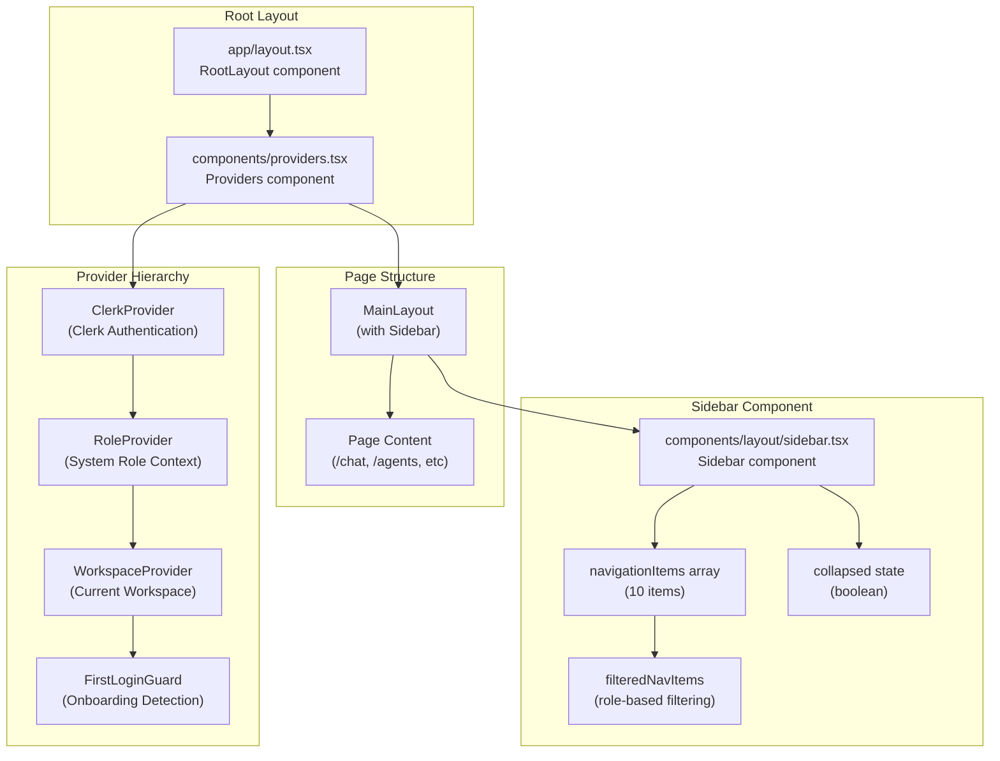

**Sources:** [frontend/app/layout.tsx:1-30](), [frontend/components/providers.tsx:1-86](), [frontend/components/layout/sidebar.tsx:1-279]()

---

## Sidebar Component Structure

The `Sidebar` component implements a collapsible navigation menu with role-based filtering, animation support, and tooltip overlays for collapsed state.

### Component Interface

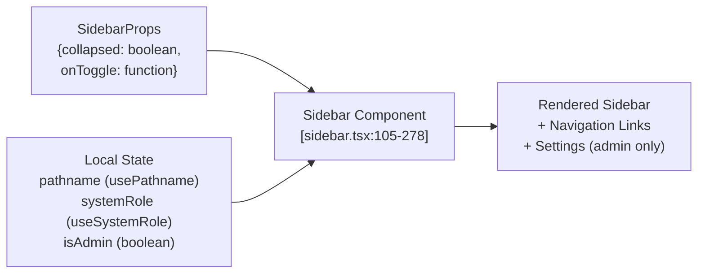

**Sources:** [frontend/components/layout/sidebar.tsx:25-28](), [frontend/components/layout/sidebar.tsx:105-109]()

### Navigation Items Configuration

The sidebar defines 10 navigation items in the `navigationItems` array, each with specific properties:

| Property | Type | Purpose |
|----------|------|---------|
| `name` | string | Display name |
| `href` | string | Route path |
| `icon` | LucideIcon | Icon component |
| `iconColor` | string | Tailwind color class |
| `description` | string | Subtitle text |
| `requiredRole?` | 'admin' | Optional role restriction |

**Example Navigation Item:**

```typescript
{
  name: 'Team Management',
  href: '/team',
  icon: Users,
  iconColor: 'text-[hsl(var(--info))]',
  description: 'Manage workspace members',
  requiredRole: 'admin' as const
}
```

**Sources:** [frontend/components/layout/sidebar.tsx:30-103]()

---

## Role-Based Access Control

The sidebar implements client-side role filtering using the `RoleProvider` context to control which navigation items are visible to users.

### Role Filtering Logic

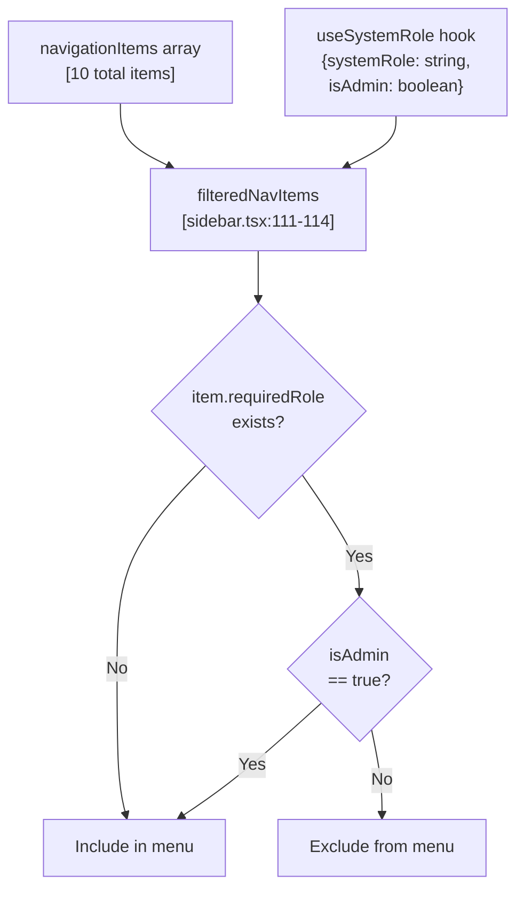

**Implementation:**

[frontend/components/layout/sidebar.tsx:108-114]() retrieves the user's system role and filters navigation items:

```typescript
const { systemRole, isAdmin } = useSystemRole()

const filteredNavItems = navigationItems.filter(item => {
  if (!item.requiredRole) return true  // No role required, show to everyone
  return item.requiredRole === 'admin' && isAdmin
})
```

**Admin-Only Items:**
- Team Management (`/team`)
- Context Engineering (`/context`)
- Settings (`/settings`)

**Sources:** [frontend/components/layout/sidebar.tsx:108-114](), [frontend/components/layout/sidebar.tsx:74-87](), [frontend/components/layout/sidebar.tsx:248-275]()

---

## Navigation Item Rendering

Each navigation item is rendered with active state detection, hover effects, tooltip support, and collapsible behavior.

### Active State Detection

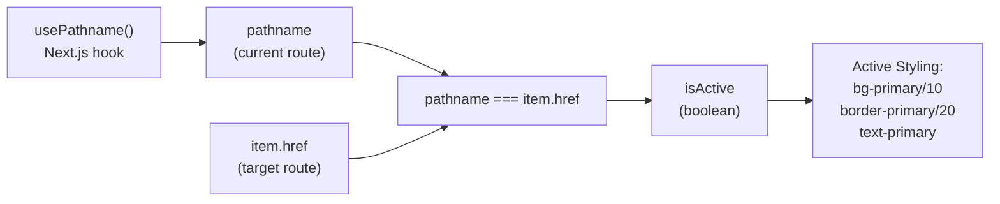

**Sources:** [frontend/components/layout/sidebar.tsx:106-107](), [frontend/components/layout/sidebar.tsx:195](), [frontend/components/layout/sidebar.tsx:211-213]()

### Link Structure

Each navigation link renders with the following structure:

| Element | Collapsed State | Expanded State |
|---------|----------------|----------------|
| Container | `flex items-center gap-3 w-full px-3 py-2` | Same |
| Icon | Always visible, 18×18px | Same |
| Text Container | Hidden | Visible with name + description |
| Tooltip | Visible on hover | Hidden |

**Sources:** [frontend/components/layout/sidebar.tsx:205-243]()

---

## Layout Hierarchy

The application uses a nested layout pattern where the root layout establishes global providers, and individual pages can opt into the `MainLayout` wrapper which includes the sidebar.

### Layout Component Tree

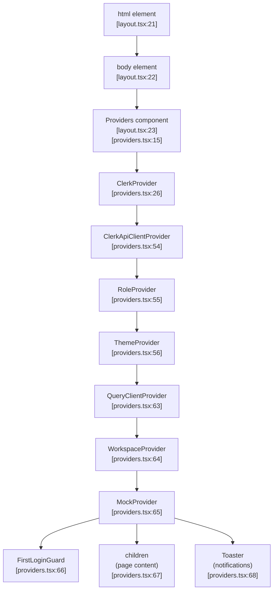

**Sources:** [frontend/app/layout.tsx:15-29](), [frontend/components/providers.tsx:15-86]()

### Provider Responsibilities

| Provider | Purpose | Dependencies |
|----------|---------|--------------|
| `ClerkProvider` | User authentication, session management | External Clerk service |
| `ClerkApiClientProvider` | Authenticated API client injection | `ClerkProvider` |
| `RoleProvider` | System role context (`useSystemRole` hook) | `ClerkProvider` |
| `ThemeProvider` | Dark/light mode theming | None |
| `QueryClientProvider` | React Query cache (60s stale time, 1 retry) | None |
| `WorkspaceProvider` | Current workspace context | `QueryClientProvider` |
| `MockProvider` | API mock data toggle | None |
| `FirstLoginGuard` | Onboarding detection and welcome modal | `ClerkProvider`, `WorkspaceProvider` |

**Sources:** [frontend/components/providers.tsx:16-23](), [frontend/components/providers.tsx:26-84]()

---

## Sidebar Collapse Behavior

The sidebar supports collapsible state with animated width transitions and persistent tooltips in collapsed mode.

### Collapse State Management

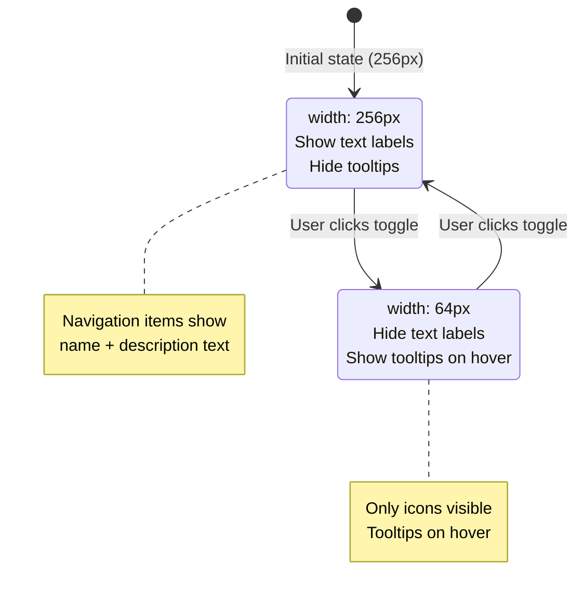

**Animation Configuration:**

[frontend/components/layout/sidebar.tsx:117-125]() uses Framer Motion for smooth width transitions:

```typescript
<motion.div
  className={cn(
    'fixed left-0 top-0 z-40 h-screen glass-card border-r',
    collapsed ? 'w-16' : 'w-64'
  )}
  initial={false}
  animate={{ width: collapsed ? 64 : 256 }}
>
```

**Sources:** [frontend/components/layout/sidebar.tsx:117-125](), [frontend/components/layout/sidebar.tsx:142-153]()

---

## Chat History Integration

When the user is on the chat page (`/chat`), the sidebar displays an additional button to toggle the chat history panel.

### Chat History Toggle Flow

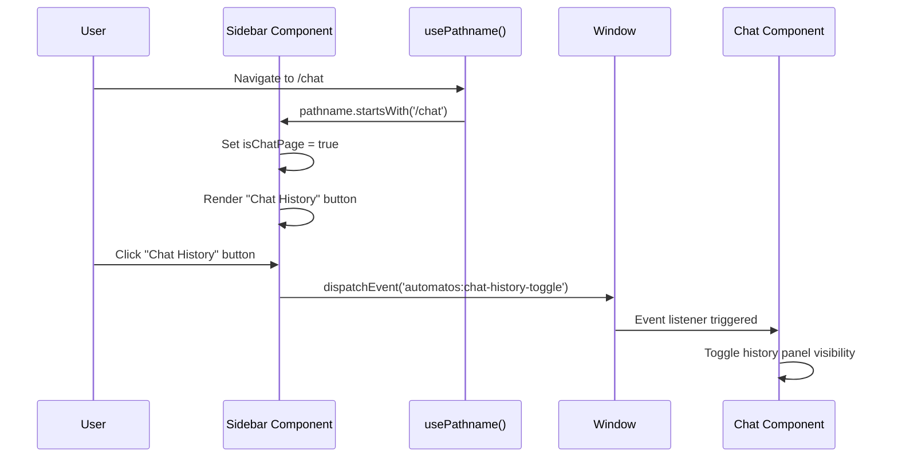

**Implementation:**

[frontend/components/layout/sidebar.tsx:107]() and [frontend/components/layout/sidebar.tsx:158-191]() implement chat-specific navigation:

```typescript
const isChatPage = pathname?.startsWith('/chat') ?? false

{isChatPage && (
  <button
    type="button"
    onClick={() => {
      window.dispatchEvent(new CustomEvent('automatos:chat-history-toggle'))
    }}
    // ... styling
  >
    <PanelLeft className="w-[18px] h-[18px]" />
    {!collapsed && <span>Chat History</span>}
  </button>
)}
```

**Sources:** [frontend/components/layout/sidebar.tsx:107](), [frontend/components/layout/sidebar.tsx:158-191]()

---

## Onboarding Integration

The sidebar integrates with the onboarding system by providing `data-tour` attributes for the Shepherd.js tour.

### Tour Target Attributes

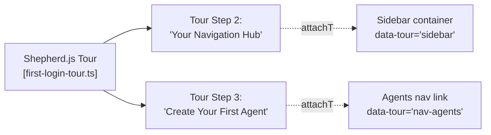

**Data Attribute Placement:**

- [frontend/components/layout/sidebar.tsx:118](): `data-tour="sidebar"` on main container
- [frontend/components/layout/sidebar.tsx:208](): `data-tour="nav-agents"` on Agents link

**Tour Integration:**

When a new user logs in, `FirstLoginGuard` checks if onboarding has been completed. If not, the welcome modal offers to start the Shepherd.js tour, which highlights the sidebar (Step 2) and the Agents link (Step 3) to guide users through creating their first agent.

**Sources:** [frontend/components/layout/sidebar.tsx:118](), [frontend/components/layout/sidebar.tsx:208](), [frontend/components/onboarding/first-login-guard.tsx:1-36]()

---

## Settings Route (Admin Only)

The Settings navigation item is positioned at the bottom of the sidebar and is only visible to admin users.

### Settings Link Structure

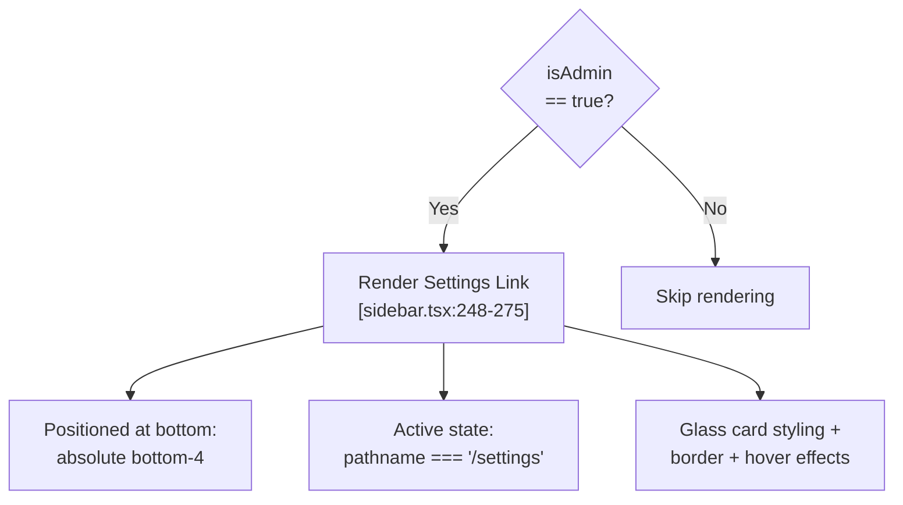

**Sources:** [frontend/components/layout/sidebar.tsx:248-275]()

---

## Backend Role Resolution

The frontend receives system role information from the backend authentication flow, which resolves roles during the hybrid authentication process.

### Role Resolution Flow

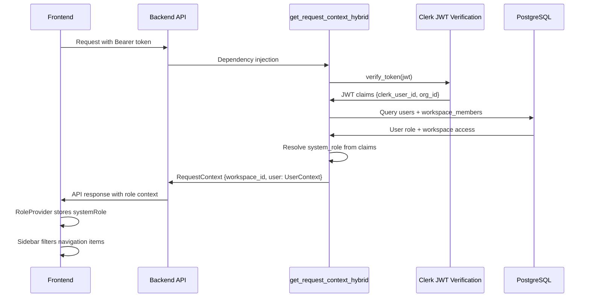

**Backend Role Fields:**

[orchestrator/core/auth/hybrid.py:341-349]() constructs the `UserContext` with role information:

```python
user = UserContext(
    id=info.get("clerk_user_id") or info.get("email"),
    email=info.get("email"),
    role=info.get("role") or "user",
    system_role=info.get("system_role") or info.get("role") or "user",
    clerk_user_id=info.get("clerk_user_id"),
    org_id=info.get("org_id"),
    raw_claims=claims,
)
```

**Sources:** [orchestrator/core/auth/hybrid.py:283-350](), [orchestrator/api/workspaces.py:24-54]()

---

## Workspace Context and New User Detection

The sidebar relies on workspace context to determine if the user is new and should trigger onboarding. Additionally, admin users can override the workspace context to view platform-wide data.

### New Workspace Detection

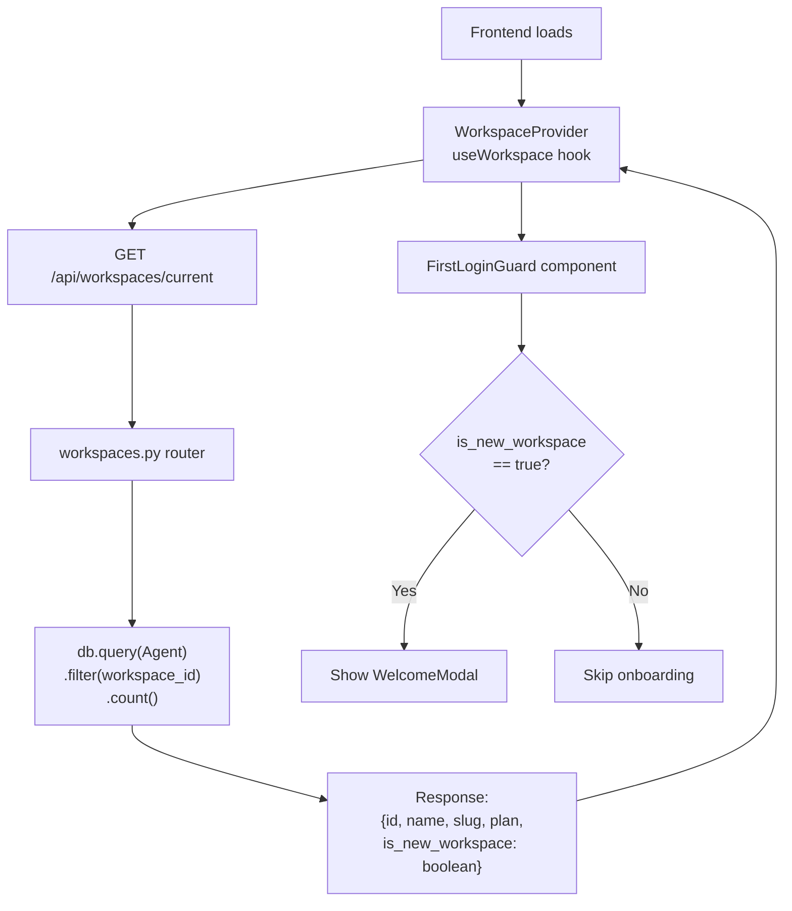

**Backend Logic:**

[orchestrator/api/workspaces.py:44]() counts agents to detect new workspaces:

```python
agent_count = db.query(Agent).filter(Agent.workspace_id == workspace.id).count()

return {
    "id": str(workspace.id),
    "name": workspace.name,
    "slug": workspace.slug,
    "plan": workspace.plan,
    "role": ctx.user.role,
    "plan_limits": workspace.plan_limits or {},
    "is_new_workspace": agent_count == 0,
}
```

**Frontend Detection:**

[frontend/components/onboarding/first-login-guard.tsx:14-26]() checks the `isNewWorkspace` flag from workspace context and triggers the welcome modal if the user hasn't completed onboarding:

```typescript
if (!onboardingComplete && workspace.isNewWorkspace) {
  const timerId = setTimeout(() => setShowWelcome(true), 1000)
  return () => clearTimeout(timerId)
}
```

**Sources:** [orchestrator/api/workspaces.py:24-54](), [frontend/components/onboarding/first-login-guard.tsx:9-35](), [frontend/components/onboarding/welcome-modal.tsx:1-148]()

---

## Admin Workspace Override

Admin users can override the workspace context to view platform-wide analytics and data across all workspaces. This is implemented through a module-level override in the API client.

### Workspace Override Flow

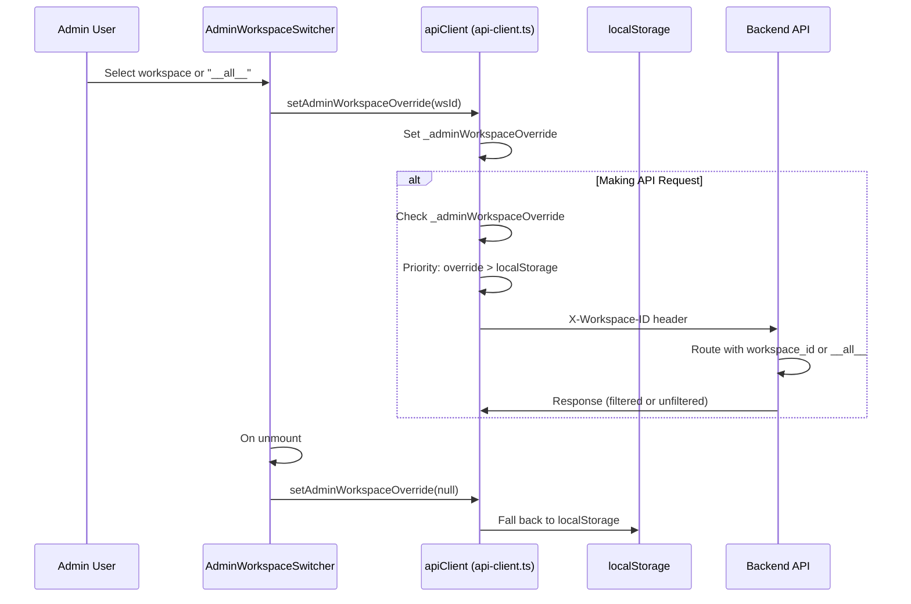

**Override Priority Logic:**

[frontend/lib/api-client.ts:83-91]() implements the module-level override:

```typescript
let _adminWorkspaceOverride: string | null = null

export function setAdminWorkspaceOverride(wsId: string | null) {
  _adminWorkspaceOverride = wsId
}

export function getAdminWorkspaceOverride(): string | null {
  return _adminWorkspaceOverride
}
```

**Header Injection:**

[frontend/lib/api-client.ts:855-862]() uses the override when setting the workspace header:

```typescript
const workspaceId = _adminWorkspaceOverride
  || localStorage.getItem('last_active_workspace')
  || localStorage.getItem('last_active_org')
if (workspaceId) {
  headers['X-Workspace-ID'] = workspaceId
}
```

**Backend Handling:**

When `X-Workspace-ID` is set to `__all__` (the sentinel value), the backend authentication layer detects this and sets `admin_all_workspaces=True` in the request context, which bypasses workspace filtering for admin analytics endpoints.

**Sources:** [frontend/lib/api-client.ts:83-91](), [frontend/lib/api-client.ts:855-862]()

---

## Summary

The navigation and layout system provides:

1. **Role-Based Navigation**: Filters menu items based on admin status using `RoleProvider` context
2. **Collapsible Sidebar**: Animated width transitions with tooltip support in collapsed mode
3. **Active Route Detection**: Highlights current page using Next.js `usePathname` hook
4. **Context-Aware Features**: Shows chat history toggle only on `/chat` pages
5. **Onboarding Integration**: Provides `data-tour` attributes for Shepherd.js tour targeting
6. **Workspace Detection**: Integrates with backend to identify new workspaces and trigger welcome flows
7. **Provider Hierarchy**: Establishes authentication, role, workspace, and theme context before rendering

The sidebar component ([frontend/components/layout/sidebar.tsx]()) serves as the primary navigation interface, working in concert with the provider hierarchy ([frontend/components/providers.tsx]()) to deliver a secure, role-aware navigation experience.

---