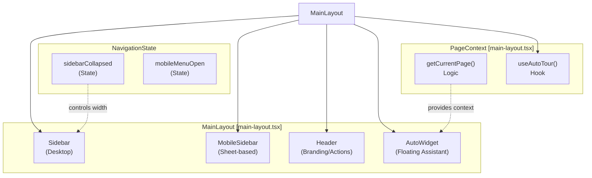
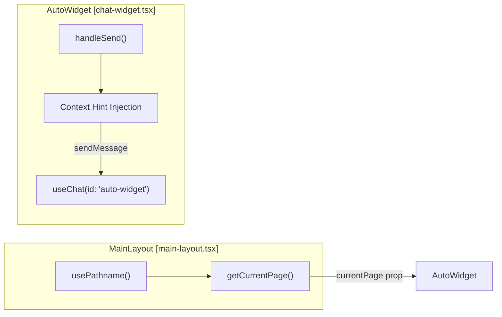
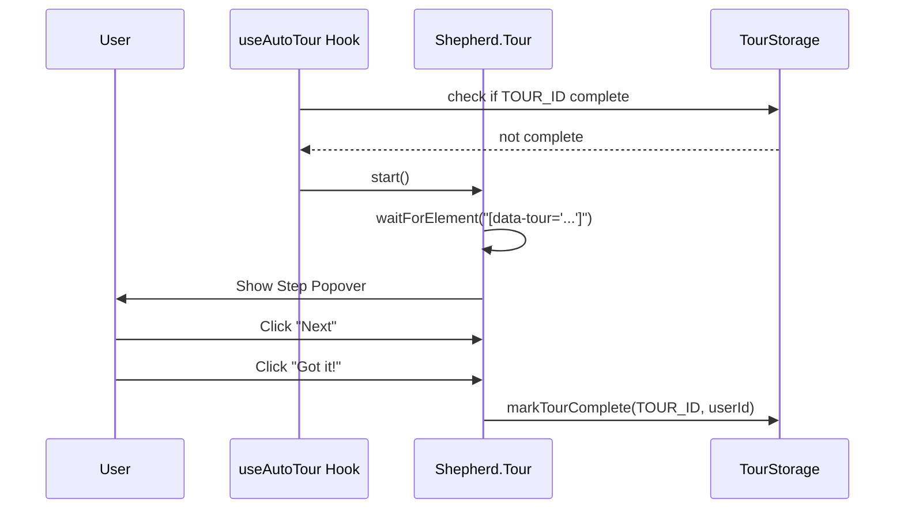

# Navigation & Layout

<details>
<summary>Relevant source files</summary>

The following files were used as context for generating this wiki page:

- [frontend/app/chat/page.tsx](frontend/app/chat/page.tsx)
- [frontend/app/tools/page.tsx](frontend/app/tools/page.tsx)
- [frontend/components/chatbot/chat-widget.tsx](frontend/components/chatbot/chat-widget.tsx)
- [frontend/components/layout/header.tsx](frontend/components/layout/header.tsx)
- [frontend/components/layout/main-layout.tsx](frontend/components/layout/main-layout.tsx)
- [frontend/components/layout/mobile-sidebar.tsx](frontend/components/layout/mobile-sidebar.tsx)
- [frontend/components/layout/sidebar.tsx](frontend/components/layout/sidebar.tsx)
- [frontend/components/tools/my-tools-dashboard.tsx](frontend/components/tools/my-tools-dashboard.tsx)
- [frontend/lib/shepherd/tour-utils.ts](frontend/lib/shepherd/tour-utils.ts)
- [frontend/lib/shepherd/tours/activity-tour.ts](frontend/lib/shepherd/tours/activity-tour.ts)
- [frontend/lib/shepherd/tours/agents-tour.ts](frontend/lib/shepherd/tours/agents-tour.ts)
- [frontend/lib/shepherd/tours/analytics-tour.ts](frontend/lib/shepherd/tours/analytics-tour.ts)
- [frontend/lib/shepherd/tours/chat-tour.ts](frontend/lib/shepherd/tours/chat-tour.ts)
- [frontend/lib/shepherd/tours/documents-tour.ts](frontend/lib/shepherd/tours/documents-tour.ts)
- [frontend/lib/shepherd/tours/marketplace-tour.ts](frontend/lib/shepherd/tours/marketplace-tour.ts)
- [frontend/lib/shepherd/tours/settings-tour.ts](frontend/lib/shepherd/tours/settings-tour.ts)
- [frontend/lib/shepherd/tours/tools-tour.ts](frontend/lib/shepherd/tours/tools-tour.ts)
- [frontend/lib/shepherd/tours/workspace-tour.ts](frontend/lib/shepherd/tours/workspace-tour.ts)
- [frontend/public/brand/jira-logo.svg](frontend/public/brand/jira-logo.svg)

</details>


## Purpose

This document covers the frontend navigation system and page layout architecture, including the collapsible sidebar, role-based menu filtering, page context tracking, and the integration of global UI components like the floating `AutoWidget` and `Shepherd.js` onboarding tours.

---

## Navigation Architecture Overview

The navigation system consists of a provider hierarchy that establishes authentication and workspace context, a root layout that wraps all pages, and a dynamic sidebar that filters navigation items based on user roles.

### Global Layout Hierarchy

The application uses a Next.js App Router structure where the `MainLayout` component [frontend/components/layout/main-layout.tsx:19]() manages the primary navigation shell. It coordinates the desktop sidebar, mobile drawer (via `Sheet`), and the global header.

**Layout Component Hierarchy Diagram**


**Sources:** [frontend/components/layout/main-layout.tsx:19-119]()

---

## Sidebar & Navigation Logic

The `Sidebar` component implements a collapsible navigation menu with role-based filtering and premium icon support via the `useSystemIcons` hook [frontend/components/layout/sidebar.tsx:131]().

### Navigation Items Configuration
Navigation items are defined in a central array `navigationItems` [frontend/components/layout/sidebar.tsx:35-125](). Each item includes metadata for routing, icons, and access control.

| Item Name | Route | Icon | Description |
|-----------|-------|------|-------------|
| Chat | `/chat` | `MessageCircle` | Your AI workspace |
| Command Center | `/command-center` | `Radar` | Your AI workforce at a glance |
| Assignments | `/assignments` | `ClipboardList` | Plan, schedule & orchestrate work |
| Deliverables | `/deliverables` | `Package` | Files, code & agent output |
| Agent Management | `/agents` | `Bot` | Manage AI agents and skills |
| Tools & Integrations | `/tools` | `Wrench` | Development and utility tools |
| Knowledge Base | `/documents` | `Database` | Documents, databases & code-graph |
| Marketplace | `/marketplace` | `Store` | Discover agents, playbooks & tools |
| Team Management | `/team` | `Users` | Manage workspace members |
| Analytics | `/analytics` | `BarChart3` | Performance, costs & insights |
| Workspace Admin | `/admin/workspaces` | `Building2` | Admin-only workspace management |

**Sources:** [frontend/components/layout/sidebar.tsx:35-125]()

### Role-Based Filtering
Filtering is performed using the `useSystemRole` hook [frontend/components/layout/sidebar.tsx:130](). Items with `requiredRole: 'admin'` are only rendered if `isAdmin` is true [frontend/components/layout/sidebar.tsx:134-137]().

```typescript
// frontend/components/layout/sidebar.tsx:134-137
const filteredNavItems = navigationItems.filter(item => {
  if (!item.requiredRole) return true  // No role required, show to everyone
  return item.requiredRole === 'admin' && isAdmin
})
```

**Sources:** [frontend/components/layout/sidebar.tsx:130-137]()

---

## Page Context & Floating Assistant

The `MainLayout` tracks the user's current location via `getCurrentPage()` [frontend/components/layout/main-layout.tsx:29-48](). This context is passed to the `AutoWidget`, a floating assistant available on every page except the full-screen `/chat` page [frontend/components/layout/main-layout.tsx:51]().

### AutoWidget Context Injection
When a user interacts with the `AutoWidget`, it injects a "quiet hint" into the first message of the conversation to provide the agent with situational awareness [frontend/components/chatbot/chat-widget.tsx:106-112]().

**Widget Data Flow Diagram**


**Sources:** [frontend/components/layout/main-layout.tsx:29-51](), [frontend/components/chatbot/chat-widget.tsx:106-112]()

---

## Onboarding & Guided Tours

The system uses `Shepherd.js` to provide interactive, step-by-step tours for major pages. The `useAutoTour` hook triggers these automatically on the first visit [frontend/components/layout/main-layout.tsx:26]().

### Tour Anchors & Logic
Tours rely on `data-tour` attributes as anchors. Implementation is modularized in `frontend/lib/shepherd/tours/`.

* **Chat Tour**: Covers the agent selector, mode bar, and toolbar [frontend/lib/shepherd/tours/chat-tour.ts:63-133]().
* **Activity Tour**: Explains the Command Center stats, tabs (Summary, Board, Calendar, etc.), and content drilling [frontend/lib/shepherd/tours/activity-tour.ts:41-105]().
* **Agents Tour**: Guides users through the Roster, Org Chart, and Configuration views [frontend/lib/shepherd/tours/agents-tour.ts:35-92]().
* **Knowledge Tour**: Walks through the five knowledge sources (Documents, Database, CodeGraph, Business Graph, Memory) [frontend/lib/shepherd/tours/documents-tour.ts:38-108]().

### Tour Utilities
Common UI patterns in tours are handled by `tour-utils.ts`, including `waitForElement` (to handle async DOM rendering) and `tabList` (for rendering compact bullet lists of page features) [frontend/lib/shepherd/tour-utils.ts:11-92]().

**Tour Step Lifecycle**


**Sources:** [frontend/lib/shepherd/tour-utils.ts:11-92](), [frontend/lib/shepherd/tours/chat-tour.ts:1-173](), [frontend/lib/shepherd/tours/activity-tour.ts:1-111]()

---

## Header Actions & Responsive Design

The `Header` component provides global access to documentation, theme switching, and notifications [frontend/components/layout/header.tsx:50-97]().

### Layout Responsiveness
* **Desktop**: Sidebar is docked on the left, either collapsed (64px) or expanded (256px) [frontend/components/layout/sidebar.tsx:144]().
* **Mobile/Tablet**: The sidebar is moved into a `Sheet` (drawer) triggered by the menu button in the header [frontend/components/layout/main-layout.tsx:80-89](). The `MobileSidebar` component optimizes navigation for touch with larger tap targets [frontend/components/layout/mobile-sidebar.tsx:153-183]().

### Header Components
| Component | Implementation |
|-----------|----------------|
| **Help & Docs** | `DropdownMenu` with links to external Documentation and API Reference [frontend/components/layout/header.tsx:52-87](). |
| **Theme Toggle** | `ThemeToggle` for light/dark mode switching [frontend/components/layout/header.tsx:90](). |
| **Notifications** | `NotificationBell` displaying real-time system alerts [frontend/components/layout/header.tsx:93](). |
| **Profile** | `ProfileMenu` for account settings and manual tour relaunch [frontend/components/layout/header.tsx:96](). |

**Sources:** [frontend/components/layout/main-layout.tsx:80-97](), [frontend/components/layout/header.tsx:50-97](), [frontend/components/layout/mobile-sidebar.tsx:153-183]()

---