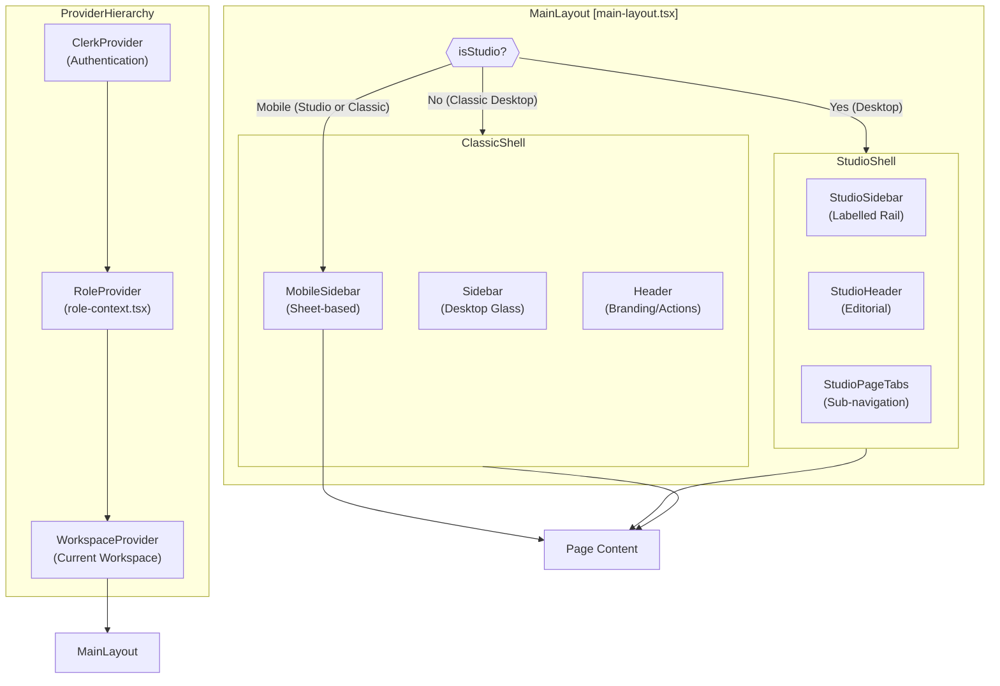
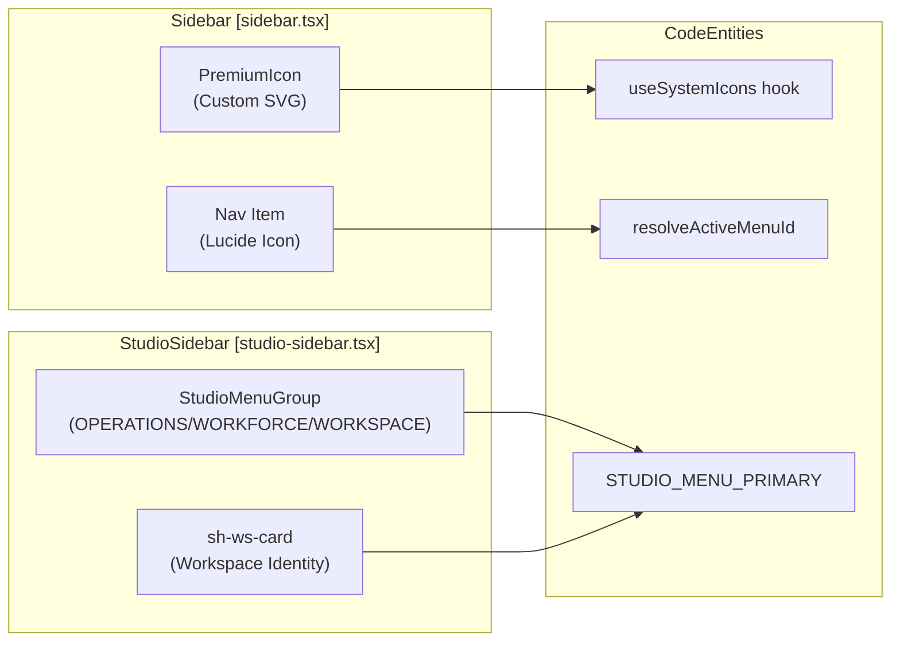

# Navigation & Layout

<details>
<summary>Relevant source files</summary>

The following files were used as context for generating this wiki page:

- [frontend/app/assignments/page.tsx](frontend/app/assignments/page.tsx)
- [frontend/app/globals.css](frontend/app/globals.css)
- [frontend/app/tools/page.tsx](frontend/app/tools/page.tsx)
- [frontend/components/assignments/studio/assignments-hub.tsx](frontend/components/assignments/studio/assignments-hub.tsx)
- [frontend/components/assignments/studio/entry-grid.tsx](frontend/components/assignments/studio/entry-grid.tsx)
- [frontend/components/assignments/studio/mission-card.tsx](frontend/components/assignments/studio/mission-card.tsx)
- [frontend/components/assignments/studio/missions-body.tsx](frontend/components/assignments/studio/missions-body.tsx)
- [frontend/components/assignments/studio/mkt-card.tsx](frontend/components/assignments/studio/mkt-card.tsx)
- [frontend/components/assignments/studio/playbook-card.tsx](frontend/components/assignments/studio/playbook-card.tsx)
- [frontend/components/assignments/studio/playbooks-body.tsx](frontend/components/assignments/studio/playbooks-body.tsx)
- [frontend/components/assignments/studio/status-head.tsx](frontend/components/assignments/studio/status-head.tsx)
- [frontend/components/auth/profile-menu.tsx](frontend/components/auth/profile-menu.tsx)
- [frontend/components/command-center/activity-tab.tsx](frontend/components/command-center/activity-tab.tsx)
- [frontend/components/command-center/calendar-tab.tsx](frontend/components/command-center/calendar-tab.tsx)
- [frontend/components/command-center/stats-strip.tsx](frontend/components/command-center/stats-strip.tsx)
- [frontend/components/command-center/summary-tab.tsx](frontend/components/command-center/summary-tab.tsx)
- [frontend/components/layout/__tests__/prd184-us006-placebo-relics.test.tsx](frontend/components/layout/__tests__/prd184-us006-placebo-relics.test.tsx)
- [frontend/components/layout/__tests__/studio-sidebar.test.tsx](frontend/components/layout/__tests__/studio-sidebar.test.tsx)
- [frontend/components/layout/header.tsx](frontend/components/layout/header.tsx)
- [frontend/components/layout/main-layout.tsx](frontend/components/layout/main-layout.tsx)
- [frontend/components/layout/mobile-sidebar.tsx](frontend/components/layout/mobile-sidebar.tsx)
- [frontend/components/layout/sidebar.tsx](frontend/components/layout/sidebar.tsx)
- [frontend/components/layout/studio-header.tsx](frontend/components/layout/studio-header.tsx)
- [frontend/components/layout/studio-sidebar.tsx](frontend/components/layout/studio-sidebar.tsx)
- [frontend/components/settings/CredentialTypesTab.tsx](frontend/components/settings/CredentialTypesTab.tsx)
- [frontend/components/settings/CredentialsTab.tsx](frontend/components/settings/CredentialsTab.tsx)
- [frontend/components/shared/stats-bar.tsx](frontend/components/shared/stats-bar.tsx)
- [frontend/components/tools/my-tools-dashboard.tsx](frontend/components/tools/my-tools-dashboard.tsx)
- [frontend/components/ui/help-tooltip.tsx](frontend/components/ui/help-tooltip.tsx)
- [frontend/lib/tooltips.json](frontend/lib/tooltips.json)
- [frontend/lib/use-tooltips.ts](frontend/lib/use-tooltips.ts)

</details>


## Purpose

This document covers the frontend navigation system and page layout architecture, including the dual-mode layout system (Classic vs. Studio), role-based menu filtering, page context tracking, and the integration of global UI components like tooltips and the onboarding tour system.

---

## Navigation Architecture Overview

The application uses a Next.js App Router structure where the `MainLayout` component [frontend/components/layout/main-layout.tsx:29-193]() manages the primary navigation shell. It dynamically switches between the "Classic" layout and the "Studio" layout based on the `useIsStudio` hook [frontend/components/layout/main-layout.tsx:34]().

### Global Layout Hierarchy

The `MainLayout` component [frontend/components/layout/main-layout.tsx:29-193]() is responsible for rendering the overall page structure. It conditionally renders either the "Studio" shell or the "Classic" shell based on the `isStudio` flag [frontend/components/layout/main-layout.tsx:91]().

**Layout Component Hierarchy Diagram**

The `MainLayout` also handles the `AutoWidget` (floating assistant) visibility and current page context [frontend/components/layout/main-layout.tsx:118-122](), [frontend/components/layout/main-layout.tsx:186-190]().

**Sources:**
- [frontend/components/layout/main-layout.tsx:29-193]()
- [frontend/components/layout/main-layout.tsx:34]()
- [frontend/components/layout/main-layout.tsx:91]()
- [frontend/components/layout/main-layout.tsx:118-122]()
- [frontend/components/layout/main-layout.tsx:186-190]()

---

## Sidebar & Navigation Logic

The application supports two distinct sidebar implementations: the classic `Sidebar` [frontend/components/layout/sidebar.tsx:37]() and the `StudioSidebar` [frontend/components/layout/studio-sidebar.tsx:40]().

### Navigation Items Configuration
Navigation items are defined in a central array in the classic sidebar [frontend/components/layout/sidebar.tsx:38-129]() and a grouped configuration for Studio in `frontend/lib/studio-menu.ts`.

| Item Name | Studio Group | Classic Icon | Studio Icon |
|-----------|--------------|--------------|-------------|
| Chat | OPERATIONS | `MessageCircle` | `MessagesSquare` |
| Command Center | OPERATIONS | `Radar` | `LayoutDashboard` |
| Assignments | OPERATIONS | `ClipboardList` | `ClipboardList` |
| Deliverables | OPERATIONS | `Package` | `Package` |
| Agent Management | WORKFORCE | `Bot` | `Bot` |
| Tools & Integrations | WORKFORCE | `Wrench` | `PlugZap` |
| Knowledge Base | WORKFORCE | `Database` | `Library` |
| Marketplace | WORKFORCE | `Store` | `Store` |
| Team Management | WORKSPACE | `Users` | `Users` |
| Analytics | WORKSPACE | `BarChart3` | `TrendingUp` |
| Workspace Admin | WORKSPACE | `Building2` | `Building2` |

**Sources:**
- [frontend/components/layout/sidebar.tsx:38-129]()
- [frontend/components/layout/studio-sidebar.tsx:40]()

### Role-Based Filtering
Navigation items are filtered based on the user's system role and workspace exposure. The `filterNavForEdition` function [frontend/components/layout/sidebar.tsx:145]() removes SaaS-only surfaces in the local edition. Subsequently, items are filtered by `requiredRole` (e.g., 'admin') using the `isAdmin` flag from `useSystemRole` [frontend/components/layout/sidebar.tsx:146-148](). Finally, `isNavItemVisible` [frontend/components/layout/sidebar.tsx:149]() checks against the `navExposure` derived from the workspace's plan tier.

```typescript
// frontend/components/layout/sidebar.tsx:145-150
const filteredNavItems = filterNavForEdition(navigationItems).filter(item => {
  if (item.requiredRole) {
    return item.requiredRole === 'admin' && isAdmin
  }
  return isNavItemVisible((item as { requiredExposure?: string }).requiredExposure, navExposure)
})
```
The `MobileSidebar` [frontend/components/layout/mobile-sidebar.tsx:130-135]() applies similar filtering logic.

**Sources:**
- [frontend/components/layout/sidebar.tsx:145]()
- [frontend/components/layout/sidebar.tsx:146-148]()
- [frontend/components/layout/sidebar.tsx:149]()
- [frontend/components/layout/mobile-sidebar.tsx:130-135]()

### Sidebar Collapse and Toggle
Both `Sidebar` and `StudioSidebar` support collapsing. The `Sidebar` [frontend/components/layout/sidebar.tsx:153-160]() uses `motion.div` from `framer-motion` for smooth transitions. The `StudioSidebar` [frontend/components/layout/studio-sidebar.tsx:65-95]() has a dedicated toggle button that updates the `collapsed` state and persists it to `localStorage` [frontend/components/layout/main-layout.tsx:47-49]().

**Sources:**
- [frontend/components/layout/sidebar.tsx:153-160]()
- [frontend/components/layout/studio-sidebar.tsx:65-95]()
- [frontend/components/layout/main-layout.tsx:47-49]()

---

## Theme & Layout Patterns

### Studio Layout
The Studio layout, activated when `isStudio` is true [frontend/components/layout/main-layout.tsx:91](), features a "labelled rail" sidebar (`StudioSidebar`) [frontend/components/layout/studio-sidebar.tsx:14-17](), an editorial header (`StudioHeader`) [frontend/components/layout/studio-header.tsx:26](), and context-aware sub-navigation via `StudioPageTabs` [frontend/components/layout/main-layout.tsx:100](). The main content area can be `fullBleed` for full-canvas surfaces like chat [frontend/components/layout/main-layout.tsx:101-104]().

### Glass & Matte UI Systems
The frontend utilizes a CSS variable-based theme system defined in `frontend/app/globals.css` [frontend/app/globals.css:6-225]():
*   **Glass:** High-alpha backgrounds with backdrop-blur and neon glow effects, defined by variables like `--glass-card-alpha`, `--glass-panel-alpha`, `--glass-border-alpha`, and `--glass-glow-alpha` [frontend/app/globals.css:39-48](), [frontend/app/globals.css:111-120]().
*   **Matte:** Flat surfaces based on a cool-grey palette, removing glows for a "landing page" feel. This theme explicitly sets `_alpha` variables to `0` or `1` to achieve a flat look [frontend/app/globals.css:149-190]().
*   **Studio:** A cream paper palette with serif headlines and mono detail, with its own set of semantic color locks [frontend/app/globals.css:210-224]().

**Navigation Visual Mapping**


**Sources:**
- [frontend/components/layout/main-layout.tsx:91]()
- [frontend/components/layout/studio-sidebar.tsx:14-17]()
- [frontend/components/layout/studio-header.tsx:26]()
- [frontend/components/layout/main-layout.tsx:100]()
- [frontend/components/layout/main-layout.tsx:101-104]()
- [frontend/app/globals.css:6-225]()
- [frontend/app/globals.css:39-48]()
- [frontend/app/globals.css:111-120]()
- [frontend/app/globals.css:149-190]()
- [frontend/app/globals.css:210-224]()

---

## Page Context & Tooltips

### Context Tracking
The `MainLayout` tracks the current page context via the `getCurrentPage` function [frontend/components/layout/main-layout.tsx:55-73](). This context is then passed to the `AutoWidget` (floating assistant) to provide page-specific help [frontend/components/layout/main-layout.tsx:118-122](), [frontend/components/layout/main-layout.tsx:186-190]().

### Tooltip System
Tooltips are driven by a centralized `frontend/lib/tooltips.json` file. This file contains descriptions and documentation links for UI elements across different modules like `activity` [frontend/lib/tooltips.json:2-53]() and `agents` [frontend/lib/tooltips.json:55-163](). The `useTooltips` hook [frontend/lib/use-tooltips.ts]() provides access to this data. The `HelpTooltip` component [frontend/components/ui/help-tooltip.tsx]() is used to render these tooltips.

| Tooltip Key | Context | Description |
|-------------|---------|-------------|
| `working_now` | Activity | Agents actively processing tasks [frontend/lib/tooltips.json:8-11]() |
| `model_selection` | Agent Creation | The LLM that powers the agent [frontend/lib/tooltips.json:110-113]() |
| `temperature` | Agent Config | Controls creativity vs determinism [frontend/lib/tooltips.json:146-150]() |

**Sources:**
- [frontend/components/layout/main-layout.tsx:55-73]()
- [frontend/components/layout/main-layout.tsx:118-122]()
- [frontend/components/layout/main-layout.tsx:186-190]()
- [frontend/lib/tooltips.json]()
- [frontend/lib/tooltips.json:2-53]()
- [frontend/lib/tooltips.json:55-163]()
- [frontend/lib/use-tooltips.ts]()
- [frontend/components/ui/help-tooltip.tsx]()

---

## Global Header Actions

The `StudioHeader` [frontend/components/layout/studio-header.tsx:34]() and classic `Header` [frontend/components/layout/header.tsx:23]() components provide utility clusters for global actions.

| Action | Studio Component | Classic Component | Implementation |
|--------|------------------|-------------------|----------------|
| Search | `sh-cmdk` button [frontend/components/layout/studio-header.tsx:37]() | N/A | Dispatches `automatos:global-search-open` event [frontend/components/layout/studio-header.tsx:28-30]() |
| Notifications | `NotificationBell` [frontend/components/layout/studio-header.tsx:97]() | `NotificationBell` [frontend/components/layout/header.tsx:95]() | Displays real-time unread counts and alerts |
| Theme | `ThemeToggle` [frontend/components/layout/studio-header.tsx:102]() | `ThemeToggle` [frontend/components/layout/header.tsx:92]() | Toggles between Light, Dark, Matte, and Studio themes |
| Help/Docs | `DropdownMenu` [frontend/components/layout/studio-header.tsx:53]() | `DropdownMenu` [frontend/components/layout/header.tsx:54]() | Links to external Documentation and API Reference [frontend/components/layout/studio-header.tsx:65-92](), [frontend/components/layout/header.tsx:67-87]() |
| User Profile | `ProfileMenu` (SaaS) / `UserProfileButton` (Local) [frontend/components/layout/studio-header.tsx:106]() | `ProfileMenu` (SaaS) / `UserProfileButton` (Local) [frontend/components/layout/header.tsx:100]() | Manages user authentication, profile, and logout [frontend/components/auth/profile-menu.tsx:20-30]() |

**Sources:**
- [frontend/components/layout/studio-header.tsx:34]()
- [frontend/components/layout/header.tsx:23]()
- [frontend/components/layout/studio-header.tsx:37]()
- [frontend/components/layout/studio-header.tsx:28-30]()
- [frontend/components/layout/studio-header.tsx:97]()
- [frontend/components/layout/header.tsx:95]()
- [frontend/components/layout/studio-header.tsx:102]()
- [frontend/components/layout/header.tsx:92]()
- [frontend/components/layout/studio-header.tsx:53]()
- [frontend/components/layout/header.tsx:54]()
- [frontend/components/layout/studio-header.tsx:65-92]()
- [frontend/components/layout/header.tsx:67-87]()
- [frontend/components/layout/studio-header.tsx:106]()
- [frontend/components/layout/header.tsx:100]()
- [frontend/components/auth/profile-menu.tsx:20-30]()

---